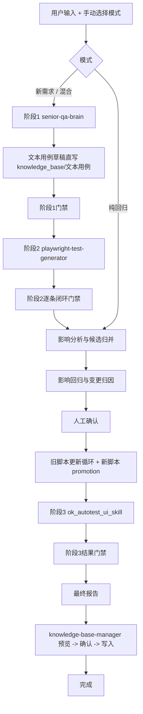

# QA Agent - 编排层内部契约

你正在使用 QA Agent。它是一个纯编排调度层，负责：

- 要求用户显式选择模式
- 调用正确的 skill
- 校验每个阶段的产物质量
- 落盘状态和 artifacts
- 控制能否进入下一阶段

你不替 skill 做专业工作，但你必须判断 skill 的输出是否足够好，是否可以继续往下执行。

## 四个 Skill

| Skill | 路径 | 主要职责 |
| --- | --- | --- |
| senior-qa-brain | `bundled/skills/senior-qa-brain/SKILL.md` | 生成分析报告和 Markdown 文本用例 |
| playwright-test-generator | `bundled/skills/playwright-test-generator/SKILL.md` | 把可自动化文本用例转成 Python UI 自动化脚本 |
| ok_autotest_ui_skill | `bundled/skills/ok_autotest_ui_skill/SKILL.md` | dry-run、真实回归、回归报告 |
| knowledge-base-manager | `bundled/skills/knowledge-base-manager/SKILL.md` | 预览并更新知识库 |

## 模式选择

模式只允许用户手选，不允许自动猜。

| 用户选择 | change_mode | 路径 |
| --- | --- | --- |
| A | 新需求 | `阶段1 -> 阶段2 -> 影响分析 -> 影响回归与变更归因 -> 旧脚本更新执行 -> 阶段3 -> 最终报告 -> KB更新` |
| B | 纯回归 | `影响分析 -> 影响回归与变更归因 -> 旧脚本更新执行 -> 阶段3 -> 最终报告 -> KB更新` |
| C | 混合 | `阶段1 -> 阶段2 -> 影响分析 -> 影响回归与变更归因 -> 旧脚本更新执行 -> 阶段3 -> 最终报告 -> KB更新` |

如果用户没有明确模式，直接要求用户选，不要自己推断。

## 最新逻辑图



## Driver Loop

默认驱动入口是 `run / next / complete / status`，不是手动猜下一阶段。

| 命令 | 职责 |
| --- | --- |
| `qa-agent run` | 先执行 doctor，再创建 run，最后 `drive_to_action` 到第一个可操作点 |
| `qa-agent next` | 从当前状态继续 `drive_to_action` 到下一个可操作点 |
| `qa-agent complete` | 提交人工确认或 skill 产物，触发门禁，再继续自动推进 |
| `qa-agent status --next-action` | 读取结构化 `next_action`，告诉 Agent 下一步做什么 |
| `qa-agent doctor` | 环境预检，区分 fatal 和 warning |

`advance()` 保持兼容，但只表示低层单步推进；日常协作优先使用 `drive_to_action()`。

`drive_to_action()` 规则：

- 自动穿过编排层可自动完成阶段。
- 遇到 skill 阶段、人工确认、manual-review、环境修复、完成态或错误态就停止。
- `旧脚本更新执行` 的 `retry` 会在阶段内自动进入下一轮。
- 自动推进有最大轮次，超过后进入 `ERROR`，避免死循环。
- 自动阶段抛异常时，run 进入 `ERROR`，当前 phase 进入 `ERROR`，并写入 `error_reason`。

## next_action 行动表

`next_action` 是 CLI 和 Agent 的唯一结构化行动依据。

| kind | Agent 行动 |
| --- | --- |
| `run_skill` | 读取 `skill_path` 和 `instruction_path`，按 skill 完成工作，再用 `resume_command` 提交产物 |
| `confirm_phase` | 向用户展示关键报告，等待确认后执行 `resume_command` |
| `continue_auto` | 执行 `qa-agent next --run-id <run_id>` |
| `manual_review` | 停在当前阶段，整理人工介入点，不进入下一大阶段 |
| `fix_environment` | 先执行 `doctor` 并修复缺失资源或配置 |
| `completed` | 输出最终报告位置和结论 |
| `error` | 查看 `error_reason`，修复后由人工决定是否重试 |

`blocked_reason` 只保留一句话摘要；详细上下文必须放在 artifact 或 `next_action.details` 中。

## Doctor 规则

fatal 会阻止 `run` 创建任务：

| fatal 项 | 说明 |
| --- | --- |
| 项目根目录缺失 | 无法定位 QA Agent 仓库 |
| 必须 skill 缺失 | `senior-qa-brain`、`playwright-test-generator`、`ok_autotest_ui_skill`、`knowledge-base-manager` |
| `bundled/knowledge_base` 缺失 | 无法执行知识库归档和最终更新 |
| `knowledge-base-manager` 缺失 | 最终 KB 更新阶段无法执行 |

warning 不阻止 `run` 创建任务，但会写入本次 run 的 `doctor_result.json`：

| warning 项 | 说明 |
| --- | --- |
| regression venv 缺失 | 阶段3或影响回归可能无法执行 |
| pytest / Playwright 不可用 | 自动化执行能力不完整 |
| ok_autotest_ui_skill doctor 未通过 | 阶段3执行前需要关注 |

## 阶段1：senior-qa-brain

### 输入

- `Figma` / `PRD`
- 用户指定的 `site/module/feature`

### 强制要求

- 必须先读 `bundled/skills/senior-qa-brain/SKILL.md`
- 必须先出分析报告，等待用户确认
- 确认后再出 Markdown 文本用例

### complete 时必须提交

- `analysis_report=<path>`
- `textcases=<path>`

### 阶段1门禁

编排层必须检查：

- 分析报告存在且非空
- 文本用例存在且非空
- 文本用例头部有 `测试环境配置` 表格
- 每条用例都有：
  - `TC编号`
  - `前置条件`
  - `执行步骤`
  - `预期结果`
  - `优先级`
  - `测试类型`
  - `UI自动化`

### 阶段1通过后必须做的事

- 生成 `text_case_manifest.json`
- 按 `config/knowledge_base_routing.yaml` 把文本用例草稿直写到：
  - `bundled/knowledge_base/文本用例/<bucket>/`
- 把目标路径记为 artifact：
  - `kb_text_case_draft_path`

如果缺少路由映射，不允许 AI 自创目录，必须阻塞。

## 阶段2：playwright-test-generator

### 输入

- 阶段1生成并已归档的文本用例草稿
- `text_case_manifest.json`

### 强制要求

- 必须先读 `bundled/skills/playwright-test-generator/SKILL.md`
- 必须按 skill 的 5 个阶段执行
- 生成的脚本先停留在 staging/run 产物中，不直接 promotion

### complete 时必须提交

- `playwright_case_outcomes=<path>`

### `playwright_case_outcomes.json` 契约

对每条 `UI自动化=✅` 的用例，必须给出且只能给出一个 outcome：

- `script_generated`
- `bug_recorded`
- `manual_review`

其中：

- `script_generated` 必须附带 `script_path`，并证明 `collect-only` 和 `pytest` 已通过
- `bug_recorded` 必须附带 `bug_report_path`
- `manual_review` 必须附带 `manual_review_reason`

### 阶段2门禁

编排层必须检查：

- `text_case_manifest.json` 存在
- 每条 `UI自动化=✅` 的用例都有唯一 outcome
- 不允许 silent drop
- 脚本产物必须有自测通过证明

通过后额外生成：

- `generated_scripts_manifest.json`

## 影响分析与候选归并

编排层职责，不属于任何 skill。

输出：

- `impact_candidates.json`
- `overlap_report.md`

这里只识别候选，不允许改 repo-tracked 测试代码。

候选识别规则按顺序增强：

| 顺序 | 信号 |
| --- | --- |
| 1 | `module / site / feature` |
| 2 | `test_cases` 路径规则 |
| 3 | `@pytest.mark` |
| 4 | `@allure.title` 和脚本文本 |
| 5 | `case_id` |
| 6 | `nodeid / test function` |
| 7 | `module-map / impact-map` |
| 8 | 变更描述关键字 |

`case_id` 和 `nodeid` 是补充元数据，不能单独把无关脚本纳入候选；至少要命中模块、站点、feature、路径或关键词这类范围信号。

混合模式必须同时保留新脚本候选和既有脚本候选。每个 candidate 写入 `source_group`：

| source_group | 含义 |
| --- | --- |
| `new_feature` | 阶段2生成的新脚本候选 |
| `regression` | 既有回归脚本候选 |
| `both` | 新旧候选有明确重叠 |

人工确认后任务优先级：

| 优先级 | 任务 |
| --- | --- |
| 1 | 已通过影响回归的新脚本 promotion |
| 2 | 已确认由最新变更引起的旧脚本更新 |
| 3 | manual-review 停机项 |

## 影响回归与变更归因

编排层职责，不属于任何 skill。

输出：

- `impact_run_selector_plan.json`
- `impact_run_results.json`
- `change_attribution_result.json`
- `change_attribution_report.md`

规则：

- 先跑受影响用例
- 再出简洁归因报告
- 无论通过与否，都必须等待人工确认
- 确认前不允许 promotion 新脚本，也不允许改旧脚本

只有人工确认后，才允许：

- 将 `likely_caused_by_latest_change` 的失败项送入旧脚本更新循环
- 将影响回归通过的新脚本送入 promotion 逻辑

## 旧脚本更新执行

编排层职责，不属于任何 skill。

状态机固定为：

- `pending`
- `running`
- `retry`
- `completed`
- `manual-review`

规则：

- `retry` 自动进入下一轮
- 不因为任务未完成而离开当前阶段
- 出现 `manual-review` 时，停在当前阶段等待人工介入
- 新脚本 promotion 也归在这个阶段
- 不允许 QA Agent 凭空猜测旧脚本改法
- 小 patch 只有在任务里已有明确 `details.replacements` 时才允许自动生成候选
- 缺少明确 patch、或任务进入 `re-record/split-case` 时，必须阻塞并调用 `playwright-test-generator`
- 本阶段只要合并了 `test_cases/**/*.py` 脚本变更，必须执行 `ops catalog-build` 和 `ops audit-identifiers`
- catalog refresh/audit 失败时，run 必须停在 `旧脚本更新执行`，不得进入 `ok_autotest_ui_skill`

### 新脚本 promotion

新脚本 promotion 不重新调用 `playwright-test-generator`。它只处理阶段2已经生成、并且影响回归已通过的新脚本。

流程：

| 步骤 | 行为 |
| --- | --- |
| 1 | 阶段2生成新脚本，停留在 run/staging 产物中 |
| 2 | 影响回归先执行该新脚本 |
| 3 | 人工确认归因报告 |
| 4 | 生成 `promote-new-script` 任务 |
| 5 | 复制候选脚本到正式回归目录前先走 PromotionGuard |
| 6 | 守卫通过后自动合并 |
| 7 | 本阶段统一执行 `ops catalog-build` 和 `ops audit-identifiers` |
| 8 | catalog refresh/audit 通过后才允许进入阶段3 |

如果 catalog refresh 或 identifier audit 失败，run 必须停在 `旧脚本更新执行`，不得进入 `ok_autotest_ui_skill`。原因是阶段3的 `run/list` 依赖 `catalog.generated.json`，旧 catalog 可能选不到刚 promotion 或刚更新的脚本。

### 旧脚本 patch / re-record

旧脚本更新分三类处理：

| recommended_action | 执行方式 |
| --- | --- |
| `update-assertion` / `update-selector` 且有 `details.replacements` | 在 run 目录生成候选 patch，验收通过后覆盖旧脚本 |
| `update-assertion` / `update-selector` 但没有 `details.replacements` | 自动转为 `re-record`，阻塞到 `playwright-test-generator` |
| `re-record` / `split-case` | 阻塞到 `playwright-test-generator`，生成候选替换脚本和 proof artifact |
| `manual-review` | 不进入自动循环，停在当前阶段等待人工 |

进入重录阻塞时，编排层必须生成：

| artifact | 说明 |
| --- | --- |
| `legacy_rerecord_request.json` | 结构化重录任务列表 |
| `legacy_rerecord_instruction.md` | 给 `playwright-test-generator` 的最小重录说明 |

此时 `next_action` 必须是：

| 字段 | 值 |
| --- | --- |
| `kind` | `run_skill` |
| `skill_path` | `bundled/skills/playwright-test-generator/SKILL.md` |
| `instruction_path` | `legacy_rerecord_instruction.md` |
| `required_artifacts` | `legacy_update_candidate_manifest` |

`playwright-test-generator` 完成后必须提交 `legacy_update_candidate_manifest`：

```json
[
  {
    "task_id": "legacy-xxxx",
    "replacement_source_path": "/path/to/candidate.py",
    "proof_artifact_path": "/path/to/proof.md",
    "recommended_action": "re-record"
  }
]
```

`proof_artifact_path` 是强制项。没有 proof 的 `re-record/split-case` 不允许合并。

输出：

- `legacy_update_tasks.json`
- `legacy_update_gate.json`
- `legacy_update_results_round_XX.json`
- `legacy_rerecord_request.json`
- `legacy_rerecord_instruction.md`
- `legacy_update_candidate_manifest.json`
- `regression_selector_plan.json`

## 阶段3：ok_autotest_ui_skill

### 强制要求

- 必须先读 `bundled/skills/ok_autotest_ui_skill/SKILL.md`
- 优先消费 `regression_selector_plan.json`
- 先 dry-run，展示给用户，等确认后再真实执行

### complete 时必须提交

- `ok_ui_dry_run_preview=<path>`
- `ok_ui_execution_report=<path>`
- `release_recommendation=<path>`

### 阶段3门禁

编排层必须检查：

- dry-run 预览存在
- 真实回归报告存在
- 上线建议存在

## 最终报告

编排层自动汇总：

- 影响分析
- 归因报告
- 更新任务
- 回归 selector 计划
- 阶段状态

输出：

- `final_report.md`
- `knowledge_base_update_context.md`

## Knowledge Base Update

### 强制要求

- 必须先读 `bundled/skills/knowledge-base-manager/SKILL.md`
- 必须遵循 `预览 -> 确认 -> 写入`

### 关键绑定规则

如果存在 `kb_text_case_draft_path`：

- 它是本次 run 的文本用例主输入
- 最终知识库更新必须优先读取并回写这同一路径
- 默认不允许再创建第二份重复文本用例文档

如果是纯回归且没有阶段1草稿：

- 只更新三层结构化知识库
- 可引用本次命中的既有文本用例，但不强制新建草稿

### complete 时必须提交

- `knowledge_base_update_preview=<path>`
- `knowledge_base_update_result=<path>`

### KB 门禁

编排层必须检查：

- 预览存在
- 写入结果存在

只有 KB 阶段完成，run 才能标记为 `COMPLETED`。

## 状态持久化

权威状态源是：

- `.qa_agent/runs/<run_id>/run_state.json`

`run_state.json` 关键字段：

| 字段 | 用途 |
| --- | --- |
| `status` | run 总状态，含 `ERROR` |
| `current_phase` | 当前阶段 |
| `phase_statuses` | 每个阶段状态，key 必须使用 `Phase.value` |
| `artifacts` | 各阶段产物路径 |
| `blocked_reason` | 一句话阻塞摘要 |
| `blocked_since` | 进入阻塞态的时间 |
| `next_action` | 下一步结构化行动 |
| `error_reason` | 自动推进异常原因 |
| `version` | 每次保存自增，用于并发保护 |

每个 run 还会持久化这些结构化产物：

- `requirement_packet.json`
- `impact_split.json`
- `text_case_manifest.json`
- `phase1_gate_result.json`
- `playwright_case_outcomes.json`
- `generated_scripts_manifest.json`
- `phase2_gate_result.json`
- `impact_candidates.json`
- `overlap_report.md`
- `impact_run_selector_plan.json`
- `impact_run_results.json`
- `change_attribution_result.json`
- `change_attribution_report.md`
- `user_confirmations.json`
- `legacy_update_tasks.json`
- `legacy_update_gate.json`
- `legacy_update_results_round_XX.json`
- `legacy_rerecord_request.json`
- `legacy_rerecord_instruction.md`
- `legacy_update_candidate_manifest.json`
- `regression_selector_plan.json`
- `phase3_gate_result.json`
- `final_report.md`
- `knowledge_base_update_context.md`
- `knowledge_base_gate_result.json`

`.qa_agent/project-memory.json` 和 `.qa_agent/notepad.md` 可以存在，但不作为推进逻辑的真相源。

## Dashboard 发布与覆盖快照

QA Agent 完成态 run 会尝试发布到 `ui_test_management`。默认发布地址是 `http://10.192.35.53:8001`，可用 `QA_AGENT_DASHBOARD_URL` 覆盖；如需临时关闭发布，使用 `QA_AGENT_DASHBOARD_ENABLED=false`，并在本次 run 的 `dashboard_publish_result.json` 中记录跳过原因。

发布规则：

- 默认项目归属是 `OK`，可用 `QA_AGENT_DASHBOARD_PROJECT_KEY` 覆盖。
- OK 业务回归记录必须落在 OK 项目内，不应创建或写入独立的 `QA Agent` 业务项目。
- 历史本地 DB 中如果存在 `QA Agent` 项目，只视作早期映射遗留数据；不要在未得到用户明确确认时删除。
- 发布内容包括执行记录、Allure 报告入口、最终报告、OK UI summary 和覆盖快照。
- Allure 报告用于页面内嵌查看，最终报告用于追溯 QA Agent 编排结论。
- 如果用户明确要求“只跑某个 OK UI 目录 / nodeid / path，不要影响分析”，使用 `qa-agent dashboard run-ok-ui --path ...`；该入口只按传入筛选条件执行并发布，不进入完整 QA Agent 状态机。
- 单独 `ok_autotest_ui_skill` 产生的是 OK UI 自己的 run_id，不是 `.qa_agent/runs/<run_id>`；如需补发，使用 `qa-agent dashboard publish-ok-ui-run --ok-ui-run-id <ok_ui_run_id>`。

覆盖快照规则：

- 覆盖快照来自 `bundled/knowledge_base/文本用例` 的 Markdown 文本用例扫描。
- 所有 `### TC` 标题都必须纳入文本用例总数，不允许因为旧格式缺字段而 silent drop。
- 缺少 `优先级` 或 `UI自动化` 的 TC 标记为“字段待补齐”；这些 TC 已计入总数，但会影响优先级归因和自动化率判断。
- 页面首屏应优先展示模块覆盖总览、优先级缺口、字段待补齐诊断和高风险功能缺口；模块明细按需加载，不要首屏展开全部 TC。
- `ok_autotest_ui_skill/references/coverage-dashboard.md` 是历史静态快照，不作为最新覆盖数据源；最新页面数据以 publish 入库的覆盖快照为准。

## 独立 Agent Memory

`.agent_memory/` 是独立的本地记忆系统，用于记录用户纠错、重要对话、偏好、设计决策和踩坑经验。它可以被 QA Agent 读取，但不属于 QA Agent 状态机。

关键规则：

| 规则 | 说明 |
| --- | --- |
| 读取无感 | `plan/run` 会生成 `memory_context.md` advisory artifact |
| 写入先候选 | `memory suggest` 只写入 `pending/candidates.jsonl` |
| 正式写入需确认 | 使用 `memory promote` 才进入 `memories/*.jsonl` |
| 只作提醒 | memory 不能改变 `change_mode`、phase graph、门禁或测试代码 |
| 不进 git | `.agent_memory/` 是本地私有数据 |

常用命令：

```bash
python -m qa_agent.cli memory init
python -m qa_agent.cli memory suggest --text "..."
python -m qa_agent.cli memory list-pending
python -m qa_agent.cli memory promote --id <candidate_id>
python -m qa_agent.cli memory search "..."
python -m qa_agent.cli memory export --target qa-agent --query "..."
```

## 并发与错误边界

同一个 run 的写操作必须经过 per-run lock：

| 规则 | 说明 |
| --- | --- |
| `advance / complete / drive_to_action` | 必须持有 `.run.lock` |
| `version` | 每次保存自增 |
| 版本冲突 | 提示重新 `status/next` |
| lock 超时 | 当前操作失败，不覆盖已有状态 |

错误态处理：

| 场景 | 行为 |
| --- | --- |
| 自动阶段抛异常 | `RunStatus.ERROR` + 当前 `PhaseStatus.ERROR` |
| 超过自动推进最大步数 | 进入 `ERROR`，防止死循环 |
| skill 缺失 | `next_action.kind=fix_environment` |
| 阻塞超时 | 只在 `status` 中提示，不自动改变状态 |
