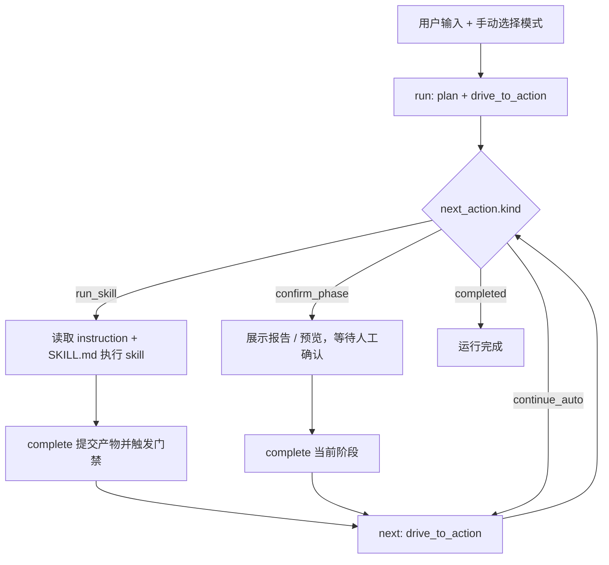

# QA Agent 优化方案评审与改进方案

## Summary

基于两份 Claude Code 评审文档和当前仓库实现，结论如下：

- 评审中的大方向大多合理，尤其是：
  - 单 session 驱动摩擦确实偏大
  - `qa_agent.markdown_cases` 死引用是明确缺陷
  - 影响分析、环境预检、状态提示还有明显优化空间
- 但第二份文档给出的落地方案有几处不够理想：
  - 不应把大量执行说明堆进 `blocked_reason`
  - 不应把 `AGENTS.md` 完全改写成 Claude CLI runbook
  - 不应优先用 TF-IDF/语义检索解决影响分析问题
  - 不应只靠 `advance --auto` 修复交互摩擦
- 更优方案是：
  - 引入结构化 `next_action`
  - 增加 `drive_to_action()` 驱动层
  - CLI 增加 `run / next / doctor`
  - 保留 README/AGENTS 的分层定位
  - 用共享 Markdown 解析器替代当前重复解析与死引用问题

## 最新逻辑图

目标不是去掉人工确认，而是让一个 Claude Code session 能持续推进到“下一个明确动作点”。

## Key Changes

### 1. 引入结构化 `next_action`

在 `RunState` 中新增：

- `blocked_since`
- `next_action`
- `next_action.kind`
  - `run_skill`
  - `confirm_phase`
  - `continue_auto`
  - `completed`
- `next_action.phase`
- `next_action.summary`
- `next_action.skill_path`
- `next_action.instruction_path`
- `next_action.required_artifacts`
- `next_action.resume_command`

规则：

- `blocked_reason` 只保留一句话摘要
- 程序和 CLI 一律读取 `next_action`
- `status --next-action` 和 `status --json` 基于该结构输出

### 2. 新增 `drive_to_action()`，不要只改 `advance --auto`

保留 `advance()` 当前语义，新增：

- `QAConductor.drive_to_action(run_id, inputs=None)`

行为：

- 自动穿过所有可自动完成阶段
- 在以下时机停下：
  - 需要执行 skill
  - 需要人工确认
  - 已完成
- `legacy_update` 若只是 `retry/继续下一轮`，继续自动推进
- `manual-review` 时停止并生成明确 action

### 3. CLI 增加更适合单 session 驱动的命令

新增：

- `run`
  - 等价于 `plan + drive_to_action`
- `next`
  - 从当前状态继续 `drive_to_action`
- `doctor`
  - 前置环境检查

保留：

- `advance`
  - 作为底层调试命令
- `complete`
  - 继续负责提交产物并触发门禁
- `status`
  - 增加 `--next-action`
  - 增加 `--json`

推荐工作流改为：

- `run`
- 执行 skill / 确认
- `complete`
- `next`
- 循环直到完成

### 4. README 和 AGENTS 继续分层，但补 driver loop

不建议把 `AGENTS.md` 完全重写成 Claude CLI 教程。

建议：

- `README.md`
  - 面向用户
  - 增加用户视角逻辑图
  - 增加完整命令速查
  - 增加每阶段 artifact key 示例
- `AGENTS.md`
  - 面向 agent
  - 保留内部契约
  - 增加 `Driver Loop` 章节
  - 增加 `next_action.kind -> 行动` 对照表
  - 增加 artifact key 总表

### 5. 修复 `qa_agent.markdown_cases` 死引用，并收敛解析逻辑

当前问题成立：

- `qa_agent/adapters/dedupe_mapper.py` 引用了不存在的 `qa_agent.markdown_cases`

推荐改法：

- 新增 `qa_agent/markdown_cases.py`
- 抽出当前 `conductor.py` 中的 Markdown 用例解析逻辑
- `conductor` 和 `dedupe_mapper` 共用这一套解析器
- 为共享解析器补单测

这样比简单删 import 更好，也能顺便消除解析重复。

### 6. 混合模式补“行为差异”，不必强拆 phase 列表

当前 `MIXED_PHASES = NEW_FEATURE_PHASES` 本身不一定是问题，问题在于混合模式缺少额外语义。

改为：

- 新需求
  - 影响分析主要消费新脚本候选
- 纯回归
  - 影响分析主要消费变更描述命中的旧资产
- 混合
  - 必须同时消费：
    - 阶段2生成的新脚本候选
    - 变更描述命中的旧脚本候选
  - 结果中增加来源字段：
    - `source_group = new_feature | regression | both`

### 7. 影响分析先用规则和元数据增强，不先上语义检索

优先级：

1. `module/site/feature`
2. 路径规则
3. `@pytest.mark`
4. `allure.title`
5. `case_id`
6. `nodeid`
7. `module-map / impact-map`
8. 变更描述关键字

只有前面都不够时，才考虑 AI 辅助扩候选。

本轮不引入：

- TF-IDF
- 向量检索
- 大模型全文语义扫全仓

### 8. 增加 `doctor`，把环境问题前置暴露

`qa-agent doctor` 至少检查：

- regression project root 是否存在
- `venv_python` 是否存在且可执行
- `ok_autotest_ui_skill` 脚本是否存在
- `bundled/knowledge_base` / `knowledge-base-manager` 是否存在
- pytest / Playwright 基础依赖是否可调用
- 如适用，skill 自带 `doctor` 是否通过

规则：

- `plan` 不强制失败，但可附带 warning
- `run` 默认先做 doctor
- doctor 失败时停在明确的 actionable 状态，而不是等 runtime 才炸

### 9. 增加陈旧阻塞提醒，不自动改状态

新增：

- `blocked_since`
- 配置项 `thresholds.gates.blocked_warn_after_seconds`

行为：

- `status` 超过阈值时提示阻塞过久
- 只做提醒，不自动修改 phase/status

### 10. 测试补强重点

优先补：

- `markdown_cases` 共享解析测试
- `run` 命令测试
- `next` 命令跨自动阶段测试
- `legacy_update` 自动多轮推进测试
- `status --next-action` / `status --json` 测试
- `doctor` 失败场景测试
- `blocked_since` 陈旧提醒测试
- `impact_verification.py` 单测
- `legacy_update.py` 单测
- `promotion_guard.py` 单测

次优先级：

- CLI 参数边界
- 并发推进保护

## Public APIs / Interfaces

- `RunState`
  - 新增 `blocked_since`
  - 新增 `next_action`
- 新增模型
  - `NextAction`
  - `ActionHint`
- `QAConductor`
  - 新增 `drive_to_action()`
  - 保留 `advance()`
- `qa_agent.cli`
  - 新增 `run`
  - 新增 `next`
  - 新增 `doctor`
  - `status` 增加 `--next-action`
  - `status` 增加 `--json`
- 新增共享模块
  - `qa_agent/markdown_cases.py`
- 配置
  - 新增 `blocked_warn_after_seconds`

## Test Plan

1. `run --change-mode 新需求 ...`
   预期：创建 run 后直接推进到第一个 `run_skill` 动作点。
2. 阶段1 `complete` 后执行 `next`
   预期：自动穿过影响分析，停在 `impact_verification` 或下一个动作点。
3. `legacy_update` 首轮返回 `retry`
   预期：`next` 自动进入下一轮，不要求用户重复手动推进。
4. `status --next-action`
   预期：输出 skill 路径、instruction 路径、artifact keys、resume command。
5. `doctor` 缺少 venv
   预期：明确说明缺失项，不进入深层 runtime 才失败。
6. `qa_agent.markdown_cases`
   预期：`conductor` 与 `dedupe_mapper` 都可用，不再出现死 import。
7. 混合模式 impact analysis
   预期：候选集同时含新脚本来源和旧回归来源，并能区分来源字段。
8. 阻塞超过阈值
   预期：`status` 给出 stale warning，但 phase/status 不自动变化。
9. KB 阶段
   预期：存在 `kb_text_case_draft_path` 时，instruction 和 `next_action` 都明确要求优先回写该路径。

## Assumptions

- 目标是降低单 session 驱动摩擦，不是去掉人工确认门禁。
- skill 仍然是外部执行单元，QA Agent 不直接调用 LLM。
- 推荐交互路径转为 `run / next / complete`，但 `advance` 保持兼容。
- 影响分析本轮优先做规则增强，不引入 TF-IDF 或向量检索。
- `README.md` 继续面向用户，`AGENTS.md` 继续面向 agent，不做角色颠倒。
