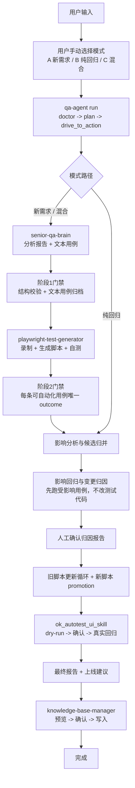

# QA Agent 使用说明

`QA_Agent` 是一个测试编排项目。你在这个仓库里让 AI 工作时，它会帮你串起：

- `senior-qa-brain`：分析 Figma / PRD，输出分析报告和文本用例
- `playwright-test-generator`：把可自动化文本用例转成 UI 自动化脚本
- `ok_autotest_ui_skill`：做 PC UI 回归
- `knowledge-base-manager`：把本次产物同步回知识库

这个项目的重点不是“替代 skill”，而是“把 skill 串起来，并在每一阶段做验收”。

## 完整逻辑图



## 你怎么开始

在仓库根目录直接告诉 AI：

- 你要跑哪种模式：`新需求`、`纯回归`、`混合`
- 站点：比如 `ae`
- 模块：比如 `car`
- 功能点：比如 `列表`
- 如果是新需求/混合，再给 `Figma`、`PRD`
- 如果是纯回归/混合，再给改动描述

常见说法：

```text
请用 QA Agent 跑一条新需求链路，站点 ae，模块 car，功能点 列表，PRD 在 /path/to/doc.pdf
```

```text
请用 QA Agent 跑纯回归，站点 ae，模块 car，改动是“列表卡片样式改大卡”
```

```text
请用 QA Agent 跑混合模式，站点 ae，模块 car，功能点 列表，PRD 在 /path/to/doc.pdf，另外列表卡片样式有改动
```

## 三种模式

- `新需求`：先出分析报告和文本用例，再做自动化转译、影响验证、回归、知识库更新
- `纯回归`：直接从影响分析开始，不生成新的文本用例草稿
- `混合`：先走新需求支线，再把新脚本和旧脚本一起纳入回归

模式不自动判断。你需要明确告诉 AI 选哪一种。

## 推荐命令流

最推荐用 `run` 创建并自动推进到第一个可操作点：

```bash
python -m qa_agent.cli run \
  --change-mode 新需求 \
  --site ae \
  --module car \
  --feature 列表 \
  --prd-ref "/path/to/需求文档.pdf"
```

纯回归示例：

```bash
python -m qa_agent.cli run \
  --change-mode 纯回归 \
  --site ae \
  --module car \
  --feature 列表 \
  --change-description "列表卡片样式改大卡"
```

查看下一步该做什么：

```bash
python -m qa_agent.cli status --run-id <run_id> --next-action
```

提交阶段产物并触发门禁：

```bash
python -m qa_agent.cli complete \
  --run-id <run_id> \
  --phase senior-qa-brain \
  --artifact analysis_report=/path/to/analysis.md \
  --artifact textcases=/path/to/textcases.md
```

人工确认后继续自动推进：

```bash
python -m qa_agent.cli next --run-id <run_id>
```

环境预检：

```bash
python -m qa_agent.cli doctor
```

调试时看完整 JSON：

```bash
python -m qa_agent.cli status --run-id <run_id> --json
```

`advance` 仍然保留，但它是低层单步推进命令；日常建议优先使用 `run / next / complete / status`。

## 你会经历哪些确认点

1. `senior-qa-brain`
   AI 会先停在分析报告，等你确认后再继续生成文本用例。
2. `playwright-test-generator`
   AI 会要求产出逐条 case outcome，确认每条 `UI自动化=✅` 的用例都有唯一结局。
3. `影响回归与变更归因`
   AI 会先跑受影响用例，再给你一份简洁归因报告，等你确认后才允许改旧脚本或 promotion 新脚本。
4. `ok_autotest_ui_skill`
   AI 会先给你 dry-run 预览，等你确认后才真实执行回归。
5. `knowledge-base-manager`
   AI 会先给你知识库更新预览，等你确认后才写入。

## 阶段完成时通常要交哪些产物

如果你用 CLI 或要求 AI 手动 `complete` 某个阶段，常见产物是：

- 阶段1：`analysis_report=<path>`、`textcases=<path>`
- 阶段2：`playwright_case_outcomes=<path>`
- 阶段3：`ok_ui_dry_run_preview=<path>`、`ok_ui_execution_report=<path>`、`release_recommendation=<path>`
- 知识库阶段：`knowledge_base_update_preview=<path>`、`knowledge_base_update_result=<path>`

常见 artifact key 示例：

| 阶段 | artifact key |
| --- | --- |
| 阶段1 | `analysis_report`, `textcases`, `text_case_manifest`, `kb_text_case_draft_path` |
| 阶段2 | `playwright_case_outcomes`, `generated_scripts_manifest` |
| 影响分析 | `impact_candidates`, `overlap_report` |
| 影响归因 | `impact_run_selector_plan`, `impact_run_results`, `change_attribution_report` |
| 更新循环 | `legacy_update_tasks`, `legacy_update_gate`, `regression_selector_plan` |
| 阶段3 | `ok_ui_dry_run_preview`, `ok_ui_execution_report`, `release_recommendation` |
| 最终阶段 | `final_report`, `knowledge_base_update_context`, `knowledge_base_update_preview`, `knowledge_base_update_result` |

## 文本用例会放哪里

新需求 / 混合模式下，阶段1通过门禁后，文本用例会直接写到：

`bundled/knowledge_base/文本用例/<目录桶>/`

例如 `car` 会路由到：

`bundled/knowledge_base/文本用例/test_car/`

最终知识库更新阶段会优先回写这同一份草稿，不会默认新建第二份重复文本用例。

## 产物去哪看

每次运行都会落到：

`/Users/a58/Desktop/QA_Agent/.qa_agent/runs/<run_id>/`

重点看这些文件：

- `run_state.json`
- `analysis_report.*`
- `text_case_manifest.json`
- `playwright_case_outcomes.json`
- `impact_candidates.json`
- `change_attribution_report.md`
- `legacy_update_tasks.json`
- `regression_selector_plan.json`
- `final_report.md`
- `knowledge_base_update_context.md`

## 卡住时怎么继续

- 如果 AI 提示“等待确认”，说明这是正常门禁，确认后继续即可
- 如果提示缺少某个 artifact，就把对应文件补齐后再次 `complete`
- 如果停在 `manual-review`，说明自动循环已经到边界，需要人工介入

查看状态：

```bash
python -m qa_agent.cli status --run-id <run_id> --next-action
```

推进下一阶段：

```bash
python -m qa_agent.cli next --run-id <run_id>
```

如果 `doctor` 报 fatal，需要先修复内嵌 skill、知识库或项目根目录；如果只有 warning，`run` 会继续创建任务，但会把预检结果保存到本次 run。

完整内部编排契约、阶段门禁和状态持久化说明见 [AGENTS.md](/Users/a58/Desktop/QA_Agent/AGENTS.md)。
