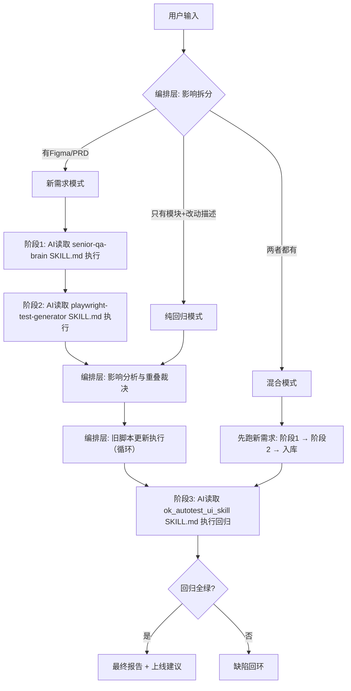

# QA Agent 编排层

`QA_Agent` 是一个纯编排调度层，把三个独立 skill 串成完整的测试链路：

- `senior-qa-brain` — 分析 Figma + 生成测试用例
- `playwright-test-generator` — 录制浏览器交互 + 生成 Python 测试脚本
- `ok_autotest_ui_skill` — 执行回归测试 + 生成报告

**编排层不做具体测试工作。** 每个 skill 的执行交给 AI 读取对应 SKILL.md 后自行完成。

## 架构



## 三种变更模式

| 模式 | 用户输入 | 走哪些阶段 |
|------|---------|-----------|
| **新需求** | Figma链接 和/或 PRD | 阶段1 → 阶段2 → 影响分析 → 旧脚本更新循环 → 阶段3 |
| **纯回归** | 模块名 + 站点 + 改动描述 | 影响分析 → 旧脚本更新循环 → 阶段3 |
| **混合** | Figma/PRD + 改动描述 | 先新需求支线，再做影响分析与旧脚本更新循环，最后阶段3 |

AI 自动识别变更模式，拿不准时会通过对话确认。

## 快速开始

```bash
cd /Users/a58/Desktop/QA_Agent
bash scripts/bootstrap_env.sh
source .venv/bin/activate
python -m qa_agent.cli --help
```

## 命令

### 新需求

```bash
# 创建计划
qa-agent plan --figma-url <Figma链接> --site sg --module login --feature "visual_optimization"

# 也支持中文
qa-agent 计划 --figma链接 <Figma链接> --站点 sg --模块 login --功能 "visual_optimization"
```

### 纯回归

```bash
qa-agent plan --module wallet --site ae --change-description "修改了提现金额校验逻辑"
```

### 混合

```bash
qa-agent plan --figma-url <Figma链接> --module login --site sg --change-description "同时改了旧的注册流程"
```

### 推进流程

```bash
# 推进到下一阶段
qa-agent advance --run-id <运行ID>

# 标记当前阶段完成并推进（skill 执行完后调用）
qa-agent complete --run-id <运行ID> --phase <阶段名>

# 查看状态
qa-agent status --run-id <运行ID>
```

## 典型工作流（新需求）

```
1. qa-agent plan --figma-url ... --site sg --module login
   → 输出: [运行ID] 新需求 | 已计划

2. qa-agent advance --run-id <ID>
   → 输出: 请按 senior-qa-brain/SKILL.md 执行
   → 你按 SKILL.md 分析 Figma、生成报告、确认、生成用例

3. qa-agent complete --run-id <ID> --phase senior-qa-brain
   → 输出: 请按 playwright-test-generator/SKILL.md 执行
   → 你按 SKILL.md 分批录制、验证、生成脚本

4. qa-agent complete --run-id <ID> --phase playwright-test-generator
   → 输出: 自动进入影响分析与旧脚本更新循环

5. qa-agent advance --run-id <ID>
   → 输出: 旧脚本更新第 N 轮结果；若未清零则继续 advance

6. qa-agent complete --run-id <ID> --phase ok_autotest_ui_skill
   → 输出: 最终报告已生成
```

## 编排规则

完整的编排契约定义在 [AGENTS.md](AGENTS.md)。

## 状态目录

所有状态保存在 `.qa_agent/` 下：

- `.qa_agent/project-memory.json`
- `.qa_agent/notepad.md`
- `.qa_agent/runs/<运行ID>/`

## 说明

- 编排层只做阶段流转，不替代 skill 的内部逻辑
- 每个 skill 的执行方式由其 SKILL.md 定义
- 影响分析、旧脚本更新循环和提升守卫是编排层的"阶段间衔接"逻辑
- 提升守卫的标准参考：
  - `ok_autotest_ui_skill/bundled/ok_autotest_ui_pc/docs/test-case-authoring-spec.md`
  - `ok_autotest_ui_skill/bundled/ok_autotest_ui_pc/docs/test-case-review-checklist.md`
