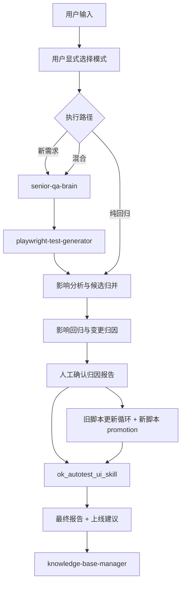

# QA Agent 编排层

`QA_Agent` 是一个纯编排调度层，把四段能力串成完整测试链路：

- `senior-qa-brain`：分析 Figma / PRD，产出分析报告和 Markdown 用例
- `playwright-test-generator`：录制浏览器交互，生成 Python 测试脚本
- `ok_autotest_ui_skill`：执行 UI 回归并输出回归报告
- `knowledge-base-manager`：在最终阶段预览并更新知识库

编排层不替代 skill 内部逻辑；它负责状态流转、影响分析、先跑先判、旧脚本更新循环和产物落盘。

## 架构



## 变更模式

模式不再自动判定，用户必须显式选择：

| 模式 | CLI 参数 | 阶段 |
|------|---------|------|
| 新需求 | `--change-mode 新需求` | `senior-qa-brain -> playwright-test-generator -> impact -> verify -> legacy -> ok_ui -> final -> kb` |
| 纯回归 | `--change-mode 纯回归` | `impact -> verify -> legacy -> ok_ui -> final -> kb` |
| 混合 | `--change-mode 混合` | `senior-qa-brain -> playwright-test-generator -> impact -> verify -> legacy -> ok_ui -> final -> kb` |

## 快速开始

```bash
cd /Users/a58/Desktop/QA_Agent
bash scripts/bootstrap_env.sh
source .venv/bin/activate
python -m qa_agent.cli --help
```

## 命令

```bash
qa-agent plan --change-mode 新需求 --figma-url <Figma链接> --site ae --module car --feature 列表
qa-agent plan --change-mode 纯回归 --site ae --module car --change-description "列表卡片样式调整"
qa-agent plan --change-mode 混合 --figma-url <Figma链接> --site ae --module car --change-description "列表卡片样式调整"

qa-agent advance --run-id <运行ID>
qa-agent complete --run-id <运行ID> --phase <阶段名>
qa-agent status --run-id <运行ID>
```

`IMPACT_VERIFICATION` 阶段完成后，需要显式执行：

```bash
qa-agent complete --run-id <运行ID> --phase 影响回归与变更归因
```

`KNOWLEDGE_BASE_UPDATE` 阶段完成后，run 才会进入 `已完成`。

## 编排要点

- 识别出受影响用例后，先执行一轮影响回归，再生成简洁归因报告
- 人工确认前，不允许修改 repo-tracked 测试代码
- 旧脚本更新和新脚本 promotion 都在 `旧脚本更新执行` 阶段内循环处理
- `ok_autotest_ui_skill` 只消费确认后的 `regression_selector_plan.json`
- 最终阶段固定触发 `knowledge-base-manager`

## Vendored 资产

- `bundled/knowledge_base/`：知识库内容快照
- `bundled/skills/knowledge-base-manager/`：knowledge base skill 快照
- 两者都由 `scripts/sync_bundled_assets.sh` 同步
- 同步时会先校验 `/Users/a58/Desktop/knowledge_base` 是否位于 `main`、是否干净、是否追平远端 `origin/main`
- 同步完成后会生成 `.bundle-manifest.json`

## 状态目录

- `.qa_agent/project-memory.json`
- `.qa_agent/notepad.md`
- `.qa_agent/runs/<运行ID>/`

完整编排契约见 [AGENTS.md](/Users/a58/Desktop/QA_Agent/AGENTS.md)。
