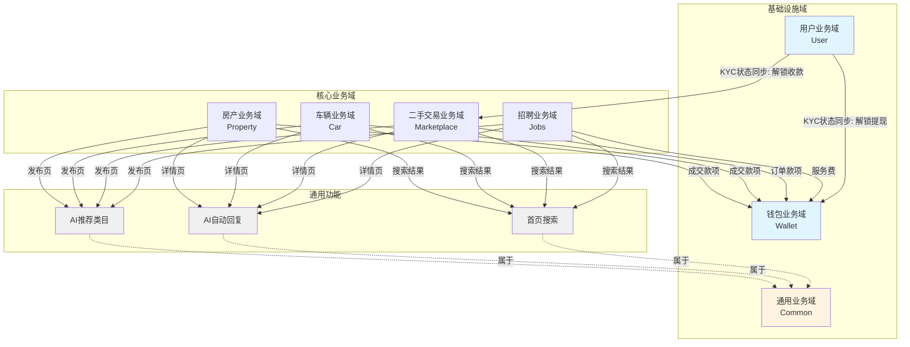
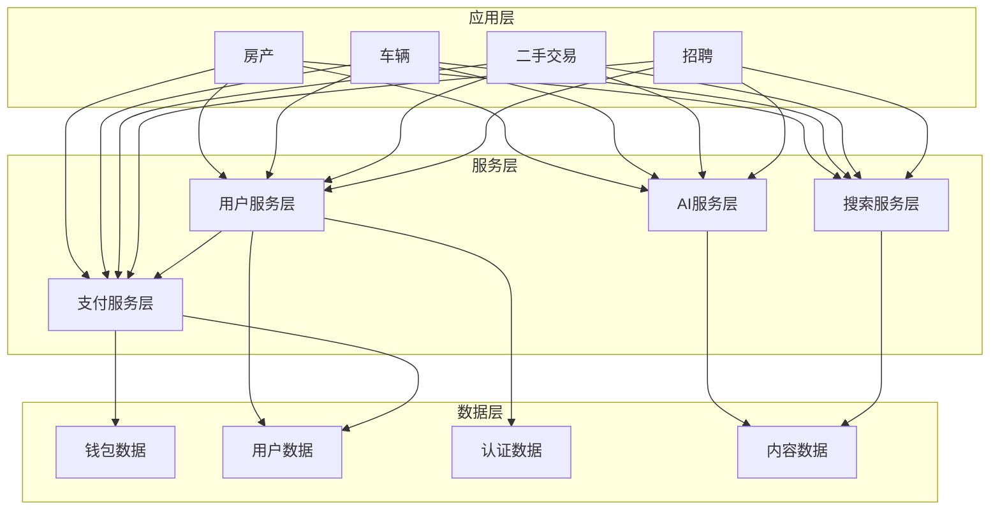
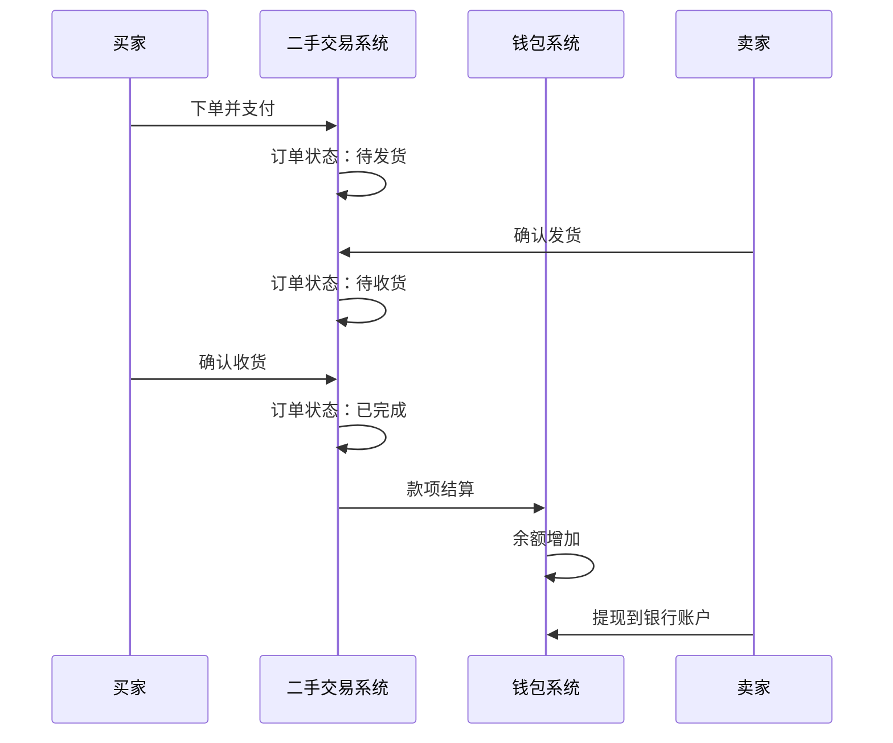
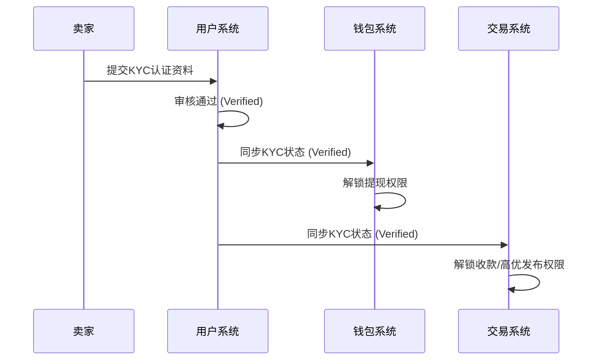
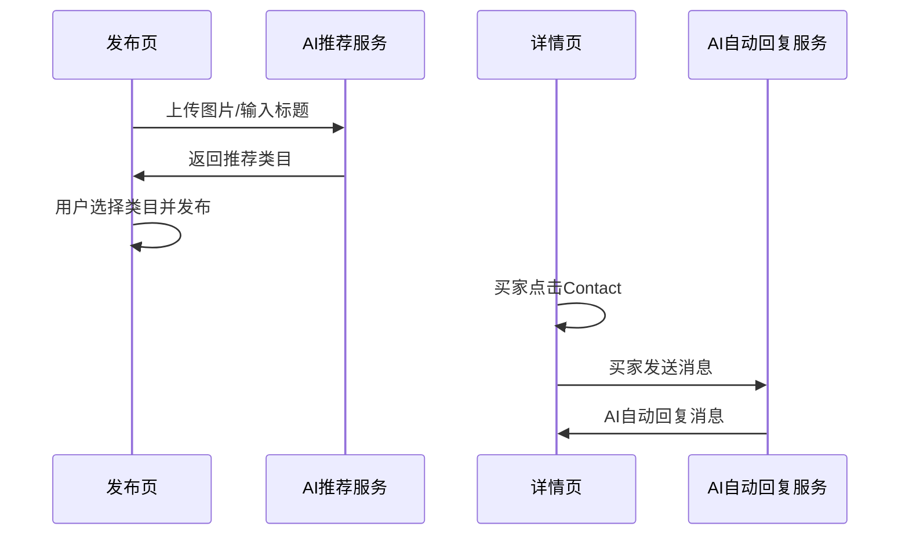
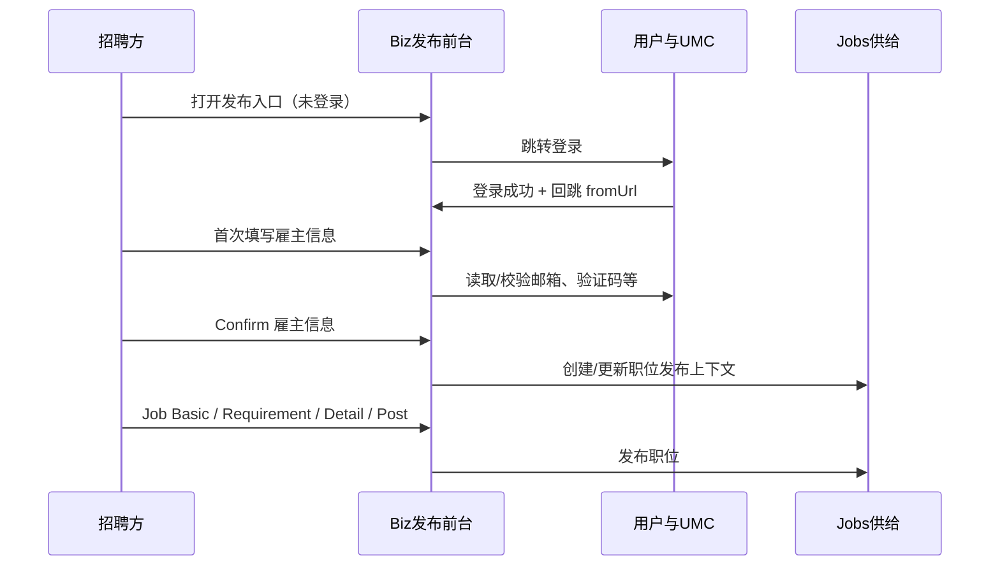

# 业务域关联图

## 1. 业务域全景关联图

### 1.1 整体架构图

### 1.2 分层架构视图

## 2. 跨域数据流转

### 2.1 订单款项流转（二手交易 → 钱包）

### 2.2 KYC状态流转（用户域 → 钱包/交易域）

### 2.3 AI功能调用（各业务域 → 通用业务域）

### 2.4 B 端职位发布与用户信息（UMC / 登录态）

---

## 3. 变更历史

| 日期 | 版本 | 变更内容 | 变更人 |
|-----|------|---------|--------|
| 2026-03-24 | v1.1 | 新增用户业务域及KYC状态的跨域同步链路 | AI |
| 2026-03-24 | v1.0 | 初始版本，基于所有业务域生成 | AI |
| 2026-05-09 | v1.2 | 补充 B 端职位发布与 UMC/登录回跳的数据流（2.4） | QA Agent |
