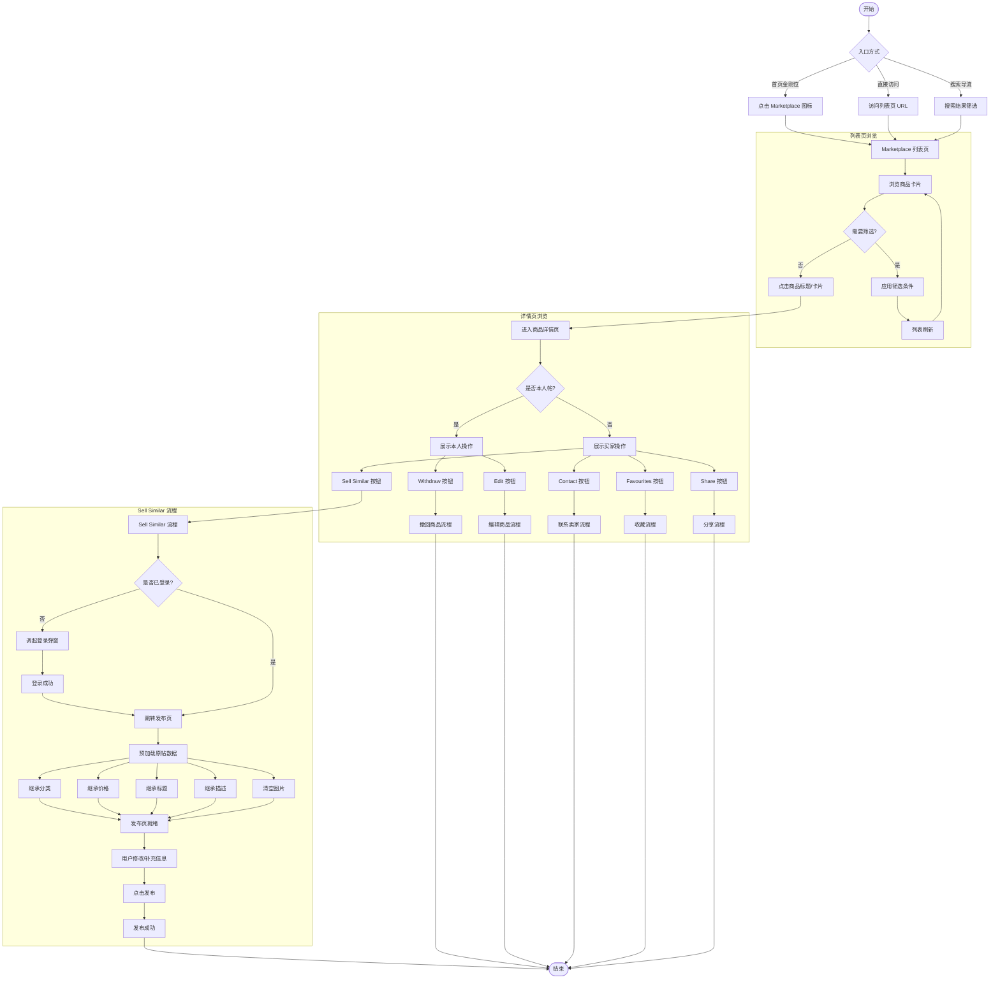

# Marketplace列表详情与SellSimilar业务流程

> **业务目标**：为买家提供高效的商品浏览、筛选、详情查看服务，通过 Sell Similar 功能降低卖家发布门槛

---

## 1. 完整流程图

> **要求**：专注于本业务域内的详细步骤，**不包含**跨域交互的复杂逻辑分支（跨域逻辑统一在业务全景文档中展示）。

---

## 2. 详细步骤与观测点

### 步骤1：进入列表页

**页面位置**：Marketplace 列表页

**操作流程**：
1. 用户通过首页金刚位点击 "Marketplace" 图标
2. 或直接访问 URL：`https://{site}.58v5.cn/{language}/city-{city}/cate-marketplace/`
3. 或通过搜索结果筛选 Marketplace 分类进入

**观测点**：
- ✅ P0：页面 URL 正确（包含 `/cate-marketplace/`）
- ✅ P0：列表页加载完成，显示商品卡片
- ✅ P0：筛选器区域可见（Transaction、Category、Price、Location、Condition）
- ✅ P0：排序选项可见（Default、Newest、Price: Low to High、Price: High to Low）
- ❌ 负向：列表为空时显示 "No results found"

**验证方法**：
- 直接访问列表页 URL，观察页面加载状态
- 检查商品卡片数量 ≥ 0（数据库有数据时 ≥ 1）
- 检查筛选器、排序器是否可交互

**关联规则**：[Marketplace列表详情与SellSimilar规则.md - 3.1 列表页规则](../../业务规则库/二手交易模块/Marketplace列表详情与SellSimilar规则.md#31-列表页规则)

---

### 步骤2：应用筛选条件（可选）

**页面位置**：Marketplace 列表页 - 筛选器区域

**操作流程**：
1. 点击 "Transaction" 筛选项
2. 选择 "Online" 或 "Offline"
3. 点击 "Confirm" 按钮
4. 列表刷新，展示筛选结果

**观测点**：
- ✅ P0：Transaction 筛选面板成功打开
- ✅ P0：选中 Online/Offline 后，选项高亮
- ✅ P0：点击 Confirm 后，列表刷新
- ✅ P1：筛选标签显示在列表顶部（如 "Online" 标签）
- ✅ P1：筛选后商品数量变化，URL 更新（如增加 `?transaction=online`）
- ❌ 负向：筛选无结果时显示空状态

**验证方法**：
- 依次选择 Online、Offline，观察列表变化
- 检查 Online 商品是否显示 "Free Delivery" 标签
- 检查 Offline 商品是否不显示配送标签
- 观察 URL 参数变化

**关联规则**：[Marketplace列表详情与SellSimilar规则.md - 3.1 列表页规则 - 筛选规则](../../业务规则库/二手交易模块/Marketplace列表详情与SellSimilar规则.md#31-列表页规则)

---

### 步骤3：点击商品进入详情页

**页面位置**：Marketplace 列表页 → 商品详情页

**操作流程**：
1. 在列表页点击商品标题或卡片
2. 页面跳转到商品详情页

**观测点**：
- ✅ P0：页面成功跳转，URL 包含 `/cate-{category}/` 和商品 ID
- ✅ P0：详情页加载完成，显示商品主图、标题、价格
- ✅ P0：卖家信息区域可见（昵称、Listings 数量）
- ✅ P1：操作按钮区域可见（Favourites、Share、Contact/Withdraw/Edit、Sell Similar）
- ✅ P1：推荐模块可见（"You may also like"）
- ✅ P1：地图模块可见（"Show map" 按钮）
- ❌ 负向：商品不存在时显示 "This listing is no longer available"

**验证方法**：
- 点击任意商品，观察详情页加载状态
- 检查必填元素是否全部展示
- 检查操作按钮是否符合「本人帖/非本人帖」规则

**关联规则**：[Marketplace列表详情与SellSimilar规则.md - 3.2 详情页规则](../../业务规则库/二手交易模块/Marketplace列表详情与SellSimilar规则.md#32-详情页规则)

---

### 步骤4：详情页操作按钮差异（核心）

**页面位置**：商品详情页 - 操作按钮区域

**操作流程**：
1. 系统判断当前商品是否为本人发布
2. 根据所有者身份展示不同的操作按钮

#### 情况A：本人发布的商品
**展示按钮**：
- ✅ Withdraw（撤回商品）
- ✅ Edit（编辑商品信息）
- ❌ **不展示** Contact
- ❌ **不展示** Sell Similar

**观测点**：
- ✅ P0：Withdraw 按钮可见且可点击
- ✅ P0：Edit 按钮可见且可点击
- ✅ P0：**不展示** Contact 按钮
- ✅ P0：**不展示** Sell Similar 按钮

#### 情况B：他人发布的商品（Marketplace 分类）
**展示按钮**：
- ✅ Contact（联系卖家）
- ✅ Sell Similar（快速发布同类商品）
- ✅ Favourites（收藏）
- ✅ Share（分享）
- ❌ **不展示** Withdraw/Edit

**观测点**：
- ✅ P0：Contact 按钮可见且可点击
- ✅ P0：Sell Similar 按钮可见且可点击
- ✅ P0：**不展示** Withdraw/Edit 按钮

**验证方法**：
- 登录后访问自己发布的商品，检查按钮展示
- 登录后访问他人发布的商品，检查按钮展示
- 检查按钮文案是否正确（如 "Sell Similar" 按钮文案）

**关联规则**：[Marketplace列表详情与SellSimilar规则.md - 3.3 Sell Similar 规则 - 按钮展示规则](../../业务规则库/二手交易模块/Marketplace列表详情与SellSimilar规则.md#33-sell-similar-规则)

---

### 步骤5：点击 Sell Similar 按钮（核心流程）

**页面位置**：商品详情页（非本人帖） → 发布页

**操作流程**：
1. 用户点击 "Sell Similar" 按钮
2. 系统检查登录状态
   - 若未登录：调起登录弹窗，登录成功后跳转发布页
   - 若已登录：直接跳转发布页
3. 发布页预加载原帖数据
4. 用户修改/补充信息后发布

**观测点**：
- ✅ P0：Sell Similar 按钮在非本人帖详情页可见
- ✅ P0：点击按钮后，**3 秒内**跳转到发布页
- ✅ P0：发布页 URL 包含 `/publish/` 路径
- ✅ P0：发布页页面标题包含 "Post"
- ✅ P1：未登录点击时，调起登录弹窗（不是跳转登录页）
- ✅ P1：登录成功后，自动跳转到发布页（保留跳转意图）
- ❌ 负向：本人帖不展示 Sell Similar 按钮
- ❌ 负向：非 Marketplace 分类商品不展示 Sell Similar 按钮

**验证方法**：
- 登录后访问他人商品，点击 Sell Similar，观察跳转
- 未登录时点击 Sell Similar，观察是否调起登录弹窗
- 登录成功后，观察是否自动跳转到发布页
- 检查发布页 URL 是否正确

**关联规则**：[Marketplace列表详情与SellSimilar规则.md - 3.3 Sell Similar 规则](../../业务规则库/二手交易模块/Marketplace列表详情与SellSimilar规则.md#33-sell-similar-规则)

---

### 步骤6：发布页预加载原帖数据（核心流程）

**页面位置**：发布页

**操作流程**：
1. 发布页加载完成后，自动预填充以下字段：
   - 分类（完整分类路径，如 Electronics → Cell Phones → Apple）
   - 价格（原帖价格，用户可修改）
   - 标题（原帖标题，用户可修改）
   - 描述（原帖描述，用户可修改）
   - 商品属性（如 Brand、Model 等）
2. 以下字段**不预填充**（需要用户重新填写）：
   - 图片（清空，用户必须重新上传）
   - 视频（清空）
   - 位置（使用用户默认位置）
   - 配送选项（使用默认值）

**观测点**：
- ✅ P0：分类字段已预填充（与原帖一致）
- ✅ P1：价格字段已预填充（与原帖一致，非 AED 0）
- ✅ P1：标题字段已预填充（与原帖一致）
- ✅ P1：描述字段已预填充（与原帖一致）
- ✅ P1：商品属性已预填充（如 Brand、Model 等）
- ✅ P0：图片上传区域为空（无预加载图片）
- ✅ P1：视频上传区域为空
- ❌ 负向：预加载失败时，显示空表单，不阻止用户发布

**验证方法**：
- 从详情页点击 Sell Similar，记录原帖价格、标题、描述
- 进入发布页后，检查各字段是否正确预填充
- 特别检查图片上传区域是否为空（不预加载图片）
- 观察页面加载速度（预加载不应明显延长加载时间）

**关联规则**：[Marketplace列表详情与SellSimilar规则.md - 3.3 Sell Similar 规则 - 数据继承规则](../../业务规则库/二手交易模块/Marketplace列表详情与SellSimilar规则.md#33-sell-similar-规则)

---

## 3. 流程完整性验证清单

### 列表页流程验证
- [ ] 从首页金刚位进入列表页成功
- [ ] 直接访问列表页 URL 成功
- [ ] 搜索结果筛选进入列表页成功
- [ ] 列表页显示商品卡片（含主图、标题、价格、位置、收藏按钮）
- [ ] 筛选器区域可见且可交互（Transaction、Category、Price、Location、Condition）
- [ ] 排序选项可见且可交互
- [ ] 列表为空时显示 "No results found"

### 筛选功能验证
- [ ] Transaction 筛选 Online 成功，列表刷新
- [ ] Transaction 筛选 Offline 成功，列表刷新
- [ ] Online 商品显示 "Free Delivery" 标签
- [ ] Offline 商品不显示配送标签
- [ ] 筛选无结果时显示空状态

### 详情页流程验证
- [ ] 从列表页点击商品进入详情页成功
- [ ] 详情页 URL 正确（包含 `/cate-{category}/` 和商品 ID）
- [ ] 详情页显示必填元素（主图、标题、价格、卖家信息、操作按钮）
- [ ] 本人帖展示 Withdraw/Edit 按钮，不展示 Contact/Sell Similar
- [ ] 非本人帖展示 Contact/Sell Similar 按钮，不展示 Withdraw/Edit
- [ ] 商品不存在时显示 "This listing is no longer available"

### Sell Similar 流程验证
- [ ] 非本人帖详情页展示 Sell Similar 按钮
- [ ] 本人帖不展示 Sell Similar 按钮
- [ ] 非 Marketplace 分类商品不展示 Sell Similar 按钮
- [ ] 未登录点击 Sell Similar 调起登录弹窗
- [ ] 登录成功后自动跳转发布页
- [ ] 已登录点击 Sell Similar 直接跳转发布页
- [ ] 3 秒内成功跳转到发布页
- [ ] 发布页 URL 包含 `/publish/` 路径
- [ ] 发布页页面标题包含 "Post"

### 数据预加载验证
- [ ] 发布页分类字段已预填充（与原帖一致）
- [ ] 发布页价格字段已预填充（与原帖一致）
- [ ] 发布页标题字段已预填充（与原帖一致）
- [ ] 发布页描述字段已预填充（与原帖一致）
- [ ] 发布页商品属性已预填充（如 Brand、Model 等）
- [ ] 发布页图片上传区域为空（不预加载图片）
- [ ] 发布页视频上传区域为空
- [ ] 预加载失败时显示空表单，不阻止用户发布

---

## 4. 关联文档

- [业务全景](./二手交易业务全景.md)
- [业务规则](../../业务规则库/二手交易模块/Marketplace列表详情与SellSimilar规则.md)
- [商品发布业务流程](./商品发布业务流程.md)

---

## 5. 变更历史

| 日期 | 版本 | 变更内容 | 变更人 |
|------|------|---------|--------|
| 2026-04-28 | v1.0 | 初始版本，整合 Marketplace 列表详情与 Sell Similar 业务流程 | QA Agent |
| 2026-05-11 | v1.1 | 文本用例 `sell_similar_test_cases.md` 同步：`case_id_sell_similar_tc*`、UI 自动化说明；关联规则与归档索引 | knowledge-base-manager |
