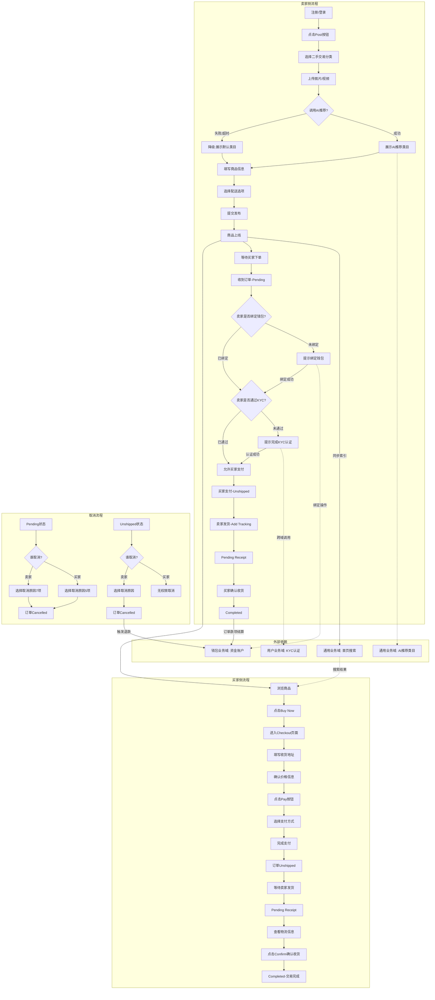
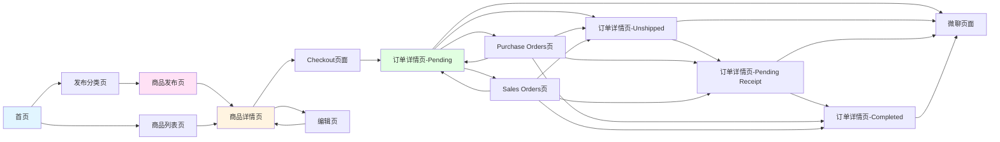
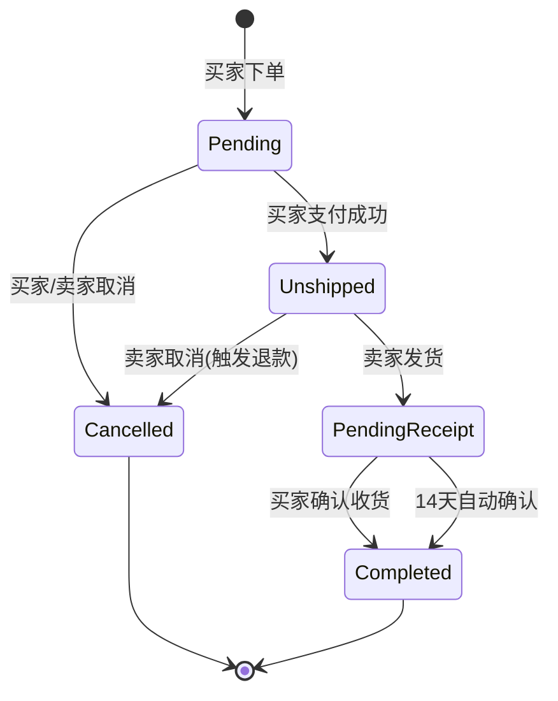

# 二手交易业务域 - 业务全景

## 1. 业务定位
二手交易业务域是OK.com的核心交易业务之一,为买家和卖家提供二手商品交易平台,支持商品发布、在线下单、支付、物流追踪、交易完成全流程。

**业务价值**:
- 为卖家提供商品发布和订单管理平台
- 为买家提供商品浏览、下单、支付、收货服务
- 通过托管交易保障买卖双方权益

**目标用户**:
- **卖家/发布者**: 需要出售二手商品的个人或商家
- **买家**: 寻找二手商品的用户
- **游客**: 未登录的访客,可浏览但功能受限

## 2. 业务范围

### 2.1 分类覆盖
| 分类 | 说明 |
|-----|------|
| Electronics(电子产品) | Cell Phones、Laptops、Tablets等 |
| 二手交易 | 综合二手商品交易 |
| Free Stuff | 免费物品赠送 |

### 2.2 地域覆盖
- **AE站**(阿联酋): Abu Dhabi, Dubai, Sharjah等主要城市
- 其他国际站点

### 2.3 用户角色
| 角色 | 权限 | 说明 |
|-----|------|------|
| 游客 | 浏览、搜索 | 下单需登录 |
| 买家 | 浏览、搜索、下单、支付、收货、评价 | 已登录用户 |
| 卖家 | 发布、浏览、订单管理、发货 | 已登录且发布过商品 |
| 发布者 | 所有权限+编辑/下架自己的商品 | 商品所有者 |

## 3. 业务流程全景图

## 4. 核心业务流程概览

### 4.1 商品发布流程
**业务目标**: 让卖家能快速发布商品信息,吸引买家

**核心步骤**:
1. 用户登录验证
2. 进入发布分类页
3. 选择二手交易分类(如Electronics → Cell Phones → Apple)
4. 上传图片(1-9张,必填)和视频(可选,1个<200MB)
5. 填写商品信息(Title/Description/Price/Location)
6. 选择配送选项(Seller pays/Buyer pays/Arrange pickup)
7. 提交发布
8. 验证商品详情页展示

**关键观测点**:
- ✅ 未登录用户无法访问发布页
- ✅ 图片至少1张,最多9张
- ✅ 视频最多1个,大小<200MB
- ✅ 配送选项必选(3种方式)
- ✅ 所有必填字段校验生效
- ✅ 发布成功后立即在商品详情页展示

**详细流程文档**: [商品发布业务流程.md](./商品发布业务流程.md)

---

### 4.2 订单创建流程
**业务目标**: 让买家能快速下单并完成支付

**核心步骤**:
1. 进入商品详情页,点击Buy Now按钮
2. 进入Checkout页面
3. 填写/编辑收货地址(Full Name/Address/Phone等)
4. 确认价格信息(Item Price/Delivery/Total)
5. 点击Pay按钮唤起支付弹窗
6. 选择支付方式(银行卡/Google Pay)
7. 完成支付,订单状态变为Payment received
8. 跳转到订单详情页

**关键观测点**:
- ✅ 未登录点击Buy Now跳转登录页
- ✅ 商品被占用时显示"Someone placed a bid but didn't complete payment"
- ✅ 收货地址必填项校验生效
- ✅ 支付成功后订单状态变为Unshipped
- ✅ 支付失败订单保持Pending状态,可重新支付

**详细流程文档**: [订单创建业务流程.md](./订单创建业务流程.md)

---

### 4.3 订单流转流程
**业务目标**: 完成从下单到交易完成的全流程

**核心步骤**:
1. Pending状态: 买家下单未支付(24小时倒计时)
2. Unshipped状态: 买家已支付,卖家待发货
3. 卖家发货: 填写Tracking Number和logistics company
4. Pending Receipt状态: 卖家已发货,买家待收货(14天自动确认)
5. 买家确认收货: 点击Confirm按钮
6. Completed状态: 交易完成,资金入卖家钱包

**关键观测点**:
- ✅ Pending状态买卖双方均可取消
- ✅ Unshipped状态仅卖家可取消(触发退款)
- ✅ Pending Receipt状态买卖双方均不可取消
- ✅ 卖家发货必填Tracking Number和logistics company
- ✅ 14天未确认收货自动完成
- ✅ 买家Completed可查看交易记录,卖家Completed资金入钱包

**详细流程文档**: [订单流转业务流程.md](./订单流转业务流程.md)

---

### 4.4 Marketplace 列表、详情与 Sell Similar

**业务目标**：完成 AE（及同构站点）Marketplace 前台逛选与「卖同款」再发布引导。

**核心步骤**：
1. 进入列表页 → 筛选/排序/浏览卡片。
2. 进入详情 → 按本人/非本人分流操作按钮集。
3. 非本人使用 Sell Similar 跳转发布页并预填允许字段。

**关键观测点**：
- ✅ 非本人帖展示 Sell Similar；本人帖不展示。
- ✅ 未登录点击 Sell Similar 先完成登录。
- ✅ 列表筛选、详情上下线/状态与扩展用例一致。

**详细流程文档**：
- [Marketplace列表与详情浏览业务流程.md](./Marketplace列表与详情浏览业务流程.md)
- [SellSimilar业务流程.md](./SellSimilar业务流程.md)

**业务规则**：
- [Marketplace列表详情与SellSimilar规则.md](../../业务规则库/二手交易模块/Marketplace列表详情与SellSimilar规则.md)
- [Marketplace发布页专项规则.md](../../业务规则库/二手交易模块/Marketplace发布页专项规则.md)

**文本用例来源（bundled）**：`bundled/knowledge_base/文本用例/marketplace/`、`bundled/knowledge_base/文本用例/marketplace_post/`

---

## 5. 页面拓扑关系

### 5.1 页面入口矩阵
| 页面 | 入口1 | 入口2 | 入口3 | 入口4 | 入口5 |
|-----|------|------|------|------|------|
| 商品列表页 | 首页 Marketplace 图标 | Browse 菜单 | 搜索结果 | - | - |
| 商品详情页 | 列表页卡片点击 | 搜索结果 | 直接 URL | - | - |
| 发布页 | 首页发布按钮 → Marketplace分类 | - | - | - | - |
| Checkout页 | 商品详情页 Buy Now 按钮 | - | - | - | - |
| 订单详情页(买家) | Purchase Orders 列表 | - | - | - | - |
| 订单详情页(卖家) | Sales Orders 列表 | - | - | - | - |

### 5.2 页面跳转流程图

**页面关系说明**:
- **首页** → 商品列表页(浏览商品)
- **首页** → 发布分类页(点击Post按钮)
- **发布分类页** → 商品发布页(选择二手交易分类)
- **商品发布页** → 商品详情页(提交成功)
- **商品列表页** → 商品详情页(点击商品卡片)
- **商品详情页** → Checkout页面(点击Buy Now按钮)
- **Checkout页面** → 订单详情页-Pending(支付后)
- **订单详情页** → Purchase Orders页(买家订单管理)
- **订单详情页** → Sales Orders页(卖家订单管理)
- **订单详情页** → 微聊页面(点击Message Seller/Buyer)
- **商品详情页** → 编辑页(点击Edit按钮,仅发布者)

### 5.3 页面关系详解

#### 首页 → 列表页
- **入口**: 点击 Marketplace 图标 / Browse 菜单
- **目标**: Marketplace 列表页
- **参数**: 无(首次进入)

#### 首页 → 发布页
- **入口**: 点击发布按钮
- **流程**: 首页 → 发布分类页 → 选择Marketplace分类 → 选择子分类 → 商品发布页
- **权限**: 未登录则先跳转登录页
- **登录后行为**: 登录成功后返回发布分类页

#### 列表页 → 详情页
- **入口**: 点击商品卡片
- **打开方式**: 新标签页(PC) / 当前页跳转(M端)
- **参数**: 商品 ID

#### 发布页 → 详情页
- **触发条件**: 提交发布成功
- **流程**: 商品发布页 → 商品详情页
- **数据**: URL包含post_id,详情页显示所有填写信息
- **时间标签**: 显示"Posted 0 min ago"

#### 详情页 → Checkout页
- **入口**: 点击 Buy Now 按钮
- **权限**: 需登录
- **未登录行为**: 弹出登录框,登录后进入Checkout页
- **商品占用**: 商品被占用时显示"Someone placed a bid but didn't complete payment",不允许进入Checkout
- **URL**: 包含createOrder参数

#### Checkout页 → 订单详情页
- **触发条件**: 支付成功
- **流程**: Checkout页面 → 订单详情页(Pending/Unshipped状态)
- **数据**: 订单状态为Payment received或Unshipped

#### 订单详情页 → Purchase Orders页
- **入口**: 顶部用户菜单 → Purchase Orders
- **目标**: 买家订单管理页
- **Tab切换**: Pending / Unshipped / Pending Receipt / Completed / Cancelled

#### 订单详情页 → Sales Orders页
- **入口**: 顶部用户菜单 → Sales Orders
- **目标**: 卖家订单管理页
- **Tab切换**: Pending / Unshipped / Pending Receipt / Completed / Cancelled

#### 订单详情页 → 微聊页面
- **入口**: 点击 Message Seller 按钮(买家) / Message Buyer 按钮(卖家)
- **流程**: 订单详情页 → 微聊页面
- **数据**: 聊天对象为当前订单对应的买家/卖家

#### 详情页 → 编辑页
- **入口**: 点击 Edit 按钮
- **权限**: 仅发布者可见
- **流程**: 商品详情页 → 编辑页 → 提交 → 商品详情页
- **数据**: 编辑页预填所有已填写数据

## 6. 业务数据流转

**状态说明**:
- **Pending**: 买家下单但未完成支付,24小时倒计时,超时自动取消
- **Unshipped**: 买家已支付,卖家未发货,卖家需在规定时间内发货
- **Pending Receipt**: 卖家已发货,买家未确认收货,14天自动确认
- **Completed**: 买家已确认收货,交易完成,资金入卖家钱包
- **Cancelled**: 订单已取消,Unshipped状态取消触发退款

### 6.2 用户操作与数据变化

| 操作 | 数据变化 | 前台展示变化 | 涉及页面 |
|-----|---------|------------|---------|
| 发布商品 | 新增商品记录 | 列表页新增卡片 | 发布页 → 详情页 |
| 编辑商品 | 更新商品记录 | 详情页信息更新 | 详情页 → 编辑页 |
| 撤回商品 | 商品状态变为"已撤回" | 列表页移除,详情页显示"已撤回" | 详情页 |
| 买家下单 | 新增订单记录(Pending状态) | Purchase Orders新增订单 | 详情页 → Checkout页 |
| 买家支付 | 订单状态变为Unshipped | 订单详情页状态更新,进度条更新 | Checkout页 → 订单详情页 |
| 买家取消订单 | 订单状态变为Cancelled | 订单详情页显示"Order Cancelled" | 订单详情页 |
| 卖家取消订单 | 订单状态变为Cancelled,触发退款 | 订单详情页显示"Order Cancelled"和退款说明 | 订单详情页 |
| 卖家发货 | 订单状态变为Pending Receipt,新增物流信息 | 订单详情页新增Package Tracking区块 | 订单详情页 |
| 买家确认收货 | 订单状态变为Completed,资金入卖家钱包 | 订单详情页显示"Order Completed" | 订单详情页 |
| 14天自动确认 | 订单状态变为Completed,资金入卖家钱包 | 订单详情页显示"Order Completed" | 订单详情页 |

### 6.3 关键业务数据

#### 商品基础信息
| 字段 | 类型 | 必填 | 说明 |
|-----|------|-----|------|
| 商品ID | String | 是 | 唯一标识 |
| 标题 | String | 是 | 商品标题 |
| 描述 | String | 是 | 0-10000字符 |
| 分类 | Enum | 是 | Electronics/Furniture/Clothing等 |
| 价格 | Number | 是 | 1-100,000,000 |
| 位置 | String | 是 | 地址 |
| 图片 | Array | 是 | 1-9张 |
| 视频 | String | 否 | 1个,<200MB |
| 配送选项 | Enum | 是 | Seller pays/Buyer pays/Arrange pickup |
| 发布者ID | String | 是 | 用户ID |
| 发布时间 | DateTime | 是 | 自动生成 |
| 状态 | Enum | 是 | 草稿/已上线/已撤回 |

#### 订单数据
| 字段 | 类型 | 必填 | 说明 |
|-----|------|-----|------|
| 订单ID | String | 是 | Order Number |
| 商品ID | String | 是 | 关联商品 |
| 买家ID | String | 是 | 买家用户ID |
| 卖家ID | String | 是 | 卖家用户ID |
| 订单状态 | Enum | 是 | Pending/Unshipped/Pending Receipt/Completed/Cancelled |
| 商品价格 | Number | 是 | Item Price |
| 配送费 | Number | 是 | Delivery(可为0) |
| 买家保护费 | Number | 否 | Buyer Protection Fee |
| 总价 | Number | 是 | Total = Item Price + Delivery |
| 收货地址 | Object | 是 | Full Name/Address/City/Country/Phone |
| 物流单号 | String | 否 | Tracking Number(发货后必填) |
| 物流公司 | String | 否 | logistics company(发货后必填) |
| 下单时间 | DateTime | 是 | Order time |
| 支付时间 | DateTime | 否 | Payment Time |
| 发货时间 | DateTime | 否 | Delivery time |
| 交易完成时间 | DateTime | 否 | Transaction Time |
| 取消原因 | String | 否 | 买家5项/卖家7项 |

#### 收藏记录
| 字段 | 类型 | 必填 | 说明 |
|-----|------|-----|------|
| 收藏ID | String | 是 | 唯一标识 |
| 用户ID | String | 是 | 收藏者ID |
| 商品ID | String | 是 | 被收藏商品ID |
| 收藏时间 | DateTime | 是 | 自动生成 |

## 7. 关键业务规则索引

### 7.1 发布相关
- [商品发布规则.md](../../业务规则库/商品模块/商品发布规则.md)
  - 图片/视频上传规则(图片1-9张, 视频1个<200MB)
  - Delivery Options配送选项规则(3种配送方式)
  - 分类规则
  - 字段输入规则(Title/Description/Price/Location)

### 7.2 下单相关
- [订单创建规则.md](../../业务规则库/交易模块/订单创建规则.md)
  - Checkout页面展示规则
  - 收货地址规则(6个字段, 完整校验规则)
  - 价格展示规则(Item Price/Delivery/Total)
  - 支付方式规则(银行卡支付/Google Pay)
  - 商品占用规则

### 7.3 订单流转相关
- [订单状态流转.md](../../业务规则库/交易模块/订单状态流转.md)
  - 订单状态定义(7个状态)
  - 买家视角状态规则(5个Tab, 5个状态详细规则)
  - 卖家视角状态规则(5个Tab, 5个状态详细规则)
  - 取消权限规则(各状态取消权限矩阵)
  - 发货规则(Add Tracking/13个物流公司)
  - 确认收货规则(Confirm按钮/14天自动确认)
  - 退款规则(卖家取消Unshipped触发退款)
  - Message Seller/Buyer规则

## 8. 业务FAQ

### Q1: 商品发布需要哪些必填字段?
**A**: 图片(至少1张)、Title、Description、Category(完整分类路径)、Price、Location、Delivery Options(3种配送方式选其一)。

### Q2: 图片和视频的上传限制是什么?
**A**: 图片必填,1-9张,格式JPG/PNG,单张<5MB;视频可选,最多1个,格式MP4/MOV/AVI,大小<200MB。

### Q3: 配送选项有哪些?
**A**: 3种配送方式(单选): Seller pays for postage(卖家承担邮费)、Buyer pays for postage(买家承担邮费)、Arrange pickup with the buyer(买家自提)。

### Q4: 订单各状态的取消权限是什么?
**A**: 
- Pending(未支付): 买家、卖家均可取消
- Unshipped(已支付未发货): 仅卖家可取消,取消后触发退款
- Pending Receipt(已发货): 买家、卖家均不可取消

### Q5: 卖家如何发货?
**A**: 在Unshipped订单详情页点击Add Tracking按钮,填写Tracking Number(必填)和logistics company(必填,13个选项),可选编辑Seller Address,点击Mark as Shipped提交。

### Q6: 买家如何确认收货?
**A**: 在Pending Receipt订单详情页点击Confirm按钮,弹出确认收货弹窗,点击弹窗Confirm确认收货,订单状态变为Completed。若14天未确认,系统自动确认收货。

### Q7: 未登录用户可以下单吗?
**A**: 不可以。未登录点击Buy Now会跳转登录页,登录成功后进入Checkout页面。

### Q8: 商品被占用是什么意思?
**A**: 其他买家已下单但未完成支付,商品处于占用状态,显示"Someone placed a bid but didn't complete payment",不允许其他买家进入Checkout页面,24小时后自动释放。

### Q9: 支付方式有哪些?
**A**: 银行卡支付(在Airwallex iframe中输入银行卡信息)、Google Pay(点击Google Pay按钮,弹出Google Pay确认弹窗)。

### Q10: 卖家取消Unshipped订单后如何退款?
**A**: 卖家取消Unshipped订单后,订单状态变为Cancelled,显示退款说明"The funds will be refunded to the buyer from the platform's escrow account.",退款3-5个工作日到账。

## 9. 业务指标(可选)

### 9.1 核心指标
- **日均发布量**: XXX条
- **日均订单量**: XXX单
- **支付成功率**: XX%(支付成功数/下单数)
- **发货及时率**: XX%(按时发货数/Unshipped订单数)
- **确认收货率**: XX%(主动确认收货数/Pending Receipt订单数)

### 9.2 漏斗指标
- **发布漏斗**: 进入发布页→填写表单→提交成功
- **下单漏斗**: 浏览商品→点击Buy Now→填写地址→支付成功
- **交易漏斗**: Pending→Unshipped→Pending Receipt→Completed

## 10. 已知问题与风险

### 10.1 产品待确认问题
1. 图片上传计数: 上传1张图片后,计数器可能显示"2/9",系统可能自动生成了缩略图
2. Location搜索建议选择: 按Enter键会直接提交表单,而不是选择搜索建议
3. Contact Phone验证不一致: 字段标记为必填(*),但清空后仍可提交
4. 卖家取消Unshipped订单后,状态直接显示"Order Cancelled",不显示"Cancelled (refunding)"中间状态(Web端刷新后跳过中间态)

### 10.2 技术风险
- 支付服务依赖Airwallex,可能存在支付弹窗加载失败风险
- 图片上传依赖第三方存储服务,可能存在上传失败风险
- Google Pay支付依赖Google服务,测试环境可能未启用Google Pay按钮

## 11. 变更历史
| 日期 | 版本 | 变更内容 | 变更人 |
|-----|------|---------|--------|
| 2026-03-24 | v1.0 | 初始版本,基于二手交易模块2个测试用例文档(69条用例)整合 | AI |
| 2026-04-27 | v1.1 | 新增 §4.4 Marketplace 列表/详情/Sell Similar；关联 marketplace、marketplace_post 文本用例归档 | AI |
