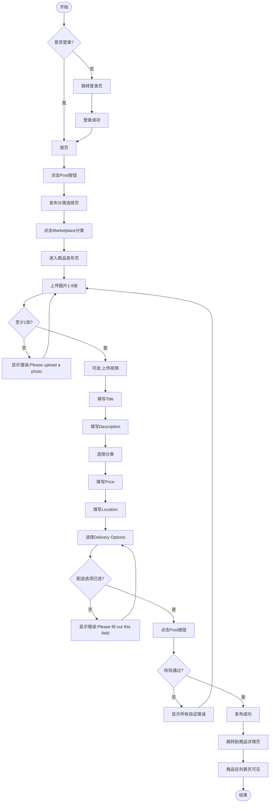

# 商品发布业务流程

> **业务目标**: 让卖家能快速发布商品信息,吸引买家

---

## 1. 完整流程图

---

## 2. 详细步骤与观测点

### 步骤1: 用户登录验证
**页面位置**: 任意页面

**操作**:
- 检查用户登录状态

**观测点**:
- ✅ 已登录用户: 可直接访问发布页
- ❌ 未登录用户: 点击Post按钮后,自动重定向到登录页
- ✅ 登录成功后: 返回发布分类页

**验证方法**:
- 清除登录态,点击Post按钮,观察是否跳转登录页
- 登录后,观察是否返回发布分类页

**关联规则**: [商品发布规则.md - 2.2 异常流程](../../../业务规则库/商品模块/商品发布规则.md#22-异常流程)

---

### 步骤2: 选择二手交易分类
**页面位置**: 发布分类页

**操作**:
1. 点击首页右上角Post按钮
2. 在发布分类页选择二手交易分类
3. 选择子分类(如Electronics → Cell Phones → Apple)

**观测点**:
- ✅ URL跳转到发布分类页
- ✅ 页面显示"Post"标题
- ✅ 显示所有发布分类: Jobs、Property、二手交易、Services、Community等
- ✅ 点击二手交易后进入子分类选择
- ✅ 选择完整分类路径后进入商品发布页

**验证方法**:
- 点击Post按钮,观察URL是否变化
- 观察页面是否显示分类列表
- 尝试选择Marketplace → Electronics → Cell Phones → Apple

**关联规则**: [商品发布规则.md - 1. 功能概述 - 入口位置](../../../业务规则库/商品模块/商品发布规则.md#1-功能概述)

---

### 步骤3: 上传图片和视频
**页面位置**: 商品发布页

**操作**:
1. 点击"Choose File"按钮或Upload区域
2. 选择1-9张图片(JPG/PNG格式,单张<5MB)
3. 可选:上传1个视频(MP4/MOV/AVI格式,<200MB)
4. 点击图片缩略图可删除图片

**观测点**:
- ✅ 图片上传成功,显示缩略图预览
- ✅ 计数器从"0/9"变为"1/9"(或"2/9"等)
- ✅ 第一张图片标记为"Main"(主图)
- ✅ 点击图片缩略图,可删除图片,计数器减1
- ✅ 上传9张图片后,上传按钮变为disabled或隐藏
- ❌ 尝试上传第10张图片,被拒绝或提示已达到最大数量限制
- ✅ 视频上传成功,显示视频缩略图或视频图标
- ✅ 提示:"Only one video can be uploaded, and it must be under 200MB."
- ❌ 上传超过200MB的视频,上传失败,显示错误提示
- ❌ 外观图片为空时提交,显示错误"Please upload a photo before submitting."

**验证方法**:
- 上传1张图片,观察计数器和主图标记
- 上传9张图片,观察上传按钮状态
- 尝试上传第10张,观察是否被拒绝
- 上传视频,观察视频缩略图
- 不上传图片直接提交,观察错误提示

**关联规则**: [商品发布规则.md - 3.1 图片/视频上传规则](../../../业务规则库/商品模块/商品发布规则.md#31-图片视频上传规则)

---

### 步骤4: 填写商品信息
**页面位置**: 商品发布页

**操作**:
1. 在Title字段输入商品标题(如"iPhone 14 Pro Max 256GB")
2. 在Description字段输入商品描述(如"Brand new iPhone 14 Pro Max with 256GB storage.")
3. 在Price字段输入价格(如"3500")
4. 在Location字段输入位置(或使用默认值)
5. 可选:选择Condition(New/Used)
6. 可选:选择Storage(64GB/128GB/256GB等)

**观测点**:
- ✅ Title输入成功,无验证错误提示
- ❌ Title为空时提交,显示错误"请填写商品标题"
- ✅ Description输入成功,字段下方显示字符计数(如"152/10000")
- ✅ Description达到10000字符时,无法继续输入
- ❌ Description为空时提交,显示错误"请填写商品描述"
- ✅ Price输入成功,无验证错误提示
- ❌ Price为0时提交,显示错误"价格必须大于0"
- ✅ 负数价格被自动拒绝
- ✅ Price超过100,000,000时,输入被自动截断
- ✅ Location输入关键词,显示位置搜索建议列表
- ✅ 点击搜索建议,位置信息填充到字段中
- ✅ 点击"Locate me"按钮,浏览器请求地理位置权限,自动填充当前位置信息

**验证方法**:
- 输入有效Title/Description/Price,观察是否接受
- 输入0、负数、超大值,观察校验行为
- 输入Description,观察字符计数
- 在Location输入关键词,观察搜索建议
- 不填写必填项直接提交,观察错误提示

**关联规则**: [商品发布规则.md - 3.4 字段输入规则](../../../业务规则库/商品模块/商品发布规则.md#34-字段输入规则)

---

### 步骤5: 选择配送选项
**页面位置**: 商品发布页

**操作**:
1. 在Delivery Options区域,选择配送方式:
   - Seller pays for postage(卖家承担邮费)
   - Buyer pays for postage(买家承担邮费)
   - Arrange pickup with the buyer(买家自提)
2. 观察该选项是否被选中(高亮或勾选标记)

**观测点**:
- ✅ 点击配送选项后,该选项被选中(高亮或勾选)
- ✅ 错误提示消失
- ✅ 每次只能选中一个选项(单选行为)
- ✅ 显示说明文案:"This category supports online transactions. Choose shipping if needed."
- ❌ 未选择配送选项时提交,显示错误"Please fill out this field."

**验证方法**:
- 选择"Seller pays for postage",观察选中态
- 切换到"Buyer pays for postage",观察前一选项自动取消选中
- 不选择配送选项直接提交,观察错误提示

**关联规则**: [商品发布规则.md - 3.2 Delivery Options配送选项规则](../../../业务规则库/商品模块/商品发布规则.md#32-delivery-options配送选项规则)

---

### 步骤6: 提交发布并验证
**页面位置**: 商品发布页 → 商品详情页

**操作**:
1. 点击Post按钮提交表单
2. 观察提交结果
3. 验证商品详情页信息完整性

**观测点**:
- ❌ 仅填写部分必填字段提交,显示所有验证错误
- ✅ 填写所有必填字段后提交,提交成功
- ✅ 页面跳转到商品详情页
- ✅ 商品详情页显示所有填写的信息: 图片/视频/Title/Description/Price/Location/配送选项
- ✅ 商品在列表页可见

**验证方法**:
- 仅填写部分必填字段提交,观察错误提示
- 填写所有必填字段提交,观察成功跳转
- 验证商品详情页所有信息是否正确显示
- 在列表页搜索该商品,验证是否可见

**关联规则**: [商品发布规则.md - 2.1 主流程](../../../业务规则库/商品模块/商品发布规则.md#21-主流程)

---

## 3. 流程完整性验证清单

- [ ] 未登录点击Post是否跳转登录页
- [ ] 登录成功后是否自动返回发布分类页
- [ ] 点击二手交易分类是否进入子分类选择
- [ ] 选择完整分类路径是否进入商品发布页
- [ ] 图片至少1张,最多9张
- [ ] 视频最多1个,大小<200MB
- [ ] Title为空时是否显示错误提示
- [ ] Description为空时是否显示错误提示
- [ ] Description字符计数是否正确显示
- [ ] Description达到10000字符时是否无法继续输入
- [ ] Price为0时是否显示错误提示
- [ ] 负数价格是否被拒绝
- [ ] Price超过100,000,000时是否自动截断
- [ ] Location搜索建议是否正常显示
- [ ] 配送选项未选择时是否显示错误提示
- [ ] 仅填写部分必填字段提交是否显示所有验证错误
- [ ] 填写所有必填字段提交是否成功
- [ ] 提交成功后是否跳转到商品详情页
- [ ] 商品详情页是否显示所有填写的信息
- [ ] 商品在列表页是否可见

---

## 4. 关联文档

- [二手交易业务全景](./二手交易业务全景.md)
- [商品发布规则.md](../../业务规则库/商品模块/商品发布规则.md)
- [Marketplace Post草稿与体验扩展规则.md](../../业务规则库/二手交易模块/Marketplace Post草稿与体验扩展规则.md)（AE PC 草稿：`OK-AE-Marketplace-Post-草稿体验优化-测试用例-PC-20260407.md`）
- [Marketplace文本用例归档索引.md](./Marketplace文本用例归档索引.md)

---

## 5. 变更历史

| 日期 | 版本 | 变更内容 | 变更人 |
|-----|------|---------|--------|
| 2026-03-24 | v1.0 | 初始版本,基于OK-Marketplace-Post测试用例(18条)生成 | AI |
| 2026-05-11 | v1.1 | 归档关联：草稿体验 PC 文本用例与草稿规则、归档索引 | knowledge-base-manager |
