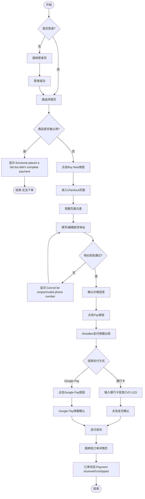

# 订单创建业务流程

> **业务目标**: 让买家能快速下单并完成支付

---

## 1. 完整流程图

---

## 2. 详细步骤与观测点

### 步骤1: 进入Checkout页面
**页面位置**: 商品详情页 → Checkout页面

**操作**:
1. 在商品详情页点击Buy Now按钮
2. 等待Checkout页面加载完成

**观测点**:
- ✅ 未登录点击Buy Now,跳转登录页
- ✅ 登录成功后,进入Checkout页面
- ✅ 商品被占用时,显示"Someone placed a bid but didn't complete payment",不允许进入Checkout页面
- ✅ 页面URL包含createOrder
- ✅ 左侧展示Order Summary区块(商品信息、价格)
- ✅ 左侧展示Shipping区块(配送地址)
- ✅ 左侧展示Payment Method区块(支付方式)
- ✅ 右侧展示Order Summary价格汇总(Subtotal / Delivery / Total)
- ✅ 右侧展示Pay按钮(黑底白字)

**验证方法**:
- 清除登录态,点击Buy Now,观察是否跳转登录页
- 登录后,观察是否进入Checkout页面
- 观察页面URL是否包含createOrder
- 验证页面各区块是否正确显示

**关联规则**: [订单创建规则.md - 3.1 Checkout页面展示规则](../../../业务规则库/交易模块/订单创建规则.md#31-checkout页面展示规则)

---

### 步骤2: 填写/编辑收货地址
**页面位置**: Checkout页面

**操作**:
1. 点击Shipping区块中的收货地址行(或编辑按钮)
2. 弹出地址编辑弹窗
3. 点击"Clean"按钮清空所有字段(可选)
4. 填写收货地址:
   - Full Name: "AutoTest Buyer"
   - Address Line 1: "123 Test Street"
   - County/City: 选择城市
   - State: 选择州/省
   - Postal Code: "12345"(可选)
   - Phone Number: "+971 0501234567"
5. 点击"Apply"按钮

**观测点**:
- ✅ 点击地址行后弹窗正常弹出
- ✅ 弹窗包含必填字段: Full Name、Address Line 1、Phone Number
- ✅ 点击Clean后所有输入框清空
- ❌ Full Name为空点击Apply → 字段内显示"Cannot be empty"错误
- ❌ Phone输入字母(如"abc") → 字母被过滤,字段为空后显示"Cannot be empty"
- ❌ Phone格式不正确(单个数字"1")点击Apply → toast提示"Invalid phone number."
- ❌ 所有必填字段均空点击Apply → 所有字段同时显示"Cannot be empty",弹窗不关闭
- ✅ Postal Code超过10字符时,UI层限制继续输入(字符计数器显示x/10)
- ✅ 填写合法地址后点击Apply,弹窗关闭
- ✅ Checkout页面Shipping区块展示更新后的地址

**验证方法**:
- 点击地址区域,观察弹窗是否打开
- 测试Clean按钮功能
- 清空必填字段点击Apply,观察错误提示
- 输入非法Phone号码,观察校验行为
- 填写合法地址点击Apply,观察地址是否更新

**关联规则**: [订单创建规则.md - 3.2 收货地址规则](../../../业务规则库/交易模块/订单创建规则.md#32-收货地址规则)

---

### 步骤3: 确认价格信息
**页面位置**: Checkout页面

**操作**:
- 观察右侧价格汇总区块的各价格字段

**观测点**:
- ✅ 货币单位显示AED
- ✅ Item Price = AED 3500(与商品详情页标价一致)
- ✅ Delivery = AED 0.00(Seller Pays Postage → 免运费)
- ✅ Total = AED 3500.00(Item Price + Delivery = 3500 + 0)
- ✅ 价格带千分位分隔符(如AED 3,500.00)
- ✅ 保留2位小数

**验证方法**:
- 观察价格汇总区块各字段
- 验证价格计算是否正确(Total = Item Price + Delivery)
- 验证价格格式是否正确(千分位分隔符、2位小数)

**关联规则**: [订单创建规则.md - 3.3 价格展示规则](../../../业务规则库/交易模块/订单创建规则.md#33-价格展示规则)

---

### 步骤4: 选择支付方式并完成支付
**页面位置**: Checkout页面 → 支付弹窗

**操作**:
1. 点击"Pay"按钮
2. 等待Airwallex支付弹窗(iframe)出现
3. 选择支付方式:
   - **银行卡支付**: 在iframe中输入测试银行卡信息(CVC=123),点击支付确认按钮
   - **Google Pay**: 在iframe中点击Google Pay按钮,在弹出的Google Pay确认弹窗中点击确认

**观测点**:
- ✅ 点击Pay后弹出支付弹窗(Airwallex iframe)
- ✅ 弹窗顶部显示支付方式(如Airwallex支付)
- ✅ 弹窗底部有Pay / Close按钮
- ✅ **银行卡支付**: 支付弹窗正常显示,可输入银行卡信息
- ✅ **银行卡支付**: 支付完成后自动跳转至订单详情页
- ✅ **银行卡支付**: 订单状态显示"Payment received"或"Paid"或"Unshipped"
- ✅ **Google Pay**: 支付弹窗正常显示,可见Google Pay按钮
- ✅ **Google Pay**: 点击Google Pay后支付流程完成(含弹窗确认或直接模拟支付)
- ✅ **Google Pay**: 支付完成后自动跳转至订单详情页
- ✅ **Google Pay**: 订单状态显示"Payment received"或"Paid"或"Unshipped"
- ⚠️ **Google Pay**: 若测试环境Airwallex iframe中未渲染Google Pay按钮,用例会失败并提示"请确认测试环境已启用Google Pay"
- ⚠️ **Google Pay**: 若支付弹窗显示"Something went wrong, please try again later.",自动关闭弹窗并切换商品重试(最多3次)

**验证方法**:
- 点击Pay按钮,观察支付弹窗是否出现
- 测试银行卡支付流程
- 测试Google Pay支付流程
- 验证支付成功后是否跳转到订单详情页
- 验证订单状态是否正确

**关联规则**: [订单创建规则.md - 3.4 支付方式规则](../../../业务规则库/交易模块/订单创建规则.md#34-支付方式规则)

---

## 3. 流程完整性验证清单

- [ ] 未登录点击Buy Now是否跳转登录页
- [ ] 登录成功后是否进入Checkout页面
- [ ] 商品被占用时是否显示错误提示
- [ ] Checkout页面URL是否包含createOrder
- [ ] Order Summary区块是否正确显示
- [ ] Shipping区块是否正确显示
- [ ] Payment Method区块是否正确显示
- [ ] 价格汇总区块是否正确显示
- [ ] Pay按钮是否可见
- [ ] 收货地址弹窗是否正常打开
- [ ] 收货地址必填项校验是否生效
- [ ] 收货地址填写后是否正确更新
- [ ] 价格计算是否正确(Total = Item Price + Delivery)
- [ ] 点击Pay按钮是否弹出支付弹窗
- [ ] 银行卡支付是否成功
- [ ] Google Pay支付是否成功
- [ ] 支付成功后是否跳转到订单详情页
- [ ] 订单状态是否显示为Unshipped

---

## 4. 关联文档

- [二手交易业务全景](./二手交易业务全景.md)
- [订单创建规则.md](../../../业务规则库/交易模块/订单创建规则.md)

---

## 5. 变更历史

| 日期 | 版本 | 变更内容 | 变更人 |
|-----|------|---------|--------|
| 2026-03-24 | v1.0 | 初始版本,基于AE二手交易订单流转测试用例(TC001-TC008)生成 | AI |
