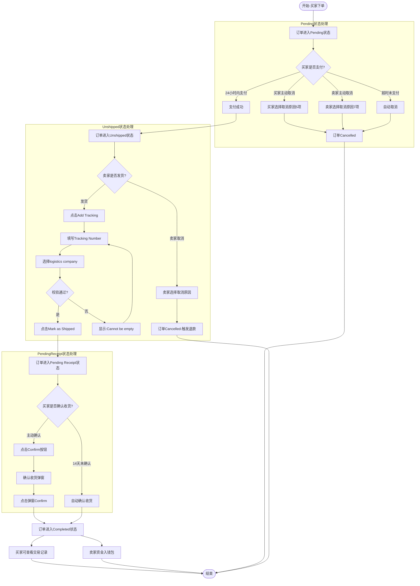

# 订单流转业务流程

> **业务目标**: 完成从下单到交易完成的全流程

---

## 1. 完整流程图

---

## 2. 详细步骤与观测点

### 步骤1: Pending状态(买家视角)
**页面位置**: Purchase Orders → Pending Tab → 订单详情页

**操作**:
1. 买家下单后,导航至Purchase Orders → Pending Tab
2. 点击Pending订单进入详情页
3. 观察页面各区块内容

**观测点**:
- ✅ 状态区域显示"Processing payment" + Refresh刷新按钮
- ✅ 倒计时显示"Pay within XX:XX:XX or auto-cancel"(蓝色)
- ✅ 进度条节点: Placed(已完成) → Paid → Shipped → Completed
- ✅ Shipping区块展示买家收货地址(Full Name、Address、City、Country、Phone)
- ✅ Order Info区块显示: Order Number、Transaction snapshot、Seller nickname、Order time
- ✅ 商品区块显示: 缩略图 + 名称 + 价格
- ✅ 价格明细: Total / Item Price / Delivery / Buyer Protection Fee
- ✅ 操作按钮: Pay(主操作,黑底白字)、Cancel(次操作)
- ✅ 右上角显示Message Seller按钮

**可执行操作**:
- **Pay**: 点击唤起支付弹窗,完成支付后订单状态变为Unshipped
- **Cancel**: 点击弹出取消弹窗,选择取消原因(5项)后订单状态变为Cancelled
- **Message Seller**: 点击跳转到与卖家的微聊聊天页面
- **Transaction snapshot**: 点击"click to view"跳转到交易快照页面
- **修改收货地址**: 点击Shipping区块中的收货地址,弹出地址编辑弹窗

**验证方法**:
- 进入Pending订单详情页,验证所有区块是否正确显示
- 测试Pay按钮功能
- 测试Cancel按钮功能
- 测试Message Seller按钮功能
- 测试修改收货地址功能

**关联规则**: [订单状态流转.md - 3.2.2 Pending状态(买家视角)](../../../业务规则库/交易模块/订单状态流转.md#322-pending状态买家视角)

---

### 步骤2: Pending状态(卖家视角)
**页面位置**: Sales Orders → Pending Tab → 订单详情页

**操作**:
1. 卖家登录后,导航至Sales Orders → Pending Tab
2. 点击Pending订单进入详情页
3. 观察页面各区块内容

**观测点**:
- ✅ 状态标题显示"Buyer paying"
- ✅ 倒计时显示"Pay within 23:XX:XX or auto-cancel"(蓝色)
- ✅ 进度条: Placed(✓) → Paid → Shipped → Completed
- ✅ Order Info区块显示: Order Number、Transaction snapshot、Buyer nickname、Order time
- ✅ **无Shipping区块**(买家尚未支付,地址未传给卖家)
- ✅ 操作按钮仅有Cancel(单一按钮)
- ✅ 右上角显示Message Buyer按钮

**可执行操作**:
- **Cancel**: 点击弹出取消弹窗,选择取消原因(7项,与买家选项不同)后订单状态变为Cancelled
- **Message Buyer**: 点击跳转到与买家的微聊聊天页面

**卖家取消原因选项**(7项,单选):
- Buyer requested cancellation
- Incorrect product information or price
- Product out of stock or sold out
- Agreed local meetup transaction
- Buyer information is abnormal
- Product damaged or lost before shipment
- Other reasons

**验证方法**:
- 进入卖家Pending订单详情页,验证所有区块是否正确显示
- 验证无Shipping区块
- 测试Cancel按钮功能
- 测试Message Buyer按钮功能

**关联规则**: [订单状态流转.md - 3.3.2 Pending状态(卖家视角)](../../../业务规则库/交易模块/订单状态流转.md#332-pending状态卖家视角)

---

### 步骤3: Unshipped状态(买家视角)
**页面位置**: Purchase Orders → Unshipped Tab → 订单详情页

**操作**:
1. 买家支付成功后,导航至Purchase Orders → Unshipped Tab
2. 点击Unshipped订单进入详情页
3. 观察页面各区块内容

**观测点**:
- ✅ 状态区域显示"Payment Success"或"Paid"
- ✅ 进度条: Placed(✓) → Paid(✓) → Shipped → Completed
- ✅ Shipping区块展示买家收货地址
- ✅ Order Info区块显示: Order Number、Transaction snapshot、Seller nickname、Order time、Payment Time
- ✅ 商品区块展示缩略图 + 名称 + 价格
- ✅ **无Cancel按钮**(订单已支付,买家不可主动取消)
- ✅ 右上角显示Message Seller按钮

**可执行操作**:
- **Message Seller**: 点击跳转到与卖家的微聊聊天页面
- **Transaction Snapshot**: 点击"click to view"跳转到交易快照页面

**验证方法**:
- 进入买家Unshipped订单详情页,验证所有区块是否正确显示
- 验证无Cancel按钮
- 测试Message Seller按钮功能

**关联规则**: [订单状态流转.md - 3.2.3 Unshipped状态(买家视角)](../../../业务规则库/交易模块/订单状态流转.md#323-unshipped状态买家视角)

---

### 步骤4: Unshipped状态(卖家视角)-卖家发货
**页面位置**: Sales Orders → Unshipped Tab → 订单详情页

**操作**:
1. 卖家导航至Sales Orders → Unshipped Tab
2. 点击Unshipped订单进入详情页
3. 点击"Add Tracking"按钮
4. 在发货弹窗中填写:
   - Tracking Number: "TEST1234567890"
   - logistics company: 选择"DHL"(13个选项之一)
   - 可选: 点击Seller Address右侧箭头编辑发货地址
5. 点击"Mark as Shipped"提交发货

**观测点**:
- ✅ 状态标题显示"Ready to ship"
- ✅ 倒计时显示"Ship in Xd XX:XX:XX or auto-cancel"(蓝色)
- ✅ 进度条: Placed(✓) → Paid(✓) → Shipped → Completed
- ✅ Shipping区块展示买家收货地址(Full Name、Address、City、Country、Phone)及copy按钮
- ✅ Order Info区块显示: Order Number、Transaction snapshot、Buyer nickname、Order time、Payment Time
- ✅ 操作按钮: Cancel + Add Tracking(主操作,黑底白字)
- ✅ 右上角显示Message Buyer按钮
- ✅ 点击Add Tracking,弹窗正常弹出,标题为"Add Shipping Tracking"
- ✅ 弹窗包含: Seller Address(可点击编辑)、Tracking Number输入框(必填)、logistics company下拉(必填)
- ✅ logistics company下拉共13个选项: Aramex / Australia Post / DHL / Expeditors / FedEx / J.B. Hunt / TNT / Toll Group / UPS / USPS / XPO Logistics / iMile / Other Couriers
- ✅ 警示文字: "After submitting the shipment, it cannot be changed. Please carefully check the information"
- ✅ 底部显示"Mark as Shipped"按钮
- ❌ Tracking Number为空点击Mark as Shipped → 字段下方显示"Cannot be empty"错误提示
- ❌ logistics company未选择点击Mark as Shipped → 字段下方显示"Cannot be empty"错误提示
- ✅ 填写完整信息后点击Mark as Shipped,弹窗关闭,订单状态切换为"Shipped"(即Pending Receipt状态)
- ✅ 页面新增Package Tracking区块: Tracking Number: TEST1234567890 / logistics company: DHL / "View logistics trajectory"链接
- ✅ Order Info新增Delivery time字段,记录发货时间
- ✅ 原"Add Tracking"按钮消失(被Package Tracking区块替代)
- ✅ 倒计时从"Ship in Xd"切换为"Auto-complete in 14d 23:59:58"

**Seller Address编辑流程**:
- 点击Seller Address右侧箭头图标,打开发货地址编辑弹窗
- 弹窗包含必填字段: Full Name、Address Line 1、Phone Number
- 点击Clean按钮清空所有字段
- 填写合法发货地址后点击Apply,弹窗关闭
- Add Tracking弹窗中Seller Address展示更新后的地址

**验证方法**:
- 进入卖家Unshipped订单详情页,验证所有区块是否正确显示
- 点击Add Tracking按钮,观察发货弹窗是否打开
- 测试Tracking Number和logistics company必填校验
- 测试Seller Address编辑功能
- 填写完整信息提交,验证订单状态是否变为Pending Receipt
- 验证Package Tracking区块是否正确显示

**关联规则**: 
- [订单状态流转.md - 3.3.3 Unshipped状态(卖家视角)](../../../业务规则库/交易模块/订单状态流转.md#333-unshipped状态卖家视角)
- [订单状态流转.md - 3.5 发货规则](../../../业务规则库/交易模块/订单状态流转.md#35-发货规则)

---

### 步骤5: 卖家取消Unshipped订单(退款流程)
**页面位置**: Sales Orders → Unshipped Tab → 订单详情页

**操作**:
1. 卖家在Unshipped订单详情页点击"Cancel"按钮
2. 在弹窗中选择取消原因(如"Incorrect product information or price")
3. 点击"Confirm"
4. 观察订单状态及退款说明

**观测点**:
- ✅ 弹窗标题显示"Reason for cancellation"
- ✅ 原因选项共7项(单选,与买家选项不同)
- ✅ 底部按钮: Back(次操作) / Confirm(主操作,未选原因时禁用)
- ✅ 选择原因后Confirm变为可用
- ✅ 点击Confirm → 订单页面状态显示"Order Cancelled"
- ✅ 显示取消原因: "Reason for order cancellation: Incorrect product information or price"
- ✅ 显示退款说明: "The funds will be refunded to the buyer from the platform's escrow account."
- ✅ Order Info新增Transaction closure time字段
- ⚠️ 取消后状态直接显示"Order Cancelled",不显示"Cancelled (refunding)"中间状态(Web端刷新后跳过中间态)

**验证方法**:
- 进入卖家Unshipped订单详情页,点击Cancel按钮
- 观察取消弹窗内容
- 选择取消原因,点击Confirm
- 验证订单状态是否变为Cancelled
- 验证是否显示退款说明

**关联规则**: [订单状态流转.md - 3.7 退款规则](../../../业务规则库/交易模块/订单状态流转.md#37-退款规则)

---

### 步骤6: Pending Receipt状态(买家视角)
**页面位置**: Purchase Orders → Pending Receipt Tab → 订单详情页

**操作**:
1. 卖家发货后,买家导航至Purchase Orders → Pending Receipt Tab
2. 点击Pending Receipt订单进入详情页
3. 观察页面各区块内容

**观测点**:
- ✅ 状态区域显示"Shipped"
- ✅ 自动完成倒计时显示"Auto-complete in Xd XX:XX:XX"(蓝色)
- ✅ 进度条: Placed(✓) → Paid(✓) → Shipped(✓) → Completed
- ✅ Package Tracking区块展示: Tracking Number、logistics company、"View logistics trajectory"链接
- ✅ Order Info区块显示: Order Number、Transaction snapshot、Seller nickname、Receiving address、Order time、Payment Time、Delivery time
- ✅ 操作按钮仅有Confirm(黑底白字),**无Cancel按钮**
- ✅ 右上角显示Message Seller按钮

**可执行操作**:
- **Confirm**: 点击弹出确认收货弹窗,点击弹窗Confirm后订单状态变为Completed
- **Message Seller**: 点击跳转到与卖家的微聊聊天页面
- **View logistics trajectory**: 点击跳转到物流追踪页面

**验证方法**:
- 进入买家Pending Receipt订单详情页,验证所有区块是否正确显示
- 验证无Cancel按钮
- 测试Confirm按钮功能
- 测试View logistics trajectory功能

**关联规则**: [订单状态流转.md - 3.2.4 Pending Receipt状态(买家视角)](../../../业务规则库/交易模块/订单状态流转.md#324-pending-receipt状态买家视角)

---

### 步骤7: Pending Receipt状态(卖家视角)
**页面位置**: Sales Orders → Pending Receipt Tab → 订单详情页

**操作**:
1. 卖家发货后,导航至Sales Orders → Pending Receipt Tab
2. 点击Pending Receipt订单进入详情页
3. 观察页面各区块内容

**观测点**:
- ✅ 状态标题显示"Shipped"
- ✅ 倒计时显示"Auto-complete in 13d XX:XX:XX"(蓝色)
- ✅ 进度条: Placed(✓) → Paid(✓) → Shipped(✓) → Completed
- ✅ Package Tracking区块展示: Tracking Number、logistics company、"View logistics trajectory"链接
- ✅ Order Info区块显示: Order Number、Transaction snapshot、Buyer nickname、Receiving address、Order time、Payment Time、Delivery time
- ✅ **无操作按钮**(已发货后买卖家均不可取消)
- ✅ 右上角显示Message Buyer按钮

**可执行操作**:
- **View logistics trajectory**: 点击跳转到物流追踪页面
- **Message Buyer**: 点击跳转到与买家的微聊聊天页面

**验证方法**:
- 进入卖家Pending Receipt订单详情页,验证所有区块是否正确显示
- 验证无操作按钮
- 测试View logistics trajectory功能

**关联规则**: [订单状态流转.md - 3.3.4 Pending Receipt状态(卖家视角)](../../../业务规则库/交易模块/订单状态流转.md#334-pending-receipt状态卖家视角)

---

### 步骤8: 买家确认收货
**页面位置**: Purchase Orders → Pending Receipt Tab → 订单详情页

**操作**:
1. 买家在Pending Receipt订单详情页点击"Confirm"按钮
2. 弹出确认收货弹窗
3. 点击弹窗中的"Confirm"按钮确认收货

**观测点**:
- ✅ 点击Confirm弹出确认收货弹窗
- ✅ 弹窗显示确认提示文字
- ✅ 弹窗操作按钮: Confirm(确认收货)、Back(返回)
- ✅ 点击弹窗Back → 弹窗关闭,订单保持Shipped状态
- ✅ 点击弹窗Confirm → 订单状态变为Completed

**验证方法**:
- 点击Confirm按钮,观察确认收货弹窗是否弹出
- 测试Back按钮功能
- 测试Confirm按钮功能
- 验证订单状态是否变为Completed

**关联规则**: [订单状态流转.md - 3.6 确认收货规则](../../../业务规则库/交易模块/订单状态流转.md#36-确认收货规则)

---

### 步骤9: Completed状态(买家视角)
**页面位置**: Purchase Orders → Completed Tab → 订单详情页

**操作**:
1. 买家确认收货后,导航至Purchase Orders → Completed Tab
2. 点击Completed订单进入详情页
3. 观察页面各区块内容

**观测点**:
- ✅ 状态区域显示"Order Completed"
- ✅ 进度条全部完成: Placed(✓) → Paid(✓) → Shipped(✓) → Completed(✓)
- ✅ Order Info区块含新增字段Transaction Time
- ✅ 操作按钮仅有"View Transaction"(单一按钮)
- ✅ 右上角显示Message Seller按钮

**可执行操作**:
- **View Transaction**: 点击弹出交易记录弹窗,显示-AED 3500(红色/负数,代表支出)
- **Message Seller**: 点击跳转到与卖家的微聊聊天页面
- **Upload Buyer Photos**: 上传买家秀图片

**View Transaction弹窗内容**:
- 显示**-AED 3500**(红色/负数,代表支出)
- 显示"Transaction Successful"
- 显示Payment Time、Product Name、Order ID、Reference ID
- 显示汇率说明文字及Help链接

**验证方法**:
- 进入买家Completed订单详情页,验证所有区块是否正确显示
- 测试View Transaction按钮功能
- 测试Upload Buyer Photos功能

**关联规则**: [订单状态流转.md - 3.2.5 Completed状态(买家视角)](../../../业务规则库/交易模块/订单状态流转.md#325-completed状态买家视角)

---

### 步骤10: Completed状态(卖家视角)
**页面位置**: Sales Orders → Completed Tab → 订单详情页

**操作**:
1. 买家确认收货后,卖家导航至Sales Orders → Completed Tab
2. 点击Completed订单进入详情页
3. 观察页面各区块内容

**观测点**:
- ✅ 状态标题显示"Order Completed"
- ✅ 显示提示文字: "The funds have been deposited into the wallet, you can go to the wallet to withdraw them."
- ✅ 进度条全部完成: Placed(✓) → Paid(✓) → Shipped(✓) → Completed(✓)
- ✅ Order Info区块含新增字段Transaction Time
- ❌ **卖家Completed订单详情页不显示View Transaction按钮**(该按钮仅在买家侧展示)
- ✅ 右上角显示Message Buyer按钮

**可执行操作**:
- **Message Buyer**: 点击跳转到与买家的微聊聊天页面

**验证方法**:
- 进入卖家Completed订单详情页,验证所有区块是否正确显示
- 验证不显示View Transaction按钮
- 验证显示资金入钱包提示文字

**关联规则**: [订单状态流转.md - 3.3.5 Completed状态(卖家视角)](../../../业务规则库/交易模块/订单状态流转.md#335-completed状态卖家视角)

---

## 3. 流程完整性验证清单

### Pending状态验证
- [ ] 买家Pending订单详情页是否显示"Processing payment"
- [ ] 买家Pending订单是否显示Pay和Cancel按钮
- [ ] 买家Pending订单是否可修改收货地址
- [ ] 买家Pending订单取消原因是否为5项
- [ ] 卖家Pending订单详情页是否显示"Buyer paying"
- [ ] 卖家Pending订单是否无Shipping区块
- [ ] 卖家Pending订单是否仅有Cancel按钮
- [ ] 卖家Pending订单取消原因是否为7项

### Unshipped状态验证
- [ ] 买家Unshipped订单详情页是否显示"Payment Success"
- [ ] 买家Unshipped订单是否无Cancel按钮
- [ ] 卖家Unshipped订单详情页是否显示"Ready to ship"
- [ ] 卖家Unshipped订单是否显示Add Tracking按钮
- [ ] 卖家Unshipped订单是否显示Cancel按钮
- [ ] Add Tracking弹窗是否正常打开
- [ ] Tracking Number必填校验是否生效
- [ ] logistics company必填校验是否生效
- [ ] Seller Address是否可编辑
- [ ] 提交发货后订单状态是否变为Pending Receipt
- [ ] Package Tracking区块是否正确显示

### Pending Receipt状态验证
- [ ] 买家Pending Receipt订单详情页是否显示"Shipped"
- [ ] 买家Pending Receipt订单是否显示Confirm按钮
- [ ] 买家Pending Receipt订单是否无Cancel按钮
- [ ] 买家Pending Receipt订单是否显示Package Tracking区块
- [ ] 卖家Pending Receipt订单详情页是否显示"Shipped"
- [ ] 卖家Pending Receipt订单是否无操作按钮
- [ ] 卖家Pending Receipt订单是否显示Package Tracking区块
- [ ] View logistics trajectory是否正常跳转
- [ ] 确认收货弹窗是否正常弹出
- [ ] 点击弹窗Back是否关闭弹窗且订单保持Shipped状态
- [ ] 点击弹窗Confirm是否确认收货且订单状态变为Completed

### Completed状态验证
- [ ] 买家Completed订单详情页是否显示"Order Completed"
- [ ] 买家Completed订单是否显示View Transaction按钮
- [ ] 买家Completed订单View Transaction是否显示-AED金额(负数)
- [ ] 买家Completed订单是否可Upload Buyer Photos
- [ ] 卖家Completed订单详情页是否显示"Order Completed"
- [ ] 卖家Completed订单是否不显示View Transaction按钮
- [ ] 卖家Completed订单是否显示资金入钱包提示文字

### 取消流程验证
- [ ] Pending状态买家是否可取消
- [ ] Pending状态卖家是否可取消
- [ ] Unshipped状态买家是否不可取消
- [ ] Unshipped状态卖家是否可取消
- [ ] 卖家取消Unshipped订单是否触发退款
- [ ] Pending Receipt状态买家是否不可取消
- [ ] Pending Receipt状态卖家是否不可取消

### Message功能验证
- [ ] 买家各状态订单是否可Message Seller
- [ ] 卖家各状态订单是否可Message Buyer
- [ ] Message跳转是否正确到达微聊页面
- [ ] 聊天对象是否为当前订单对应的买家/卖家

---

## 4. 关联文档

- [二手交易业务全景](./二手交易业务全景.md)
- [订单状态流转.md](../../../业务规则库/交易模块/订单状态流转.md)

---

## 5. 变更历史

| 日期 | 版本 | 变更内容 | 变更人 |
|-----|------|---------|--------|
| 2026-03-24 | v1.0 | 初始版本,基于AE二手交易订单流转测试用例(TC009-TC051)生成 | AI |
