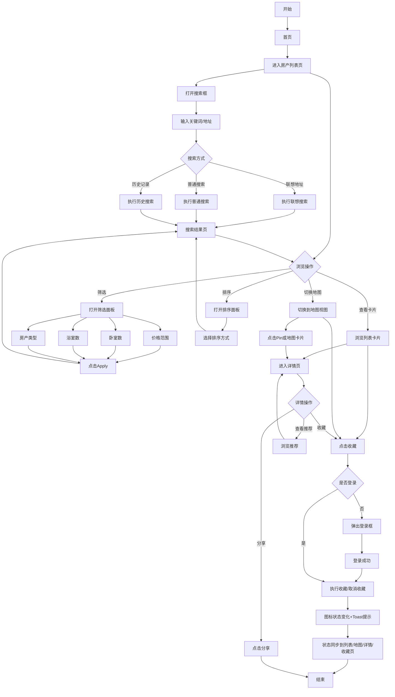

# 房产C端行为流程（浏览/搜索/收藏）

> **业务目标**：统一描述 C 端用户在房产模块的浏览、搜索、收藏完整行为链路，减少重复文档维护成本。

---

## 1. 合并后流程图

---

## 2. C端行为域说明

### 2.1 浏览行为（Browse）
- 列表页存在两种展示模式：列表模式（List）和地图模式（Map）。
- 两种模式支持双向切换，并共享筛选、排序、搜索状态。
- 列表页支持筛选、排序、分页、列表/地图切换。
- 详情页支持图片轮播、地图弹窗、推荐卡片和分享。
- 浏览链路核心是「列表/地图/详情」三页联动。

### 2.2 搜索行为（Search）
- 支持联想地址搜索、普通关键词搜索、历史记录搜索。
- 搜索结果可继续进行筛选、排序、分类切换。
- 地址联想在地图视图下需要自动定位。

### 2.3 收藏行为（Favourite）
- 收藏入口覆盖列表页、地图页、详情页。
- 列表页支持直接点击卡片收藏图标进行收藏/取消收藏。
- 未登录收藏需先唤起登录流程，登录后继续执行收藏。
- 收藏/取消收藏需要在多页面实时同步，并在收藏页反映最终状态。

---

## 3. 核心校验清单（合并版）

- [ ] 列表页、地图页、详情页入口可达且状态一致  
- [ ] 搜索联想/普通搜索/历史搜索均可返回有效结果  
- [ ] 筛选与排序参数在翻页、视图切换、搜索后继续生效  
- [ ] 地图 Pin 与卡片联动、地图控件行为正常  
- [ ] 列表页可直接收藏/取消收藏且提示正确  
- [ ] 收藏在未登录与已登录场景下行为正确  
- [ ] 收藏状态在列表页/地图页/详情页/收藏页保持同步  
- [ ] 空结果、异常输入、网络波动场景有可见兜底提示  

---

## 4. 原文档映射关系

- 浏览流程原文档：`房产浏览业务流程.md`
- 搜索流程原文档：`房产搜索业务流程.md`
- 收藏流程原文档：`房产收藏业务流程.md`

---

## 5. 变更历史

| 日期 | 版本 | 变更内容 | 变更人 |
|-----|------|---------|--------|
| 2026-04-22 | v1.0 | 合并浏览/搜索/收藏三份 C 端流程文档，形成统一维护入口 | AI |
| 2026-04-22 | v1.1 | 明确列表页与地图页可直接收藏，补充收藏入口与校验项 | AI |
