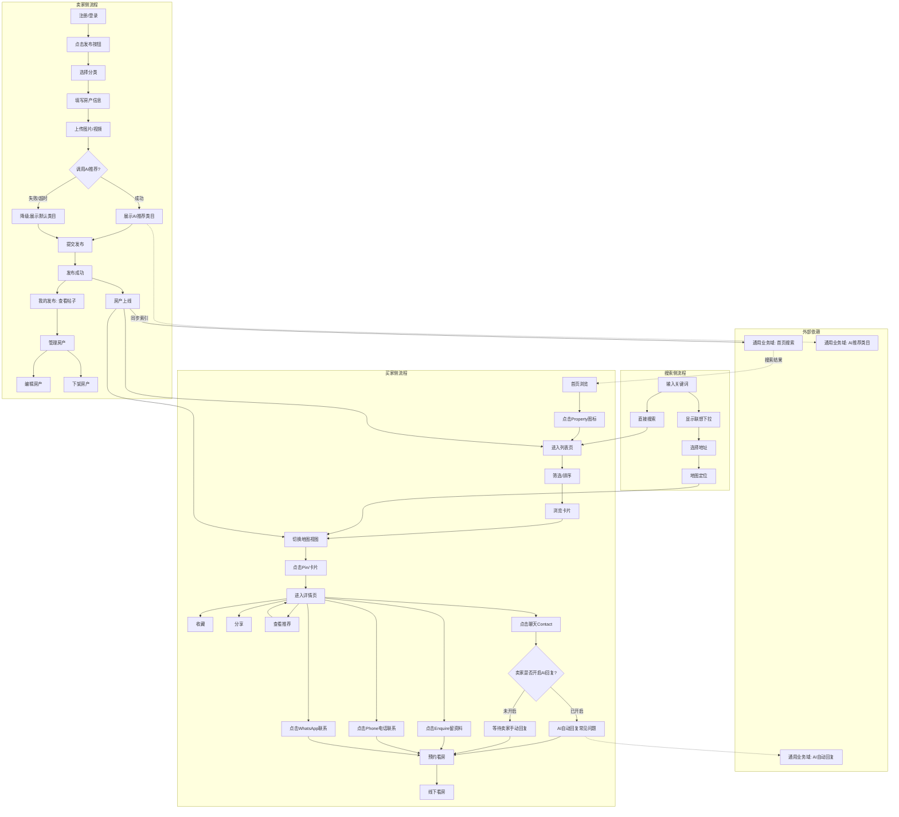
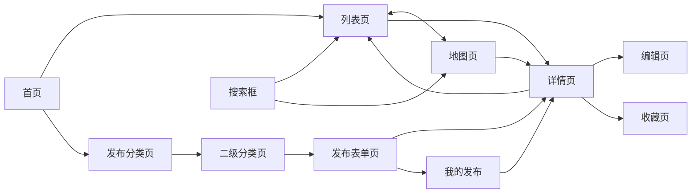
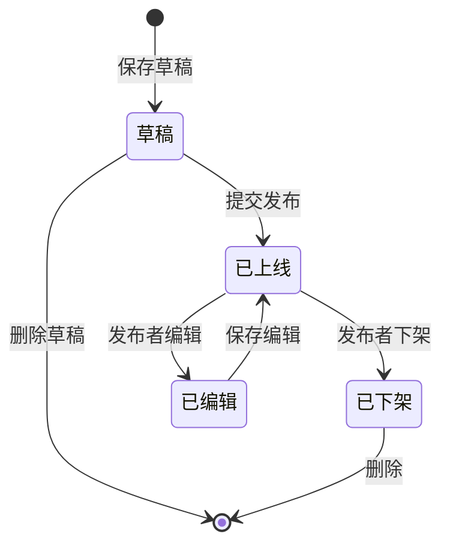

# 房产业务域 - 业务全景

## 1. 业务定位
房产业务域是 OK.com 的核心业务之一，为买家和卖家提供房产信息发布、浏览、搜索、收藏服务，覆盖租房、买房、学生公寓、商业地产等多种房产类型。

**业务价值**：
- 为卖家提供房产信息发布和管理平台
- 为买家提供房产信息浏览、搜索、筛选、收藏服务
- 通过地图视图提供直观的地理位置展示

**目标用户**：
- **卖家/发布者**：需要发布房产信息的个人或机构
- **买家/租客**：寻找房产的用户
- **游客**：未登录的访客，可浏览但功能受限

## 2. 业务范围

### 2.1 分类覆盖
| 分类 | 说明 | 三级分类 |
|-----|------|---------|
| For Rent（租房） | 出租房产 | House / Apartment / Townhouse / Studio / Other |
| For Sale（买房） | 出售房产 | House / Apartment / Townhouse / Studio / Other |
| Student（学生公寓） | 学生住宿 | Student accommodation 特定类型 |
| Commercial（商业地产） | 商业物业 | Commercial 特定类型 |

### 2.2 地域覆盖
- **AU站**（澳大利亚）：Sydney, Melbourne, Canberra, Brisbane
- **US站**（美国）
- **AE站**（阿联酋）
- 其他国际站点

### 2.3 用户角色
| 角色 | 权限 | 说明 |
|-----|------|------|
| 游客 | 浏览、搜索 | 收藏需登录 |
| 买家 | 浏览、搜索、收藏、分享 | 已登录用户 |
| 卖家 | 发布、浏览、搜索、收藏、分享；「我的发布」中查看与管理自有帖子 | 已登录且发布过房产 |
| 发布者 | 卖家权限 + 编辑/下架自己的房产（详情页与「我的发布」等入口） | 房产所有者 |

## 3. 业务流程全景图

## 4. 核心业务流程概览

### 4.1 房产发布流程
**业务目标**：让卖家能快速发布房产信息，吸引买家

**核心步骤**：
1. 用户登录验证
2. 进入发布分类页
3. 选择房产分类（For Rent / For Sale / Student / Commercial）
4. 上传图片/视频（必填，至少1个）
5. 上传户型图（可选，最多10张）
6. 填写房产详情字段（标题、价格、卧室、浴室、联系方式、位置等）
7. 提交发布
8. 进入「我的发布」查看刚发布的帖子（可选路径，与成功提示/跳转一致）
9. 在「我的发布」中管理房产（如编辑、下架等，与详情页管理能力一致或互补）
10. 验证详情页展示
11. 验证列表页展示
12. 验证地图页展示

**关键观测点**：
- ✅ 未登录用户无法访问发布页
- ✅ 图片/视频至少1个，最多20个
- ✅ 主图逻辑：第一张图片自动成为主图
- ✅ 所有必填字段校验生效
- ✅ 发布成功后立即在详情页、列表页、地图页展示
- ✅ 发布者可在「我的发布」中查看该帖子，并在同入口进行房产管理（与详情页 Edit/Withdraw 等能力配合）
- ✅ 发布者可见 Edit/Withdraw 按钮（详情页等场景）

**详细流程文档**：[房产发布业务流程.md](./房产发布业务流程.md)

---

### 4.2 房产浏览流程
**业务目标**：让买家能快速找到符合需求的房产

**核心步骤**：
1. 进入列表页（默认 For Sale）
2. 筛选房产（价格、卧室、浴室、房产类型）
3. 排序房产（Best Match / Newest First / Lowest Price / Highest Price）
4. 浏览卡片列表
5. 切换到地图视图
6. 地图交互（点击 Pin、放大/缩小、拖动、定位、全屏）
7. 进入详情页
8. 查看详情页信息（图片轮播、Show map、推荐房产）
9. 收藏房产
10. 联系卖家（Contact聊天 / Enquire / Phone / WhatsApp）

**关键观测点**：
- ✅ 筛选和排序参数在翻页、切换视图时保持
- ✅ 列表页和地图页可自由切换
- ✅ 地图 Pin 与卡片列表联动正常
- ✅ 收藏功能正常，状态同步
- ✅ 联系路径可达（Contact聊天 / Enquire / Phone / WhatsApp）
- ✅ 推荐轮播正常
- ✅ 面包屑导航正常

**详细流程文档**：[房产浏览业务流程.md](./房产浏览业务流程.md)

---

### 4.3 房产搜索流程
**业务目标**：让买家通过关键词或地址快速定位房产

**核心步骤**：
1. 打开搜索框（显示历史记录）
2. 输入关键词（显示联想下拉）
3. 选择搜索方式（联想地址 / 直接搜索 / 历史记录）
4. 查看搜索结果（列表页 / 地图页）
5. 搜索分类切换（For Rent / For Sale / Student / Commercial）

**关键观测点**：
- ✅ 联想地址搜索正常，地图自动定位
- ✅ 普通关键词搜索正常，URL 参数正确
- ✅ 搜索结果可筛选和排序
- ✅ 搜索分类切换正常
- ✅ 搜索结果为空时显示空态

**详细流程文档**：[房产搜索业务流程.md](./房产搜索业务流程.md)

---

### 4.4 房产收藏流程
**业务目标**：让买家能保存感兴趣的房产，方便后续查看

**核心步骤**：
1. 识别收藏入口（列表页/地图页/详情页）
2. 未登录点击收藏（弹出登录框）
3. 登录后收藏（图标变实心，显示提示）
4. 取消收藏（图标变空心，显示提示）
5. 防重复提交（快速连续点击）
6. 查看收藏页（显示所有收藏）

**关键观测点**：
- ✅ 未登录点击收藏弹出登录框
- ✅ 登录后收藏成功，图标变实心
- ✅ 收藏状态在列表页、地图页、详情页同步
- ✅ 刷新页面收藏状态保持
- ✅ 快速连续点击防重复提交
- ✅ 收藏页正常显示所有收藏

**详细流程文档**：[房产收藏业务流程.md](./房产收藏业务流程.md)

---

### 4.5 房产管理流程
**业务目标**：让发布者能管理自己发布的房产

**核心步骤**：
1. 识别管理入口：**「我的发布」**（发布后查看帖子、集中管理）与详情页 **Edit/Withdraw** 等入口
2. 在「我的发布」中查看帖子列表，进入单帖进行查看或管理操作
3. 编辑房产（修改信息后提交）
4. 下架房产（确认下架）

**关键观测点**：
- ✅ 发布成功后，发布者可在「我的发布」中找到对应帖子并管理房产
- ✅ 仅发布者可见管理类操作（含「我的发布」内管理与详情页 Edit/Withdraw 等）
- ✅ 编辑后详情页信息更新
- ✅ 下架后列表页/地图页移除，详情页显示"已下架"

---

## 5. 页面拓扑关系

### 5.1 页面入口矩阵
| 页面 | 入口1 | 入口2 | 入口3 | 入口4 | 入口5 |
|-----|------|------|------|------|------|
| 列表页 | 首页 Property 图标 | Browse 菜单 | All 分类 | 搜索结果 | 详情页面包屑 |
| 地图页 | 列表页 Map 按钮 | 搜索结果（地址联想） | URL 直接访问（view=map） | - | - |
| 详情页 | 列表页卡片点击 | 地图页 Pin 点击 | 推荐卡片点击 | 搜索结果 | 直接 URL |
| 发布页 | 首页发布按钮 | - | - | - | - |
| 编辑页 | 详情页 Edit 按钮 | 我的发布进入帖子后再编辑（若产品提供） | - | - | - |
| 我的发布 | 用户中心/发帖菜单「我的发布」或 Post 相关入口 | 发布成功后的提示跳转（若产品提供） | - | - | - |
| 收藏页 | 顶部用户菜单 | - | - | - | - |

### 5.2 页面跳转流程图

### 5.3 页面关系详解

#### 首页 → 列表页
- **入口**：点击 Property 图标 / Browse 菜单 / All 分类
- **目标**：For Sale 列表页（默认）/ For Rent 列表页 / Student 列表页 / Commercial 列表页
- **参数**：无（首次进入）

#### 列表页 ↔ 地图页
- **入口**：点击 Map 按钮（列表页 → 地图页）/ 点击 List 按钮（地图页 → 列表页）
- **参数保留**：所有搜索、筛选、排序参数保持
- **URL 变化**：view=map（地图页）/ 无 view 参数（列表页）

#### 列表页/地图页 → 详情页
- **入口**：点击卡片（列表页）/ 点击 Pin（地图页）
- **打开方式**：新标签页（PC）/ 当前页跳转（M端）
- **参数**：房产 ID

#### 首页 → 发布页
- **入口**：点击发布按钮
- **流程**：首页 → 发布分类页 → 二级分类页 → 发布表单页
- **权限**：未登录则先跳转登录页

#### 详情页 → 编辑页
- **入口**：点击 Edit 按钮；或从「我的发布」进入对应帖子后再进入编辑（以线上入口为准）
- **权限**：仅发布者可见
- **流程**：详情页 → 编辑页 → 提交 → 详情页

#### 发布成功 / 日常 → 我的发布
- **入口**：用户菜单或 Post 相关导航中的「我的发布」；部分流程下发布成功提示可跳转至「我的发布」或帖子列表
- **能力**：查看已发布帖子；在同一列表/详情链路中管理房产（与全景图中「管理房产」一致）
- **权限**：需登录，且仅展示/管理当前用户自己发布的帖子

#### 详情页 → 收藏页
- **入口**：点击收藏图标后，可从用户菜单进入收藏页
- **权限**：需登录

## 6. 业务数据流转

### 6.1 房产状态流转

**说明**：
- 房产发布无审核流程，提交后直接上线
- 草稿数量上限：发帖 + 草稿总数 2.5万（待确认 AU 站是否生效）

### 6.2 用户操作与数据变化

| 操作 | 数据变化 | 前台展示变化 | 涉及页面 |
|-----|---------|------------|---------|
| 发布房产 | 新增房产记录 | 列表页/地图页新增卡片/Pin；「我的发布」中出现该帖 | 发布页 → 详情页 / 我的发布 |
| 编辑房产 | 更新房产记录 | 详情页信息更新 | 详情页 → 编辑页；或 我的发布 → 编辑 |
| 下架房产 | 房产状态变为"已下架" | 列表页/地图页移除，详情页显示"已下架" | 详情页；或 我的发布 内操作 |
| 收藏房产 | 新增收藏记录 | 收藏图标变实心，收藏页新增 | 列表页/地图页/详情页 |
| 取消收藏 | 删除收藏记录 | 收藏图标变空心，收藏页移除 | 列表页/地图页/详情页 |
| 筛选房产 | 无数据变化 | 列表页/地图页结果更新，URL 参数更新 | 列表页/地图页 |
| 排序房产 | 无数据变化 | 列表页/地图页顺序更新，URL 参数更新 | 列表页/地图页 |
| 搜索房产 | 无数据变化 | 跳转到搜索结果页，URL 参数更新 | 任意页面 → 列表页/地图页 |

### 6.3 关键业务数据

#### 房产基础信息
| 字段 | 类型 | 必填 | 说明 |
|-----|------|-----|------|
| 房产ID | String | 是 | 唯一标识 |
| 标题 | String | 是 | 1-100字符 |
| 分类 | Enum | 是 | For Rent/For Sale/Student/Commercial |
| 房产类型 | Enum | 是 | House/Apartment/Townhouse/Studio/Other |
| 价格 | Number | 是* | 或选择"Contact for price" |
| 卧室数量 | Number | 是 | 1-8+ |
| 浴室数量 | Number | 是 | 1-4+ |
| 停车位数量 | Number | 否 | 0-10+ |
| 面积 | Number | 否 | m² |
| 描述 | String | 否 | 0-10000字符 |
| 联系电话 | String | 是 | 电话格式 |
| 位置 | String | 是 | 地址 |
| 图片/视频 | Array | 是 | 至少1个，最多20个 |
| 户型图 | Array | 否 | 最多10张 |
| 发布者ID | String | 是 | 用户ID |
| 发布时间 | DateTime | 是 | 自动生成 |
| 状态 | Enum | 是 | 草稿/已上线/已下架 |

#### 收藏记录
| 字段 | 类型 | 必填 | 说明 |
|-----|------|-----|------|
| 收藏ID | String | 是 | 唯一标识 |
| 用户ID | String | 是 | 收藏者ID |
| 房产ID | String | 是 | 被收藏房产ID |
| 收藏时间 | DateTime | 是 | 自动生成 |

## 7. 关键业务规则索引

### 7.1 发布相关
- [房产发布规则.md](../../../业务规则库/房产模块/房产发布规则.md)
  - 分类规则
  - 图片/视频上传规则
  - 输入字段规则
  - 权限规则
  - AI 识图推荐规则

### 7.2 浏览相关
- [房产列表页规则.md](../../../业务规则库/房产模块/房产列表页规则.md)
  - 入口规则
  - 排序规则（Best Match/Newest/Lowest Price/Highest Price）
  - 筛选规则（价格/卧室/浴室/房产类型）
  - 搜索规则（关键词搜索/联想地址搜索/搜索历史）
  - 分页规则（页码跳转/Next按钮/参数保留）
  - 视图切换规则（List↔Map）
  - 多条件组合规则（Sort+Price+Beds+Bathrooms+Type）
  - 面包屑导航规则
  - 健壮性与兼容性规则
- [房产列表卡片规则.md](../../../业务规则库/房产模块/房产列表卡片规则.md)
  - 卡片布局规则（一行4个卡片）
  - 图片展示规则（单张/多张轮播）
  - 价格展示规则（租房/买房/Contact for price）
  - 房产类型规则（住宅/学生公寓/商业地产类型枚举）
  - Bed/Bath/Parking图标数量规则
  - 位置邮编规则
  - 房产标题规则
  - 房间型号规则
  - 面积规则
  - 头像和名称规则
  - 收藏功能规则
  - 卡片排列翻页规则
- [房产地图页规则.md](../../../业务规则库/房产模块/房产地图页规则.md)
  - 页面布局规则
  - 卡片列表规则（每页最多24张）
  - 地图加载规则
  - 地图 Pin 规则（Pin点总数=结果徽标数字）
  - Pin 与卡片联动规则
  - 地图搜索规则（关键词/联想地址）
  - 地图排序规则
  - 地图筛选规则（价格/卧室/浴室/房产类型）
  - 多条件组合筛选规则
  - 视图切换规则
  - 分类切换规则
  - 分页规则
  - 地图交互控件规则（放大/缩小/拖动/定位/全屏）
- [房产详情页规则.md](../../../业务规则库/房产模块/房产详情页规则.md)
  - 页面展示规则
  - 收藏功能规则
  - 分享功能规则（Facebook/Twitter/WhatsApp/Email/Copy Link）
  - 地图弹窗规则（Show Map/Close/ESC/点击蒙层）
  - 面包屑导航规则
  - 推荐轮播规则（You may also like）
  - 顶部搜索规则
  - 地址链接规则
  - 权限规则
  - 危险操作规则（Withdraw/Edit）

## 8. 业务FAQ

### Q1: 发布房产后多久能在列表页看到？
**A**: 发布成功后立即在列表页/地图页展示，房产发布无审核流程。

### Q2: 游客可以收藏房产吗？
**A**: 不可以。游客点击收藏图标会弹出登录框，需登录后才能收藏。

### Q3: 列表页和地图页的筛选条件是否同步？
**A**: 是的。列表页和地图页共享所有筛选、排序参数，切换视图时参数保持不变。

### Q4: 发布者可以编辑或下架别人的房产吗？
**A**: 不可以。发布者只能编辑或下架自己发布的房产。非发布者访问详情页时，看不到 Edit/Withdraw 按钮。

### Q5: 图片和视频的上传限制是什么？
**A**: 图片 + 视频合计最多 20 个，视频仅可上传 1 个。图片单张 <10MB（JPG/PNG），视频 ≤200MB（MP4/MOV）。户型图独立上传，最多 10 张，不占用图片/视频 20 个上限。

### Q6: 地图页的 Pin 点和卡片列表如何联动？
**A**: 
- 鼠标悬停卡片时，对应 Pin 高亮（PC）
- 点击 Pin 后，左侧卡片列表自动滚动到对应卡片
- 翻页后地图 Pin 同步更新为当前页房产

### Q7: 搜索历史记录如何使用？
**A**: 点击搜索框显示历史下拉，点击历史记录执行联想搜索（含坐标参数）。如果是地址搜索，地图会自动定位到该区域。

### Q8: 房产下架后还能访问详情页吗？
**A**: 可以访问，但详情页会显示"已下架"状态，不再在列表页/地图页展示。

## 9. 业务指标（可选）

### 9.1 核心指标
- **日均发布量**：XXX 条
- **日均浏览量**：XXX 次
- **日均搜索量**：XXX 次
- **收藏转化率**：XX%（收藏数 / 详情页访问数）
- **搜索使用率**：XX%（搜索用户数 / 总访问用户数）

### 9.2 漏斗指标
- **发布漏斗**：进入发布页 → 填写表单 → 提交成功
- **浏览漏斗**：列表页 → 详情页 → 收藏/联系卖家
- **搜索漏斗**：搜索 → 点击结果 → 详情页

## 10. 已知问题与风险

### 10.1 产品待确认问题
1. 主图删除后下一张是视频时，C端封面展示哪张图？
2. 图片+视频共享20上限的错误提示文案矛盾（"20 images only" vs "图片+视频共20个"）
3. 跨二级分类切换时，已填字段如何处理？
4. Contact for price 切回 Price available 后，之前输入的价格是否保留？
5. AI识图 loading 期间用户手动选分类，AI完成后会覆盖用户选择吗？
6. PC端发布入口点击Property后直接进发布表单，无二级分类选择页，与文档描述不符

### 10.2 技术风险
- 地图服务依赖 Google Maps，可能存在加载失败风险
- 图片/视频上传依赖第三方存储服务，可能存在上传失败风险
- 搜索联想依赖地址数据库，可能存在地址匹配不准确风险

## 11. 变更历史
| 日期 | 版本 | 变更内容 | 变更人 |
|-----|------|---------|--------|
| 2026-03-24 | v1.0 | 初始版本，基于房产模块4个规则文档整合 | AI |
| 2026-03-24 | v2.0 | 拆分详细流程到独立文档，保留业务全景概览 | AI |
| 2026-03-24 | v3.0 | 整合24个房产测试用例文件（Property/Basic/List/Map + property_detail + property_list + property_map），新增房产列表卡片规则，更新关键业务规则索引 | AI |
| 2026-04-21 | v3.1 | 业务全景图卖家侧移除「卖家是否绑定钱包」分支 | AI |
| 2026-04-21 | v3.2 | 业务全景图移除「达成交易意向 / 线上签约/支付定金 / 交易完成」交易链路节点 | AI |
| 2026-04-23 | v3.3 | 卖家侧补充：发布成功后可于「我的发布」查看帖子；「我的发布」支持管理房产；同步发布/管理/页面拓扑与数据表表述 | AI |
