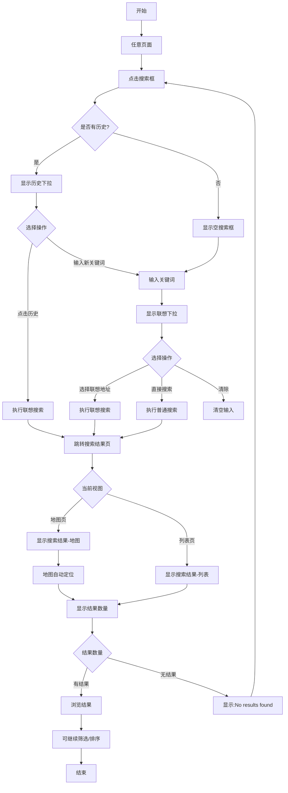

# 房产搜索业务流程

> **业务目标**：让买家通过关键词或地址快速定位房产

---

## 1. 完整流程图

---

## 2. 详细步骤与观测点

### 步骤1：打开搜索框
**页面位置**：任意页面（顶部搜索框）

**操作**：
- 点击搜索框

**观测点**：
- ✅ 搜索框获得焦点
- ✅ 搜索框显示占位符"Search for anything"
- ✅ 如有搜索历史，显示历史下拉
- ✅ 历史下拉显示最近搜索记录（最多N条）
- ✅ 历史记录按时间倒序排列

**验证方法**：
- 点击搜索框，观察是否获得焦点
- 观察是否显示历史下拉
- 观察历史记录顺序是否正确

**关联规则**：[房产列表页规则.md - 3.4 搜索规则](../../../业务规则库/房产模块/房产列表页规则.md#34-搜索规则)

---

### 步骤2：输入关键词
**页面位置**：搜索框

**操作**：
- 输入关键词或地址（如"Sydney"、"property"、"apartment"）

**观测点**：
- ✅ 输入时实时显示联想下拉
- ✅ 联想下拉显示地址匹配结果
- ✅ 联想结果按相关度排序
- ✅ 联想结果显示地址全称（如"Sydney, NSW, Australia"）
- ✅ 联想结果高亮匹配关键词
- ✅ 输入为空时，联想面板关闭
- ✅ 点击清除按钮（X），清空输入，联想面板关闭

**验证方法**：
- 输入"Sydney"，观察联想下拉是否显示
- 观察联想结果是否按相关度排序
- 观察匹配关键词是否高亮
- 清空输入，观察联想面板是否关闭

**关联规则**：[房产列表页规则.md - 3.4 搜索规则 - 搜索联想](../../../业务规则库/房产模块/房产列表页规则.md#34-搜索规则)

---

### 步骤3：选择搜索方式
**页面位置**：搜索框

**操作**：
- 选择联想地址（点击联想下拉中的地址）
- 或直接点击 Search 按钮（普通关键词搜索）
- 或点击搜索历史记录

**观测点**：

**选择联想地址观测**：
- ✅ 点击联想地址后，搜索框填充该地址
- ✅ 联想面板关闭
- ✅ 自动跳转到搜索结果页
- ✅ URL 包含坐标参数（lat/lng 或 city_id）
- ✅ 如当前是地图页，地图自动定位到该地址区域

**直接搜索观测**：
- ✅ 点击 Search 按钮后，跳转到搜索结果页
- ✅ URL 包含 common_type 参数
- ✅ 搜索框保留输入的关键词

**点击历史记录观测**：
- ✅ 点击历史记录后，自动跳转到搜索结果页
- ✅ URL 包含历史记录的参数（坐标参数或 common_type）
- ✅ 如历史记录是地址搜索，地图自动定位

**验证方法**：
- 输入"Sydney"，点击联想地址，观察 URL 是否包含坐标参数
- 输入"property"，直接点击 Search，观察 URL 是否包含 common_type 参数
- 点击历史记录，观察是否跳转到搜索结果页

**关联规则**：[房产列表页规则.md - 3.4 搜索规则](../../../业务规则库/房产模块/房产列表页规则.md#34-搜索规则)

---

### 步骤4：查看搜索结果
**页面位置**：搜索结果页（列表页/地图页）

**操作**：
- 浏览搜索结果

**观测点**：

**列表页搜索结果观测**：
- ✅ 列表页显示搜索结果
- ✅ 搜索框显示搜索关键词
- ✅ 显示结果数量（如"23 properties"）
- ✅ 面包屑导航显示搜索路径
- ✅ 搜索结果可筛选和排序
- ✅ 筛选和排序参数保留搜索关键词
- ❌ 搜索结果为空：显示"No results found"空态

**地图页搜索结果观测**：
- ✅ 地图页显示搜索结果
- ✅ 地图自动定位到搜索区域（如选择了联想地址）
- ✅ 地图 URL 包含 viewport 参数（c:lat,lng|z:level）
- ✅ 地图上显示搜索结果的 Pin 点
- ✅ 左侧卡片列表显示搜索结果
- ✅ 显示结果数量（如"23 properties"）
- ✅ 搜索结果可筛选和排序

**验证方法**：
- 搜索"Sydney"，观察列表页是否显示 Sydney 的房产
- 切换到地图页，观察地图是否定位到 Sydney
- 观察 URL 是否包含 viewport 参数
- 搜索不存在的关键词，观察是否显示"No results found"

**关联规则**：
- [房产列表页规则.md - 3.4 搜索规则](../../../业务规则库/房产模块/房产列表页规则.md#34-搜索规则)
- [房产地图页规则.md - 3.4 搜索规则](../../../业务规则库/房产模块/房产地图页规则.md#34-搜索规则)

---

### 步骤5：搜索分类切换
**页面位置**：搜索结果页

**操作**：
- 在搜索结果页切换分类（For Rent / For Sale / Student / Commercial）

**观测点**：
- ✅ 顶部显示分类切换 Tab 或下拉菜单
- ✅ 点击分类后，URL 更新分类参数
- ✅ 搜索关键词保留
- ✅ 搜索结果更新为对应分类的房产
- ✅ 结果数量更新

**验证方法**：
- 搜索"Sydney"后，切换到 For Rent 分类
- 观察 URL 是否更新分类参数
- 观察搜索关键词是否保留
- 观察搜索结果是否更新

**关联规则**：[房产列表页规则.md - 3.4 搜索规则 - 搜索分类切换](../../../业务规则库/房产模块/房产列表页规则.md#34-搜索规则)

---

## 3. 流程完整性验证清单

- [ ] 搜索框正常显示和获得焦点
- [ ] 搜索历史正常显示和点击
- [ ] 联想下拉正常显示和选择
- [ ] 联想地址搜索正常，地图自动定位
- [ ] 普通关键词搜索正常，URL 参数正确
- [ ] 搜索结果正常显示
- [ ] 搜索结果可筛选和排序
- [ ] 搜索分类切换正常
- [ ] 搜索结果为空时显示空态
- [ ] 清除搜索正常

---

## 4. 关联文档

- [房产业务全景](./房产业务全景.md)
- [房产列表页规则.md](../../../业务规则库/房产模块/房产列表页规则.md)
- [房产地图页规则.md](../../../业务规则库/房产模块/房产地图页规则.md)

---

## 5. 变更历史

| 日期 | 版本 | 变更内容 | 变更人 |
|-----|------|---------|--------|
| 2026-03-24 | v1.0 | 从房产业务全景拆分独立流程文档 | AI |
