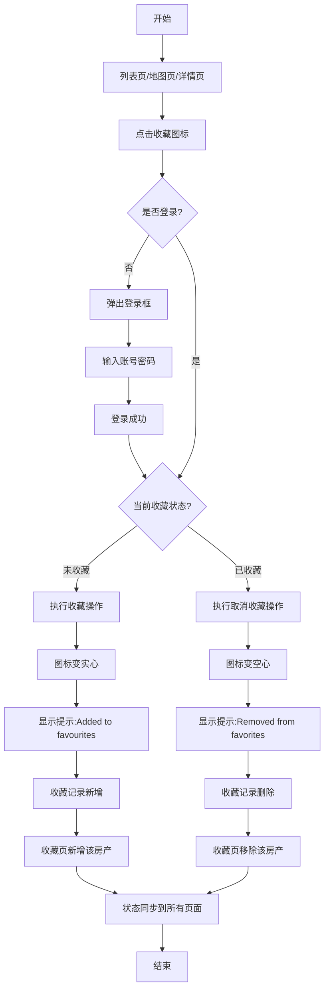

# 房产收藏业务流程

> **业务目标**：让买家能保存感兴趣的房产，方便后续查看

---

## 1. 完整流程图

---

## 2. 详细步骤与观测点

### 步骤1：识别收藏入口
**页面位置**：列表页/地图页/详情页

**操作**：
- 观察收藏图标位置和状态

**观测点**：

**列表页收藏图标观测**：
- ✅ 每张卡片右上角显示收藏图标（心形）
- ✅ 未收藏：空心图标
- ✅ 已收藏：实心图标
- ✅ 鼠标悬停图标，显示提示（如"Add to favourites"）

**地图页收藏图标观测**：
- ✅ 左侧卡片列表每张卡片显示收藏图标
- ✅ 图标状态与列表页一致

**详情页收藏图标观测**：
- ✅ 页面顶部显示收藏图标和"Favourites"文字
- ✅ 未收藏：空心图标
- ✅ 已收藏：实心图标

**验证方法**：
- 在列表页、地图页、详情页分别观察收藏图标位置
- 观察图标状态是否一致

**关联规则**：
- [房产列表页规则.md - 3.8 列表卡片展示规则 - 收藏功能规则](../../../业务规则库/房产模块/房产列表页规则.md#38-列表卡片展示规则)
- [房产详情页规则.md - 3.2 收藏功能规则](../../../业务规则库/房产模块/房产详情页规则.md#32-收藏功能规则)

---

### 步骤2：未登录点击收藏
**页面位置**：列表页/地图页/详情页

**操作**：
- 未登录状态下点击收藏图标

**观测点**：
- ✅ 弹出登录框/登录弹窗
- ✅ 登录框显示登录表单（邮箱/密码输入框）
- ✅ 登录框显示"注册"链接
- ✅ 登录框显示"忘记密码"链接
- ✅ 收藏图标状态不变（仍为空心）

**验证方法**：
- 清除登录态，点击收藏图标
- 观察是否弹出登录框
- 观察登录框内容是否完整

**关联规则**：[房产详情页规则.md - 3.2 收藏功能规则](../../../业务规则库/房产模块/房产详情页规则.md#32-收藏功能规则)

---

### 步骤3：登录后收藏
**页面位置**：列表页/地图页/详情页

**操作**：
- 登录成功后，或已登录状态下点击收藏图标（空心）

**观测点**：
- ✅ 收藏图标立即变为实心
- ✅ 显示 Toast 提示"Added to favourites"
- ✅ Toast 提示自动消失（约2-3秒）
- ✅ 页面不刷新，停留在当前位置
- ✅ 收藏状态实时同步到所有页面（列表页、地图页、详情页）

**同步验证观测**：
- ✅ 在列表页收藏，切换到详情页，图标为实心
- ✅ 在详情页收藏，返回列表页，图标为实心
- ✅ 在地图页收藏，切换到列表页，图标为实心
- ✅ 刷新页面，收藏状态保持

**验证方法**：
- 登录后点击收藏图标，观察图标是否变实心
- 观察是否显示"Added to favourites"提示
- 在列表页收藏，切换到详情页，观察图标状态
- 刷新页面，观察收藏状态是否保持

**关联规则**：[房产详情页规则.md - 3.2 收藏功能规则](../../../业务规则库/房产模块/房产详情页规则.md#32-收藏功能规则)

---

### 步骤4：取消收藏
**页面位置**：列表页/地图页/详情页

**操作**：
- 已登录且已收藏状态下，点击收藏图标（实心）

**观测点**：
- ✅ 收藏图标立即变为空心
- ✅ 显示 Toast 提示"Removed from favorites"
- ✅ Toast 提示自动消失（约2-3秒）
- ✅ 页面不刷新，停留在当前位置
- ✅ 收藏状态实时同步到所有页面

**验证方法**：
- 点击已收藏的图标，观察图标是否变空心
- 观察是否显示"Removed from favorites"提示
- 切换到其他页面，观察图标状态是否同步

**关联规则**：[房产详情页规则.md - 3.2 收藏功能规则](../../../业务规则库/房产模块/房产详情页规则.md#32-收藏功能规则)

---

### 步骤5：防重复提交
**页面位置**：列表页/地图页/详情页

**操作**：
- 快速连续点击收藏图标3次

**观测点**：
- ✅ 仅触发一次有效收藏请求
- ✅ 图标状态正确切换（空心 ↔ 实心）
- ✅ 仅显示一次 Toast 提示
- ✅ 无异常报错

**验证方法**：
- 快速连续点击收藏图标3次
- 观察图标状态是否正确
- 观察 Toast 提示是否仅显示一次
- 检查网络请求（开发者工具），观察是否仅发送一次请求

**关联规则**：[房产详情页规则.md - 3.2 收藏功能规则](../../../业务规则库/房产模块/房产详情页规则.md#32-收藏功能规则)

---

### 步骤6：查看收藏页
**页面位置**：收藏页（Favourites）

**操作**：
- 从顶部用户菜单进入收藏页

**观测点**：
- ✅ 收藏页显示所有已收藏的房产
- ✅ 收藏页布局与列表页类似（卡片列表）
- ✅ 每张卡片显示主图、价格、标题、房产类型、卧室/浴室/停车位/面积、位置、发布者信息
- ✅ 每张卡片显示收藏图标（实心）
- ✅ 收藏按时间倒序排列（最近收藏的在最前）
- ✅ 点击卡片跳转到详情页
- ✅ 点击收藏图标可取消收藏
- ✅ 取消收藏后，该房产从收藏页移除
- ❌ 无收藏：显示空态（如"You have no favourites yet"）

**验证方法**：
- 收藏几个房产后，进入收藏页
- 观察收藏页是否显示所有已收藏的房产
- 观察卡片信息是否完整
- 在收藏页取消收藏，观察该房产是否移除
- 取消所有收藏，观察是否显示空态

**关联规则**：[房产详情页规则.md - 3.2 收藏功能规则 - 收藏页验证](../../../业务规则库/房产模块/房产详情页规则.md#32-收藏功能规则)

---

## 3. 流程完整性验证清单

- [ ] 未登录点击收藏弹出登录框
- [ ] 登录后收藏成功，图标变实心
- [ ] 显示"Added to favourites"提示
- [ ] 取消收藏成功，图标变空心
- [ ] 显示"Removed from favorites"提示
- [ ] 收藏状态在列表页、地图页、详情页同步
- [ ] 刷新页面收藏状态保持
- [ ] 快速连续点击防重复提交
- [ ] 收藏页正常显示所有收藏
- [ ] 收藏页取消收藏后房产移除
- [ ] 无收藏时显示空态

---

## 4. 关联文档

- [房产业务全景](./房产业务全景.md)
- [房产列表页规则.md](../../../业务规则库/房产模块/房产列表页规则.md)
- [房产详情页规则.md](../../../业务规则库/房产模块/房产详情页规则.md)

---

## 5. 变更历史

| 日期 | 版本 | 变更内容 | 变更人 |
|-----|------|---------|--------|
| 2026-03-24 | v1.0 | 从房产业务全景拆分独立流程文档 | AI |
