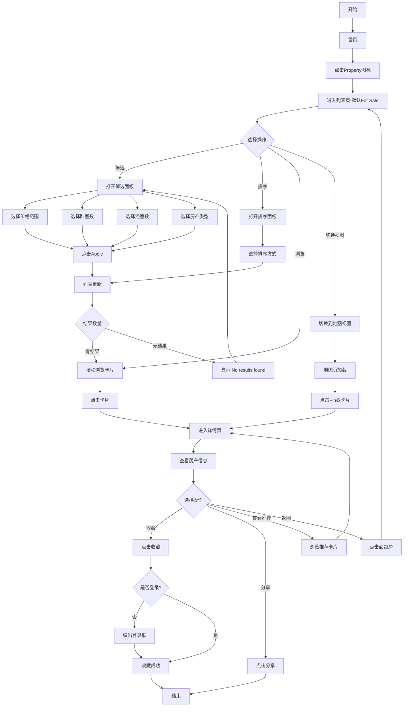

# 房产浏览业务流程

> **业务目标**：让买家能快速找到符合需求的房产

---

## 1. 完整流程图

---

## 2. 详细步骤与观测点

### 步骤1：进入列表页
**页面位置**：首页

**操作**：
- 点击首页 Property 图标
- 或点击 Browse 菜单 → Property
- 或点击 All 分类 → Property for rent/sale

**观测点**：
- ✅ URL 跳转到列表页（如 `/cate-property/`）
- ✅ 默认显示 For Sale 列表页
- ✅ 页面顶部显示搜索框、筛选、排序、视图切换按钮
- ✅ 面包屑导航显示（如 Home > Property for sale）
- ✅ 左侧显示房产卡片列表
- ✅ 右侧显示分页控件（PC）
- ✅ 默认排序为 Best Match（URL 无 sort_id 参数）
- ✅ 显示结果数量（如"23 properties"）

**验证方法**：
- 从不同入口进入列表页，观察 URL 和默认分类
- 观察页面布局和各个组件是否显示

**关联规则**：[房产列表页规则.md - 3.1 入口规则](../../../业务规则库/房产模块/房产列表页规则.md#31-入口规则)

---

### 步骤2：筛选房产
**页面位置**：列表页

**操作**：
- 点击筛选按钮（Filter）
- 选择价格范围（Min Price / Max Price）
- 选择卧室数量（1-8+）
- 选择浴室数量（1-4+）
- 选择房产类型（House / Apartment / Townhouse / Studio / Other，多选）
- 点击 Apply 按钮

**观测点**：
- ✅ 点击 Filter 按钮，弹出筛选面板
- ✅ 筛选面板显示所有筛选选项
- ✅ 价格输入框支持数字输入
- ✅ 卧室/浴室为单选模式
- ✅ 房产类型为多选模式
- ✅ 点击 Apply 后，筛选面板关闭
- ✅ URL 更新，包含筛选参数（lowestPrice、highestPrice、attr_168、attr_169、attr_170）
- ✅ 列表页结果更新，显示符合条件的房产
- ✅ 结果数量更新（如"5 properties"）
- ❌ Min > Max 价格：系统拦截或自动交换值，显示提示"Invalid price range"
- ❌ 输入非数字字符：前端过滤或失焦清空
- ❌ 筛选条件无结果：显示"No results found"空态

**筛选参数保留观测**：
- ✅ 筛选后翻页，筛选参数保留在 URL 中
- ✅ 筛选后切换排序，筛选参数保留
- ✅ 筛选后切换视图（列表↔地图），筛选参数保留
- ✅ 清除单个筛选，其他筛选不受影响
- ✅ 点击 Reset 按钮，清空所有筛选，恢复默认状态

**验证方法**：
- 选择价格范围，观察 URL 是否包含 lowestPrice 和 highestPrice 参数
- 输入 Min > Max 价格，观察系统如何处理
- 选择多个房产类型，观察 URL 是否包含多个 attr_170 值
- 筛选后翻页，观察筛选参数是否保留

**关联规则**：[房产列表页规则.md - 3.3 筛选规则](../../../业务规则库/房产模块/房产列表页规则.md#33-筛选规则)

---

### 步骤3：排序房产
**页面位置**：列表页

**操作**：
- 点击排序按钮（Sort）
- 选择排序方式（Best Match / Newest First / Lowest Price / Highest Price）
- 点击 Done 按钮

**观测点**：
- ✅ 点击 Sort 按钮，弹出排序面板
- ✅ 排序面板显示所有排序选项
- ✅ 当前排序选项被选中（如 Best Match）
- ✅ 选择排序后，排序面板关闭
- ✅ URL 更新，包含 sort_id 参数（除了 Best Match）
- ✅ 列表页结果重新排序
- ✅ 排序状态在分页后保持
- ✅ 打开 Sort 面板不选择点击 Done，URL 不变

**验证方法**：
- 选择 Newest First，观察 URL 是否包含 sort_id 参数
- 观察列表页结果是否按发布时间倒序排列
- 排序后翻页，观察排序参数是否保留
- 打开 Sort 面板不选择点击 Done，观察 URL 是否变化

**关联规则**：[房产列表页规则.md - 3.2 排序规则](../../../业务规则库/房产模块/房产列表页规则.md#32-排序规则)

---

### 步骤4：浏览卡片列表
**页面位置**：列表页

**操作**：
- 滚动浏览房产卡片列表
- 观察卡片信息
- 悬停卡片（PC）
- 点击卡片图片轮播（如有多张图片）

**观测点**：
- ✅ 每张卡片显示主图
- ✅ 每张卡片显示价格（$1,234 或 "Contact for price"）
- ✅ 每张卡片显示标题
- ✅ 每张卡片显示房产类型
- ✅ 每张卡片显示卧室/浴室/停车位/面积
- ✅ 每张卡片显示位置/邮编
- ✅ 每张卡片显示发布者信息
- ✅ 每张卡片显示收藏按钮（空心=未收藏，实心=已收藏）
- ✅ 多张图片的卡片显示数量标识（如"1/3"）
- ✅ 点击左右箭头或滑动切换图片
- ✅ 鼠标悬停卡片，卡片高亮（PC）
- ✅ 每张卡片图片加载成功（naturalWidth > 0 且 complete = true）
- ✅ 图片失败率 < 50%

**验证方法**：
- 逐一检查卡片信息是否完整
- 悬停卡片，观察是否高亮
- 点击图片轮播，观察是否切换
- 检查图片加载状态（开发者工具）

**关联规则**：[房产列表页规则.md - 3.8 列表卡片展示规则](../../../业务规则库/房产模块/房产列表页规则.md#38-列表卡片展示规则)

---

### 步骤5：切换到地图视图
**页面位置**：列表页

**操作**：
- 点击 Map 按钮

**观测点**：
- ✅ URL 更新，包含 view=map 参数
- ✅ 页面布局变为：左侧卡片列表（40%）+ 右侧地图（60%）
- ✅ 地图加载成功，显示 Google Maps
- ✅ 地图上显示房产 Pin 点
- ✅ Pin 点数量与当前页房产数量一致
- ✅ 筛选和排序参数保留
- ✅ 顶部 Bar 保持不变（搜索框、筛选、排序、视图切换）
- ✅ 面包屑导航保持不变
- ❌ 地图加载失败：显示"Map loading failed"

**验证方法**：
- 点击 Map 按钮，观察 URL 是否包含 view=map
- 观察页面布局是否变化
- 观察地图是否加载成功
- 观察 Pin 点数量是否正确

**关联规则**：[房产地图页规则.md - 3.1 页面布局规则](../../../业务规则库/房产模块/房产地图页规则.md#31-页面布局规则)

---

### 步骤6：地图交互
**页面位置**：地图页

**操作**：
- 点击地图 Pin 点
- 悬停地图 Pin 点（PC）
- 悬停左侧卡片（PC）
- 点击地图放大/缩小按钮
- 拖动地图
- 点击定位按钮
- 点击全屏按钮

**观测点**：

**Pin 交互观测**：
- ✅ 点击 Pin，弹出小卡片显示房产基本信息（PC）
- ✅ 点击 Pin，底部抽屉升起显示房产信息（M端）
- ✅ 悬停 Pin，Pin 高亮（PC）
- ✅ 点击 Pin 弹窗，跳转详情页（新标签页 PC / 当前页 M端）

**Pin 与卡片联动观测**：
- ✅ 鼠标悬停卡片时，对应 Pin 改变颜色（PC）
- ✅ 点击 Pin 后，左侧卡片列表自动滚动到对应卡片
- ✅ 点击卡片后，对应 Pin 高亮（M端）
- ✅ 翻页后地图 Pin 同步更新为当前页房产

**地图放大/缩小观测**：
- ✅ 点击 + 按钮，地图缩放级别 +1，URL viewport `z:11` → `z:12`
- ✅ 点击 − 按钮，地图缩放级别 -1，URL viewport `z:12` → `z:11`
- ✅ 连续点击，缩放级别累积变化
- ✅ 达到最大/最小缩放级别，按钮变为 disabled
- ✅ 缩小后多个标记聚合为气泡（如"N+"）
- ✅ 上报 analytics 事件（map_zoom_in / map_zoom_out）

**地图拖动观测**：
- ✅ 向右拖动，地图向西移动，经度（lng）增大，URL viewport `c:lat,lng` 更新
- ✅ 向上拖动，地图向南移动，纬度（lat）增大，URL viewport `c:lat,lng` 更新
- ✅ 拖动后，结果数量随视野变化更新
- ✅ 显示"Searching..."过渡状态

**地图定位观测**：
- ✅ 未授予地理位置权限：点击定位按钮，浏览器弹出权限请求弹窗
- ✅ 已授予地理位置权限：点击定位按钮，地图跳转至当前位置，显示蓝色圆点标记
- ✅ 拒绝地理位置权限：点击定位按钮，地图位置不变，可能显示"Location access denied"提示

**地图全屏观测**：
- ✅ 点击全屏按钮，左侧列表隐藏，地图占据全宽
- ✅ 右上角显示提示："Exit full screen by pressing [esc]"
- ✅ 全屏模式下再次点击，恢复分屏布局
- ✅ 全屏模式下按 Esc，退出全屏
- ✅ 上报 analytics 事件（map_fullscreen / map_exit_fullscreen）

**验证方法**：
- 点击 Pin，观察弹窗信息是否正确
- 悬停卡片，观察 Pin 是否高亮
- 点击放大/缩小按钮，观察 URL viewport 参数变化
- 拖动地图，观察 URL viewport 参数变化
- 点击定位按钮，观察地图是否跳转
- 点击全屏按钮，观察布局变化

**关联规则**：
- [房产地图页规则.md - 3.3 地图 Pin 规则](../../../业务规则库/房产模块/房产地图页规则.md#33-地图-pin-规则)
- [房产地图页规则.md - 3.9 地图交互控件规则](../../../业务规则库/房产模块/房产地图页规则.md#39-地图交互控件规则)

---

### 步骤7：进入详情页
**页面位置**：列表页/地图页

**操作**：
- 点击列表页卡片
- 或点击地图页 Pin 弹窗

**观测点**：
- ✅ 新标签页打开详情页（PC）
- ✅ 当前页跳转详情页（M端）
- ✅ URL 包含房产 ID
- ✅ 详情页正常加载
- ❌ 房源不存在：显示 404 或"房源不存在"友好提示
- ❌ 网络超时：显示"Loading failed"

**验证方法**：
- 点击卡片，观察是否打开新标签页（PC）
- 观察详情页 URL 是否包含房产 ID
- 访问无效房产 ID，观察错误提示

**关联规则**：[房产详情页规则.md - 1. 功能概述](../../../业务规则库/房产模块/房产详情页规则.md#1-功能概述)

---

### 步骤8：查看详情页信息
**页面位置**：房产详情页

**操作**：
- 浏览房产详细信息
- 查看图片轮播
- 点击"Show map"按钮
- 查看推荐房产

**观测点**：
- ✅ 页面标题显示房产标题
- ✅ 主图轮播显示所有图片/视频
- ✅ 图片轮播支持左右切换
- ✅ 价格显示正确
- ✅ 房产类型、卧室、浴室、停车位、面积显示正确
- ✅ 描述显示正确
- ✅ 地址显示正确
- ✅ 发布时间标签显示
- ✅ 分类标签显示
- ✅ 发布者信息显示
- ✅ 收藏按钮显示
- ✅ 分享按钮显示
- ✅ 面包屑导航显示
- ✅ "You may also like"推荐区域显示
- ✅ 点击"Show map"，弹出地图弹窗
- ✅ 地图弹窗显示房源位置
- ✅ 按 ESC 键关闭地图弹窗
- ✅ 推荐轮播左箭头在第一页时为 disabled 状态
- ✅ 点击推荐轮播右箭头，切换到下一组推荐
- ✅ 点击推荐卡片，跳转到对应房源详情页

**验证方法**：
- 逐一检查详情页各个字段是否显示
- 点击图片轮播，观察是否切换
- 点击"Show map"，观察地图弹窗是否显示
- 按 ESC 键，观察地图弹窗是否关闭
- 点击推荐卡片，观察是否跳转

**关联规则**：[房产详情页规则.md - 3.1 页面展示规则](../../../业务规则库/房产模块/房产详情页规则.md#31-页面展示规则)

---

### 步骤9：收藏房产
**页面位置**：详情页/列表页/地图页

**操作**：
- 点击收藏图标（心形）

**观测点**：
- ❌ 未登录：弹出登录框
- ✅ 已登录-未收藏：图标变实心，显示"Added to favourites"提示
- ✅ 已登录-已收藏：图标变空心，显示"Removed from favorites"提示
- ✅ 收藏状态实时同步（列表页、地图页、详情页）
- ✅ 刷新页面，收藏状态保持
- ✅ 快速连续点击3次，仅触发一次有效请求（防重复提交）
- ✅ 收藏后可在"Favourites"页面查看
- ✅ 取消收藏后，从"Favourites"页面移除

**验证方法**：
- 未登录状态点击收藏，观察是否弹出登录框
- 登录后点击收藏，观察图标是否变实心
- 观察是否显示"Added to favourites"提示
- 刷新页面，观察收藏状态是否保持
- 快速连续点击收藏，观察是否防重复提交
- 进入"Favourites"页面，观察是否显示刚收藏的房产

**关联规则**：[房产详情页规则.md - 3.2 收藏功能规则](../../../业务规则库/房产模块/房产详情页规则.md#32-收藏功能规则)

---

## 3. 流程完整性验证清单

- [ ] 列表页正常加载，显示房产卡片
- [ ] 筛选功能正常，URL 参数更新
- [ ] 排序功能正常，URL 参数更新
- [ ] 筛选和排序参数在翻页、切换视图时保持
- [ ] 列表页和地图页可自由切换
- [ ] 地图 Pin 与卡片列表联动正常
- [ ] 地图交互控件（放大/缩小/拖动/定位/全屏）正常
- [ ] 点击卡片/Pin 正常跳转详情页
- [ ] 详情页信息完整显示
- [ ] 收藏功能正常，状态同步
- [ ] 推荐轮播正常
- [ ] 面包屑导航正常

---

## 4. 关联文档

- [房产业务全景](./房产业务全景.md)
- [房产列表页规则.md](../../../业务规则库/房产模块/房产列表页规则.md)
- [房产地图页规则.md](../../../业务规则库/房产模块/房产地图页规则.md)
- [房产详情页规则.md](../../../业务规则库/房产模块/房产详情页规则.md)

---

## 5. 变更历史

| 日期 | 版本 | 变更内容 | 变更人 |
|-----|------|---------|--------|
| 2026-03-24 | v1.0 | 从房产业务全景拆分独立流程文档 | AI |
