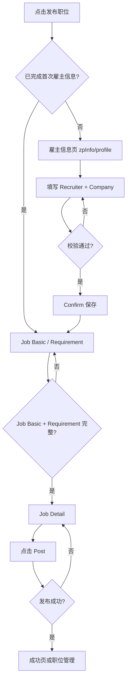

# B 端职位发布（PC）业务流程

> **业务目标**：招聘方在 Biz PC Web 完成雇主建档与多页表单，成功发布职位并进入管理或成功反馈页。跨域依赖（UMC、钱包等）的复杂分支见 [招聘业务全景.md](./招聘业务全景.md) 第 4.7 节与全局关联图。

## 1. 完整流程图

> 本图聚焦 **招聘域内** 页面顺序；登录、验证码等用户域细节不展开全部分支。

## 2. 详细步骤与观测点

### 步骤 1：进入与首次雇主信息

- **页面位置**：`/biz/{lang}/zpInfo/profile?fromUrl=...`
- **操作流程**：登录 → 从发布入口进入 → 填写 First/Last name、Email、站点相关 WhatsApp；公司搜索选已有或新建 + Logo。
- **观测点**：
  - ✅ P0：文字头像按 Last Name、无上传入口；Email UMC 同步/必填策略正确。
  - ✅ P0：公司搜索必填、联想与 `+关键字` 创建；BR/MX WhatsApp 展示与非 BR 隐藏。
  - ❌ 负向：必填未填 Confirm 不跳转；Email 非法格式拦截。
- **验证方法**：对照 TC001–TC024-1、TC088 等。
- **关联规则**：[B端职位发布规则.md](../../业务规则库/招聘模块/B端职位发布规则.md) 第 3.1–3.2 节。

### 步骤 2：雇主信息提交后路由

- **操作流程**：Confirm 成功 → 进入 `fromUrl` 对应发布步骤（如 `/publish/job?categoryId=...`）。
- **观测点**：
  - ✅ 再次点发布不再进雇主信息（TC025/TC026）；未完成首次仍进雇主信息（TC027）。
- **关联规则**：规则文档 §2.2。

### 步骤 3：Job Basic 与 Requirement

- **页面位置**：职位发布 Step1（同一页或同流程连续步骤）。
- **观测点**：
  - ✅ 默认值：Workplace Onsite、Job type Full-time；Experience/Education 默认 All levels。
  - ✅ 枚举完整可选；Job title、Salary range 等必填/阻断逻辑符合规则。
- **验证方法**：TC034–TC045、TC061（US en 枚举文案）。

### 步骤 4：Job Detail 与 Post

- **页面位置**：发布第二步。
- **观测点**：
  - ✅ 页加载完整；主按钮为 **Post**；完整填写后发布成功跳转（TC047–TC049）。
- **关联规则**：规则文档 §3.1.7。

### 步骤 5：多语言、RTL 与健壮性（横切）

- **观测点**：雇主页与发布 13 字段 i18n；AE `dir=rtl`；断网与防重复提交（TC050–TC066 等）。
- **关联规则**：规则文档 §3.4、§4。

## 3. 流程完整性验证清单

- [ ] 首次雇主信息 Confirm 后可进入 Job Basic，URL 与 `categoryId` 一致。
- [ ] 非首次从发布入口直达 Job Basic，不再出现 zpInfo/profile。
- [ ] Job Basic + Requirement 必填与默认项与规则一致。
- [ ] Job Detail 主按钮为 Post，发布成功路径可达。
- [ ] 至少抽测 1 个非 SG 站点差异场景（如 BR WhatsApp 或 ES i18n）。

## 4. 关联文档

- [招聘业务全景.md](./招聘业务全景.md)（4.7 B 端发布、页面拓扑）
- [B端职位发布规则.md](../../业务规则库/招聘模块/B端职位发布规则.md)
- [招聘文本用例归档索引.md](./招聘文本用例归档索引.md)
- 文本用例：[ok-sg-BizJobPublish-测试用例-20260414.md](../../文本用例/zhaopin/ok-sg-BizJobPublish-测试用例-20260414.md)

## 5. 变更历史

| 日期 | 版本 | 变更内容 | 变更人 |
|------|------|----------|--------|
| 2026-05-09 | v1.0 | 从 BizJobPublish 文本用例归档生成 | QA Agent |
