# 岗位偏好业务流程

> **业务目标**：让求职者快速设置求职偏好，系统根据偏好推荐匹配职位，提升求职效率

---

## 1. 完整流程图

```mermaid
graph TD
    Start([用户访问首页/列表页]) --> CheckEntry{入口类型?}
    
    CheckEntry -->|首页 Jobs 金刚位| CheckLoginHome{是否登录?}
    CheckEntry -->|列表页 Add Job Preference 卡片| CheckLoginList{是否登录?}
    CheckEntry -->|列表页 Edit 链接| JobPrefPageEdit[Job Preferences 页面]
    
    CheckLoginHome -->|未登录| ShowLoginDialog1[弹出登录弹窗]
    CheckLoginHome -->|已登录| CheckPref{是否有偏好?}
    
    CheckLoginList -->|未登录| ShowLoginDialog2[弹出登录弹窗]
    CheckLoginList -->|已登录| JobPrefPageAdd[Job Preferences 页面]
    
    ShowLoginDialog1 --> Login1[登录]
    ShowLoginDialog2 --> Login2[登录]
    Login1 --> CheckPref
    Login2 --> JobPrefPageAdd
    
    CheckPref -->|无偏好| JobPrefPageAdd
    CheckPref -->|有偏好| JobsListPage[Jobs 列表页]
    
    JobPrefPageAdd --> ShowForm[显示偏好表单]
    JobPrefPageEdit --> ShowFormEdit[显示偏好表单]
    
    ShowForm --> SelectJobFunctions[选择 Job Functions]
    ShowFormEdit --> SelectJobFunctions
    
    SelectJobFunctions --> ClickTrigger1[点击触发器]
    ClickTrigger1 --> OpenPanel1[打开两栏面板]
    OpenPanel1 --> SelectCategory[点击左侧一级分类]
    SelectCategory --> ShowSubcategory[右侧显示二级分类]
    ShowSubcategory --> ClickSubcategory[点击右侧二级分类]
    ClickSubcategory --> AddTag1[添加到触发器区域]
    AddTag1 --> CheckCount1{已选数量?}
    
    CheckCount1 -->|<10| ContinueSelect1[继续选择]
    CheckCount1 -->|=10| DisableOther1[禁用其他选项]
    
    ContinueSelect1 --> ClickSubcategory
    DisableOther1 --> ClickConfirm1[点击 Confirm]
    ClickConfirm1 --> ClosePanel1[关闭面板]
    ClosePanel1 --> SelectLocation
    
    SelectLocation[选择 Location] --> ClickTrigger2[点击触发器]
    ClickTrigger2 --> OpenPanel2[打开城市列表面板]
    OpenPanel2 --> CheckSite{站点类型?}
    
    CheckSite -->|ES站| ShowProvinces[显示省份列表]
    CheckSite -->|AE/SG站| ShowCities[显示城市列表]
    
    ShowProvinces --> ClickProvince[点击省份]
    ClickProvince --> ExpandCities[展开城市列表]
    ExpandCities --> CheckCity[勾选城市]
    
    ShowCities --> CheckCity
    CheckCity --> AddTag2[添加到触发器区域]
    AddTag2 --> CheckCount2{已选数量?}
    
    CheckCount2 -->|<5| ContinueSelect2[继续选择]
    CheckCount2 -->|=5| DisableOther2[禁用其他选项]
    
    ContinueSelect2 --> CheckCity
    DisableOther2 --> ClickConfirm2[点击 Confirm]
    ClickConfirm2 --> ClosePanel2[关闭面板]
    ClosePanel2 --> FillSalary
    
    FillSalary[填写 Salary] --> SelectPayType[选择 Pay Type]
    SelectPayType --> InputAmount[输入金额]
    InputAmount --> ValidateAmount{金额>0?}
    
    ValidateAmount -->|否| ShowError[显示错误提示]
    ValidateAmount -->|是| FormatAmount[格式化千位分隔符]
    
    ShowError --> InputAmount
    FormatAmount --> SelectWorkplaceType[选择 Workplace Type]
    
    SelectWorkplaceType --> CheckWorkplace{是否选择?}
    CheckWorkplace -->|是| CheckWorkplaceMultiple[勾选多个]
    CheckWorkplace -->|否| SelectJobType
    
    CheckWorkplaceMultiple --> SelectJobType
    
    SelectJobType[选择 Job Type] --> CheckJobType{是否选择?}
    CheckJobType -->|是| CheckJobTypeMultiple[勾选多个]
    CheckJobType -->|否| CheckRequired
    
    CheckJobTypeMultiple --> CheckRequired
    
    CheckRequired{必填项已填?} -->|否| DisableContinue[Continue 按钮禁用]
    CheckRequired -->|是| EnableContinue[Continue 按钮可点击]
    
    DisableContinue --> SelectJobFunctions
    EnableContinue --> ClickContinue[点击 Continue]
    
    ClickContinue --> SubmitPref[提交偏好]
    SubmitPref --> SaveToDb[保存到数据库]
    SaveToDb --> RedirectToList[跳转到列表页]
    RedirectToList --> ShowPrefTags[顶部显示偏好标签]
    ShowPrefTags --> End([流程结束])
    
    ShowForm --> ClickSkip{点击 Skip?}
    ClickSkip -->|是| RedirectToList
    ClickSkip -->|否| SelectJobFunctions
    
    ShowForm --> ClickBack{点击 Back?}
    ShowFormEdit --> ClickBack
    ClickBack -->|是| ReturnPrev[返回上一页]
    ClickBack -->|否| SelectJobFunctions
    ReturnPrev --> End
```

---

## 2. 详细步骤与观测点

### 步骤1：入口判断
**页面位置**：首页 / Jobs 列表页

**操作**：
- 首页 Jobs 金刚位：未登录/已登录无偏好 → 跳转到 Job Preferences 页面
- 列表页 Add Job Preference 卡片：未登录弹出登录弹窗；已登录跳转到偏好页
- 列表页 Edit 链接：跳转到 Job Preferences 编辑页

**观测点**：
- ✅ 未登录点击 Add Job Preference，是否弹出登录弹窗
- ✅ 登录成功后，是否自动跳转到 Job Preferences 页面
- ✅ 已登录无偏好，首页 Jobs 金刚位是否跳转到偏好页（URL含 `showSkip=1`）
- ✅ 已登录有偏好，首页 Jobs 金刚位是否直接跳转到列表页
- ✅ 点击 Edit 链接，URL 是否含 `returnUrl` 参数
- ✅ 编辑模式下，原有数据是否自动回填

**验证方法**：
- 清除登录态，点击 Add Job Preference，观察是否弹出登录弹窗
- 登录后，观察是否跳转到 Job Preferences 页面
- 已登录无偏好，点击首页 Jobs 金刚位，观察 URL 是否含 `showSkip=1`
- 已登录有偏好，点击 Edit 链接，观察数据是否自动回填

**关联规则**：[岗位偏好规则.md - 1. 功能概述 - 入口位置](../../业务规则库/招聘模块/岗位偏好规则.md#1-功能概述)

---

### 步骤2：选择 Job Functions
**页面位置**：Job Preferences 页面

**操作**：
1. 点击触发器 "Select preferred job function (0/10)"
2. 打开两栏面板（左侧31个一级分类，右侧对应二级分类）
3. 点击左侧一级分类，右侧显示对应二级分类
4. 点击右侧二级分类项选中（必须点击二级项才算选中）
5. 已选项在触发器区域显示为 tag（带 × 删除按钮）
6. 选满10项后，其他未选项变为禁用状态
7. 点击 Confirm 确认选择并关闭面板

**观测点**：
- ✅ 点击触发器，是否打开两栏面板
- ✅ 点击一级分类，右侧是否显示对应二级分类
- ✅ 点击二级分类项，是否添加到触发器区域（显示为 tag）
- ✅ 选满10项后，其他选项是否禁用
- ✅ 点击 tag 的 ×，是否删除该项
- ✅ 点击 Clear，是否清空所有选中（面板保持打开）
- ✅ 点击 Confirm，面板是否关闭

**验证方法**：
- 点击触发器，观察面板是否打开
- 点击一级分类，观察右侧是否显示二级分类
- 选满10项，尝试点击其他选项，观察是否禁用
- 点击 tag 的 ×，观察是否删除

**关联规则**：[岗位偏好规则.md - 3.5 交互规则 - Job Functions 选择交互](../../业务规则库/招聘模块/岗位偏好规则.md#35-交互规则)

---

### 步骤3：选择 Location
**页面位置**：Job Preferences 页面

**操作**：
1. 点击触发器 "Select preferred work location (0/5)"
2. 打开城市列表面板
3. **ES站特殊流程**：
   - 显示省份列表（20个省份）
   - 点击省份展开城市列表
   - 勾选城市（checkbox）
   - 面板顶部有 "Search City" 搜索框
   - 面板顶部有 "Use current location" 按钮
4. **AE/SG站流程**：
   - 直接显示城市列表（AE:9个城市，SG:1个城市）
   - 勾选城市（checkbox）
5. 已选项在触发器区域显示为 tag（带 × 删除按钮）
6. 选满5项后，其他未选项变为禁用状态
7. 点击 Confirm 确认选择并关闭面板

**观测点**：
- ✅ ES站：点击省份，是否展开城市列表
- ✅ ES站：搜索框是否可用，搜索结果是否正确
- ✅ ES站："Use current location" 是否可用
- ✅ 勾选城市，是否添加到触发器区域（显示为 tag）
- ✅ 选满5项后，其他选项是否禁用
- ✅ 点击 tag 的 ×，是否删除该项
- ✅ 点击 Clear，是否清空所有选中（面板保持打开）
- ✅ 点击 Confirm，面板是否关闭

**验证方法**：
- ES站：点击省份，观察是否展开城市列表
- 选满5项，尝试点击其他选项，观察是否禁用
- 点击 tag 的 ×，观察是否删除

**关联规则**：[岗位偏好规则.md - 3.5 交互规则 - Location 选择交互](../../业务规则库/招聘模块/岗位偏好规则.md#35-交互规则)

---

### 步骤4：填写 Salary
**页面位置**：Job Preferences 页面

**操作**：
1. 选择 Pay Type（Yearly/Monthly/Hourly，默认 Yearly）
2. 输入金额（正整数）
3. 校验金额：
   - 金额 > 0 → 校验通过，自动格式化千位分隔符（5000 → 5,000）
   - 金额 = 0 → 显示错误提示 "Don't leave this field empty."
   - 金额为负数 → 输入框自动拦截（无法输入负号）
   - 金额为字母 → 输入框自动拦截（无法输入字母）
   - 金额为小数 → 接受小数输入

**观测点**：
- ✅ Pay Type 默认是否选中 Yearly
- ✅ 输入金额后，是否自动格式化千位分隔符
- ✅ 输入0，是否显示错误提示
- ❌ 尝试输入负号，是否被拦截
- ❌ 尝试输入字母，是否被拦截
- ✅ 输入小数，是否接受

**验证方法**：
- 输入5000，观察是否格式化为5,000
- 输入0，观察是否显示错误提示
- 尝试输入负号和字母，观察是否被拦截

**关联规则**：[岗位偏好规则.md - 3.2 校验规则 - Salary 必填校验](../../业务规则库/招聘模块/岗位偏好规则.md#32-校验规则)

---

### 步骤5：选择 Workplace Type 和 Job Type
**页面位置**：Job Preferences 页面

**操作**：
1. Workplace Type：多选 checkbox（Onsite/Remote/Hybrid）
2. Job Type：多选 checkbox（Full-time/Part-time/Contract/Internship/Temporary）
3. 可选字段，不影响 Continue 按钮激活

**观测点**：
- ✅ 是否可以勾选多个选项
- ✅ 不勾选是否可以提交

**验证方法**：
- 勾选多个选项，观察是否可以同时选中
- 不勾选，观察 Continue 按钮是否仍可点击

**关联规则**：[岗位偏好规则.md - 3.1 输入规则](../../业务规则库/招聘模块/岗位偏好规则.md#31-输入规则)

---

### 步骤6：提交偏好
**页面位置**：Job Preferences 页面

**操作**：
1. 检查必填项：Job Functions、Location、Salary
2. 必填项已填写 → Continue 按钮可点击（蓝色）
3. 必填项未填写 → Continue 按钮禁用（灰色不可点击）
4. 点击 Continue → 提交偏好数据
5. 保存到数据库
6. 跳转到 Jobs 列表页
7. 列表页顶部显示偏好标签 + Edit 链接

**观测点**：
- ✅ 必填项未填写时，Continue 按钮是否禁用
- ✅ 必填项已填写时，Continue 按钮是否可点击
- ✅ 提交成功后，是否跳转到列表页
- ✅ 列表页顶部是否显示偏好标签
- ✅ 偏好标签是否显示所有已选的 Job Functions
- ✅ 是否显示 Edit 链接

**验证方法**：
- 必填项未填写，观察 Continue 按钮是否禁用
- 填写必填项，观察按钮是否可点击
- 提交后，观察是否跳转到列表页并显示偏好标签

**关联规则**：[岗位偏好规则.md - 3.2 校验规则](../../业务规则库/招聘模块/岗位偏好规则.md#32-校验规则)

---

### 步骤7：Skip 流程（可选）
**页面位置**：Job Preferences 页面

**操作**：
1. 首次创建时，页面显示 Skip 链接（URL含 `showSkip=1`）
2. 点击 Skip → 跳过偏好设置，直接跳转到列表页
3. 列表页显示 Add Job Preference 卡片（因为无偏好）

**观测点**：
- ✅ 首次创建时，是否显示 Skip 链接（URL含 `showSkip=1`）
- ✅ 点击 Skip，是否跳过偏好设置，直接进入列表页
- ✅ 跳过后，列表页是否显示 Add Job Preference 卡片
- ❌ 编辑模式下，是否不显示 Skip 链接

**验证方法**：
- 首次访问，观察是否显示 Skip 链接
- 点击 Skip，观察是否跳转到列表页
- 编辑模式，观察是否无 Skip 链接

**关联规则**：[岗位偏好规则.md - 2.2 异常流程](../../业务规则库/招聘模块/岗位偏好规则.md#22-异常流程)

---

## 3. 流程完整性验证清单

- [ ] 未登录点击 Add Job Preference 是否弹出登录弹窗
- [ ] 登录成功后是否自动跳转到 Job Preferences 页面
- [ ] Job Functions 选满10项后，其他选项是否禁用
- [ ] Location 选满5项后，其他选项是否禁用
- [ ] Salary 填写0或负数时，是否显示错误提示
- [ ] 必填项未填写时，Continue 按钮是否禁用
- [ ] 提交成功后，是否跳转到列表页并显示偏好标签
- [ ] 编辑模式下，原有数据是否自动回填
- [ ] Salary 金额输入后是否自动格式化千位分隔符
- [ ] 点击 Skip 是否跳过偏好设置，直接进入列表页
- [ ] ES站：Location 是否显示两级级联（省份 → 城市）
- [ ] AE/SG站：Location 是否显示单级城市列表
- [ ] 点击 Clear 是否清空所有选中（面板保持打开）
- [ ] 点击 Confirm 面板是否关闭
- [ ] 点击 tag 的 × 是否删除该项
- [ ] 所有错误提示文案正确

---

## 4. 关联文档

- [招聘业务全景](./招聘业务全景.md)
- [岗位偏好规则.md](../../业务规则库/招聘模块/岗位偏好规则.md)

---

## 5. 变更历史

| 日期 | 版本 | 变更内容 | 变更人 |
|-----|------|---------|--------|
| 2026-03-24 | v1.0 | 初始版本 | AI |
| 2026-03-24 | v2.0 | 调整为5章结构，移除数据流转章节 | AI |
