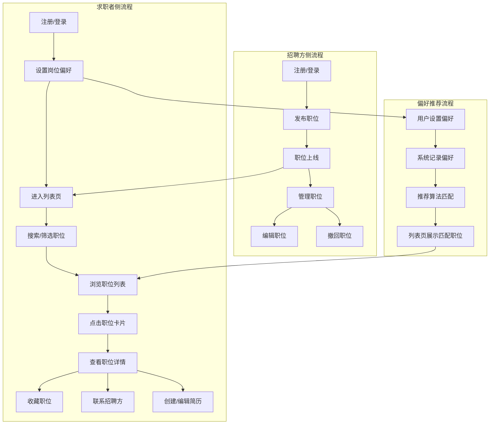
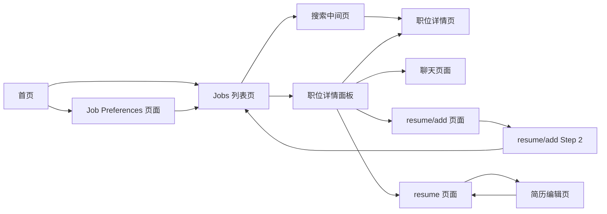
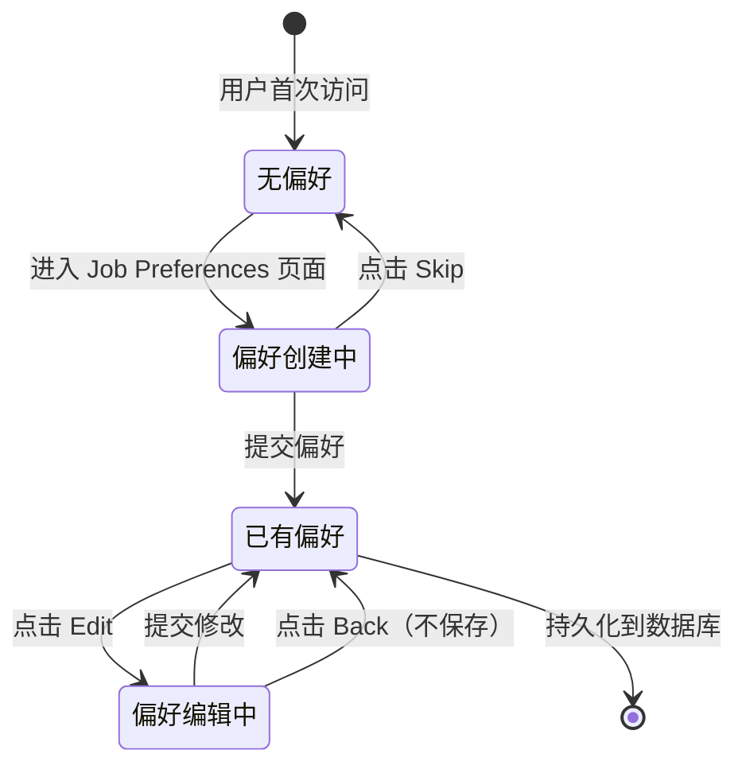

# 招聘业务域 - 业务全景

## 1. 业务定位
招聘业务域是 OK 平台的核心业务之一，为求职者和招聘方提供双边匹配服务，覆盖岗位偏好设置、职位浏览、搜索、收藏、简历管理等全流程。

**业务价值**：
- 为招聘方提供职位发布和管理平台，触达海量求职者
- 为求职者提供个性化职位推荐、搜索、筛选、收藏服务
- 通过偏好匹配算法提升双边匹配效率

**目标用户**：
- **求职者（Job Seeker）**：寻找工作机会的用户
- **招聘方（Recruiter）**：发布职位、招聘人才的企业或个人
- **游客（Guest）**：未登录的访客，可浏览但功能受限

## 2. 业务范围

### 2.1 功能覆盖
| 功能模块 | 说明 | 核心能力 |
|---------|------|---------|
| 岗位偏好设置 | 求职者设置求职偏好 | Job Functions（最多10项）、Location（最多5项）、Salary、Workplace Type、Job Type |
| 招聘列表页 | 职位列表浏览 | 搜索、筛选、排序、无限滚动、详情面板 |
| 职位详情 | 职位完整信息展示 | Contact、Favourites、Share、Resume、New tab |
| 简历管理 | 求职者简历创建和编辑 | 个人信息、工作经验、教育背景、头像上传 |

### 2.2 地域覆盖
- **ES站**（西班牙）：Madrid, Barcelona 等20个省份+城市
- **AE站**（阿联酋）：Dubai, Abu Dhabi 等9个城市
- **SG站**（新加坡）：Singapore

### 2.3 用户角色
| 角色 | 权限 | 说明 |
|-----|------|------|
| 游客 | 浏览职位列表和详情 | Contact、Favourites、Resume 需登录 |
| 求职者 | 浏览、搜索、筛选、收藏、联系、简历 | 已登录用户 |
| 招聘方 | 发布职位、管理职位、查看简历 | 已登录且发布过职位 |
| 发布者 | 所有权限 + 编辑/撤回自己的职位 | 职位所有者 |

## 3. 业务流程全景图

## 4. 核心业务流程概览

### 4.1 岗位偏好设置流程
**业务目标**：让求职者快速设置求职偏好，系统根据偏好推荐匹配职位

**核心步骤**：
1. 用户通过入口进入 Job Preferences 页面
2. 选择 Job Functions（必填，最多10项，两级级联）
3. 选择 Location（必填，最多5项，checkbox多选）
4. 设置 Salary（必填，Pay Type + 金额）
5. 选择 Workplace Type（可选，多选）
6. 选择 Job Type（可选，多选）
7. 点击 Continue 提交
8. 跳转到列表页，顶部显示偏好标签

**关键观测点**：
- ✅ Job Functions 选满10项后，其他选项是否禁用
- ✅ Location 选满5项后，其他选项是否禁用
- ✅ Salary 填写0或负数时，是否显示错误提示
- ✅ 必填项未填写时，Continue 按钮是否禁用
- ✅ 提交成功后，是否跳转到列表页并显示偏好标签
- ✅ 编辑模式下，原有数据是否自动回填

**详细流程文档**：[岗位偏好业务流程.md](./岗位偏好业务流程.md)

---

### 4.2 招聘列表页浏览流程
**业务目标**：让求职者快速找到符合需求的职位

**核心步骤**：
1. 进入列表页（显示偏好标签或 Add Job Preference 卡片）
2. 搜索职位（关键词搜索 → 跳转搜索中间页）
3. 筛选职位（Location、Job Type、Workplace Type、Salary）
4. 浏览职位列表（无限滚动加载）
5. 点击职位卡片（展开右侧详情面板）
6. 在详情面板进行操作（Contact、Favourites、Share、Resume）

**关键观测点**：
- ✅ 未登录/已登录无偏好时，是否显示 Add Job Preference 卡片
- ✅ 已登录有偏好时，是否显示偏好标签栏 + Edit 链接
- ✅ 搜索后是否跳转到搜索中间页（URL含 `keyword=xxx`）
- ✅ 筛选后 URL 参数是否正确更新
- ✅ 滚动到底部是否自动加载更多职位
- ✅ 加载完毕是否显示 "You've reached the end"
- ✅ 点击职位卡片，详情面板是否正确展开

**详细流程文档**：[招聘列表页业务流程.md](./招聘列表页业务流程.md)

---

### 4.3 职位详情查看流程
**业务目标**：让求职者查看职位完整信息，并进行后续操作

**核心步骤**：
1. 点击职位卡片（列表页 → 展开详情面板；搜索中间页 → 新标签页打开）
2. 查看职位信息（标题、薪资、标签、描述、要求、技能）
3. 选择操作：
   - Contact：联系招聘方（需登录）
   - Favourites：收藏职位（需登录）
   - Share：分享职位
   - Resume：创建/编辑简历（需登录）
   - New tab：在新标签页打开

**关键观测点**：
- ✅ 职位信息是否完整显示
- ✅ 未登录点击 Contact/Favourites/Resume 是否弹出登录弹窗
- ✅ 登录成功后是否正确跳转到对应页面
- ✅ 收藏状态切换后，图标是否正确更新
- ✅ 点击 Share 是否弹出分享面板
- ✅ 本人发布的职位是否显示 Withdraw/Edit 按钮

**详细流程文档**：详情面板流程见 [招聘列表页业务流程.md](./招聘列表页业务流程.md)

---

### 4.4 简历管理流程
**业务目标**：让求职者创建和编辑个人简历，用于求职匹配

**核心步骤**：
1. 点击 Resume 按钮（未登录需先登录）
2. 检查是否有简历（无 → resume/add 页面；有 → resume 页面）
3. **Step 1 - Personal Information**：
   - 选择头像（10个预设 或 上传自定义）
   - 填写 First Name、Last Name（必填，1-100字符）
   - Email/Location 自动预填
   - 选择 Gender（可选）
4. **Step 2 - Recent Experience**：
   - 选择 Job Function（必填*）
   - 选择 From/To 日期（年月滚动选择器，1925-2036）
   - 或开启 "I have no work experience"
   - 选择 Education Level、From/To 日期（必填）
5. 点击 Done 提交
6. 数据保存到数据库（4张表）

**关键观测点**：
- ✅ 未登录点击 Resume 是否弹出登录弹窗
- ✅ Step 1 必填项未填写时，Continue 按钮是否禁用
- ✅ Step 2 必填项未填写时，Done 按钮是否禁用
- ✅ 提交成功后是否跳转离开 resume/add 页面
- ✅ 数据是否正确保存到数据库
- ✅ 重新进入简历页面时，数据是否自动回显

**详细流程文档**：[简历管理业务流程.md](./简历管理业务流程.md)

---

### 4.5 职位收藏流程
**业务目标**：让求职者保存感兴趣的职位，方便后续查看

**核心步骤**：
1. 识别收藏入口（列表页/详情面板）
2. 未登录点击收藏（弹出登录弹窗）
3. 登录后收藏（图标变实心，显示 toast "Added to favourites"）
4. 取消收藏（图标变空心，显示 toast "Removed from favourites"）
5. 查看收藏页（显示所有收藏）

**关键观测点**：
- ✅ 未登录点击收藏弹出登录弹窗
- ✅ 登录后收藏成功，图标变实心
- ✅ 收藏状态在列表页、详情面板同步
- ✅ 刷新页面收藏状态保持
- ✅ 收藏页正常显示所有收藏

---

### 4.6 职位搜索流程
**业务目标**：让求职者通过关键词快速定位职位

**核心步骤**：
1. 聚焦搜索框（显示 Recent Searches 历史记录）
2. 输入关键词（支持空搜索）
3. 点击 Search 按钮
4. 跳转到搜索中间页（URL含 `keyword=xxx`）
5. 查看搜索结果（可筛选、可点击职位卡片）

**关键观测点**：
- ✅ 聚焦搜索框，是否显示 Recent Searches
- ✅ 点击历史记录，是否触发对应关键词搜索
- ✅ 点击 Search，是否跳转到搜索中间页
- ✅ 搜索中间页是否无右侧详情面板
- ✅ 搜索中间页是否无 Reset 按钮
- ✅ 搜索无结果时是否显示空状态提示

**详细流程文档**：搜索流程见 [招聘列表页业务流程.md](./招聘列表页业务流程.md)

---

## 5. 页面拓扑关系

### 5.1 页面入口矩阵
| 页面 | 入口1 | 入口2 | 入口3 | 入口4 | 入口5 |
|-----|------|------|------|------|------|
| Job Preferences 页面 | 首页 Jobs 金刚位 | 列表页 Add Job Preference 卡片 | 列表页 Edit 链接 | - | - |
| Jobs 列表页 | 首页 Jobs 金刚位 | 导航栏 Jobs 链接 | Job Preferences 提交后 | 搜索结果 | - |
| 搜索中间页 | 列表页搜索框 | - | - | - | - |
| 职位详情面板 | 列表页职位卡片点击 | - | - | - | - |
| 职位详情页 | 搜索中间页职位卡片点击 | 详情面板 New tab | 直接 URL | - | - |
| resume/add 页面 | 详情面板 Resume 按钮 | - | - | - | - |
| resume 页面 | 详情面板 Resume 按钮 | - | - | - | - |
| 聊天页面 | 详情面板 Contact 按钮 | - | - | - | - |

### 5.2 页面跳转流程图

### 5.3 页面关系详解

#### 首页 → Job Preferences 页面
- **入口**：点击 Jobs 金刚位
- **条件**：未登录 或 已登录无偏好
- **目标**：Job Preferences 页面（URL含 `showSkip=1`）
- **参数**：无

#### 首页 → Jobs 列表页
- **入口**：点击 Jobs 金刚位 / 导航栏 Jobs 链接
- **条件**：已登录有偏好
- **目标**：Jobs 列表页
- **参数**：无

#### Job Preferences 页面 → Jobs 列表页
- **入口**：点击 Continue 提交 / 点击 Skip
- **目标**：Jobs 列表页
- **参数**：无
- **效果**：列表页顶部显示偏好标签 + Edit 链接

#### Jobs 列表页 → 搜索中间页
- **入口**：输入搜索关键词，点击 Search
- **目标**：搜索中间页
- **参数**：`keyword=xxx`
- **特点**：搜索中间页无右侧详情面板、无 Reset 按钮

#### Jobs 列表页 → 职位详情面板
- **入口**：点击职位卡片
- **目标**：右侧详情面板展开
- **参数**：无（URL不变）
- **特点**：面板宽度约占页面1/2，支持滚动

#### 搜索中间页 → 职位详情页
- **入口**：点击职位卡片
- **目标**：在新标签页打开职位详情页
- **参数**：职位 ID
- **特点**：卡片为 `<a>` link 元素

#### 职位详情面板 → 聊天页面
- **入口**：点击 Contact 按钮
- **权限**：需登录
- **目标**：聊天页面

#### 职位详情面板 → resume/add 页面 / resume 页面
- **入口**：点击 Resume 按钮
- **权限**：需登录
- **目标**：无简历 → resume/add 页面；有简历 → resume 页面

#### resume/add 页面 → resume/add Step 2
- **入口**：点击 Continue
- **条件**：First Name + Last Name 已填写
- **目标**：Step 2 页面

#### resume/add Step 2 → Jobs 列表页
- **入口**：点击 Done
- **条件**：所有必填项已填写
- **目标**：跳转离开 resume/add 页面

## 6. 业务数据流转

### 6.1 岗位偏好状态流转

**说明**：
- 用户首次访问时无偏好，首页 Jobs 金刚位跳转到 Job Preferences 页面
- 提交偏好后，列表页顶部显示偏好标签 + Edit 链接
- 编辑偏好时，原有数据自动回填

### 6.2 用户操作与数据变化

| 操作 | 数据变化 | 前台展示变化 | 涉及页面 |
|-----|---------|------------|---------|
| 设置偏好 | 新增/更新偏好记录 | 列表页顶部显示偏好标签 | Job Preferences 页面 → 列表页 |
| 搜索职位 | 无数据变化 | 跳转到搜索中间页，URL 参数更新 | 列表页 → 搜索中间页 |
| 筛选职位 | 无数据变化 | 列表页结果更新，URL 参数更新 | 列表页 |
| 收藏职位 | 新增收藏记录 | 收藏图标变实心，收藏页新增 | 列表页/详情面板 |
| 取消收藏 | 删除收藏记录 | 收藏图标变空心，收藏页移除 | 列表页/详情面板 |
| 创建简历 | 新增简历记录（4张表） | resume/add 页面 → 跳转离开 | resume/add 页面 |
| 编辑简历 | 更新简历记录 | 简历详情页信息更新 | resume 页面 |
| 发布职位 | 新增职位记录 | 列表页新增职位卡片 | 发布页 → 列表页 |
| 撤回职位 | 职位状态变为"已撤回" | 列表页移除，详情页显示"已撤回" | 详情面板 |

### 6.3 关键业务数据

#### 岗位偏好信息
| 字段 | 类型 | 必填 | 说明 |
|-----|------|-----|------|
| 用户ID | String | 是 | 唯一标识 |
| Job Functions | Array | 是 | 最多10项，两级级联 |
| Location | Array | 是 | 最多5项 |
| Salary - Pay Type | Enum | 是 | Yearly/Monthly/Hourly |
| Salary - 金额 | Number | 是 | >0 |
| Workplace Type | Array | 否 | Onsite/Remote/Hybrid |
| Job Type | Array | 否 | Full-time/Part-time/Contract/Internship/Temporary |
| 创建时间 | DateTime | 是 | 自动生成 |
| 更新时间 | DateTime | 是 | 自动生成 |

#### 职位基础信息
| 字段 | 类型 | 必填 | 说明 |
|-----|------|-----|------|
| 职位ID | String | 是 | 唯一标识 |
| 职位标题 | String | 是 | 1-100字符 |
| Job Function | Enum | 是 | 两级级联 |
| 薪资范围 | String | 是 | 如 "€5,000 - €10,000/month" |
| Job Type | Array | 是 | Full-time/Part-time/Contract/Internship/Temporary |
| Workplace Type | Array | 是 | Onsite/Remote/Hybrid |
| 城市 | String | 是 | 如 "Madrid" |
| 职位描述 | String | 是 | 富文本 |
| 职位要求 | String | 否 | 富文本 |
| 技能标签 | Array | 否 | 如 ["JavaScript", "React"] |
| 公司 Logo | String | 否 | 图片 URL |
| 招聘者姓名 | String | 是 | 如 "John Doe" |
| 招聘者职位 | String | 否 | 如 "HR Manager" |
| 发布者ID | String | 是 | 用户ID |
| 发布时间 | DateTime | 是 | 自动生成 |
| 状态 | Enum | 是 | 已上线/已撤回 |

#### 简历信息
| 字段 | 类型 | 必填 | 说明 |
|-----|------|-----|------|
| 简历ID | String | 是 | 唯一标识 |
| 用户ID | String | 是 | 用户ID |
| 头像 | String | 否 | 预设头像编号 或 上传头像URL |
| First Name | String | 是 | 1-100字符 |
| Last Name | String | 是 | 1-100字符 |
| Email | String | 是 | 邮箱格式 |
| Current Location | String | 是 | 国家 |
| Gender | Enum | 否 | Male/Female/Other |
| Job Function | Enum | 是* | 两级级联（*除非无工作经验） |
| Work From | String | 是* | YYYY-MM |
| Work To | String | 是* | YYYY-MM 或 Present |
| Education Level | String | 是 | 学历等级 |
| Education From | String | 是 | YYYY-MM |
| Education To | String | 是 | YYYY-MM |
| 创建时间 | DateTime | 是 | 自动生成 |
| 更新时间 | DateTime | 是 | 自动生成 |

#### 收藏记录
| 字段 | 类型 | 必填 | 说明 |
|-----|------|-----|------|
| 收藏ID | String | 是 | 唯一标识 |
| 用户ID | String | 是 | 收藏者ID |
| 职位ID | String | 是 | 被收藏职位ID |
| 收藏时间 | DateTime | 是 | 自动生成 |

## 7. 关键业务规则索引

### 7.1 偏好相关
- [岗位偏好规则.md](../../业务规则库/招聘模块/岗位偏好规则.md)
  - Job Functions 选择规则（两级级联，最多10项）
  - Location 选择规则（ES站两级级联，AE/SG站单级，最多5项）
  - Salary 填写规则（Pay Type + 金额，金额>0）
  - Workplace Type 和 Job Type 选择规则（多选）
  - 站点特殊规则（ES/AE/SG 三站差异）

### 7.2 浏览相关
- [招聘列表页规则.md](../../业务规则库/招聘模块/招聘列表页规则.md)
  - 搜索规则（关键词、历史记录、搜索中间页）
  - 筛选规则（Location、Job Type、Workplace Type、Salary）
  - 列表加载规则（无限滚动）
  - 职位卡片规则（Add Job Preference 卡片、偏好标签栏）
  - 搜索中间页规则（无详情面板、无 Reset 按钮）
- [职位详情规则.md](../../业务规则库/招聘模块/职位详情规则.md)
  - 详情面板展示规则
  - 操作按钮规则（Contact、Favourites、Share、Resume、New tab）
  - 权限规则（未登录需先登录）
  - 收藏功能规则（图标变化、toast 提示）
  - 分享功能规则（复制链接、社交媒体分享）

### 7.3 简历相关
- [简历管理规则.md](../../业务规则库/招聘模块/简历管理规则.md)
  - Step 1 个人信息规则（头像、姓名、邮箱、地址、性别）
  - Step 2 工作经验和教育背景规则
  - 日期选择器规则（1925-2036）
  - 数据持久化规则（4张表）
  - 头像上传规则（格式、大小限制）

## 8. 业务FAQ

### Q1: 未登录用户可以浏览职位吗？
**A**: 可以。未登录用户可以浏览职位列表和详情，但部分操作需要先登录（如收藏、联系招聘方、创建简历）。

### Q2: 岗位偏好设置后可以修改吗？
**A**: 可以。已登录有偏好的用户，列表页顶部会显示偏好标签 + Edit 链接，点击 Edit 可进入编辑页，原有数据会自动回填。

### Q3: Job Functions 和 Location 的数量限制是什么？
**A**: Job Functions 最多选择10项，Location 最多选择5项。选满后，其他未选项会变为禁用状态。

### Q4: 搜索中间页和列表页有什么区别？
**A**: 
- 搜索中间页：无右侧详情面板，职位卡片点击后在新标签页打开；无 Reset 按钮；无偏好标签栏
- 列表页：有右侧详情面板，职位卡片点击后展开面板；有 Reset 按钮；有偏好标签栏

### Q5: 收藏状态在不同页面是否同步？
**A**: 是的。收藏状态在列表页、详情面板之间同步，刷新页面后收藏状态也会保持。

### Q6: 简历创建后可以编辑吗？
**A**: 可以。已有简历的用户点击 Resume 按钮会进入 resume 页面（简历详情展示页），可点击各区域的 Edit 按钮编辑对应内容。

### Q7: ES站、AE站、SG站有什么差异？
**A**: 
- **货币单位**：ES站 €（EUR）、AE站 AED、SG站 S$（SGD）
- **城市结构**：ES站两级级联（20个省份 → 城市）、AE站单级（9个城市）、SG站单级（1个城市）
- **默认城市**：ES站 Madrid、AE站无、SG站 Singapore

### Q8: 列表页的无限滚动加载如何工作？
**A**: 滚动到列表底部时自动触发加载，加载完成后追加新职位到列表。加载完毕后显示 "You've reached the end"。滚动加载时 URL 始终不变，无分页按钮。

### Q9: 本人发布的职位有什么特殊权限？
**A**: 本人发布的职位在详情面板会显示 Withdraw 和 Edit 按钮（替代 Contact 按钮），可以撤回或编辑职位。

### Q10: 简历的日期选择器年份范围是什么？
**A**: 1925 - 2036（当前年份+10年）。月份范围为 1-12（January - December）。

## 9. 业务指标（可选）

### 9.1 核心指标
- **日均职位浏览量**：XXX 次
- **日均搜索量**：XXX 次
- **日均偏好设置量**：XXX 次
- **日均简历创建量**：XXX 份
- **收藏转化率**：XX%（收藏数 / 详情面板访问数）
- **搜索使用率**：XX%（搜索用户数 / 总访问用户数）

### 9.2 漏斗指标
- **求职漏斗**：进入列表页 → 查看详情 → 收藏/联系招聘方
- **偏好设置漏斗**：进入偏好页 → 填写表单 → 提交成功
- **简历创建漏斗**：进入 resume/add 页面 → 完成 Step 1 → 完成 Step 2 → 提交成功

## 10. 已知问题与风险

### 10.1 产品待确认问题
1. 搜索中间页的职位卡片点击后在新标签页打开，是否符合产品预期？
2. 偏好标签栏显示所有已选的 Job Functions，如果选满10项，标签栏是否会过长？
3. Salary 筛选器的 Min > Max 错误提示文案是否需要优化？
4. 简历的 "I currently work here" 复选框默认勾选，是否符合用户习惯？
5. 列表页的 Add Job Preference 卡片是否始终在第一个位置，还是会随着滚动加载移动？

### 10.2 技术风险
- 无限滚动加载依赖前端性能，可能存在加载缓慢风险
- 搜索联想依赖后端数据库，可能存在联想不准确风险
- 简历头像上传依赖第三方存储服务，可能存在上传失败风险
- 收藏功能依赖数据库持久化，可能存在数据同步延迟风险

### 10.3 测试过程中发现的问题
- 待补充（测试过程中发现的问题记录在此）

## 11. 变更历史
| 日期 | 版本 | 变更内容 | 变更人 |
|-----|------|---------|--------|
| 2026-03-24 | v1.0 | 初始版本（基于ES/AE/SG站招聘测试用例提取） | AI |
| 2026-03-24 | v2.0 | 彻底重构，对齐房产业务全景结构（11章） | AI |
