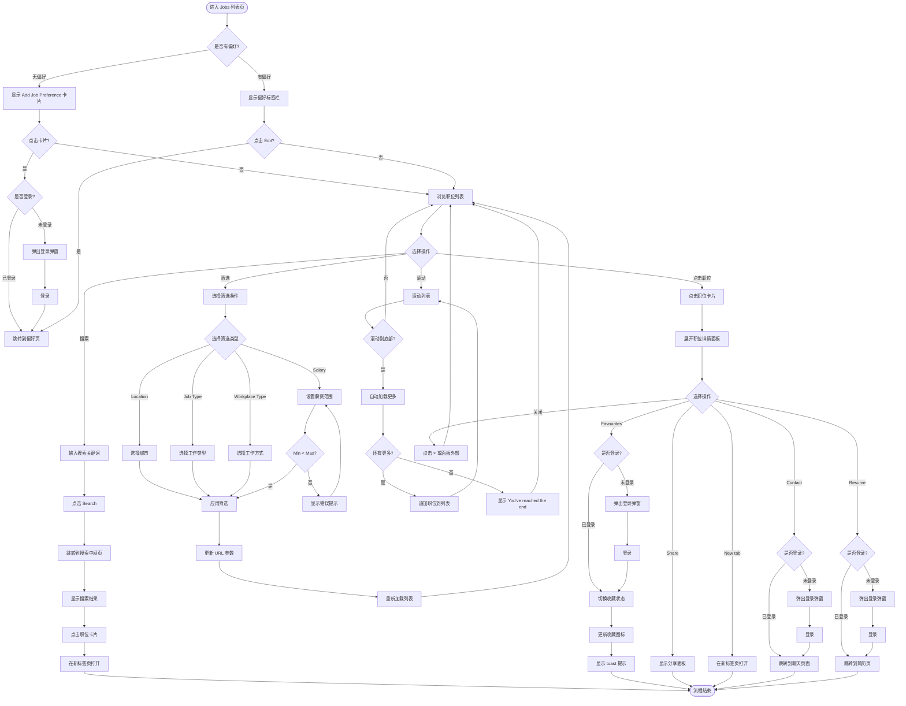

# 招聘列表页业务流程

> **业务目标**：让求职者快速找到符合需求的职位，支持搜索、筛选、浏览、查看详情

---

## 1. 完整流程图

---

## 2. 详细步骤与观测点

### 步骤1：偏好状态判断
**页面位置**：Jobs 列表页顶部

**操作**：
- 无偏好：显示 Add Job Preference 卡片（位置：列表第一个位置）
- 有偏好：显示偏好标签栏（位置：搜索栏下方）

**观测点**：
- ✅ 未登录/已登录无偏好时，是否显示 Add Job Preference 卡片
- ✅ 卡片是否在列表第一个位置
- ✅ 已登录有偏好时，是否显示偏好标签栏
- ✅ 偏好标签是否显示所有已选的 Job Functions
- ✅ 是否显示 Edit 链接
- ✅ 点击 Edit 是否跳转到偏好页（URL含 `returnUrl`）

**验证方法**：
- 清除偏好，观察是否显示 Add Job Preference 卡片
- 设置偏好后，观察是否显示偏好标签栏
- 点击 Edit，观察 URL 是否含 `returnUrl`

**关联规则**：[招聘列表页规则.md - 3.6 偏好标签栏规则](../../业务规则库/招聘模块/招聘列表页规则.md#36-偏好标签栏规则)

---

### 步骤2：搜索职位
**页面位置**：Jobs 列表页

**操作**：
1. 聚焦搜索框（显示 Recent Searches 历史记录）
2. 输入关键词（支持空搜索）
3. 点击 Search 按钮
4. 跳转到搜索中间页（URL含 `keyword=xxx`）
5. 查看搜索结果（可筛选、可点击职位卡片）

**观测点**：
- ✅ 聚焦搜索框，是否显示 Recent Searches
- ✅ 历史记录是否最多显示7条
- ✅ 点击历史记录，是否触发对应关键词搜索
- ✅ 点击 Search，是否跳转到搜索中间页
- ✅ URL 是否包含 `keyword=xxx` 参数
- ✅ 空搜索是否允许（URL 包含 `keyword=`）
- ✅ 搜索中间页是否无右侧详情面板
- ✅ 搜索中间页是否无 Reset 按钮
- ✅ 搜索无结果时是否显示空状态提示

**验证方法**：
- 聚焦搜索框，观察是否显示历史记录
- 输入关键词，点击 Search，观察是否跳转到搜索中间页
- 搜索中间页点击职位卡片，观察是否在新标签页打开

**关联规则**：[招聘列表页规则.md - 3.1 搜索规则](../../业务规则库/招聘模块/招聘列表页规则.md#31-搜索规则)

---

### 步骤3：筛选职位
**页面位置**：Jobs 列表页

**操作**：
1. 选择 Location（城市筛选，URL 路径变化）
2. 选择 Job Type（多选，URL 追加 `attr_60=1,2,3`）
3. 选择 Workplace Type（多选）
4. 设置 Salary（Min/Max 输入框，URL 追加 `lowestPrice`、`highestPrice`）
5. 应用筛选，重新加载列表

**观测点**：
- ✅ Location 筛选后，URL 路径是否变化（如 `/en/city-madrid/cate-jobs/`）
- ✅ Job Type 筛选后，URL 是否追加 `attr_60=1,2,3`
- ✅ Salary Min > Max 时，是否显示错误提示 "Max price must be higher than min price"
- ✅ 筛选后，列表是否重新加载
- ✅ 点击 Reset，是否清除所有筛选（保留搜索词 `keyword`）
- ✅ 筛选无结果时，是否显示空状态提示

**验证方法**：
- 选择城市，观察 URL 路径变化
- 选择 Job Type，观察 URL 参数变化
- 设置 Salary Min > Max，观察是否显示错误提示
- 点击 Reset，观察 URL 是否恢复为 `?iconSource=jobs`

**关联规则**：[招聘列表页规则.md - 3.2 筛选规则](../../业务规则库/招聘模块/招聘列表页规则.md#32-筛选规则)

---

### 步骤4：无限滚动加载
**页面位置**：Jobs 列表页

**操作**：
1. 滚动列表到底部
2. 自动触发加载（显示 loading 状态）
3. 加载完成后追加新职位到列表
4. 加载完毕显示 "You've reached the end"

**观测点**：
- ✅ 滚动到列表底部，是否自动触发加载
- ✅ 加载过程中，是否显示 loading 状态
- ✅ 加载完成后，是否追加新职位到列表
- ✅ 加载完毕，是否显示 "You've reached the end" 或空白
- ✅ 滚动加载时，URL 是否始终不变
- ❌ 是否无分页按钮（无 Previous/Next/页码）

**验证方法**：
- 滚动到底部，观察是否自动加载
- 观察 URL 是否不变
- 观察是否无分页按钮

**关联规则**：[招聘列表页规则.md - 3.3 列表加载规则](../../业务规则库/招聘模块/招聘列表页规则.md#33-列表加载规则)

---

### 步骤5：查看职位详情
**页面位置**：Jobs 列表页 / 搜索中间页

**操作**：
1. 列表页：点击职位卡片 → 右侧详情面板展开（URL不变）
2. 搜索中间页：点击职位卡片 → 在新标签页打开职位详情页

**观测点**：
- ✅ 列表页点击职位卡片，详情面板是否正确展开
- ✅ 详情面板是否在右侧固定位置
- ✅ 详情面板宽度是否固定（约占页面1/2）
- ✅ 职位信息是否完整显示（标题、薪资、标签、描述、要求、技能）
- ✅ 点击不同职位卡片，面板内容是否切换（不关闭面板）
- ✅ 点击 × 或面板外部，面板是否关闭
- ✅ URL 是否不变（不跳转页面）
- ✅ 搜索中间页点击职位卡片，是否在新标签页打开

**验证方法**：
- 列表页点击职位卡片，观察详情面板是否展开
- 点击不同职位卡片，观察面板内容是否切换
- 点击 ×，观察面板是否关闭
- 搜索中间页点击职位卡片，观察是否在新标签页打开

**关联规则**：[招聘列表页规则.md - 3.4 职位卡片规则](../../业务规则库/招聘模块/招聘列表页规则.md#34-职位卡片规则)

---

### 步骤6：详情面板操作
**页面位置**：职位详情面板

**操作**：
1. Contact：联系招聘方（未登录需先登录）
2. Favourites：收藏职位（未登录需先登录）
3. Share：分享职位（弹出分享面板）
4. Resume：创建/编辑简历（未登录需先登录）
5. New tab：在新标签页打开

**观测点**：
- ✅ 未登录点击 Contact/Favourites/Resume，是否弹出登录弹窗
- ✅ 登录成功后，是否正确跳转到对应页面
- ✅ 收藏状态切换后，图标是否正确更新（空心 ↔ 实心）
- ✅ 收藏成功，是否显示 toast "Added to favourites"
- ✅ 取消收藏，是否显示 toast "Removed from favourites"
- ✅ 点击 Share，是否弹出分享面板
- ✅ 点击 Copy Link，是否复制成功并显示 toast "Link copied"
- ✅ 点击 New tab，是否在新标签页打开
- ✅ 本人发布的职位，是否显示 Withdraw/Edit 按钮

**验证方法**：
- 未登录点击 Contact，观察是否弹出登录弹窗
- 点击 Favourites，观察图标是否切换
- 点击 Share，观察是否弹出分享面板
- 点击 New tab，观察是否在新标签页打开

**关联规则**：[职位详情规则.md - 3.2 操作按钮规则](../../业务规则库/招聘模块/职位详情规则.md#32-操作按钮规则)

---

## 3. 流程完整性验证清单

- [ ] 未登录/已登录无偏好时，是否显示 Add Job Preference 卡片
- [ ] 已登录有偏好时，是否显示偏好标签栏 + Edit 链接
- [ ] 搜索后是否跳转到搜索中间页（URL含 `keyword=xxx`）
- [ ] 筛选后 URL 参数是否正确更新
- [ ] 滚动到底部是否自动加载更多职位
- [ ] 加载完毕是否显示 "You've reached the end"
- [ ] 点击职位卡片，详情面板是否正确展开
- [ ] 未登录点击 Contact/Favourites/Resume 是否弹出登录弹窗
- [ ] 收藏状态切换后，图标是否正确更新
- [ ] 搜索中间页是否无右侧详情面板
- [ ] 搜索中间页是否无 Reset 按钮
- [ ] 搜索中间页点击职位卡片，是否在新标签页打开
- [ ] Salary Min > Max 时，是否显示错误提示
- [ ] 点击 Reset，是否清除所有筛选（保留搜索词）
- [ ] 筛选无结果时，是否显示空状态提示
- [ ] 所有错误提示文案正确

---

## 4. 关联文档

- [招聘业务全景](./招聘业务全景.md)
- [招聘列表页规则.md](../../业务规则库/招聘模块/招聘列表页规则.md)
- [职位详情规则.md](../../业务规则库/招聘模块/职位详情规则.md)

---

## 5. 变更历史

| 日期 | 版本 | 变更内容 | 变更人 |
|-----|------|---------|--------|
| 2026-03-24 | v1.0 | 初始版本 | AI |
| 2026-03-24 | v2.0 | 调整为5章结构，移除数据流转章节 | AI |
