# 简历管理业务流程

> **业务目标**：让求职者创建和编辑个人简历，用于求职匹配

---

## 1. 完整流程图

```mermaid
graph TD
    Start([点击 Resume 按钮]) --> CheckLogin{是否登录?}
    
    CheckLogin -->|未登录| ShowLoginDialog[弹出登录弹窗]
    CheckLogin -->|已登录| CheckResume{是否有简历?}
    
    ShowLoginDialog --> Login[登录]
    Login --> CheckResume
    
    CheckResume -->|无简历| ResumeAddPage[进入 resume/add 页面]
    CheckResume -->|有简历| ResumeViewPage[进入 resume 页面]
    
    ResumeAddPage --> ShowStep1[Step 1: Personal Information]
    ShowStep1 --> SelectAvatar[选择头像]
    SelectAvatar --> ChooseAvatarType{选择类型}
    
    ChooseAvatarType -->|预设头像| SelectPreset[选择预设头像]
    ChooseAvatarType -->|上传头像| UploadCustom[上传自定义头像]
    
    SelectPreset --> FillFirstName
    UploadCustom --> ValidateUpload{验证上传}
    ValidateUpload -->|格式/大小错误| ShowUploadError[显示错误提示]
    ValidateUpload -->|通过| ShowPreview[显示预览]
    ShowUploadError --> UploadCustom
    ShowPreview --> FillFirstName
    
    FillFirstName[填写 First Name] --> UpdateCounter1[更新字符计数 X/100]
    UpdateCounter1 --> FillLastName[填写 Last Name]
    FillLastName --> UpdateCounter2[更新字符计数 X/100]
    UpdateCounter2 --> CheckEmailLocation[Email/Location 自动预填]
    CheckEmailLocation --> SelectGender[选择 Gender]
    SelectGender --> CheckStep1Required{必填项已填?}
    
    CheckStep1Required -->|否| DisableContinue[Continue 按钮禁用]
    CheckStep1Required -->|是| EnableContinue[Continue 按钮可点击]
    
    DisableContinue --> FillFirstName
    EnableContinue --> ClickContinue[点击 Continue]
    
    ClickContinue --> ShowStep2[Step 2: Recent Experience]
    ShowStep2 --> CheckWorkExp{是否有工作经验?}
    
    CheckWorkExp -->|否| ToggleNoExp[开启 I have no work experience]
    CheckWorkExp -->|是| SelectJobFunction[选择 Job Function]
    
    ToggleNoExp --> HideWorkFields[隐藏工作经验字段]
    HideWorkFields --> SelectEducationLevel
    
    SelectJobFunction --> SelectWorkFrom[选择 From 日期]
    SelectWorkFrom --> CheckCurrentWork{是否在职?}
    
    CheckCurrentWork -->|是| CheckCurrentWorkBox[勾选 I currently work here]
    CheckCurrentWork -->|否| SelectWorkTo[选择 To 日期]
    
    CheckCurrentWorkBox --> ShowPresent[显示 Present]
    ShowPresent --> SelectEducationLevel
    SelectWorkTo --> SelectEducationLevel
    
    SelectEducationLevel[选择 Education Level] --> SelectEduFrom[选择 Education From]
    SelectEduFrom --> SelectEduTo[选择 Education To]
    SelectEduTo --> CheckStep2Required{必填项已填?}
    
    CheckStep2Required -->|否| DisableDone[Done 按钮禁用]
    CheckStep2Required -->|是| EnableDone[Done 按钮可点击]
    
    DisableDone --> CheckWorkExp
    EnableDone --> ClickDone[点击 Done]
    
    ClickDone --> SubmitResume[提交简历]
    SubmitResume --> SaveToDb[保存到数据库]
    SaveToDb --> RedirectAway[跳转离开]
    RedirectAway --> End([流程结束])
    
    ResumeViewPage --> ShowResumeDetail[显示简历详情]
    ShowResumeDetail --> DisplaySections[显示各区域]
    DisplaySections --> PersonalInfo[Personal Info]
    PersonalInfo --> PersonalSummary[Personal Summary]
    PersonalSummary --> WorkExperience[Work Experience]
    WorkExperience --> EducationBackground[Education Background]
    EducationBackground --> Language[Language]
    
    Language --> ClickEditSection{点击 Edit?}
    ClickEditSection -->|是| EditSection[编辑对应区域]
    ClickEditSection -->|否| End
    EditSection --> SaveChanges[保存修改]
    SaveChanges --> UpdateDb[更新数据库]
    UpdateDb --> RefreshView[刷新详情页]
    RefreshView --> End
```

---

## 2. 详细步骤与观测点

### 步骤1：入口判断
**页面位置**：Jobs 列表页 → 职位详情面板

**操作**：
- 点击 Resume 按钮
- 未登录 → 弹出登录弹窗
- 已登录 → 检查是否有简历

**观测点**：
- ✅ 未登录点击 Resume，是否弹出登录弹窗
- ✅ 登录成功后，是否跳转到正确页面（resume/add 或 resume）
- ✅ 无简历，是否进入 resume/add 页面（两步式创建流程）
- ✅ 有简历，是否进入 resume 页面（简历详情展示页）
- ✅ URL 是否正确（resume/add 或 resume）

**验证方法**：
- 未登录点击 Resume，观察是否弹出登录弹窗
- 登录后，观察跳转到哪个页面
- 检查 URL 是否正确

**关联规则**：[简历管理规则.md - 3.4 权限规则](../../业务规则库/招聘模块/简历管理规则.md#34-权限规则)

---

### 步骤2：Step 1 - Personal Information
**页面位置**：resume/add 页面

**操作**：
1. 选择头像（10个预设头像 或 上传自定义头像）
2. 填写 First Name（必填，1-100字符，显示字符计数 X/100）
3. 填写 Last Name（必填，1-100字符，显示字符计数 X/100）
4. Email 自动预填（登录邮箱，不可编辑）
5. Current Location 自动预填（可修改，下拉选择国家）
6. 选择 Gender（可选，下拉选择 Male/Female/Other）
7. 点击 Continue 进入 Step 2

**观测点**：
- ✅ 是否显示10个预设头像
- ✅ 点击 Upload，是否打开文件选择器
- ✅ 上传非 JPG/PNG 格式，是否显示格式错误
- ✅ 上传超过10MB，是否显示大小错误
- ✅ 上传成功，是否显示预览
- ✅ 输入文本，字符计数是否实时更新（X/100）
- ✅ Email 是否自动预填登录邮箱（灰色背景，不可编辑）
- ✅ Current Location 是否自动预填对应国家（可修改）
- ✅ First Name + Last Name 都填写后，Continue 按钮是否可点击
- ❌ 任一必填项未填写，Continue 按钮是否禁用（灰色不可点击）

**验证方法**：
- 上传不同格式和大小的图片，观察是否正确验证
- 输入文本，观察字符计数是否更新
- 检查 Email 是否不可编辑
- 填写必填项，观察 Continue 按钮状态

**关联规则**：[简历管理规则.md - 3.1 输入规则（Step 1）](../../业务规则库/招聘模块/简历管理规则.md#31-输入规则step-1---personal-information)

---

### 步骤3：Step 2 - Recent Experience
**页面位置**：resume/add 页面 - Step 2

**操作**：
1. **Latest Work Experience**：
   - 选择 Job Function（必填*，两级级联下拉）
   - 选择 From 日期（必填*，年月滚动选择器，1925-2036）
   - 选择 To 日期（默认 "Present"，可取消勾选 "I currently work here" 后选择）
   - 或开启 "I have no work experience" 开关（隐藏工作经验字段）
2. **Education Experience**：
   - 选择 Education Level（必填，单级下拉）
   - 选择 From 日期（必填，年月滚动选择器）
   - 选择 To 日期（必填，年月滚动选择器）
3. 点击 Done 提交

**观测点**：
- ✅ 默认是否显示工作经验字段
- ✅ 开启 "I have no work experience" 开关，是否隐藏工作经验字段
- ✅ Job Function 点击下拉，是否显示两级级联下拉
- ✅ 日期选择器年份范围是否为 1925-2036
- ✅ 月份范围是否为 1-12（January-December）
- ✅ "I currently work here" 默认是否已勾选（`img[alt="checked"]` 可见）
- ✅ 勾选时，Work To 是否显示 "Present"（灰色文本，不可编辑）
- ✅ 取消勾选，Work To 是否变为可编辑，显示 "YYYY-MM" 占位符
- ✅ Done 按钮激活条件是否正确（场景1：有工作经验；场景2：无工作经验）
- ❌ 任一必填项未填写，Done 按钮是否禁用（灰色不可点击）

**验证方法**：
- 开启/关闭 "I have no work experience" 开关，观察字段显示/隐藏
- 点击日期选择器，观察年份和月份范围
- 勾选/取消勾选 "I currently work here"，观察 Work To 字段变化
- 填写必填项，观察 Done 按钮状态

**关联规则**：[简历管理规则.md - 3.2 输入规则（Step 2）](../../业务规则库/招聘模块/简历管理规则.md#32-输入规则step-2---recent-experience)

---

### 步骤4：提交简历
**页面位置**：resume/add 页面 - Step 2

**操作**：
1. 点击 Done
2. 提交简历数据
3. 保存到数据库（4张表：resume、resume_person_info、resume_work_experience、resume_education）
4. 跳转离开 resume/add 页面

**观测点**：
- ✅ 点击 Done，是否提交请求
- ✅ 提交成功后，是否跳转离开 resume/add 页面
- ✅ 数据是否正确保存到数据库
- ✅ 重新进入简历页面时，数据是否自动回显最新保存的数据

**验证方法**：
- 点击 Done，观察是否跳转离开
- 重新进入简历页面，观察数据是否自动回显

**关联规则**：[简历管理规则.md - 3.5 业务约束](../../业务规则库/招聘模块/简历管理规则.md#35-业务约束)

---

### 步骤5：简历详情页（已有简历）
**页面位置**：resume 页面

**操作**：
1. 进入 resume 页面（简历详情展示页）
2. 显示各区域：Personal Info、Personal Summary、Work Experience、Education Background、Language
3. 点击各区域的 Edit 按钮编辑对应内容
4. 点击 + 按钮添加新内容（Work Experience、Education、Language）
5. 保存修改

**观测点**：
- ✅ 进入 resume 页面，是否显示简历详情
- ✅ 是否显示所有区域（Personal Info、Personal Summary、Work Experience、Education Background、Language）
- ✅ 点击各区域的 Edit 按钮，是否显示编辑表单
- ✅ 点击 + 按钮，是否显示添加表单
- ✅ 填写/修改数据后，点击 Save，是否保存成功
- ✅ 保存成功后，是否刷新详情页，显示最新数据

**验证方法**：
- 进入 resume 页面，观察是否显示所有区域
- 点击 Edit 按钮，观察是否显示编辑表单
- 保存后，观察是否刷新详情页

**关联规则**：[简历管理规则.md - 3.7 数据回显规则](../../业务规则库/招聘模块/简历管理规则.md#37-数据回显规则)

---

### 步骤6：未保存变更处理
**页面位置**：resume/add 页面

**操作**：
1. 有未保存变更时，点击 Back/Done
2. 弹出 "Unsaved Changes" 确认对话框
3. 选择确认离开 或 取消

**观测点**：
- ✅ 有未保存变更时，点击 Back/Done，是否弹出确认对话框
- ✅ 对话框文案是否为 "You have unsaved changes. Are you sure you want to leave?"
- ✅ 点击确认，是否丢弃变更并离开页面
- ✅ 点击取消，是否关闭对话框，继续编辑

**验证方法**：
- 填写表单但不提交，点击 Back，观察是否弹出确认对话框
- 点击确认/取消，观察行为是否正确

**关联规则**：[简历管理规则.md - 4. 错误处理](../../业务规则库/招聘模块/简历管理规则.md#4-错误处理)

---

## 3. 流程完整性验证清单

- [ ] 未登录点击 Resume 是否弹出登录弹窗
- [ ] 登录成功后是否跳转到正确页面（resume/add 或 resume）
- [ ] Step 1 必填项未填写时，Continue 按钮是否禁用
- [ ] Step 2 必填项未填写时，Done 按钮是否禁用
- [ ] 提交成功后是否跳转离开 resume/add 页面
- [ ] 数据是否正确保存到数据库（4张表）
- [ ] 重新进入简历页面时，数据是否自动回显
- [ ] 头像上传是否验证格式和大小
- [ ] Email 是否自动预填登录邮箱（不可编辑）
- [ ] Current Location 是否自动预填对应国家（可修改）
- [ ] 字符计数是否实时更新（X/100）
- [ ] "I currently work here" 勾选时，To 是否显示 "Present"（不可编辑）
- [ ] "I have no work experience" 开启时，是否隐藏工作经验字段
- [ ] 日期选择器年份范围是否为 1925-2036
- [ ] 有未保存变更时，点击 Back/Done 是否弹出确认对话框
- [ ] 所有错误提示文案正确

---

## 4. 关联文档

- [招聘业务全景](./招聘业务全景.md)
- [简历管理规则.md](../../业务规则库/招聘模块/简历管理规则.md)

---

## 5. 变更历史

| 日期 | 版本 | 变更内容 | 变更人 |
|-----|------|---------|--------|
| 2026-03-24 | v1.0 | 初始版本 | AI |
| 2026-03-24 | v2.0 | 调整为5章结构，移除数据流转章节 | AI |
