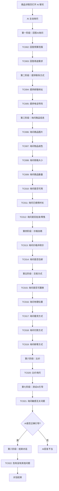

# 二手商品 AI 聊天业务流程

> **业务目标**：通过 AI 智能对话，帮助买家快速了解二手商品信息，提升咨询效率和交易促成率

## 1. 完整流程图

> **要求**：专注于本业务域内的详细步骤，**不包含**跨域交互的复杂逻辑分支（跨域逻辑统一在业务全景文档中展示）。

## 2. 详细步骤与观测点

### 步骤1：AI 主动询问用户需求
- **页面位置**：商品详情页 → AI 聊天窗口
- **操作流程**：
  1. 用户打开商品详情页的 AI 聊天窗口
  2. AI 主动发起询问：预算、用途
  3. 用户依次回答 AI 的问题
- **观测点**：
  - ✅ P0：AI 主动询问预算范围，引导用户提供具体金额
  - ✅ P0：AI 主动询问用途需求，了解使用场景和面积
  - ✅ P1：AI 根据用户回答记录需求，后续回复考虑这些因素
- **验证方法**：
  - 检查 AI 是否主动发起 2 个核心问题
  - 验证 AI 回复是否基于用户提供的需求信息
- **关联规则**：[AI 聊天功能规则 - 3.1 AI 主动询问规则](../../业务规则库/消息模块/AI聊天功能规则.md#31-ai-主动询问规则)

### 步骤2：用户提供联系方式
- **页面位置**：AI 聊天窗口
- **操作流程**：
  1. 用户主动提供邮箱地址
  2. 用户提供电话号码
  3. AI 确认收到联系方式
- **观测点**：
  - ✅ P0：用户提供邮箱地址，AI 正确识别并确认
  - ✅ P0：用户提供电话号码，AI 正确识别并确认
  - ✅ P1：AI 表示会转达给卖家，方便后续联系
- **验证方法**：
  - 发送邮箱和电话，检查 AI 是否确认收到
  - 验证 AI 回复是否包含"已记录"或"会转达"等确认信息
- **关联规则**：[AI 聊天功能规则 - 3.2 联系方式交换规则](../../业务规则库/消息模块/AI聊天功能规则.md#32-联系方式交换规则)

### 步骤3：询问商品详细信息
- **页面位置**：AI 聊天窗口
- **操作流程**：
  1. 用户依次询问：商品图片、成色、规格、数量、是否可用、使用时长、批发零售
  2. AI 根据商品详情页字段回复
- **观测点**：
  - ✅ P0：AI 回复是否有更多照片，提供不同角度图片
  - ✅ P0：AI 回复物品成色（是否有划痕、损坏）
  - ✅ P0：AI 回复规格大小（尺寸、容量、功率）
  - ✅ P1：AI 回复商品数量和是否支持批发
  - ✅ P0：AI 回复功能是否正常（制冷效果等）
  - ✅ P1：AI 回复已使用时长和新旧程度
  - ✅ P1：AI 回复批发/零售政策
- **验证方法**：
  - 对比 AI 回复与商品详情页字段
  - 验证所有商品信息的准确性和完整性
- **关联规则**：[AI 聊天功能规则 - 3.4 用户主动咨询规则（二手商品场景）](../../业务规则库/消息模块/AI聊天功能规则.md#34-用户主动咨询规则二手商品场景)

### 步骤4：价格协商
- **页面位置**：AI 聊天窗口
- **操作流程**：
  1. 用户询问价格并尝试砍价
  2. 用户询问是否包邮
  3. AI 引导用户与卖家私聊协商或提供标准回复
- **观测点**：
  - ✅ P0：AI 回复当前价格
  - ✅ P0：AI 对砍价请求的处理（引导私聊或给出卖家底价）
  - ✅ P0：AI 回复配送费用或是否包邮
- **验证方法**：
  - 检查 AI 是否正确回复价格信息
  - 验证 AI 对价格协商的引导是否合理
- **关联规则**：[AI 聊天功能规则 - 3.4 用户主动咨询规则（二手商品场景）](../../业务规则库/消息模块/AI聊天功能规则.md#34-用户主动咨询规则二手商品场景)

### 步骤5：交易方式详情
- **页面位置**：AI 聊天窗口
- **操作流程**：
  1. 用户依次询问：置换、地理位置、看货方式、付款方式、邮寄方式
  2. AI 根据商品详情或引导联系卖家
- **观测点**：
  - ✅ P2：AI 对置换交易的处理（引导私聊协商）
  - ✅ P1：AI 回复卖家地理位置（城市、区域）
  - ✅ P1：AI 引导用户联系卖家安排看货时间
  - ✅ P1：AI 回复付款方式（现金、转账、平台支付）
  - ✅ P1：AI 回复邮寄方式（快递、自提、安装服务）
- **验证方法**：
  - 检查 AI 是否正确提供地理位置信息
  - 验证 AI 对交易细节的引导是否合理
- **关联规则**：[AI 聊天功能规则 - 3.4 用户主动咨询规则（二手商品场景）](../../业务规则库/消息模块/AI聊天功能规则.md#34-用户主动咨询规则二手商品场景)

### 步骤6：比价确认
- **页面位置**：AI 聊天窗口
- **操作流程**：
  1. 用户提出看到其他类似商品价格更低
  2. AI 强调本商品优势或引导咨询卖家
- **观测点**：
  - ✅ P2：AI 正确理解用户的比价意图
  - ✅ P2：AI 强调本商品优势（成色、品牌、服务等）
  - ✅ P2：AI 引导用户与卖家协商或解释价格差异
- **验证方法**：
  - 检查 AI 是否正面回应比价问题
  - 验证 AI 是否能合理解释价格优势
- **关联规则**：[AI 聊天功能规则 - 3.4 用户主动咨询规则（二手商品场景）](../../业务规则库/消息模块/AI聊天功能规则.md#34-用户主动咨询规则二手商品场景)

### 步骤7：测试 AI 引导能力
- **页面位置**：AI 聊天窗口
- **操作流程**：
  1. 用户询问与商品无关的敏感问题（如宗教信仰）
  2. AI 识别并礼貌引导回商品话题
- **观测点**：
  - ✅ P0：AI 正确识别无关问题
  - ✅ P0：AI 礼貌引导用户回到商品话题
  - ✅ P1：AI 不回答敏感问题，保持专业
- **验证方法**：
  - 发送敏感无关问题，检查 AI 是否拒答并引导
  - 验证 AI 回复的礼貌性和专业性
- **关联规则**：[AI 聊天功能规则 - 3.6 敏感问题处理规则](../../业务规则库/消息模块/AI聊天功能规则.md#36-敏感问题处理规则)

### 步骤8：结束对话
- **页面位置**：AI 聊天窗口
- **操作流程**：
  1. 用户表示没有其他问题
  2. AI 礼貌回应，期待后续联系
- **观测点**：
  - ✅ P1：AI 礼貌结束对话
  - ✅ P1：AI 表示感谢和期待后续联系
- **验证方法**：
  - 检查 AI 是否礼貌回应用户的结束语
- **关联规则**：[AI 聊天功能规则 - 3.7 对话结束规则](../../业务规则库/消息模块/AI聊天功能规则.md#37-对话结束规则)

## 3. 流程完整性验证清单

- [ ] AI 主动询问预算范围
- [ ] AI 主动询问用途需求
- [ ] 用户提供邮箱地址，AI 确认收到
- [ ] 用户提供电话号码，AI 确认收到
- [ ] AI 回复商品图片信息
- [ ] AI 回复物品成色
- [ ] AI 回复规格大小
- [ ] AI 回复商品数量和批发政策
- [ ] AI 回复功能是否正常
- [ ] AI 回复已使用时长
- [ ] AI 回复当前价格
- [ ] AI 处理砍价请求（引导私聊或给出底价）
- [ ] AI 回复配送费用或是否包邮
- [ ] AI 处理置换交易请求
- [ ] AI 回复卖家地理位置
- [ ] AI 引导用户联系卖家安排看货
- [ ] AI 回复付款方式
- [ ] AI 回复邮寄方式
- [ ] AI 正确回应比价问题
- [ ] AI 正确识别并引导敏感无关问题
- [ ] AI 礼貌结束对话

## 4. 关联文档

- [消息业务全景](./消息业务全景.md)
- [AI 聊天功能规则](../../业务规则库/消息模块/AI聊天功能规则.md)

## 5. 变更历史
| 日期 | 版本 | 变更内容 | 变更人 |
|------|------|---------|--------|
| 2026-04-27 | v1.0 | 初始版本，基于 README_MARKETPLACE_AC.md 生成 | System |
