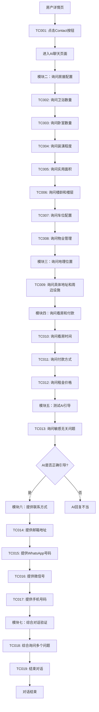

# 房产 AI 聊天业务流程

> **业务目标**：通过 AI 智能对话，帮助租户快速了解房产信息，提升咨询效率和响应速度

## 1. 完整流程图

> **要求**：专注于本业务域内的详细步骤，**不包含**跨域交互的复杂逻辑分支（跨域逻辑统一在业务全景文档中展示）。

## 2. 详细步骤与观测点

### 步骤1：进入 AI 聊天页面
- **页面位置**：房产详情页 → Contact 按钮
- **操作流程**：
  1. 用户打开房产详情页
  2. 点击页面中的 Contact 按钮
  3. 跳转到 AI 聊天页面
- **观测点**：
  - ✅ P0：Contact 按钮点击后能成功进入聊天页面
  - ✅ P0：聊天页面正确加载，显示房产信息
- **验证方法**：
  - 检查是否成功跳转到聊天页面
  - 验证页面元素是否完整加载
- **关联规则**：[AI 聊天功能规则 - 3.1 AI 主动询问规则](../../业务规则库/消息模块/AI聊天功能规则.md#31-ai-主动询问规则)

### 步骤2：询问房屋配置
- **页面位置**：AI 聊天窗口
- **操作流程**：
  1. 用户依次询问：卫浴数量、卧室数量、装潢程度、面积、楼龄楼层、车位、物业管理
  2. AI 根据房产详情页配置字段回复
- **观测点**：
  - ✅ P0：AI 回复卫浴数量信息（TC002）
  - ✅ P0：AI 回复卧室数量信息（TC003）
  - ✅ P1：AI 回复装潢程度和家具配置（TC004）
  - ✅ P1：AI 回复实用面积（平方米）（TC005）
  - ✅ P1：AI 回复楼龄和楼层信息（TC006）
  - ✅ P1：AI 回复车位配置（是否包含）（TC007）
  - ✅ P1：AI 回复物业管理和维护费用（TC008）
- **验证方法**：
  - 对比 AI 回复与房产详情页配置字段
  - 验证所有配置信息的准确性和完整性
- **关联规则**：[AI 聊天功能规则 - 3.3 用户主动咨询规则（房产场景）](../../业务规则库/消息模块/AI聊天功能规则.md#33-用户主动咨询规则房产场景)

### 步骤3：询问地理位置
- **页面位置**：AI 聊天窗口
- **操作流程**：
  1. 用户询问具体地址、周边设施、交通情况
  2. AI 根据房产详情页地址字段回复
- **观测点**：
  - ✅ P0：AI 回复具体地址信息（TC009）
  - ✅ P0：AI 提供周边设施信息（商店、大学、交通）
  - ✅ P1：AI 回复准确，基于房产详情页数据
- **验证方法**：
  - 对比 AI 回复与房产详情页地址字段
  - 验证周边设施信息的准确性
- **关联规则**：[AI 聊天功能规则 - 3.3 用户主动咨询规则（房产场景）](../../业务规则库/消息模块/AI聊天功能规则.md#33-用户主动咨询规则房产场景)

### 步骤4：询问看房和付款详情
- **页面位置**：AI 聊天窗口
- **操作流程**：
  1. 用户询问看房时间（TC010）
  2. 用户询问付款方式（TC011）
  3. 用户询问租金价格（TC012）
  4. AI 根据房产详情或引导联系房东
- **观测点**：
  - ✅ P0：AI 引导用户留下联系方式，由房东安排看房
  - ✅ P0：AI 提供付款方式相关信息或引导咨询房东
  - ✅ P0：AI 回复每周/每月租金价格
- **验证方法**：
  - 检查 AI 是否正确提供租金价格
  - 验证 AI 对看房时间和付款方式的引导是否合理
- **关联规则**：[AI 聊天功能规则 - 3.3 用户主动咨询规则（房产场景）](../../业务规则库/消息模块/AI聊天功能规则.md#33-用户主动咨询规则房产场景)

### 步骤5：测试 AI 引导能力
- **页面位置**：AI 聊天窗口
- **操作流程**：
  1. 用户询问与房产无关的敏感问题（如宗教信仰）（TC013）
  2. AI 识别并礼貌引导回房产话题
- **观测点**：
  - ✅ P1：AI 正确识别无关问题
  - ✅ P1：AI 礼貌引导用户回到房产话题
  - ✅ P1：AI 不回答敏感问题，保持专业
- **验证方法**：
  - 发送敏感无关问题，检查 AI 是否拒答并引导
  - 验证 AI 回复的礼貌性和专业性
- **关联规则**：[AI 聊天功能规则 - 3.6 敏感问题处理规则](../../业务规则库/消息模块/AI聊天功能规则.md#36-敏感问题处理规则)

### 步骤6：提供联系方式
- **页面位置**：AI 聊天窗口
- **操作流程**：
  1. 用户提供邮箱地址（优先联系方式）（TC014）
  2. 用户提供 WhatsApp 号码（TC015）
  3. 用户提供微信号（TC016）
  4. 用户提供手机号码（最后联系方式）（TC017）
  5. AI 确认收到联系方式
- **观测点**：
  - ✅ P0：用户提供邮箱地址，AI 正确识别并确认
  - ✅ P1：用户提供 WhatsApp 号码，AI 正确识别并确认
  - ✅ P1：用户提供微信号，AI 正确识别并确认
  - ✅ P2：用户提供电话号码，AI 正确识别并确认
  - ✅ P0：AI 表示会转达给房东，方便后续联系
- **验证方法**：
  - 发送不同类型的联系方式，检查 AI 是否都能正确识别
  - 验证 AI 回复是否包含"已记录"或"会转达"等确认信息
- **关联规则**：[AI 聊天功能规则 - 3.2 联系方式交换规则](../../业务规则库/消息模块/AI聊天功能规则.md#32-联系方式交换规则)

### 步骤7：综合对话验证
- **页面位置**：AI 聊天窗口
- **操作流程**：
  1. 用户一次性询问多个问题（租赁条款、水电、宠物政策）（TC018）
  2. 用户表示没有其他问题（TC019）
  3. AI 综合回复并礼貌结束对话
- **观测点**：
  - ✅ P0：AI 能够理解并回答多个问题
  - ✅ P0：AI 回复完整，覆盖用户提出的所有要点
  - ✅ P1：AI 对不确定的信息引导用户咨询房东
  - ✅ P1：AI 礼貌结束对话
- **验证方法**：
  - 检查 AI 是否回答了所有子问题
  - 验证 AI 回复的准确性和完整性
  - 检查 AI 是否礼貌回应用户的结束语
- **关联规则**：[AI 聊天功能规则 - 3.5 AI 回复质量规则](../../业务规则库/消息模块/AI聊天功能规则.md#35-ai-回复质量规则)、[AI 聊天功能规则 - 3.7 对话结束规则](../../业务规则库/消息模块/AI聊天功能规则.md#37-对话结束规则)

## 3. 流程完整性验证清单

- [ ] Contact 按钮点击后能成功进入聊天页面
- [ ] AI 回复卫浴数量信息
- [ ] AI 回复卧室数量信息
- [ ] AI 回复装潢程度和家具配置
- [ ] AI 回复实用面积
- [ ] AI 回复楼龄和楼层
- [ ] AI 回复车位配置
- [ ] AI 回复物业管理信息
- [ ] AI 回复具体地址和周边设施信息
- [ ] AI 引导用户联系房东安排看房
- [ ] AI 提供付款方式相关信息
- [ ] AI 回复租金价格
- [ ] AI 正确识别并引导敏感无关问题
- [ ] AI 正确接收并回复邮箱地址
- [ ] AI 正确接收并回复 WhatsApp 号码
- [ ] AI 正确接收并回复微信号
- [ ] AI 正确接收并回复手机号码
- [ ] AI 综合回答租赁条款、水电、宠物政策
- [ ] AI 礼貌结束对话

## 4. 关联文档

- [消息业务全景](./消息业务全景.md)
- [AI 聊天功能规则](../../业务规则库/消息模块/AI聊天功能规则.md)

## 5. 变更历史
| 日期 | 版本 | 变更内容 | 变更人 |
|------|------|---------|--------|
| 2026-04-27 | v1.0 | 初始版本，基于 README_PROPERTY_CHAT.md 生成 | System |
| 2026-04-27 | v1.1 | 更新测试流程，从17条用例增至19条，新增进入聊天页面、卫浴数量、装潢程度、WhatsApp和微信联系方式用例，删除AI主动询问阶段 | System |
