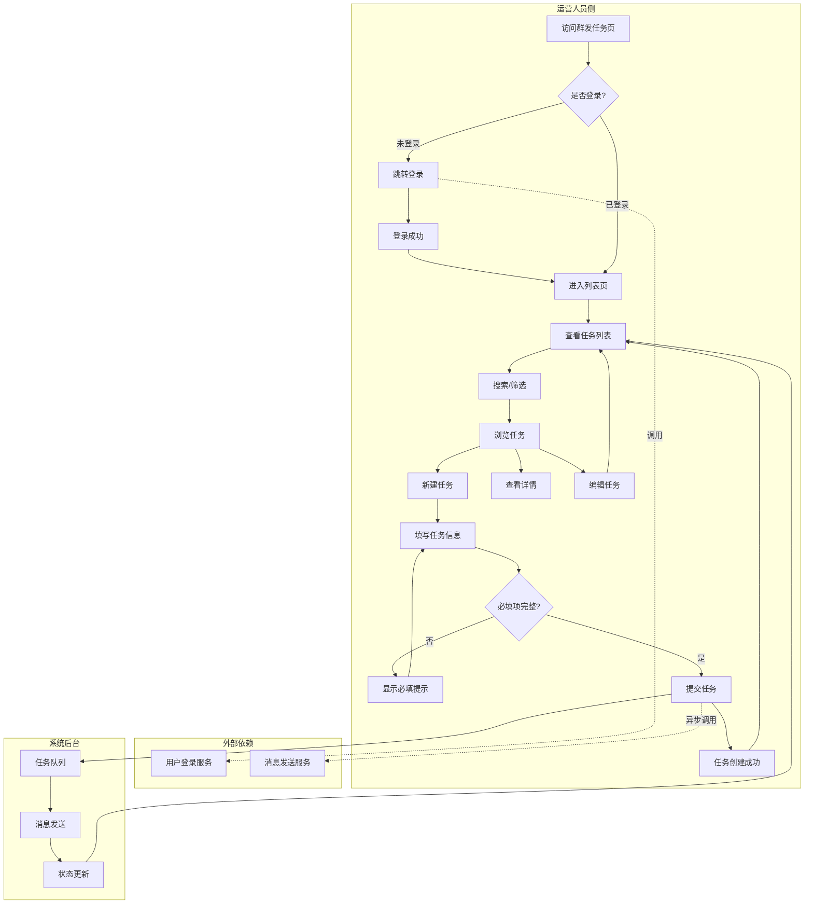
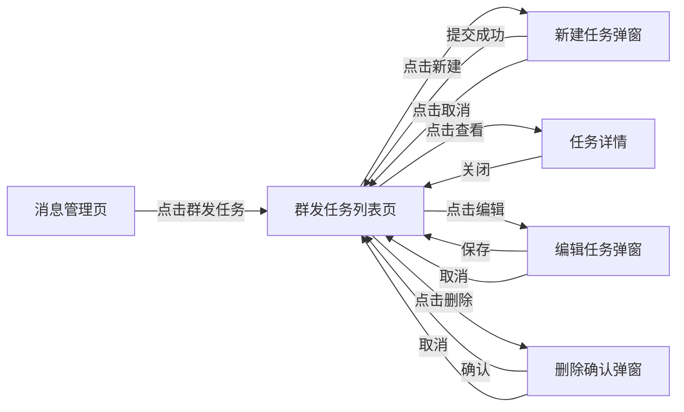
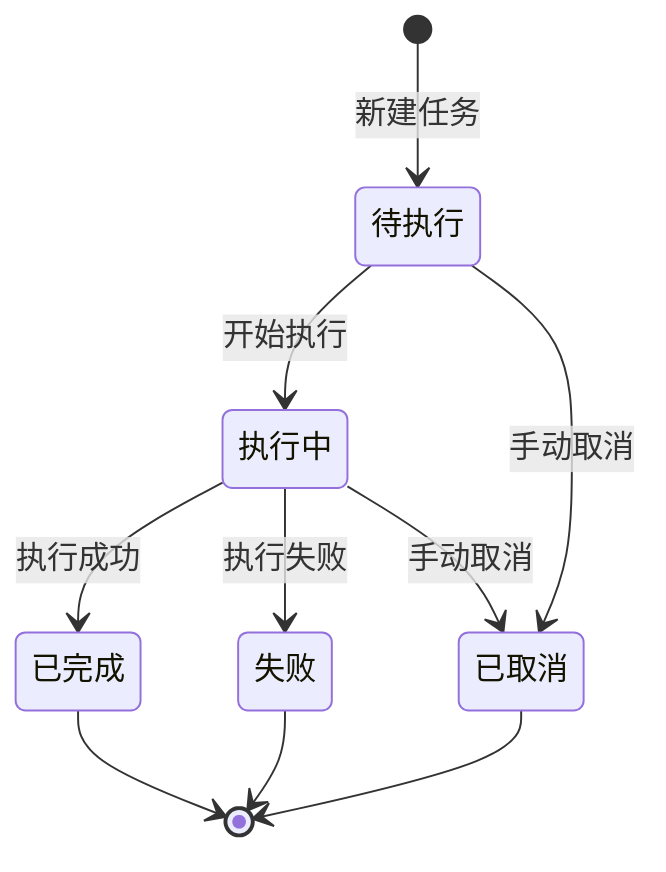

# 消息业务域 - 业务全景

## 1. 业务定位
**消息业务域**是 Vidflow 平台的核心管理功能之一，为运营人员提供群发消息管理工具，支持批量消息发送、任务状态跟踪、历史记录查询等能力。

**业务价值**：
- 为运营/管理员提供高效的消息群发工具，实现用户触达
- 支持任务管理、状态跟踪、历史查询，提升运营效率
- 提供搜索、筛选、分页等列表管理能力

**目标用户**：
- **运营人员/管理员**：创建、管理、查看群发任务
- **系统管理员**：查看和管理所有群发任务（权限依实际产品设计）

## 2. 业务范围

### 2.1 功能覆盖
| 功能模块 | 说明 | 核心能力 |
|---------|------|---------|
| 群发任务列表 | 任务浏览与管理 | 搜索、筛选（状态/时间）、分页 |
| 新建群发任务 | 创建新消息群发任务 | 必填项校验、防重复提交 |
| 任务操作 | 任务管理操作 | 查看详情、编辑、取消 |
| 状态管理 | 任务状态流转 | 待执行、执行中、已完成、失败等状态 |

### 2.2 地域覆盖
- Vidflow 平台（具体站点覆盖待补充）

### 2.3 用户角色
| 角色 | 权限 | 说明 |
|-----|------|------|
| 未登录 | 无权限 | 跳转登录页 |
| 已登录用户 | 查看、创建、管理自己的任务 | 权限范围依实际产品设计 |
| 管理员 | 查看、管理所有任务 | 最高权限 |

## 3. 业务流程全景图

> **要求**：全景图详细展示跨域交互与依赖的逻辑分支。

## 4. 核心业务流程概览

### 4.1 群发任务列表浏览流程
**业务目标**：让运营人员快速查找和浏览群发任务历史记录

**核心步骤**：
1. 登录并进入群发任务列表页
2. 查看默认列表展示（有数据或空状态）
3. 使用搜索框按任务名称/关键词搜索
4. 使用筛选器按状态（待执行/执行中/已完成/失败）或时间范围筛选
5. 切换分页或调整每页条数
6. 点击任务查看详情

**关键观测点**：
- ✅ 列表默认展示是否包含任务名、状态、创建时间等字段
- ✅ 搜索结果是否准确匹配关键词
- ✅ 筛选结果是否符合选中条件
- ✅ 分页切换后列表内容是否正确更新
- ✅ 空状态是否有引导文案和操作入口

**详细流程文档**：本文档 2. 完整流程图 - 列表浏览分支

---

### 4.2 新建群发任务流程
**业务目标**：帮助运营人员快速创建群发消息任务

**核心步骤**：
1. 点击「新建任务」按钮
2. 在弹窗中填写必填项（任务名称、发送对象、内容等）
3. 点击提交/确定
4. 等待提交成功，弹窗关闭
5. 列表中出现新建的任务

**关键观测点**：
- ✅ 必填项为空时提交是否被阻止
- ✅ 必填项处是否显示错误提示文案
- ✅ 提交成功后是否显示成功 Toast 提示
- ✅ 列表是否新增对应任务
- ✅ 快速连续点击提交按钮是否只触发一次（防重复提交）

**详细流程文档**：本文档 2. 完整流程图 - 新建任务分支

---

### 4.3 任务管理流程
**业务目标**：管理已创建的群发任务（查看、编辑）

**核心步骤**：
1. 在列表中找到目标任务
2. 查看详情：点击「查看」或任务名称
3. 编辑任务：点击「编辑」，修改字段并保存（仅待执行状态可编辑）

**关键观测点**：
- ✅ 详情是否展示任务完整信息
- ✅ 编辑后保存是否生效，列表是否更新

**详细流程文档**：本文档 2. 完整流程图 - 任务操作分支

---

### 4.4 任务状态流转流程
**业务目标**：展示群发任务的生命周期状态变化

**核心步骤**：
1. 新建任务 → 待执行状态
2. 开始执行 → 执行中状态
3. 执行完成 → 已完成状态
4. 执行失败 → 失败状态
5. 手动取消 → 已取消状态

**关键观测点**：
- ✅ 状态标签文案与业务定义一致
- ✅ 状态流转符合业务逻辑
- ✅ 不同状态下可执行的操作不同（如已完成任务不可编辑）

**详细流程文档**：本文档 2. 完整流程图 - 状态流转分支

## 5. 页面拓扑关系

### 5.1 页面入口矩阵
| 页面 | 入口1 | 入口2 | 入口3 |
|------|------|------|------|
| 群发任务列表页 | 消息管理 → 群发任务 | 直链访问 `#/groupTaskManagement/groupTaskList` | - |
| 新建任务弹窗 | 列表页「新建任务」按钮 | - | - |
| 任务详情 | 列表页「查看」按钮 | 点击任务名称 | - |
| 编辑任务弹窗 | 列表页「编辑」按钮 | - | - |

### 5.2 页面跳转流程图

### 5.3 页面关系详解
#### 消息管理页 → 群发任务列表页
- **入口**：消息管理菜单下的「群发任务」链接
- **目标**：展示群发任务列表
- **参数**：无

#### 列表页 → 新建任务弹窗
- **入口**：列表页「新建任务」按钮
- **目标**：打开新建任务表单
- **参数**：无

#### 列表页 → 任务详情
- **入口**：「查看」按钮或任务名称
- **目标**：展示任务完整信息
- **参数**：任务 ID

## 6. 业务数据流转

### 6.1 状态流转图

### 6.2 用户操作与数据变化
| 操作 | 数据变化 | 前台展示变化 | 涉及页面 |
|-----|---------|------------|---------|
| 新建任务 | 创建任务记录，状态=待执行 | 列表新增任务，显示成功提示 | 列表页、新建弹窗 |
| 搜索任务 | 查询匹配关键词的任务 | 列表仅展示匹配结果 | 列表页 |
| 筛选任务 | 查询符合筛选条件的任务 | 列表仅展示筛选结果 | 列表页 |
| 编辑任务 | 更新任务字段 | 列表/详情展示更新后内容 | 列表页、编辑弹窗 |
| 切换分页 | 查询对应页数据 | 列表内容切换 | 列表页 |

### 6.3 关键业务数据
| 字段 | 类型 | 必填 | 说明 |
|-----|------|------|------|
| 任务名称 | String | ✅ | 群发任务名称 |
| 发送对象 | Array/String | ✅ | 接收消息的用户/群组（具体类型待确认） |
| 消息内容 | String/Rich Text | ✅ | 群发消息正文 |
| 任务状态 | Enum | ✅ | 待执行/执行中/已完成/失败/已取消 |
| 创建时间 | DateTime | ✅ | 任务创建时间 |
| 执行时间 | DateTime | ❌ | 任务开始执行时间 |
| 完成时间 | DateTime | ❌ | 任务完成时间 |

## 7. 关键业务规则索引

- [群发任务管理规则](../../业务规则库/消息模块/群发任务管理规则.md)
  - 列表展示规则
  - 搜索规则
  - 筛选规则（状态、时间范围）
  - 新建/编辑规则（必填项、防重复提交）
  - 任务操作规则（查看、编辑、删除）
  - 权限规则
  - 页面状态规则

## 8. 业务FAQ

### Q1: 群发任务支持哪些状态？
**A**: 待执行、执行中、已完成、失败、已取消等（具体状态枚举待实测确认）

### Q2: 新建任务的必填项有哪些？
**A**: 任务名称、发送对象、消息内容等（具体必填项以实际页面为准，待实测确认）

### Q3: 是否支持编辑已创建的任务？
**A**: 支持，但可能仅限待执行状态的任务可编辑（待实测确认）

### Q4: 是否支持批量操作？
**A**: 测试用例中未提及，待补充确认

### Q5: 群发消息是否支持定时发送？
**A**: 测试用例中未提及，待补充确认

## 9. 业务指标（可选）

待补充：
- 任务创建成功率
- 消息发送成功率
- 平均任务执行时长
- 用户操作频次

## 10. 已知问题与风险

### 10.1 产品待确认
- 必填项具体有哪些（任务名称、发送对象、内容等）
- 错误提示文案具体内容
- 任务状态枚举值与文案
- 是否支持导出功能
- 编辑功能的可用条件（是否仅待执行状态可编辑）
- 是否支持批量操作
- 是否支持定时发送

### 10.2 技术风险
- 防重复提交机制需验证（前端禁用 + 后端幂等）
- 大量任务时列表性能（分页加载策略）
- 消息发送失败的重试机制

### 10.3 测试覆盖待补充
- 测试用例中多数预期结果标注「待实测确认」，需使用 Playwright MCP 实际探测后补充真实文案和行为

## 11. 变更历史
| 日期 | 版本 | 变更内容 | 变更人 |
|------|------|---------|--------|
| 2026-03-25 | v1.0 | 基于测试用例生成初始业务全景文档 | jiangyuqi01 |
| 2026-03-25 | v1.1 | 同步测试用例变更：删除删除任务相关内容（TC015/TC016/TC021 已移除） | jiangyuqi01 |
