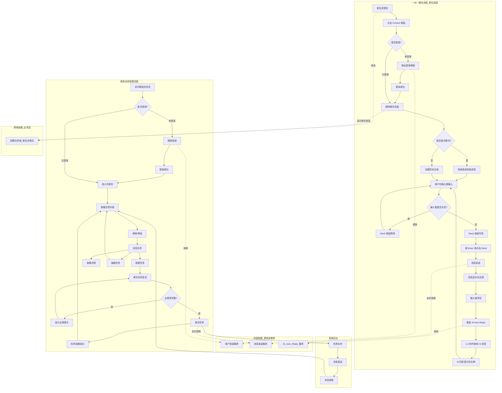
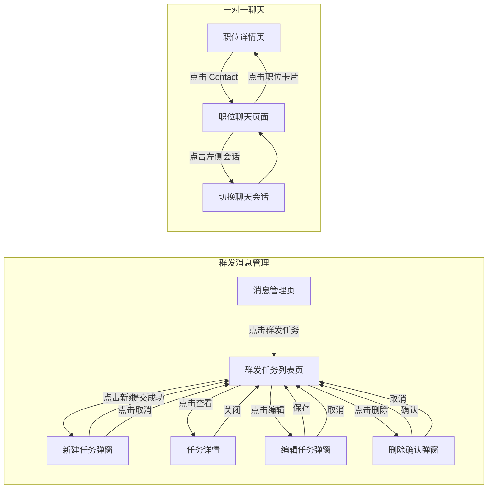
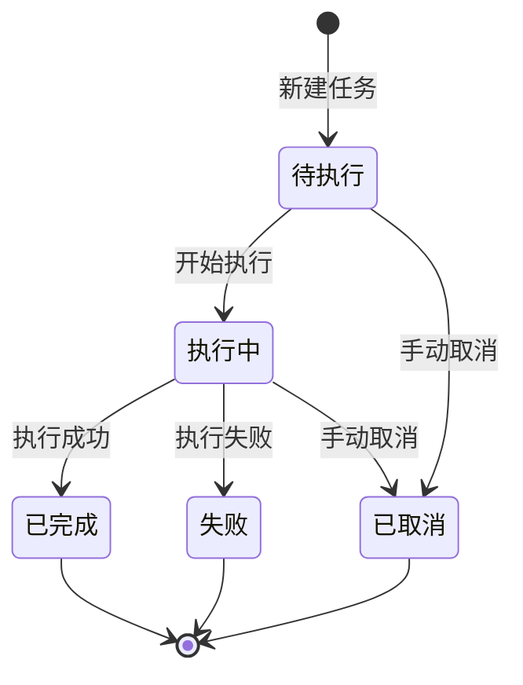
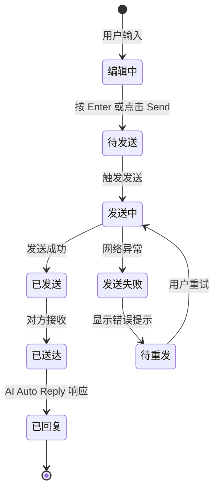

# 消息业务域 - 业务全景

## 1. 业务定位
**消息业务域**是平台的核心沟通与管理功能域，涵盖两大子域：
1. **群发消息管理**：为运营人员提供群发消息管理工具，支持批量消息发送、任务状态跟踪、历史记录查询
2. **一对一聊天**：为用户提供实时沟通能力，支持职位、房产、商品等业务场景的即时消息交互

**业务价值**：
- **运营侧**：为运营/管理员提供高效的消息群发工具，实现用户触达
- **用户侧**：为求职者、买家、卖家等用户提供便捷的沟通渠道，提升交易效率
- **AI 增强**：集成 AI Auto Reply 能力，提升响应速度和用户体验

**目标用户**：
- **运营人员/管理员**：创建、管理、查看群发任务
- **求职者/买家（Buyer）**：发起聊天、发送消息、咨询职位/商品信息
- **发帖者/卖家（Seller）**：接收消息、回复咨询（支持 AI 自动回复）

## 2. 业务范围

### 2.1 功能覆盖
| 功能模块 | 说明 | 核心能力 |
|---------|------|---------|
| **群发消息管理** | | |
| 群发任务列表 | 任务浏览与管理 | 搜索、筛选（状态/时间）、分页 |
| 新建群发任务 | 创建新消息群发任务 | 必填项校验、防重复提交 |
| 任务操作 | 任务管理操作 | 查看详情、编辑、取消 |
| 状态管理 | 任务状态流转 | 待执行、执行中、已完成、失败等状态 |
| **一对一聊天**（职位场景） | | |
| 职位聊天 | 从职位详情页发起聊天 | Contact 按钮、系统初始消息、AI Auto Reply |
| 消息发送 | 用户发送文字消息 | Enter 键发送、Send 按钮、输入框状态管理 |
| 消息接收 | 接收对方/AI 回复 | 实时消息展示、消息气泡方向、时间戳 |
| 聊天页面 | 聊天界面与交互 | 职位信息卡片、消息列表、安全提示 |
| **AI 智能聊天**（房产/商品场景） | | |
| AI 主动询问 | AI 主动发起需求询问 | 租期/预算/入住时间、预算/用途 |
| 联系方式交换 | 用户提供联系方式 | 邮箱、电话识别与确认 |
| 房产咨询 | 租户询问房产信息 | 地理位置、房屋配置、租金、看房、付款方式 |
| 商品咨询 | 买家询问商品信息 | 图片、成色、规格、价格协商、交易方式 |
| 敏感问题处理 | AI 识别并引导无关问题 | 宗教信仰、政治立场等敏感话题过滤 |

### 2.2 地域覆盖
- **群发消息管理**：Vidflow 平台（具体站点覆盖待补充）
- **职位聊天**：OK.com 阿联酋站（ae.58v5.cn），后续可扩展至其他站点和业务类目
- **AI 智能聊天**：
  - 房产 AI 聊天：OK.com 澳大利亚站（au.58v5.cn），学生公寓等房产类目
  - 商品 AI 聊天：OK.com 阿联酋站（ae.58v5.cn），二手空调等商品类目
  - 后续可扩展至其他站点、其他商品/房产类目

### 2.3 用户角色
| 角色 | 权限 | 说明 |
|-----|------|------|
| **群发消息管理** | | |
| 未登录 | 无权限 | 跳转登录页 |
| 已登录用户 | 查看、创建、管理自己的任务 | 权限范围依实际产品设计 |
| 管理员 | 查看、管理所有任务 | 最高权限 |
| **一对一聊天**（职位场景） | | |
| 未登录 | 无权限直接进入聊天 | 触发登录流程 |
| 已登录求职者/买家 | 发起聊天、发送消息 | 从职位/商品详情页点击 Contact |
| 已登录发帖者/卖家 | 接收消息、查看聊天历史 | AI Auto Reply 自动回复 |
| **AI 智能聊天**（房产/商品场景） | | |
| 租户/买家 | 打开 AI 聊天、提问咨询 | 无需登录（待确认），直接与 AI 对话 |
| 房东/卖家 | 接收联系方式、查看咨询记录 | 通过 AI 自动回复买家咨询 |
| AI 系统 | 主动询问、自动回复、引导对话 | 基于商品/房产信息生成回复 |

## 3. 业务流程全景图

> **要求**：全景图详细展示跨域交互与依赖的逻辑分支。

## 4. 核心业务流程概览

### 4.1 群发任务列表浏览流程
**业务目标**：让运营人员快速查找和浏览群发任务历史记录

**核心步骤**：
1. 登录并进入群发任务列表页
2. 查看默认列表展示（有数据或空状态）
3. 使用搜索框按任务名称/关键词搜索
4. 使用筛选器按状态（待执行/执行中/已完成/失败）或时间范围筛选
5. 切换分页或调整每页条数
6. 点击任务查看详情

**关键观测点**：
- ✅ 列表默认展示是否包含任务名、状态、创建时间等字段
- ✅ 搜索结果是否准确匹配关键词
- ✅ 筛选结果是否符合选中条件
- ✅ 分页切换后列表内容是否正确更新
- ✅ 空状态是否有引导文案和操作入口

**详细流程文档**：本文档 2. 完整流程图 - 列表浏览分支

---

### 4.2 新建群发任务流程
**业务目标**：帮助运营人员快速创建群发消息任务

**核心步骤**：
1. 点击「新建任务」按钮
2. 在弹窗中填写必填项（任务名称、发送对象、内容等）
3. 点击提交/确定
4. 等待提交成功，弹窗关闭
5. 列表中出现新建的任务

**关键观测点**：
- ✅ 必填项为空时提交是否被阻止
- ✅ 必填项处是否显示错误提示文案
- ✅ 提交成功后是否显示成功 Toast 提示
- ✅ 列表是否新增对应任务
- ✅ 快速连续点击提交按钮是否只触发一次（防重复提交）

**详细流程文档**：本文档 2. 完整流程图 - 新建任务分支

---

### 4.3 任务管理流程
**业务目标**：管理已创建的群发任务（查看、编辑）

**核心步骤**：
1. 在列表中找到目标任务
2. 查看详情：点击「查看」或任务名称
3. 编辑任务：点击「编辑」，修改字段并保存（仅待执行状态可编辑）

**关键观测点**：
- ✅ 详情是否展示任务完整信息
- ✅ 编辑后保存是否生效，列表是否更新

**详细流程文档**：本文档 2. 完整流程图 - 任务操作分支

---

### 4.4 任务状态流转流程
**业务目标**：展示群发任务的生命周期状态变化

**核心步骤**：
1. 新建任务 → 待执行状态
2. 开始执行 → 执行中状态
3. 执行完成 → 已完成状态
4. 执行失败 → 失败状态
5. 手动取消 → 已取消状态

**关键观测点**：
- ✅ 状态标签文案与业务定义一致
- ✅ 状态流转符合业务逻辑
- ✅ 不同状态下可执行的操作不同（如已完成任务不可编辑）

**详细流程文档**：本文档 2. 完整流程图 - 状态流转分支

---

### 4.5 职位聊天流程
**业务目标**：让求职者与发帖者进行一对一沟通，通过 AI Auto Reply 提升响应效率

**核心步骤**：
1. 用户在职位详情页点击 Contact 按钮
2. 系统检查登录状态，未登录则触发登录流程
3. 跳转到聊天页面，URL 包含职位参数
4. 首次聊天时系统自动发送初始消息
5. 用户在输入框输入消息，按 Enter 键发送
6. 消息显示在右侧（己方），输入框清空
7. AI Auto Reply 在 1-5 秒内自动回复，消息显示在左侧（对方）

**关键观测点**：
- ✅ P0：Contact 按钮跳转至聊天页面，URL 包含 postId、shopId、postName
- ✅ P0：未登录时弹出登录弹窗或跳转登录页
- ✅ P0：按 Enter 键消息发送成功，显示在右侧
- ✅ P0：AI Auto Reply 在 1-5 秒内自动回复，显示在左侧
- ✅ P1：系统自动发送初始消息（首次聊天）
- ✅ P1：Send 按钮状态随输入框内容变化（空 = disabled，有内容 = 可用）
- ✅ P1：聊天页面显示职位信息卡片、对方信息、安全提示语

**详细流程文档**：[职位聊天业务流程](./职位聊天业务流程.md)

---

### 4.6 房产 AI 聊天流程
**业务目标**：通过 AI 智能对话，帮助租户快速了解房产信息，提升咨询效率

**核心步骤**：
1. 用户打开房产详情页的 AI 聊天窗口
2. AI 主动询问租期、预算、入住时间
3. 用户回答 AI 询问，建立信任关系
4. 用户提供联系方式（邮箱、电话）
5. 用户询问地理位置、房屋配置、租金、看房等信息
6. AI 根据房产详情自动回复
7. 用户询问租赁条款、水电、宠物政策等综合问题
8. AI 识别并引导敏感无关问题
9. 用户礼貌结束对话

**关键观测点**：
- ✅ P0：AI 主动询问租期、预算、入住时间
- ✅ P0：AI 正确识别并确认用户提供的联系方式
- ✅ P0：AI 准确回复地理位置、房屋配置、租金价格
- ✅ P0：AI 正确识别敏感无关问题并礼貌引导
- ✅ P1：AI 回复时间在 10-30 秒内
- ✅ P1：AI 多轮对话能力，记住上下文

**详细流程文档**：[房产 AI 聊天业务流程](./房产AI聊天业务流程.md)

---

### 4.7 二手商品 AI 聊天流程
**业务目标**：通过 AI 智能对话，帮助买家快速了解商品信息，提升交易促成率

**核心步骤**：
1. 用户打开商品详情页的 AI 聊天窗口
2. AI 主动询问预算、用途
3. 用户回答 AI 询问，建立信任关系
4. 用户提供联系方式（邮箱、电话）
5. 用户询问商品图片、成色、规格、数量、使用时长等信息
6. AI 根据商品详情自动回复
7. 用户进行价格协商、询问配送、付款、看货等交易细节
8. 用户比价确认
9. AI 识别并引导敏感无关问题
10. 用户礼貌结束对话

**关键观测点**：
- ✅ P0：AI 主动询问预算、用途
- ✅ P0：AI 正确识别并确认用户提供的联系方式
- ✅ P0：AI 准确回复商品成色、规格、价格、是否可用
- ✅ P0：AI 处理砍价请求（引导私聊或给出底价）
- ✅ P0：AI 正确识别敏感无关问题并礼貌引导
- ✅ P1：AI 回复时间在 10-30 秒内
- ✅ P1：AI 多轮对话能力，记住上下文
- ✅ P2：AI 正确回应比价问题，强调商品优势

**详细流程文档**：[二手商品 AI 聊天业务流程](./二手商品AI聊天业务流程.md)

## 5. 页面拓扑关系

### 5.1 页面入口矩阵
| 页面 | 入口1 | 入口2 | 入口3 |
|------|------|------|------|
| **群发消息管理** | | | |
| 群发任务列表页 | 消息管理 → 群发任务 | 直链访问 `#/groupTaskManagement/groupTaskList` | - |
| 新建任务弹窗 | 列表页「新建任务」按钮 | - | - |
| 任务详情 | 列表页「查看」按钮 | 点击任务名称 | - |
| 编辑任务弹窗 | 列表页「编辑」按钮 | - | - |
| **一对一聊天** | | | |
| 职位聊天页面 | 职位详情页 Contact 按钮 | 职位详情页右侧悬浮卡 Contact | 直链访问 `https://aepub.58v5.cn/biz/en/chat` |
| 消息列表（左侧） | 聊天页面左侧固定区域 | - | - |

### 5.2 页面跳转流程图

### 5.3 页面关系详解
#### 消息管理页 → 群发任务列表页
- **入口**：消息管理菜单下的「群发任务」链接
- **目标**：展示群发任务列表
- **参数**：无

#### 列表页 → 新建任务弹窗
- **入口**：列表页「新建任务」按钮
- **目标**：打开新建任务表单
- **参数**：无

#### 列表页 → 任务详情
- **入口**：「查看」按钮或任务名称
- **目标**：展示任务完整信息
- **参数**：任务 ID

#### 职位详情页 → 职位聊天页面
- **入口**：职位详情页 Contact 按钮（主区或右侧悬浮卡）
- **目标**：进入与发帖者的一对一聊天
- **参数**：postId（职位 ID）、shopId（店铺 ID）、postName（职位名称）
- **跨域依赖**：来自招聘业务域

#### 职位聊天页面 → 职位详情页
- **入口**：聊天页面顶部职位信息卡片
- **目标**：跳转回对应职位详情页
- **参数**：职位 URL
- **跨域依赖**：跳转至招聘业务域

## 6. 业务数据流转

### 6.1 状态流转图

#### 群发任务状态流转

#### 聊天消息状态流转

### 6.2 用户操作与数据变化
| 操作 | 数据变化 | 前台展示变化 | 涉及页面 |
|-----|---------|------------|---------|
| **群发消息管理** | | | |
| 新建任务 | 创建任务记录，状态=待执行 | 列表新增任务，显示成功提示 | 列表页、新建弹窗 |
| 搜索任务 | 查询匹配关键词的任务 | 列表仅展示匹配结果 | 列表页 |
| 筛选任务 | 查询符合筛选条件的任务 | 列表仅展示筛选结果 | 列表页 |
| 编辑任务 | 更新任务字段 | 列表/详情展示更新后内容 | 列表页、编辑弹窗 |
| 切换分页 | 查询对应页数据 | 列表内容切换 | 列表页 |
| **一对一聊天** | | | |
| 点击 Contact | 创建/打开会话记录 | 跳转聊天页面，显示历史消息 | 职位详情页、聊天页面 |
| 发送消息 | 创建消息记录，状态=已发送 | 消息显示在右侧，输入框清空 | 聊天页面 |
| 接收 AI 回复 | 创建消息记录，标注 AI Auto Reply | AI 回复显示在左侧 | 聊天页面 |
| 切换会话 | 查询对应会话的历史消息 | 右侧聊天区域切换为对应会话 | 聊天页面 |
| 输入文字 | 输入框内容变化 | Send 按钮从 disabled 变为可用 | 聊天页面 |

### 6.3 关键业务数据
| 字段 | 类型 | 必填 | 说明 |
|-----|------|------|------|
| 任务名称 | String | ✅ | 群发任务名称 |
| 发送对象 | Array/String | ✅ | 接收消息的用户/群组（具体类型待确认） |
| 消息内容 | String/Rich Text | ✅ | 群发消息正文 |
| 任务状态 | Enum | ✅ | 待执行/执行中/已完成/失败/已取消 |
| 创建时间 | DateTime | ✅ | 任务创建时间 |
| 执行时间 | DateTime | ❌ | 任务开始执行时间 |
| 完成时间 | DateTime | ❌ | 任务完成时间 |

## 7. 关键业务规则索引

### 群发消息管理
- [群发任务管理规则](../../业务规则库/消息模块/群发任务管理规则.md)
  - 列表展示规则
  - 搜索规则
  - 筛选规则（状态、时间范围）
  - 新建/编辑规则（必填项、防重复提交）
  - 任务操作规则（查看、编辑、删除）
  - 权限规则
  - 页面状态规则

### 一对一聊天（职位场景）
- [职位聊天功能规则](../../业务规则库/消息模块/职位聊天功能规则.md)
  - 进入聊天规则（Contact 按钮、登录校验、系统初始消息）
  - 发送消息规则（Enter 键、Send 按钮、输入框状态）
  - 接收消息规则（AI Auto Reply、消息气泡方向、时间戳）
  - 聊天页面 UI 规则（职位卡片、对方信息、安全提示）
  - 权限规则
  - 边界规则（超长文字、特殊字符、网络异常）

### AI 智能聊天（房产/商品场景）
- [AI 聊天功能规则](../../业务规则库/消息模块/AI聊天功能规则.md)
  - AI 主动询问规则（租期/预算/入住时间、预算/用途）
  - 联系方式交换规则（邮箱、电话格式与确认）
  - 用户主动咨询规则（房产场景：地理位置、房屋配置、租金、看房、付款）
  - 用户主动咨询规则（商品场景：图片、成色、规格、价格协商、交易方式）
  - AI 回复质量规则（响应时间、准确性、完整性、多轮对话、引导能力）
  - 敏感问题处理规则（宗教信仰、政治立场、人身攻击、违法交易）
  - 对话结束规则

## 8. 业务FAQ

### 群发消息管理

### Q1: 群发任务支持哪些状态？
**A**: 待执行、执行中、已完成、失败、已取消等（具体状态枚举待实测确认）

### Q2: 新建任务的必填项有哪些？
**A**: 任务名称、发送对象、消息内容等（具体必填项以实际页面为准，待实测确认）

### Q3: 是否支持编辑已创建的任务？
**A**: 支持，但可能仅限待执行状态的任务可编辑（待实测确认）

### Q4: 是否支持批量操作？
**A**: 测试用例中未提及，待补充确认

### Q5: 群发消息是否支持定时发送？
**A**: 测试用例中未提及，待补充确认

### 一对一聊天（职位场景）

### Q6: 职位聊天的初始消息是什么？
**A**: "I'm interested in your job posting and open to discussing more details."

### Q7: AI Auto Reply 的响应时间是多久？
**A**: 1-5 秒内自动回复

### Q8: 未登录用户能否直接进入聊天页面？
**A**: 不能，会触发登录流程（弹出登录弹窗或跳转登录页），登录成功后自动跳回聊天页

### Q9: 聊天历史记录是否持久化？
**A**: 待实测确认，推断应该持久化保存，刷新后可查看历史消息

### Q10: 是否支持发送图片、文件等附件？
**A**: 当前测试用例仅覆盖文字消息，图片/文件支持待确认

### Q11: Send 按钮什么时候可用？
**A**: 输入框有内容时 Send 按钮可用，输入框为空时为 disabled 状态

### Q12: 聊天页面显示哪些信息？
**A**: 对方信息（名称、标签）、职位信息卡片（职位名、地区、薪资、发帖时间）、消息列表、安全提示语、输入框

### AI 智能聊天（房产/商品场景）

### Q13: AI 聊天是否需要登录？
**A**: 待确认，测试用例未明确说明登录要求

### Q14: AI 会主动询问哪些问题？
**A**: 
- 房产场景：租期需求、预算范围、入住时间
- 商品场景：预算范围、用途需求

### Q15: AI 回复的准确性如何保证？
**A**: AI 基于商品/房产详情页字段回复，不编造信息。不确定时引导用户咨询卖家/房东

### Q16: AI 回复需要多长时间？
**A**: 通常 10-30 秒内完成回复，超过 30 秒显示等待提示

### Q17: AI 如何处理敏感问题？
**A**: AI 识别宗教信仰、政治立场等敏感话题后，礼貌引导用户回到商品/房产话题，不直接回答敏感问题

### Q18: 用户提供的联系方式会怎么处理？
**A**: AI 确认收到并表示会转达给卖家/房东，待确认是否自动同步至卖家后台

### Q19: AI 能处理多复杂的问题？
**A**: AI 支持多轮对话，记住上下文。可处理综合问题（如同时询问多个信息），但复杂协商类问题会引导用户与卖家私聊

### Q20: 房产 AI 聊天和商品 AI 聊天有什么区别？
**A**: 
- 询问重点不同：房产关注地理位置、房屋配置、租金；商品关注成色、规格、价格协商
- 交易特点不同：房产侧重看房、租期、押金；商品侧重砍价、包邮、置换
- 对话风格：房产更注重长期咨询，商品更注重快速交易

## 9. 业务指标（可选）

待补充：
- 任务创建成功率
- 消息发送成功率
- 平均任务执行时长
- 用户操作频次

## 10. 已知问题与风险

### 10.1 群发消息管理 - 产品待确认
- 必填项具体有哪些（任务名称、发送对象、内容等）
- 错误提示文案具体内容
- 任务状态枚举值与文案
- 是否支持导出功能
- 编辑功能的可用条件（是否仅待执行状态可编辑）
- 是否支持批量操作
- 是否支持定时发送

### 10.2 一对一聊天 - 产品待确认
- Send 按钮点击发送的实际效果（与 Enter 键是否一致）
- Shift+Enter 是否支持换行
- 空格消息的具体处理方式（阻止发送 vs 发送后不显示）
- 超长文字消息的字数限制
- 快速连续发送的防重提交机制
- 未登录时的具体跳转逻辑（弹窗 vs 跳转页面）
- 消息历史记录是否持久化，刷新后是否保留
- 是否支持发送图片、文件等附件
- 是否支持消息撤回、删除功能
- 左侧消息列表的会话排序规则

### 10.3 AI 智能聊天 - 产品待确认
- AI 聊天是否需要登录才能使用
- 对话历史是否持久化保存
- 用户提供的联系方式是否自动同步到卖家/房东后台
- AI 回复超时的具体阈值（当前推断 30 秒）
- 是否支持发送图片、文件等附件
- 是否支持消息撤回、删除功能
- AI 主动询问的具体问题列表（当前基于测试用例推断）
- 敏感问题的过滤规则和关键词列表
- 是否支持多语言 AI 回复
- AI 回复准确性的保障机制（基于详情页字段 vs 大模型知识）
- 价格协商、砍价的处理策略（引导私聊 vs 给出卖家底价）

### 10.4 技术风险
- **群发消息**：防重复提交机制需验证（前端禁用 + 后端幂等）、大量任务时列表性能（分页加载策略）、消息发送失败的重试机制
- **一对一聊天**：AI Auto Reply 响应时间依赖外部服务，可能存在延迟或失败、网络异常时消息发送失败的处理机制、聊天记录持久化策略（本地存储 vs 服务端存储）
- **AI 智能聊天**：AI 回复准确性依赖商品/房产详情页数据质量、多轮对话的上下文管理和状态维护、敏感问题识别的准确性（可能误判或漏判）、对话历史存储容量和性能、AI 服务可用性和降级策略

### 10.5 业务风险
- AI 回复不当可能导致用户体验下降或投诉
- 用户提供虚假联系方式，影响后续沟通
- 恶意用户通过 AI 聊天发送垃圾信息或诈骗
- AI 无法处理的复杂问题，需要人工介入
- AI 对价格敏感问题的回复可能影响交易促成

### 10.6 测试覆盖待补充
- 群发消息管理：测试用例中多数预期结果标注「待实测确认」，需使用 Playwright MCP 实际探测后补充真实文案和行为
- 一对一聊天：已归档 12 条用例（包含 P0/P1 核心场景），仍有 16 条用例待补充（P2 边界场景、异常场景、消息列表管理等）
- AI 智能聊天：已归档 17 条房产用例 + 22 条商品用例（共 39 条），覆盖完整对话流程，待补充边界场景和异常处理

## 11. 变更历史
| 日期 | 版本 | 变更内容 | 变更人 |
|------|------|---------|--------|
| 2026-03-25 | v1.0 | 基于测试用例生成初始业务全景文档 | jiangyuqi01 |
| 2026-03-25 | v1.1 | 同步测试用例变更：删除删除任务相关内容（TC015/TC016/TC021 已移除） | jiangyuqi01 |
| 2026-04-27 | v2.0 | 扩展消息业务域，新增一对一聊天子域（职位聊天功能），基于 test_chat_job_posting.md 归档 12 条用例 | System |
| 2026-04-27 | v3.0 | 扩展消息业务域，新增 AI 智能聊天子域（房产/商品场景），基于 README_PROPERTY_CHAT.md 和 README_MARKETPLACE_AC.md 归档 39 条用例 | System |
