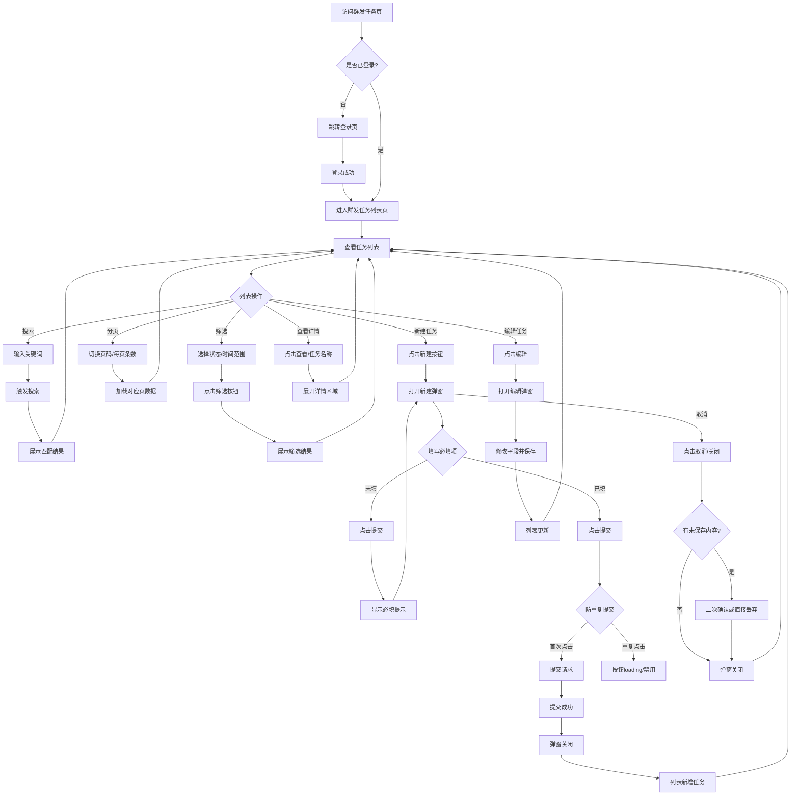

# 群发任务管理业务流程

> **业务目标**：帮助运营人员高效管理群发消息任务，实现批量消息发送、任务状态跟踪

## 1. 完整流程图

> **要求**：专注于群发任务域内的详细步骤，不包含跨域交互的复杂逻辑分支。

## 2. 详细步骤与观测点

### 步骤1：进入群发任务列表页
- **页面位置**：消息管理 → 群发任务，或直链 `#/groupTaskManagement/groupTaskList`
- **操作流程**：
  1. 访问直链或点击消息管理菜单下的群发任务入口
  2. 若未登录则完成登录
  3. 等待页面加载完成
- **观测点**：
  - ✅ P0：页面正常展示任务列表或空状态
  - ✅ P0：无报错提示、无整页空白
  - ✅ P0：URL 包含 `groupTaskManagement/groupTaskList`
- **验证方法**：检查页面 URL、检查列表容器是否可见
- **关联规则**：业务规则 3.1 列表展示规则

### 步骤2：搜索任务
- **页面位置**：群发任务列表页顶部搜索框
- **操作流程**：
  1. 在搜索框输入任务名称或关键词
  2. 回车或点击搜索按钮触发搜索
  3. 观察列表变化
- **观测点**：
  - ✅ P1：有结果时列表仅展示匹配任务
  - ✅ P1：无结果时列表为空或展示无结果文案
  - ❌ 负向：搜索特殊字符、超长文本不报错
- **验证方法**：对比搜索前后列表内容，检查匹配准确性
- **关联规则**：业务规则 3.2 搜索规则

### 步骤3：筛选任务
- **页面位置**：列表页筛选区域
- **操作流程**：
  1. 选择任务状态（如「已完成」）
  2. 或选择时间范围（开始日期 ~ 结束日期）
  3. 点击筛选按钮
  4. 观察列表变化
- **观测点**：
  - ✅ P1：列表仅展示符合筛选条件的任务
  - ✅ P1：点击重置后筛选条件清空
  - ❌ 负向：时间范围开始日期晚于结束日期是否有提示
- **验证方法**：检查列表任务的状态字段或时间字段是否符合筛选条件
- **关联规则**：业务规则 3.3 筛选规则

### 步骤4：新建群发任务
- **页面位置**：新建任务弹窗或表单页
- **操作流程**：
  1. 点击「新建」/「创建任务」按钮
  2. 填写必填项（任务名称、发送对象、内容等）
  3. 点击提交/确定
  4. 观察提交结果
- **观测点**：
  - ✅ P0：必填项完整填写后提交成功
  - ✅ P0：提交成功后弹窗关闭，列表新增任务
  - ✅ P0：显示成功提示文案
  - ❌ 负向：必填项为空提交被阻止，显示必填提示
  - ❌ 负向：快速连续点击提交按钮，仅触发一次提交
- **验证方法**：检查列表是否新增任务，检查 Toast 提示文案
- **关联规则**：业务规则 3.4 新建/编辑规则

### 步骤5：查看任务详情
- **页面位置**：任务列表行操作区或任务名称
- **操作流程**：
  1. 点击「查看」按钮或任务名称
  2. 观察详情展示
- **观测点**：
  - ✅ P1：详情区域展开或跳转详情页
  - ✅ P1：展示任务完整信息（名称、状态、创建时间、内容等）
- **验证方法**：检查详情区域是否可见，字段是否完整
- **关联规则**：业务规则 3.5 任务操作规则

## 3. 流程完整性验证清单

### 核心路径验证
- [ ] 未登录访问是否跳转登录页
- [ ] 登录成功后是否正确进入群发任务列表页
- [ ] 列表默认展示是否正常（有数据/空状态）
- [ ] 新建任务必填项完整提交是否成功
- [ ] 新建成功后列表是否新增对应任务

### 搜索与筛选验证
- [ ] 搜索有结果场景是否正确匹配
- [ ] 搜索无结果是否展示空状态
- [ ] 按状态筛选是否生效
- [ ] 按时间范围筛选是否生效
- [ ] 重置筛选是否清空所有筛选条件

### 异常场景验证
- [ ] 必填项为空提交是否被阻止并显示提示
- [ ] 重复点击提交按钮是否只触发一次
- [ ] 页面刷新后登录态是否保持

### 分页与操作验证
- [ ] 切换页码/每页条数是否生效
- [ ] 查看详情是否正确展示完整信息
- [ ] 编辑任务保存后列表是否更新

## 4. 关联文档

- [消息业务全景](./消息业务全景.md)
- [群发任务管理规则](../../业务规则库/消息模块/群发任务管理规则.md)

## 5. 变更历史
| 日期 | 版本 | 变更内容 | 变更人 |
|------|------|---------|--------|
| 2026-03-25 | v1.0 | 基于测试用例生成初始业务流程文档 | jiangyuqi01 |
| 2026-03-25 | v1.1 | 同步测试用例变更：删除删除任务相关流程步骤和验证项 | jiangyuqi01 |
| 2026-03-25 | v1.1 | 同步测试用例变更：删除删除任务相关验证步骤（TC015/TC016 已移除） | jiangyuqi01 |
