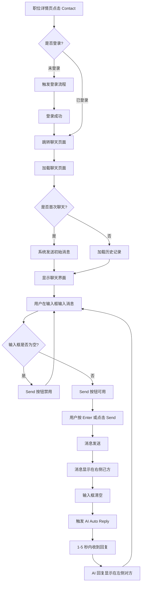

# 职位聊天业务流程

> **业务目标**：让求职者与发帖者进行一对一沟通，通过 AI Auto Reply 提升响应效率

## 1. 完整流程图

> **要求**：专注于本业务域内的详细步骤，**不包含**跨域交互的复杂逻辑分支（跨域逻辑统一在业务全景文档中展示）。

## 2. 详细步骤与观测点

### 步骤1：进入聊天页面
- **页面位置**：职位详情页 → Contact 按钮
- **操作流程**：
  1. 用户在职位详情页点击 Contact 按钮（主区或右侧悬浮卡片）
  2. 系统检查登录状态
  3. 已登录：直接跳转；未登录：触发登录流程
  4. 跳转到聊天页面 `aepub.58v5.cn/biz/en/chat`
- **观测点**：
  - ✅ P0：URL 中包含 postId、shopId、postName 等参数
  - ✅ P0：跳转后页面正确加载，显示聊天对象信息
  - ✅ P0：未登录时弹出登录弹窗或跳转登录页
  - ✅ P1：右侧边栏 Contact 按钮与主区 Contact 效果一致
- **验证方法**：
  - 检查 URL 参数是否包含职位信息
  - 验证登录态校验逻辑（已登录 vs 未登录）
  - 确认页面元素完整加载（对方信息、职位卡片、输入框）
- **关联规则**：[职位聊天功能规则 - 3.1 进入聊天规则](../../业务规则库/消息模块/职位聊天功能规则.md#31-进入聊天规则)

### 步骤2：系统发送初始消息
- **页面位置**：聊天页面
- **操作流程**：
  1. 首次与该 seller 发起聊天时
  2. 系统自动发送初始消息："I'm interested in your job posting and open to discussing more details."
  3. 消息显示在右侧（己方），包含时间戳
- **观测点**：
  - ✅ P1：初始消息自动出现在聊天区域
  - ✅ P1：消息内容正确
  - ✅ P1：消息显示在右侧（己方）
  - ✅ P1：重复进入同一聊天不重复发送初始消息
- **验证方法**：
  - 首次发起聊天，检查初始消息是否自动发送
  - 再次进入同一聊天，确认不重复发送
- **关联规则**：[职位聊天功能规则 - 3.1 进入聊天规则](../../业务规则库/消息模块/职位聊天功能规则.md#31-进入聊天规则)

### 步骤3：用户发送消息
- **页面位置**：聊天页面 → 底部输入框
- **操作流程**：
  1. 用户点击输入框，输入框获得焦点
  2. 输入文字内容
  3. 按 Enter 键或点击 Send 按钮
  4. 消息发送成功，显示在右侧
  5. 输入框自动清空
- **观测点**：
  - ✅ P0：输入框点击后激活，Placeholder 消失
  - ✅ P0：按 Enter 键消息发送成功
  - ✅ P0：消息显示在右侧（己方），包含时间戳
  - ✅ P0：发送后输入框自动清空
  - ✅ P1：点击 Send 按钮效果与 Enter 一致
  - ✅ P1：输入框为空时 Send 按钮为 disabled 状态
  - ✅ P1：输入内容后 Send 按钮变为可用
  - ❌ P2：空格消息发送被阻止或不显示
  - ❌ P2：超长文字消息正确显示或被限制
  - ❌ P2：特殊字符/Emoji 正确显示
- **验证方法**：
  - 输入正常文字后按 Enter，检查消息是否发送并显示
  - 检查 Send 按钮状态（空/有内容）
  - 边界测试：空格、超长文字、特殊字符
- **关联规则**：[职位聊天功能规则 - 3.2 发送消息规则](../../业务规则库/消息模块/职位聊天功能规则.md#32-发送消息规则)

### 步骤4：AI Auto Reply 自动回复
- **页面位置**：聊天页面 → 聊天区域
- **操作流程**：
  1. 用户发送消息后
  2. 系统触发 AI Auto Reply 服务
  3. 1-5 秒内收到 AI 回复
  4. AI 回复显示在左侧（对方），标注 "AI Auto Reply"
  5. 包含头像和发送时间
- **观测点**：
  - ✅ P0：发送消息后 1-5 秒内收到 AI 回复
  - ✅ P0：AI 回复显示在左侧，标注 "AI Auto Reply"
  - ✅ P0：回复内容与问题相关
  - ✅ P1：对方消息包含头像和时间戳
  - ❌ P2：AI 服务异常时的降级处理
- **验证方法**：
  - 发送消息后，计时检查 AI 回复时间
  - 验证 AI 回复显示位置、标注、内容
  - 异常场景：AI 服务不可用时的处理
- **关联规则**：[职位聊天功能规则 - 3.3 接收消息规则](../../业务规则库/消息模块/职位聊天功能规则.md#33-接收消息规则)

### 步骤5：聊天页面 UI 元素展示
- **页面位置**：聊天页面
- **操作流程**：
  1. 页面加载完成后展示各 UI 元素
  2. 顶部：对方信息（名称、标签）
  3. 聊天区域顶部：职位信息卡片
  4. 聊天区域：消息列表、安全提示语
  5. 底部：输入框、Send 按钮
- **观测点**：
  - ✅ P1：顶部显示对方名称和 "WhatsApp Reply" 标签
  - ✅ P1：职位信息卡片显示职位名称、地区、薪资、发帖时间
  - ✅ P1：职位卡片可点击跳转回职位详情页
  - ✅ P2：安全提示语常驻显示
- **验证方法**：
  - 检查页面各元素是否完整显示
  - 点击职位卡片，验证跳转功能
- **关联规则**：[职位聊天功能规则 - 3.4 聊天页面 UI 规则](../../业务规则库/消息模块/职位聊天功能规则.md#34-聊天页面-ui-规则)

## 3. 流程完整性验证清单

- [ ] 未登录用户点击 Contact 触发登录流程
- [ ] 已登录用户点击 Contact 直接进入聊天页面
- [ ] URL 包含职位参数（postId、shopId、postName）
- [ ] 首次聊天系统自动发送初始消息
- [ ] 重复进入同一聊天不重复发送初始消息
- [ ] 输入框点击后激活，可正常输入
- [ ] 输入框为空时 Send 按钮为 disabled 状态
- [ ] 输入内容后 Send 按钮变为可用
- [ ] 按 Enter 键消息成功发送并显示在右侧
- [ ] 发送后输入框自动清空
- [ ] 发送消息后 1-5 秒内收到 AI Auto Reply
- [ ] AI 回复显示在左侧，标注 "AI Auto Reply"
- [ ] 页面顶部显示对方信息
- [ ] 聊天区域显示职位信息卡片
- [ ] 职位卡片可点击跳转回职位详情页
- [ ] 安全提示语常驻显示

## 4. 关联文档

- [消息业务全景](./消息业务全景.md)
- [职位聊天功能规则](../../业务规则库/消息模块/职位聊天功能规则.md)

## 5. 变更历史
| 日期 | 版本 | 变更内容 | 变更人 |
|------|------|---------|--------|
| 2026-04-27 | v1.0 | 初始版本，基于 test_chat_job_posting.md P0 用例生成 | System |
