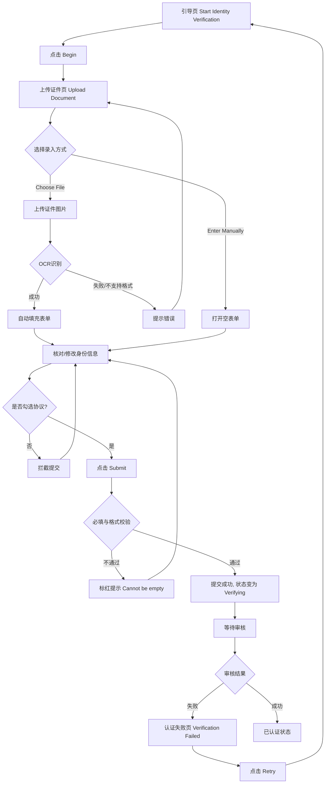

# KYC身份认证业务流程

> **业务目标**：引导卖家完成身份认证以解锁平台高级功能（如提现、收款）。

## 1. 完整流程图

> **要求**：专注于本业务域内的详细步骤，**不包含**跨域交互的复杂逻辑分支（跨域逻辑统一在业务全景文档中展示）。

## 2. 详细步骤与观测点

### 步骤1：访问引导页
- **页面位置**：`/biz/en/pay/identification`
- **操作流程**：用户登录后访问该 URL。
- **观测点**：
  - ✅ P0观测点：显示 "Start Identity Verification" 标题和 Begin 按钮。
  - ✅ P0观测点：显示三项权益说明（Get more visibility、Receive buyer payments、Use wallet withdrawal features）。
  - ❌ 负向观测点：未登录用户访问时，自动重定向到登录页。
- **验证方法**：使用已登录和未登录账号分别访问该 URL。
- **关联规则**：[KYC身份认证规则.md - 3.3 权限规则](../../业务规则库/用户模块/KYC身份认证规则.md)

### 步骤2：上传证件或手动录入
- **页面位置**：上传证件页 (Upload Document)
- **操作流程**：点击 Begin 后进入，选择 Choose File 上传图片，或点击 Enter Manually。
- **观测点**：
  - ✅ P0观测点：显示支持的证件类型说明（Passport, Driver's License, National ID）。
  - ✅ P0观测点：上传合规证件（如 `Australia_a_1.jpeg`）后，自动打开表单并 OCR 填充对应字段。
  - ✅ P0观测点：点击 Enter Manually 后，打开空表单（仅 Email 和 Country 预填）。
  - ❌ 负向观测点：上传不支持的格式（如 `.exe`）或非证件图片，提示错误或拒绝上传。
- **验证方法**：分别测试合规图片上传、非合规图片上传、以及手动录入入口。

### 步骤3：填写表单与协议勾选
- **页面位置**：身份认证表单弹窗
- **操作流程**：核对或填写 Document Type, Document Number, Date of Birth, First Name, Last Name 等信息，勾选协议并提交。
- **观测点**：
  - ✅ P0观测点：勾选 "I accept OK.com's User Agreement..." 复选框后，点击 Submit 成功提交。
  - ❌ 负向观测点：未填写必填字段点击 Submit，字段下方显示红色 "Cannot be empty" 提示，边框变红。
  - ❌ 负向观测点：未勾选协议点击 Submit，被拦截并提示须接受协议。
- **验证方法**：留空必填项提交、不勾选协议提交、完整正确填写并勾选协议后提交。

### 步骤4：认证失败与重试
- **页面位置**：认证失败页 (Verification Failed)
- **操作流程**：当账号状态为认证失败时，访问 KYC 页面，点击 Retry 按钮。
- **观测点**：
  - ✅ P0观测点：显示 "Verification Failed" 标题和失败说明文案。
  - ✅ P0观测点：点击 Retry 按钮后，跳转回 "Start Identity Verification" 引导页，可重新走完整流程。
- **验证方法**：将账号状态置为失败后访问页面，测试 Retry 链路是否畅通。

## 3. 流程完整性验证清单

- [x] 验证未登录拦截与重定向
- [x] 验证 OCR 识别成功后的字段自动填充
- [x] 验证 Enter Manually 手动录入模式
- [x] 验证必填字段为空时的前端拦截与标红提示
- [x] 验证用户协议未勾选时的拦截
- [x] 验证认证失败状态下的 Retry 重试链路
- [x] 验证认证中（Verifying）状态的防重复提交

## 4. 关联文档

- [用户业务全景](./用户业务全景.md)
- [KYC身份认证规则](../../业务规则库/用户模块/KYC身份认证规则.md)

## 5. 变更历史

| 日期 | 版本 | 变更内容 | 变更人 |
|-----|------|---------|--------|
| 2026-03-24 | v1.0 | 初始版本，基于 KYC 测试用例生成 | AI |
