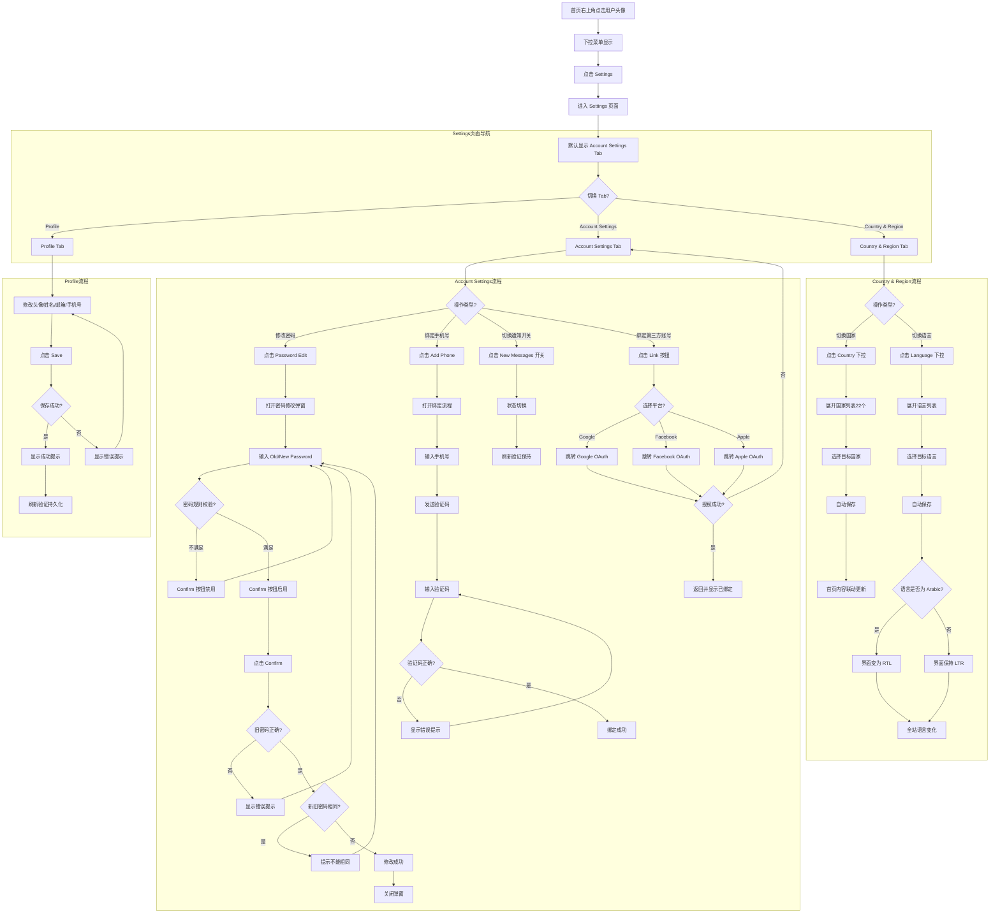

# Settings业务流程

> **业务目标**：为已登录用户提供自助管理个人资料、账户安全、区域偏好的入口，提升用户体验和账号安全性。

## 1. 完整流程图

> **要求**：专注于本业务域内的详细步骤，**不包含**跨域交互的复杂逻辑分支（跨域逻辑统一在业务全景文档中展示）。

## 2. 详细步骤与观测点

### 步骤1：进入 Settings 页面
- **页面位置**：首页右上角用户头像/用户名
- **操作流程**：
  1. 点击用户头像/用户名
  2. 下拉菜单显示，包含 Settings 选项
  3. 点击 Settings
  4. 跳转至 `https://aepub.58v5.cn/biz/en/user/home`，默认显示 Account Settings Tab（tabindex=1）
- **观测点**：
  - ✅ P0观测点：Settings 页面成功打开，URL 包含 `user/home`
  - ✅ P0观测点：左侧显示三个 Tab：Profile / Account Settings / Country & Region
  - ✅ P0观测点：默认选中 Account Settings Tab
  - ❌ 负向观测点：未登录访问 Settings 应被重定向至首页或登录页
- **验证方法**：检查 URL、Tab 可见性、默认选中状态
- **关联规则**：[Settings规则.md - 3.3 权限规则](../../业务规则库/用户模块/Settings规则.md)

### 步骤2：Profile - 修改个人资料
- **页面位置**：Settings > Profile Tab（tabindex=0）
- **操作流程**：
  1. 点击左侧 Profile Tab
  2. 显示个人资料表单：Avatar、User Name、First Name、Last Name、Email、Phone
  3. 修改任意字段（如 First Name 填入 "QA_Auto"）
  4. 点击 Save 按钮
  5. 等待保存成功提示出现
  6. 刷新页面验证修改已持久化
- **观测点**：
  - ✅ P0观测点：Profile Tab 成功打开，URL 包含 `tabindex=0`
  - ✅ P0观测点：表单显示所有字段（Avatar、User Name、First Name、Last Name、Email、Phone）
  - ✅ P0观测点：修改后点击 Save，显示成功提示（Toast/通知）
  - ✅ P0观测点：刷新后修改的值持久化保存
  - ✅ P1观测点：User Name 修改后，页面右上角昵称同步变化
  - ✅ P1观测点：Email 字段旁显示实时字符数统计
  - ❌ 负向观测点：User Name 清空后点击 Save 应提示错误或禁用按钮
  - ❌ 负向观测点：User Name 输入 60 字符应被截断或提示错误
  - ❌ 负向观测点：User Name 输入 `<script>` 或 Emoji 应被转义或拒绝
  - ❌ 负向观测点：头像上传超过 10MB 应提示文件过大
  - ❌ 负向观测点：头像上传 .pdf 格式应被拒绝或提示格式错误
  - ❌ 负向观测点：网络中断时点击 Save 应显示错误提示
- **验证方法**：修改字段后保存，刷新页面验证持久化
- **关联规则**：[Settings规则.md - 3.1 输入规则](../../业务规则库/用户模块/Settings规则.md)

### 步骤3：Account Settings - 修改密码
- **页面位置**：Settings > Account Settings Tab（tabindex=1）
- **操作流程**：
  1. 点击左侧 Account Settings Tab（或默认已选中）
  2. 显示账户设置区域：Email、Phone Number、Password、Notifications、3rd Party Account
  3. 点击 Password 区域的 Edit 按钮
  4. 打开密码修改弹窗（modal dialog）
  5. 输入 Old password（如 "Qwer1234"）
  6. 输入 New password（如 "Qwer12345"，满足：≥1数字 + ≥1大写 + ≥1小写 + 8-16位）
  7. 验证 Confirm 按钮从 disabled 变为 enabled
  8. 点击 Confirm
  9. 等待成功提示，弹窗关闭
- **观测点**：
  - ✅ P0观测点：Account Settings Tab 成功打开，URL 包含 `tabindex=1`
  - ✅ P0观测点：Email 区域显示已验证邮箱和 Verified 标识
  - ✅ P0观测点：Phone Number 区域显示 Add 按钮（未绑定）或已绑定号码
  - ✅ P0观测点：Password 区域显示 Edit 按钮
  - ✅ P0观测点：点击 Edit 后密码修改弹窗打开
  - ✅ P0观测点：弹窗显示 Old password 和 New password 输入框
  - ✅ P0观测点：初始状态 Confirm 按钮为 disabled
  - ✅ P0观测点：输入满足规则的密码后 Confirm 按钮变为 enabled
  - ✅ P0观测点：点击 Confirm 后显示成功提示，弹窗关闭
  - ✅ P1观测点：密码输入框右侧显示眼睛图标，点击可切换密码显示/隐藏
  - ❌ 负向观测点：Old password 输入错误点击 Confirm 应提示错误（如 "Incorrect old password"）
  - ❌ 负向观测点：New password 与 Old password 相同应提示不能相同
  - ❌ 负向观测点：New password 不满足规则时 Confirm 按钮应保持 disabled
- **验证方法**：打开弹窗 → 输入密码 → 验证按钮状态 → 提交 → 验证成功提示
- **关联规则**：[Settings规则.md - 3.2 校验规则](../../业务规则库/用户模块/Settings规则.md)

### 步骤4：Account Settings - 绑定手机号
- **页面位置**：Settings > Account Settings Tab > Phone Number 区域
- **操作流程**：
  1. 验证 Phone Number 区域显示 "Add your phone number" 和 Add 按钮
  2. 点击 Add 按钮
  3. 打开绑定手机号流程（弹窗或页面）
  4. 输入手机号
  5. 点击发送验证码
  6. 输入验证码
  7. 点击确认，绑定成功
  8. 关闭弹窗（Esc）
- **观测点**：
  - ✅ P0观测点：Phone Number 区域显示 "Add your phone number" 文案
  - ✅ P0观测点：Add 按钮可见且可点击
  - ✅ P0观测点：点击 Add 后绑定流程启动（弹窗或输入框出现）
  - ✅ P1观测点：若已绑定手机号，显示已有号码，Add 按钮不显示
- **验证方法**：点击 Add 按钮 → 验证绑定流程启动 → 关闭弹窗
- **关联规则**：[Settings规则.md - 3.1 输入规则](../../业务规则库/用户模块/Settings规则.md)

### 步骤5：Account Settings - 切换通知开关
- **页面位置**：Settings > Account Settings Tab > Notifications 区域（底部）
- **操作流程**：
  1. 滚动到页面底部
  2. 找到 "You will receive an email notification when you get a new message" 文案
  3. 定位文案右侧的 New Messages 开关（img "emailNotification"）
  4. 读取当前开关状态（记为 original_state：开 or 关）
  5. 点击开关，切换状态
  6. 等待响应，验证开关状态已变化
  7. 刷新页面，确认切换后状态保持
  8. 再次点击开关，恢复为 original_state
- **观测点**：
  - ✅ P0观测点：Notifications 区域在页面底部可见
  - ✅ P0观测点：显示 "You will receive an email notification when you get a new message" 文案
  - ✅ P0观测点：文案右侧显示 New Messages 开关（img 元素，cursor=pointer）
  - ✅ P0观测点：点击开关后状态成功切换
  - ✅ P0观测点：刷新后新状态保持
  - ✅ P1观测点：后置恢复成功（下次执行时开关状态与本次执行前相同）
- **验证方法**：读取状态 → 点击切换 → 刷新验证 → 恢复原状态
- **关联规则**：[Settings规则.md - 3.4 业务约束](../../业务规则库/用户模块/Settings规则.md)

### 步骤6：Account Settings - 绑定第三方账号
- **页面位置**：Settings > Account Settings Tab > 3rd Party Account 区域
- **操作流程**：
  1. 验证 3rd Party Account 区域可见
  2. 验证 Apple / Facebook / Google 的 Link 按钮存在（至少一个）
  3. 点击某个 Link 按钮（如 Google）
  4. 跳转至对应平台的 OAuth 授权页面
  5. 授权成功后返回，显示已绑定状态（Link 按钮变为 Unlink 或账号名）
- **观测点**：
  - ✅ P0观测点：3rd Party Account 区域可见
  - ✅ P0观测点：至少有一个 Link 按钮（Apple / Facebook / Google）
  - ✅ P0观测点：点击 Link 按钮后跳转至对应平台的 OAuth 授权页面
  - ✅ P1观测点：授权成功后返回，显示已绑定状态
  - ✅ P1观测点：若所有第三方账号已绑定，无 Link 按钮
  - ❌ 负向观测点：授权失败或取消授权后，返回 Settings 页面，Link 按钮仍显示
- **验证方法**：点击 Link 按钮 → 验证跳转到 OAuth 页面
- **关联规则**：[Settings规则.md - 5. 依赖模块](../../业务规则库/用户模块/Settings规则.md)

### 步骤7：Country & Region - 切换国家
- **页面位置**：Settings > Country & Region Tab（tabindex=2）
- **操作流程**：
  1. 点击左侧 Country & Region Tab
  2. 显示 Country & Region 页面
  3. 读取当前 Country 显示值（记为 original_country，如 "UAE"）
  4. 点击 Country 下拉触发器
  5. 展开国家列表，验证包含 22 个选项
  6. 选择目标国家（如 "Singapore"）
  7. 验证当前 Country 显示值已更新为 "Singapore"
  8. 返回首页，验证首页内容/分类联动更新为 Singapore 站
  9. 返回 Country & Region，再次展开下拉，选回 original_country，验证恢复成功
- **观测点**：
  - ✅ P0观测点：Country & Region Tab 成功打开，URL 包含 `tabindex=2`
  - ✅ P0观测点：显示 Country & Region 下拉（当前值：UAE）
  - ✅ P0观测点：点击下拉后展开，包含 22 个选项
  - ✅ P0观测点：选项列表包含关键国家：UAE、Singapore、United States、United Kingdom、Australia、Canada
  - ✅ P0观测点：选择后列表收起，当前值更新为目标国家
  - ✅ P0观测点：切换 Country 到 Singapore 后首页分类/内容应对应更新为 SG 站
  - ✅ P0观测点：切换 Country 到 United States 后首页内容应联动更新为 US 站
  - ✅ P1观测点：切换 Country 到 香港 后 Language 下拉应包含中文选项
  - ✅ P1观测点：后置恢复成功，下次执行时读取到与本次相同的初始值
- **验证方法**：读取当前国家 → 展开下拉验证选项 → 切换国家 → 验证首页联动 → 恢复原国家
- **关联规则**：[Settings规则.md - 3.4 业务约束](../../业务规则库/用户模块/Settings规则.md)

### 步骤8：Country & Region - 切换语言
- **页面位置**：Settings > Country & Region Tab > Language 下拉
- **操作流程**：
  1. 确认位于 Country & Region 页面
  2. 读取当前 Language 显示值（记为 original_lang，通常为 "English"）
  3. 点击 Language 下拉触发器
  4. 展开语言列表，查看可选语言
  5. 选择目标语言（如 "Arabic"）
  6. 等待界面响应，观察页面文本是否切换为对应语言
  7. 验证界面变为 RTL 布局（若选择 Arabic）
  8. 刷新页面，确认语言设置保持
  9. 重新进入 Country & Region，将 Language 恢复为 "English"，确认恢复成功
- **观测点**：
  - ✅ P0观测点：Language 下拉可见（当前值：English）
  - ✅ P0观测点：点击下拉后展开，显示可选语言列表
  - ✅ P0观测点：选择 Arabic 后界面文本切换为阿拉伯语
  - ✅ P0观测点：选择 Arabic 后界面变为 RTL 布局
  - ✅ P0观测点：刷新后语言设置保持
  - ✅ P0观测点：全站界面语言变化（不仅 Settings 页面）
  - ✅ P1观测点：后置恢复成功，Language 恢复为 English
  - ⚠️ 警告：切换到 Arabic 后操作元素定位需适配 RTL 布局，建议自动化测试用例立即恢复 English
- **验证方法**：读取当前语言 → 切换语言 → 验证界面变化 → 刷新验证保持 → 恢复原语言
- **关联规则**：[Settings规则.md - 3.4 业务约束](../../业务规则库/用户模块/Settings规则.md)

### 步骤9：Settings - Tab 切换流畅性验证
- **页面位置**：Settings 页面
- **操作流程**：
  1. 依次点击三个 Tab：Profile → Account Settings → Country & Region → Account Settings → Profile
  2. 验证每次切换后页面正确显示对应 Tab 的内容
  3. 验证 URL 参数 tabindex 正确更新（0/1/2）
  4. 验证切换过程无报错、无卡顿
- **观测点**：
  - ✅ P0观测点：三个 Tab 依次切换应流畅无报错
  - ✅ P0观测点：每次切换后 URL 参数 tabindex 正确更新
  - ✅ P0观测点：每次切换后页面内容正确显示
  - ✅ P1观测点：切换过程无网络请求错误
- **验证方法**：依次切换 Tab → 验证 URL 和页面内容 → 验证无报错
- **关联规则**：[Settings规则.md - 2. 核心流程](../../业务规则库/用户模块/Settings规则.md)

### 步骤10：Settings - 未登录访问重定向验证
- **页面位置**：浏览器地址栏
- **操作流程**：
  1. 退出登录（或使用隐身模式）
  2. 直接访问 Settings 页面 URL：`https://aepub.58v5.cn/biz/en/user/home`
  3. 验证被重定向至首页或登录页
  4. 验证未能访问 Settings 页面
- **观测点**：
  - ✅ P0观测点：未登录时直接访问 Settings 页面应被重定向至首页或登录页
  - ✅ P0观测点：未登录时无法访问任何 Settings Tab（Profile / Account Settings / Country & Region）
- **验证方法**：退出登录 → 直接访问 Settings URL → 验证重定向
- **关联规则**：[Settings规则.md - 3.3 权限规则](../../业务规则库/用户模块/Settings规则.md)

## 3. 流程完整性验证清单

- [x] 验证 Settings 页面入口可见且可点击（右上角用户头像下拉菜单）
- [x] 验证未登录访问 Settings 被重定向至首页或登录页
- [x] 验证 Settings 页面打开后默认显示 Account Settings Tab
- [x] 验证左侧三个 Tab 依次切换流畅无报错
- [x] 验证 Profile Tab 显示所有字段（Avatar、User Name、First Name、Last Name、Email、Phone）
- [x] 验证 Profile 修改任意字段后点击 Save 成功保存
- [x] 验证 Profile 刷新后修改的值持久化保存
- [x] 验证 User Name 修改后页面右上角昵称同步变化
- [x] 验证 User Name 清空后点击 Save 提示错误或禁用按钮
- [x] 验证 User Name 输入 60 字符被截断或提示错误
- [x] 验证 User Name 输入 XSS 脚本被转义或拒绝
- [x] 验证头像上传超过 10MB 提示文件过大
- [x] 验证头像上传 .pdf 格式被拒绝或提示格式错误
- [x] 验证头像上传预览后不点 Save 直接刷新头像应回滚
- [x] 验证 Email 字段旁显示实时字符数统计
- [x] 验证 Phone 区号可切换（+971 ↔ +86）
- [x] 验证网络中断时点击 Save 显示错误提示
- [x] 验证 Account Settings Tab 显示所有区域（Email、Phone、Password、Notifications、3rd Party Account）
- [x] 验证 Email 区域显示已验证邮箱和 Verified 标识
- [x] 验证 Phone Number 区域显示 Add 按钮（未绑定）或已绑定号码
- [x] 验证点击 Add Phone 按钮打开绑定流程
- [x] 验证点击 Password Edit 按钮打开密码修改弹窗
- [x] 验证密码修改弹窗显示 Old/New password 输入框
- [x] 验证初始状态 Confirm 按钮为 disabled
- [x] 验证输入满足规则的密码后 Confirm 按钮变为 enabled
- [x] 验证输入不满足规则的密码 Confirm 按钮保持 disabled
- [x] 验证 Old password 输入错误点击 Confirm 提示错误
- [x] 验证 New password 与 Old password 相同提示不能相同
- [x] 验证密码修改成功后弹窗关闭并显示成功提示
- [x] 验证密码输入框右侧眼睛图标可切换密码显示/隐藏
- [x] 验证 New Messages 开关可见且可点击
- [x] 验证点击 New Messages 开关状态成功切换
- [x] 验证刷新后 New Messages 开关状态保持
- [x] 验证 3rd Party Account 区域可见
- [x] 验证至少有一个 Link 按钮（Apple / Facebook / Google）
- [x] 验证点击 Link 按钮跳转至对应平台的 OAuth 授权页面
- [x] 验证 Country & Region Tab 显示 Country 和 Language 下拉
- [x] 验证 Country 下拉展开包含 22 个选项
- [x] 验证 Country 下拉包含关键国家（UAE、Singapore、United States 等）
- [x] 验证切换 Country 后当前值更新
- [x] 验证切换 Country 到 Singapore 后首页内容联动更新
- [x] 验证切换 Country 到 United States 后首页内容联动更新
- [x] 验证切换 Country 到 香港 后 Language 下拉包含中文选项
- [x] 验证 Language 下拉展开显示可选语言列表
- [x] 验证切换 Language 到 Arabic 后界面文本切换为阿拉伯语
- [x] 验证切换 Language 到 Arabic 后界面变为 RTL 布局
- [x] 验证刷新后 Language 设置保持
- [x] 验证全站界面语言变化（不仅 Settings 页面）

## 4. 关联文档

- [用户业务全景](./用户业务全景.md)
- [Settings规则](../../业务规则库/用户模块/Settings规则.md)
- [登录业务流程](./登录业务流程.md)
- [KYC身份认证业务流程](./KYC身份认证业务流程.md)

## 5. 变更历史

| 日期 | 版本 | 变更内容 | 变更人 |
|-----|------|---------|--------|
| 2026-04-28 | v1.0 | 初始版本，基于 Settings 模块测试用例生成 | AI |
