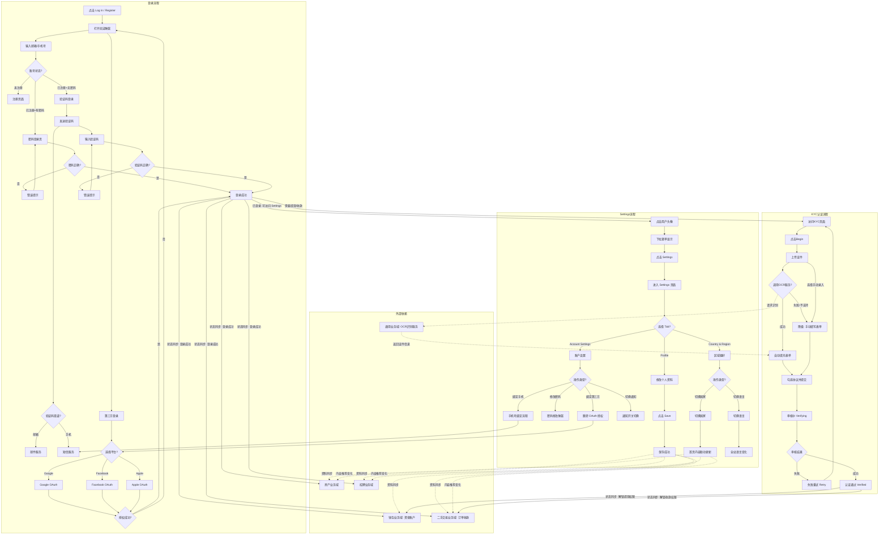
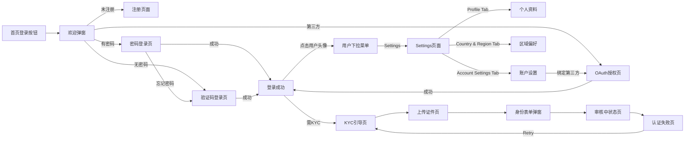
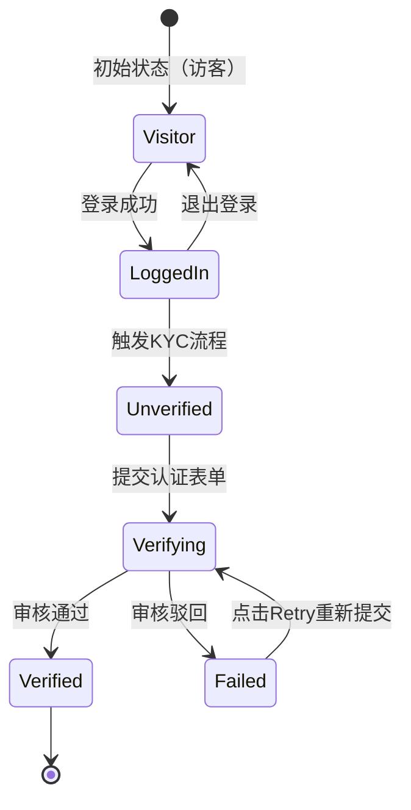

# 用户业务全景

## 1. 业务定位
- **业务价值**：统一管理平台用户的身份信息、认证状态和基础资料，为各业务线提供可信的用户身份基座。
- **目标用户**：平台所有注册用户（包含买家、卖家、企业用户等）。

## 2. 业务范围
- **功能覆盖**：
  - 用户登录（Login）：邮箱/手机号+密码、验证码登录、第三方登录（Google/Facebook/Apple）
  - 用户设置（Settings）：
    - Profile：个人资料管理（头像、姓名、邮箱、手机号）
    - Account Settings：账户设置（密码修改、手机号绑定、通知开关、第三方账号绑定）
    - Country & Region：国家和语言偏好设置
  - KYC身份认证（Identity Verification）
  - 账号状态管理（正常、认证中、认证失败、已认证、封禁）
- **地域覆盖**：全站（AE站等国际站点）
- **用户角色**：
  - 访客（未登录）：可使用登录功能成为已登录用户。
  - 卖家/发布者：需要登录并通过 KYC 认证以解锁高级权限，可在 Settings 中管理个人资料和账户设置。
  - 买家：需要登录以使用收藏、订单等功能，可在 Settings 中管理个人资料和偏好设置。

## 3. 业务流程全景图

> **要求**：全景图必须**详细展示跨域交互与依赖的逻辑分支**。例如：如果涉及钱包，必须画出"未绑定钱包"和"已绑定钱包"的分支；如果涉及AI，必须画出调用AI服务和降级处理的分支。

## 4. 核心业务流程概览

### 4.1 用户登录流程
- **业务目标**：为平台用户提供安全便捷的身份认证入口，支持多种登录方式以满足不同用户的需求。
- **核心步骤**：
  1. 点击首页右上角「Log in / Register」按钮，打开登录弹窗。
  2. 输入邮箱或手机号（系统自动识别类型）。
  3. 点击 Continue，根据账号状态进入不同流程：
     - 未注册：进入注册页面（显示 "Hi new friend"）
     - 已注册+有密码：进入密码登录页，输入密码后登录
     - 已注册+无密码：进入验证码登录页，发送并输入验证码后登录
  4. 或直接点击第三方登录按钮（Google/Facebook/Apple），完成 OAuth 授权。
  5. 登录成功后，弹窗关闭，右上角显示用户头像。
- **关键观测点**：
  - ✅ 输入框为空时 Continue 按钮禁用，有内容时启用。
  - ✅ 密码/验证码为空时登录/确认按钮禁用，有内容时启用。
  - ✅ 密码错误或验证码错误时显示错误提示。
  - ✅ 验证码发送后显示 60 秒倒计时，倒计时期间不可重复发送。
  - ✅ 登录成功后右上角显示用户头像，不再显示「Log in / Register」按钮。
- **详细流程文档**：[登录业务流程](./登录业务流程.md)

### 4.2 KYC身份认证流程
- **业务目标**：引导卖家完成身份认证以解锁平台高级功能（如提现、收款）。
- **核心步骤**：
  1. 访问引导页并点击 Begin。
  2. 上传证件图片（触发 OCR）或选择手动录入。
  3. 核对并补全身份表单信息。
  4. 勾选用户协议并提交。
  5. 等待审核结果（成功或失败重试）。
- **关键观测点**：
  - ✅ 必填字段为空时前端准确拦截并标红。
  - ✅ 必须勾选用户协议才能提交。
  - ✅ 认证失败后可通过 Retry 按钮重新发起认证。
- **详细流程文档**：[KYC身份认证业务流程](./KYC身份认证业务流程.md)

### 4.3 Settings 用户设置流程
- **业务目标**：为已登录用户提供自助管理个人资料、账户安全、区域偏好的能力，提升用户体验和账号安全性。
- **核心步骤**：
  1. 点击首页右上角用户头像，在下拉菜单中选择 Settings。
  2. 进入 Settings 页面，默认显示 Account Settings Tab。
  3. 在左侧 Tab 切换：Profile / Account Settings / Country & Region。
  4. 在 Profile 中修改个人资料（头像、姓名、邮箱、手机号）并点击 Save 保存。
  5. 在 Account Settings 中修改密码、绑定手机号、切换通知开关、绑定第三方账号（Google/Facebook/Apple）。
  6. 在 Country & Region 中切换国家和语言偏好，影响全站内容和界面语言。
- **关键观测点**：
  - ✅ 未登录访问 Settings 应被重定向至首页或登录页。
  - ✅ Profile 修改后点击 Save，显示成功提示，刷新后修改的值持久化保存。
  - ✅ 密码修改弹窗中，输入满足规则的密码后 Confirm 按钮从 disabled 变为 enabled。
  - ✅ 切换 Country 到 Singapore 后首页分类/内容应对应更新为 SG 站。
  - ✅ 切换 Language 到 Arabic 后界面变为 RTL 布局，全站语言变化。
  - ✅ User Name 修改后，页面右上角昵称同步变化，建议测试用例修改后必须恢复原值。
- **详细流程文档**：[Settings业务流程](./Settings业务流程.md)

## 5. 页面拓扑关系

### 5.1 页面入口矩阵
| 页面 | 入口1 | 入口2 | 入口3 |
|------|-------|-------|-------|
| 登录欢迎弹窗 | 首页右上角「Log in / Register」 | 访问需登录功能时自动弹出 | URL 参数触发 |
| 密码登录页 | 欢迎弹窗输入已注册邮箱/手机号 | | |
| 验证码登录页 | 欢迎弹窗输入未设置密码账号 | 密码页点击「Forgot your password?」 | |
| 注册页面 | 欢迎弹窗输入未注册邮箱/手机号 | | |
| Settings 页面 | 首页右上角用户头像下拉菜单 | 钱包/KYC 等业务域引导用户完善资料 | 直接访问 URL（需登录） |
| KYC引导页 | 钱包提现拦截跳转 | 交易收款拦截跳转 | 个人中心设置页 |
| KYC上传页 | 引导页点击 Begin | | |
| KYC失败页 | 审核失败后访问 KYC 路由 | | |

### 5.2 页面跳转流程图

### 5.3 页面关系详解
#### 首页 → 登录欢迎弹窗
- **入口**：首页右上角「Log in / Register」按钮。
- **目标**：打开登录弹窗，开始登录流程。
- **权限**：任何访客均可访问。

#### 欢迎弹窗 → 密码登录页
- **入口**：输入已注册且有密码的邮箱/手机号后点击 Continue。
- **目标**：进入密码登录页面。
- **参数**：携带用户输入的邮箱/手机号。

#### 密码登录页 → 验证码登录页
- **入口**：点击「Forgot your password?」文本链接。
- **目标**：进入验证码登录流程（忘记密码场景）。
- **参数**：携带当前邮箱/手机号。

#### KYC引导页 → 上传页
- **入口**：引导页的 "Begin" 按钮。
- **目标**：进入证件上传环节。
- **权限**：需登录且账号未处于"认证中"或"已认证"状态。

#### 认证失败页 → 引导页
- **入口**：失败页的 "Retry" 按钮。
- **目标**：重新发起认证流程。
- **数据**：清空上一次的表单提交数据。

#### 首页 → Settings 页面
- **入口**：首页右上角用户头像下拉菜单中的 Settings 选项。
- **目标**：进入 Settings 页面，默认显示 Account Settings Tab。
- **权限**：仅已登录用户可访问，未登录访问会被重定向至首页或登录页。

#### Settings → 第三方 OAuth 授权
- **入口**：Account Settings Tab > 3rd Party Account 区域的 Link 按钮（Google/Facebook/Apple）。
- **目标**：跳转至对应平台的 OAuth 授权页面，授权成功后返回 Settings 页面。
- **权限**：已登录用户。

## 6. 业务数据流转

### 6.1 状态流转图

### 6.2 用户操作与数据变化
| 操作 | 数据变化 | 前台展示变化 | 涉及页面 |
|------|----------|--------------|----------|
| 输入邮箱/手机号 | 无 | Continue 按钮从 disabled 变为 enabled | 欢迎弹窗 |
| 点击 Continue | 查询账号状态 | 进入对应登录页（密码/验证码/注册） | 欢迎弹窗 → 登录页 |
| 输入密码 | 无 | Log in 按钮从 disabled 变为 enabled | 密码登录页 |
| 密码登录成功 | 创建 Session/Token | 关闭弹窗，右上角显示用户头像 | 全站 |
| 点击 Send code | 发送验证码 | 显示 Toast，进入验证码输入页，倒计时开始 | 验证码登录页 |
| 输入验证码 | 无 | Confirm 按钮从 disabled 变为 enabled | 验证码输入页 |
| 验证码登录成功 | 创建 Session/Token | 关闭弹窗，右上角显示用户头像 | 全站 |
| 第三方登录成功 | 创建 Session/Token | 关闭弹窗，右上角显示用户头像 | 全站 |
| 退出登录 | 清除 Session/Token | 右上角显示「Log in / Register」按钮 | 全站 |
| Settings 修改个人资料 | 更新用户昵称/邮箱/手机号/头像 | Profile 表单字段更新，页面右上角昵称同步变化 | Settings > Profile |
| Settings 修改密码 | 更新用户密码 | 密码修改弹窗关闭，显示成功提示 | Settings > Account Settings |
| Settings 绑定手机号 | 添加用户手机号 | Phone Number 区域显示已绑定号码，Add 按钮消失 | Settings > Account Settings |
| Settings 切换通知开关 | 更新通知偏好设置 | New Messages 开关状态切换（开/关） | Settings > Account Settings |
| Settings 绑定第三方账号 | 添加第三方账号绑定关系 | Link 按钮变为 Unlink 或显示账号名 | Settings > Account Settings |
| Settings 切换国家 | 更新用户国家偏好 | Country 下拉显示新国家，首页内容联动更新 | Settings > Country & Region |
| Settings 切换语言 | 更新用户语言偏好 | Language 下拉显示新语言，全站界面语言变化 | Settings > Country & Region |
| 提交认证表单 | KYC状态变为 Verifying | 显示 "Verifying" 提示 | 表单弹窗 |
| 审核驳回 | KYC状态变为 Failed | 显示 "Verification Failed" 及 Retry 按钮 | 认证状态页 |
| 审核通过 | KYC状态变为 Verified | 解锁提现等高级功能入口 | 全站 |

### 6.3 关键业务数据
| 字段 | 类型 | 必填 | 说明 |
|------|------|------|------|
| Email or Phone | String | 是 | 登录凭证（邮箱或手机号） |
| Password | String | 是（密码登录） | 登录密码 |
| Verification Code | String | 是（验证码登录） | 6位验证码 |
| Session/Token | String | - | 登录凭证，用于维护登录状态 |
| Login Method | Enum | - | password / verification_code / google / facebook / apple |
| Document Type | String | 是（KYC） | 证件类型（Passport/Driver's License/National ID） |
| Document Number | String | 是（KYC） | 证件号码 |
| Issuing Country | String | 是（KYC） | 签发国家 |
| Date of Birth | Date | 是（KYC） | 出生日期 |
| First Name | String | 是（KYC/Settings） | 名字（KYC 必填，Settings 可选） |
| Last Name | String | 是（KYC/Settings） | 姓氏（KYC 必填，Settings 可选） |
| User Name | String | 否（Settings） | 用户昵称，长度≤60字符，不能为空 |
| Avatar | File | 否（Settings） | 用户头像，JPG/PNG/GIF，≤10MB |
| Phone Number | String | 否（Settings） | 用户手机号，区号+号码主体 |
| Country | Enum | 是（Settings） | 用户国家偏好，22个可选国家/地区 |
| Language | Enum | 是（Settings） | 用户语言偏好，English/Arabic 等 |
| Email Notification | Boolean | 否（Settings） | 是否接收邮件通知（New Messages 开关） |
| 3rd Party Account | String | 否（Settings） | 绑定的第三方账号（Google/Facebook/Apple） |

## 7. 关键业务规则索引
- [登录规则](../../业务规则库/用户模块/登录规则.md)
- [Settings规则](../../业务规则库/用户模块/Settings规则.md)
- [KYC身份认证规则](../../业务规则库/用户模块/KYC身份认证规则.md)

## 8. 业务FAQ

### 登录相关
- **Q1: 支持哪些登录方式？**
  - A: 目前支持邮箱/手机号+密码登录、邮箱/手机号+验证码登录，以及第三方登录（Google、Facebook、Apple）。
  
- **Q2: 输入邮箱后为什么显示验证码登录而不是密码登录？**
  - A: 这说明该账号已注册但未设置密码。您可以使用验证码登录，登录后建议在个人设置中设置密码。
  
- **Q3: 忘记密码怎么办？**
  - A: 在密码登录页点击「Forgot your password?」，通过验证码登录后可以重置密码。
  
- **Q4: 验证码多久过期？**
  - A: 验证码有效期为 60 秒，过期后需要重新发送。发送验证码后 60 秒内不可重复发送。
  
- **Q5: 为什么 Continue 按钮点不了？**
  - A: 请确保输入框不为空，输入任何内容后 Continue 按钮会自动启用。

### KYC认证相关
- **Q6: 认证失败了怎么办？**
  - A: 可以在认证失败页面点击 "Retry" 按钮重新上传清晰的证件照片并提交。
  
- **Q7: 支持哪些证件类型？**
  - A: 目前支持护照 (Passport)、驾照 (Driver's License) 和国民身份证 (National ID)。
  
- **Q8: 为什么 KYC 提交按钮点不了？**
  - A: 请检查是否所有必填项都已填写，并且勾选了底部的用户协议复选框。

## 9. 业务指标（可选）
- **9.1 核心指标**：KYC 认证通过率。
- **9.2 漏斗指标**：引导页曝光 -> 点击 Begin -> 成功上传证件 -> 成功提交表单。

## 10. 已知问题与风险

### 10.1 产品待确认问题
- **登录模块**：
  - TC014：手机号未设置密码场景，密码页提示文案仍为 "Sign in with your email code instead."，应改为 "Sign in with your phone code instead." 或通用文案。
  - "Forgot your password?" 不是 `<a>` 链接标签，而是可点击的文本元素，可能影响可访问性。
  
- **KYC模块**：
  - 用户协议和隐私政策目前无超链接，无法点击查看详情。

### 10.2 技术风险
- **登录模块**：
  - 第三方登录（Google/Facebook/Apple）依赖外部 OAuth 服务，若服务异常可能导致登录失败。
  - 验证码发送依赖短信和邮件服务，若服务延迟或失败，用户无法收到验证码。
  - 密码输入框支持任意字符（包括特殊字符、中文、Emoji），需确保后端有 XSS 防护和 SQL 注入防护。

- **Settings模块**：
  - 邮箱/短信验证码依赖：修改 Email/Phone 依赖邮件和短信服务，若服务延迟或失败，用户无法收到验证码。
  - 网络中断场景：网络中断时点击 Save 应显示错误提示，需确保前端有网络异常捕获和用户提示。
  
- **KYC模块**：
  - OCR 识别服务若出现延迟或宕机，需确保用户能顺畅切换到 Enter Manually 手动录入模式。

## 11. 变更历史
| 日期 | 版本 | 变更内容 | 变更人 |
|-----|------|---------|--------|
| 2026-03-24 | v1.0 | 初始版本，基于 KYC 测试用例生成 | AI |
| 2026-04-27 | v1.1 | 新增登录业务流程，包含密码登录、验证码登录、第三方登录；更新业务全景图和FAQ | AI |
| 2026-04-28 | v1.2 | 新增 Settings 模块，包含个人资料管理、账户设置、区域偏好；更新业务全景图、页面拓扑、数据流转、业务规则索引和已知问题 | AI |
