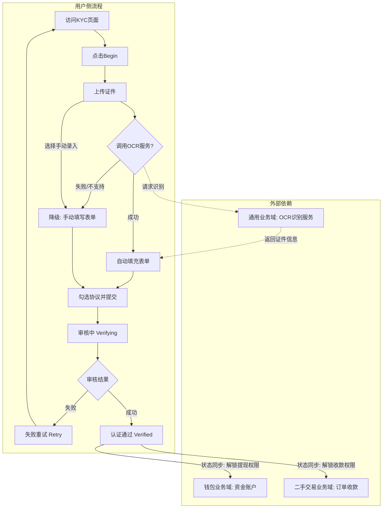
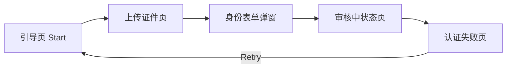
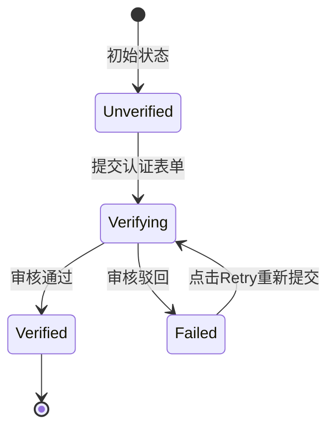

# 用户业务全景

## 1. 业务定位
- **业务价值**：统一管理平台用户的身份信息、认证状态和基础资料，为各业务线提供可信的用户身份基座。
- **目标用户**：平台所有注册用户（包含买家、卖家、企业用户等）。

## 2. 业务范围
- **功能覆盖**：
  - KYC身份认证（Identity Verification）
  - 账号状态管理（正常、认证中、认证失败、已认证、封禁）
- **地域覆盖**：全站（AE站等国际站点）
- **用户角色**：
  - 卖家/发布者：需要通过 KYC 认证以解锁高级权限。
  - 买家：基础身份信息管理。

## 3. 业务流程全景图

> **要求**：全景图必须**详细展示跨域交互与依赖的逻辑分支**。例如：如果涉及钱包，必须画出"未绑定钱包"和"已绑定钱包"的分支；如果涉及AI，必须画出调用AI服务和降级处理的分支。

## 4. 核心业务流程概览

### 4.1 KYC身份认证流程
- **业务目标**：引导卖家完成身份认证以解锁平台高级功能（如提现、收款）。
- **核心步骤**：
  1. 访问引导页并点击 Begin。
  2. 上传证件图片（触发 OCR）或选择手动录入。
  3. 核对并补全身份表单信息。
  4. 勾选用户协议并提交。
  5. 等待审核结果（成功或失败重试）。
- **关键观测点**：
  - ✅ 必填字段为空时前端准确拦截并标红。
  - ✅ 必须勾选用户协议才能提交。
  - ✅ 认证失败后可通过 Retry 按钮重新发起认证。
- **详细流程文档**：[KYC身份认证业务流程](./KYC身份认证业务流程.md)

## 5. 页面拓扑关系

### 5.1 页面入口矩阵
| 页面 | 入口1 | 入口2 | 入口3 |
|------|-------|-------|-------|
| KYC引导页 | 钱包提现拦截跳转 | 交易收款拦截跳转 | 个人中心设置页 |
| KYC上传页 | 引导页点击 Begin | | |
| KYC失败页 | 审核失败后访问 KYC 路由 | | |

### 5.2 页面跳转流程图

### 5.3 页面关系详解
#### 引导页 → 上传页
- **入口**：引导页的 "Begin" 按钮。
- **目标**：进入证件上传环节。
- **权限**：需登录且账号未处于"认证中"或"已认证"状态。

#### 认证失败页 → 引导页
- **入口**：失败页的 "Retry" 按钮。
- **目标**：重新发起认证流程。
- **数据**：清空上一次的表单提交数据。

## 6. 业务数据流转

### 6.1 状态流转图

### 6.2 用户操作与数据变化
| 操作 | 数据变化 | 前台展示变化 | 涉及页面 |
|------|----------|--------------|----------|
| 提交认证表单 | KYC状态变为 Verifying | 显示 "Verifying" 提示 | 表单弹窗 |
| 审核驳回 | KYC状态变为 Failed | 显示 "Verification Failed" 及 Retry 按钮 | 认证状态页 |
| 审核通过 | KYC状态变为 Verified | 解锁提现等高级功能入口 | 全站 |

### 6.3 关键业务数据
| 字段 | 类型 | 必填 | 说明 |
|------|------|------|------|
| Document Type | String | 是 | 证件类型（Passport/Driver's License/National ID） |
| Document Number | String | 是 | 证件号码 |
| Issuing Country | String | 是 | 签发国家 |
| Date of Birth | Date | 是 | 出生日期 |
| First Name | String | 是 | 名字 |
| Last Name | String | 是 | 姓氏 |

## 7. 关键业务规则索引
- [KYC身份认证规则](../../业务规则库/用户模块/KYC身份认证规则.md)

## 8. 业务FAQ
- **Q1: 认证失败了怎么办？**
  - A: 可以在认证失败页面点击 "Retry" 按钮重新上传清晰的证件照片并提交。
- **Q2: 支持哪些证件类型？**
  - A: 目前支持护照 (Passport)、驾照 (Driver's License) 和国民身份证 (National ID)。
- **Q3: 为什么提交按钮点不了？**
  - A: 请检查是否所有必填项都已填写，并且勾选了底部的用户协议复选框。

## 9. 业务指标（可选）
- **9.1 核心指标**：KYC 认证通过率。
- **9.2 漏斗指标**：引导页曝光 -> 点击 Begin -> 成功上传证件 -> 成功提交表单。

## 10. 已知问题与风险
- **10.1 产品待确认问题**：用户协议和隐私政策目前无超链接，无法点击查看详情。
- **10.2 技术风险**：OCR 识别服务若出现延迟或宕机，需确保用户能顺畅切换到 Enter Manually 手动录入模式。

## 11. 变更历史
| 日期 | 版本 | 变更内容 | 变更人 |
|-----|------|---------|--------|
| 2026-03-24 | v1.0 | 初始版本，基于 KYC 测试用例生成 | AI |
