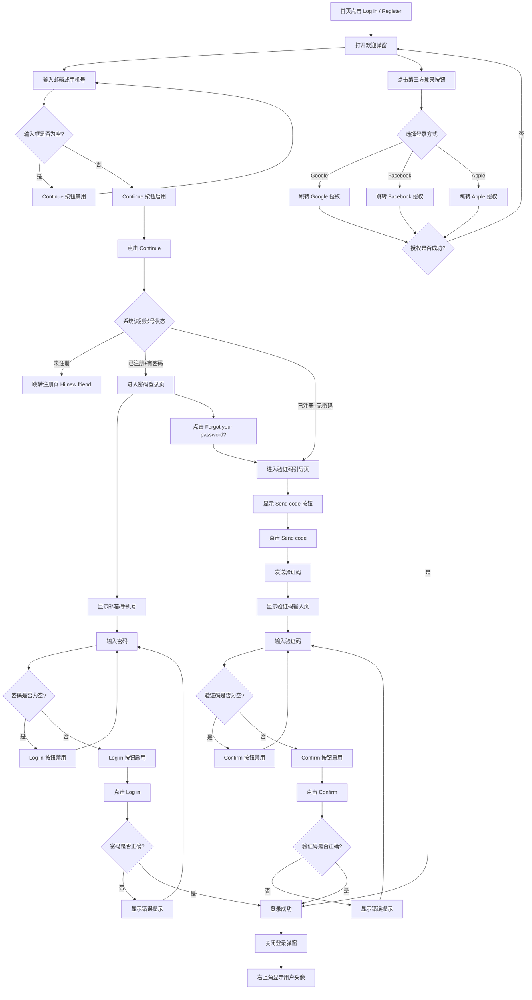

# 登录业务流程

> **业务目标**：为平台用户提供安全便捷的身份认证入口，支持多种登录方式以满足不同用户的需求。

## 1. 完整流程图

> **要求**：专注于本业务域内的详细步骤，**不包含**跨域交互的复杂逻辑分支（跨域逻辑统一在业务全景文档中展示）。

## 2. 详细步骤与观测点

### 步骤1：打开欢迎弹窗
- **页面位置**：首页右上角「Log in / Register」按钮
- **操作流程**：用户点击按钮，打开登录弹窗
- **观测点**：
  - ✅ P0观测点：弹窗显示标题「Welcome to OK.com」和区域标识「AE」
  - ✅ P0观测点：显示副标题「Free to post. Easy to find.」
  - ✅ P0观测点：显示「Email or phone number」输入框，placeholder 为「placeholder」
  - ✅ P0观测点：Continue 按钮初始为 disabled 灰色状态
  - ✅ P0观测点：显示「OR」分隔线
  - ✅ P0观测点：显示 Google、Facebook、Apple 三方登录图标
  - ✅ P0观测点：底部显示隐私声明「By continuing, you accept OK's Terms of Use and confirm that you have read our Privacy Policy.」
  - ✅ P0观测点：左上角显示盾牌图标+「Your data is protected」
- **验证方法**：检查弹窗所有元素是否正确显示，使用 Playwright 定位器验证元素可见性
- **关联规则**：[登录规则.md - 3.1 输入规则](../../业务规则库/用户模块/登录规则.md)

### 步骤2：输入邮箱或手机号
- **页面位置**：欢迎弹窗输入框
- **操作流程**：用户在输入框输入邮箱（如 mamengmeng02@58.com）或手机号（如 501234570）
- **观测点**：
  - ✅ P0观测点：输入邮箱后，Continue 按钮从 disabled 变为可点击状态
  - ✅ P0观测点：输入手机号后，系统自动识别并显示「AE +971」国家码前缀
  - ❌ 负向观测点：输入框为空时，Continue 按钮保持 disabled 状态
  - ❌ 负向观测点：输入非法格式（如 test@ 或纯空格），Continue 后显示格式错误提示
- **验证方法**：分别输入合法邮箱、合法手机号、非法格式、空内容，验证按钮状态和错误提示
- **关联规则**：[登录规则.md - 3.2 校验规则](../../业务规则库/用户模块/登录规则.md)

### 步骤3：进入密码登录页（已注册+有密码）
- **页面位置**：密码登录页
- **操作流程**：输入已注册且有密码的邮箱/手机号后点击 Continue
- **观测点**：
  - ✅ P0观测点：页面标题显示「Welcome back!」
  - ✅ P0观测点：显示用户输入的邮箱地址或手机号（手机号显示「Phone number」小标题）
  - ✅ P0观测点：显示密码输入框，placeholder 为「Enter password」
  - ✅ P0观测点：Log in 按钮初始为 disabled 状态
  - ✅ P0观测点：显示「Forgot your password?」可点击文本
  - ✅ P0观测点：显示返回按钮（左上角）
  - ✅ P1观测点：密码输入框右侧显示眼睛图标，点击可切换密码显示/隐藏
  - ❌ 负向观测点：输入错误密码后点击 Log in，显示错误提示文案
- **验证方法**：使用正确密码和错误密码分别测试，验证登录成功和失败场景
- **关联规则**：[登录规则.md - 3.2 校验规则](../../业务规则库/用户模块/登录规则.md)

### 步骤4：验证码登录流程（未设置密码 / 忘记密码）
- **页面位置**：验证码引导页 → 验证码输入页
- **操作流程**：
  1. 未设置密码账号：Continue 后直接进入验证码引导页，显示「Send code」按钮
  2. 忘记密码：在密码页点击「Forgot your password?」，进入验证码引导页
  3. 点击「Send code」发送验证码
  4. 进入验证码输入页，输入验证码并点击「Confirm」
- **观测点**：
  - ✅ P0观测点（验证码引导页）：显示特殊提示「You haven't added a password to your account yet. Sign in with your email code instead.」
  - ✅ P0观测点（验证码引导页）：显示「Send code」按钮且为 enabled 状态
  - ✅ P0观测点（验证码引导页）：不显示密码输入框
  - ✅ P0观测点（发送后）：显示 Toast 提示「The code has been sent to your email.」（邮箱）或「The code has been sent to your phone.」（手机号）
  - ✅ P0观测点（验证码输入页）：页面标题显示「Verification code」
  - ✅ P0观测点（验证码输入页）：显示说明文案「To continue, complete this verification step. We've sent a verification code to the email: [邮箱]. Please enter it below.」
  - ✅ P0观测点（验证码输入页）：显示验证码输入框，placeholder 为「Enter code」（或以「Enter code」作为可访问名称）
  - ✅ P0观测点（验证码输入页）：显示倒计时（初始 59s），递减到 0s
  - ✅ P0观测点（验证码输入页）：Confirm 按钮在验证码为空时为 disabled 状态，输入后变为 enabled
  - ✅ P1观测点：清空验证码后，Confirm 按钮恢复 disabled 状态
  - ✅ P1观测点：倒计时结束后，按钮文案变为「Resend」并变为可点击状态
- **验证方法**：测试完整验证码登录流程，包括发送、输入、提交、重发等场景
- **关联规则**：[登录规则.md - 3.4 业务约束](../../业务规则库/用户模块/登录规则.md)

### 步骤5：第三方登录（Google / Facebook / Apple）
- **页面位置**：欢迎弹窗下方第三方登录区域
- **操作流程**：点击 Google、Facebook 或 Apple 登录图标/按钮
- **观测点**：
  - ✅ P0观测点：Google 登录按钮存在且可见
  - ✅ P0观测点：Facebook 登录按钮存在且可见
  - ✅ P0观测点：Apple 登录按钮存在且可见
  - ✅ P0观测点：点击后跳转到对应平台的 OAuth 授权页面
  - ❌ 负向观测点：取消授权后，返回登录弹窗（状态未变）
- **验证方法**：点击第三方登录按钮，验证是否正确触发 OAuth 授权流程（完整授权流程需人工测试）
- **关联规则**：[登录规则.md - 3.4 业务约束](../../业务规则库/用户模块/登录规则.md)

### 步骤6：登录成功
- **页面位置**：首页
- **操作流程**：密码正确/验证码正确/第三方授权成功后，系统完成登录
- **观测点**：
  - ✅ P0观测点：登录弹窗自动关闭
  - ✅ P0观测点：右上角「Log in / Register」按钮消失，显示用户头像
  - ✅ P0观测点：点击用户头像，显示下拉菜单，包含「Log Out」选项
  - ✅ P0观测点：Session/Token 已设置，用户处于已登录状态
- **验证方法**：使用 `is_login_button_text_changed()` 方法验证登录状态变化
- **关联规则**：[登录规则.md - 3.3 权限规则](../../业务规则库/用户模块/登录规则.md)

## 3. 流程完整性验证清单

- [x] 验证欢迎弹窗所有元素正确显示
- [x] 验证输入框为空时 Continue 按钮禁用
- [x] 验证输入合法邮箱/手机号后 Continue 按钮启用
- [x] 验证未注册账号自动跳转注册页
- [x] 验证已注册有密码账号进入密码登录页
- [x] 验证密码为空时 Log in 按钮禁用
- [x] 验证输入密码后 Log in 按钮启用
- [x] 验证正确密码登录成功
- [x] 验证错误密码显示错误提示
- [x] 验证密码显示/隐藏切换功能
- [x] 验证未设置密码账号进入验证码引导页
- [x] 验证点击「Forgot your password?」进入验证码流程
- [x] 验证「Send code」发送验证码成功
- [x] 验证验证码输入页倒计时正常运行
- [x] 验证验证码为空时 Confirm 按钮禁用
- [x] 验证输入验证码后 Confirm 按钮启用
- [x] 验证清空验证码后 Confirm 按钮恢复禁用
- [x] 验证倒计时结束后显示 Resend
- [x] 验证 Google 登录按钮存在且可点击
- [x] 验证 Facebook 登录按钮存在且可点击
- [x] 验证 Apple 登录按钮存在且可点击
- [x] 验证登录成功后弹窗关闭并显示用户头像
- [x] 验证返回按钮可返回欢迎页
- [x] 验证点击蒙层关闭弹窗
- [x] 验证按 ESC 键关闭弹窗

## 4. 关联文档

- [用户业务全景](./用户业务全景.md)
- [登录规则](../../业务规则库/用户模块/登录规则.md)

## 5. 变更历史

| 日期 | 版本 | 变更内容 | 变更人 |
|-----|------|---------|--------|
| 2026-04-27 | v1.0 | 初始版本，基于登录模块测试用例生成 | AI |
