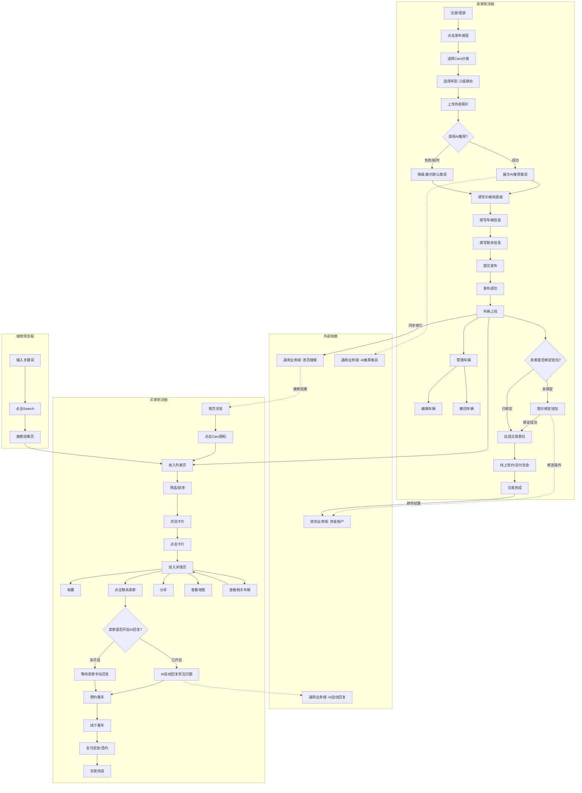
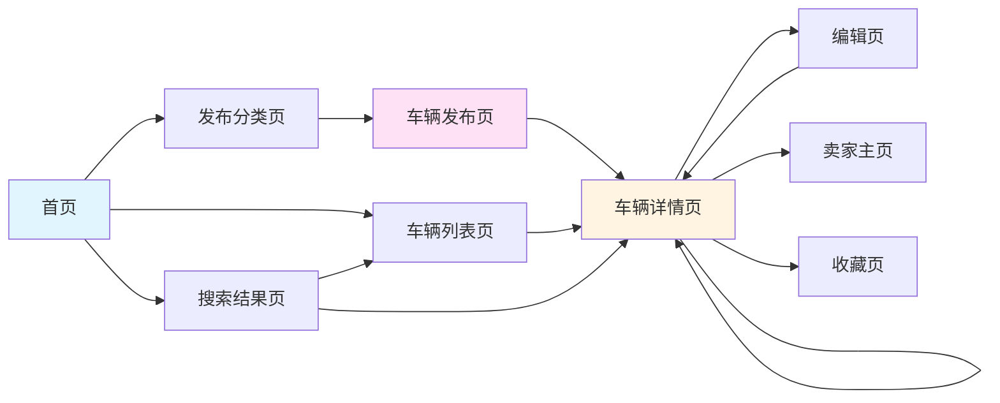
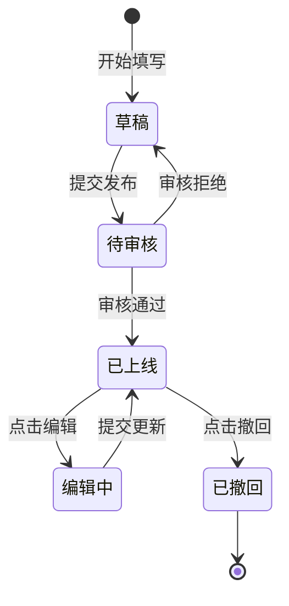

# 车辆业务域 - 业务全景

## 1. 业务定位
车辆业务域是OK.com的核心业务之一,为买家和卖家提供二手车/新车信息发布、浏览、搜索、收藏服务,覆盖多种车型和品牌。

**业务价值**:
- 为卖家提供车辆信息发布和管理平台
- 为买家提供车辆信息浏览、搜索、筛选、收藏服务
- 通过地图视图提供直观的地理位置展示

**目标用户**:
- **卖家/发布者**: 需要出售车辆的个人或车商
- **买家**: 寻找车辆的用户
- **游客**: 未登录的访客,可浏览但功能受限

## 2. 业务范围

### 2.1 分类覆盖
| 分类 | 说明 |
|-----|------|
| Used cars(二手车) | 个人或车商出售的二手车辆 |
| New cars(新车) | 全新车辆 |

### 2.2 地域覆盖
- **AE站**(阿联酋): Abu Dhabi, Dubai, Sharjah等主要城市
- 其他国际站点

### 2.3 用户角色
| 角色 | 权限 | 说明 |
|-----|------|------|
| 游客 | 浏览、搜索 | 收藏/联系需登录 |
| 买家 | 浏览、搜索、收藏、联系、分享 | 已登录用户 |
| 卖家 | 发布、浏览、搜索、收藏、联系、分享 | 已登录且发布过车辆 |
| 发布者 | 所有权限+编辑/撤回自己的车辆 | 车辆所有者 |

## 3. 业务流程全景图

## 4. 核心业务流程概览

### 4.1 车辆发布流程
**业务目标**: 让卖家能快速发布车辆信息,吸引买家

**核心步骤**:
1. 用户登录验证
2. 进入发布分类页
3. 选择Cars分类
4. 选择车型(三级联动: 品牌→车型→配置)
5. 上传外观照片(必填,至少1张)
6. 填写价格(必填,1-100,000,000 AED)
7. 上传内饰照片(可选,最多9张)
8. 填写Description(可选,0-10000字符)
9. 填写车辆信息(里程数、车身颜色、首次注册、规格)
10. 填写联系信息(电话、位置)
11. 提交发布
12. 验证详情页展示
13. 验证列表页展示

**关键观测点**:
- ✅ 未登录用户无法访问发布页
- ✅ 车型三级联动选择正常
- ✅ 外观照片至少1张,最多9张
- ✅ 价格/里程数校验生效(范围、负数、0值)
- ✅ 所有必填字段校验生效
- ✅ 发布成功后立即在详情页、列表页展示
- ✅ 发布者可见Edit/Withdraw按钮

**详细流程文档**: [车辆发布业务流程.md](./车辆发布业务流程.md)

---

### 4.2 车辆浏览流程
**业务目标**: 让买家能快速找到符合需求的车辆

**核心步骤**:
1. 进入列表页(默认Used cars)
2. 筛选车辆(城市、价格、里程、品牌)
3. 排序车辆(Price: Low to High / High to Low / Most recent / Lowest Mileage)
4. 浏览卡片列表
5. 进入详情页
6. 查看详情页信息(主图、价格、描述、车辆信息、基本特征、位置)
7. 收藏车辆
8. 联系卖家
9. 查看相关车辆推荐

**关键观测点**:
- ✅ 筛选和排序参数在翻页时保持
- ✅ 列表页可自由切换城市
- ✅ 收藏功能正常,状态同步
- ✅ 面包屑导航正常
- ✅ 相关车辆推荐正常

**详细流程文档**: [车辆浏览业务流程.md](./车辆浏览业务流程.md)

---

### 4.3 车辆搜索流程
**业务目标**: 让买家通过关键词快速定位车辆

**核心步骤**:
1. 打开搜索框
2. 输入关键词(如"Toyota")
3. 点击Search或按Enter
4. 查看搜索结果(列表页)
5. 搜索结果可筛选和排序

**关键观测点**:
- ✅ 关键词搜索正常,URL参数正确
- ✅ 搜索结果可筛选和排序
- ✅ 搜索结果为空时显示空态
- ✅ 特殊字符搜索不执行XSS脚本

---

### 4.4 车辆收藏流程
**业务目标**: 让买家能保存感兴趣的车辆,方便后续查看

**核心步骤**:
1. 识别收藏入口(详情页Favourites按钮)
2. 未登录点击收藏(弹出登录框)
3. 登录后收藏(按钮变为已收藏状态)
4. 取消收藏(按钮变为未收藏状态)
5. 查看收藏页(显示所有收藏)

**关键观测点**:
- ✅ 未登录点击收藏弹出登录框
- ✅ 登录后收藏成功
- ✅ 刷新页面收藏状态保持

---

### 4.5 车辆管理流程
**业务目标**: 让发布者能管理自己发布的车辆

**核心步骤**:
1. 识别管理入口(详情页Edit/Withdraw按钮)
2. 编辑车辆(修改信息后提交)
3. 撤回车辆(确认撤回)

**关键观测点**:
- ✅ 仅发布者可见Edit/Withdraw按钮
- ✅ 编辑后详情页信息更新
- ✅ 撤回后列表页移除,详情页显示"已撤回"

---

## 5. 页面拓扑关系

### 5.1 页面入口矩阵
| 页面 | 入口1 | 入口2 | 入口3 | 入口4 | 入口5 |
|-----|------|------|------|------|------|
| 列表页 | 首页 Cars 图标 | Browse 菜单 | 搜索结果 | - | - |
| 详情页 | 列表页卡片点击 | 相关车辆卡片点击 | 搜索结果 | 直接 URL | - |
| 发布页 | 首页发布按钮 → Cars分类 | - | - | - | - |
| 编辑页 | 详情页 Edit 按钮 | - | - | - | - |
| 收藏页 | 顶部用户菜单 | - | - | - | - |

### 5.2 页面跳转流程图

**页面关系说明**:
- **首页** → 车辆列表页(点击Cars图标)
- **首页** → 发布分类页(点击Post按钮)
- **发布分类页** → 车辆发布页(点击Cars分类)
- **车辆发布页** → 车辆详情页(提交成功)
- **车辆列表页** → 车辆详情页(点击卡片)
- **车辆详情页** → 编辑页(点击Edit按钮,仅发布者)
- **编辑页** → 车辆详情页(提交成功)
- **车辆详情页** → 卖家主页(点击卖家头像/用户名)
- **车辆详情页** → 收藏页(点击收藏后查看)
- **车辆详情页** → 车辆详情页(点击相关车辆)

### 5.3 页面关系详解

#### 首页 → 列表页
- **入口**: 点击 Cars 图标 / Browse 菜单
- **目标**: Used cars 列表页(默认) / New cars 列表页
- **参数**: 无(首次进入)

#### 列表页 → 详情页
- **入口**: 点击车辆卡片
- **打开方式**: 新标签页(PC) / 当前页跳转(M端)
- **参数**: 车辆 ID
- **URL格式**: /en/city/cate-car-used-car/<car-model>-<post_id>/

#### 首页 → 发布页
- **入口**: 点击发布按钮
- **流程**: 首页 → 发布分类页 → 选择Cars分类 → 车辆发布页
- **权限**: 未登录则先跳转登录页
- **URL**: /biz/en/cars/publish?categoryId=6548

#### 详情页 → 编辑页
- **入口**: 点击 Edit 按钮
- **权限**: 仅发布者可见
- **流程**: 详情页 → 编辑页 → 提交 → 详情页
- **URL**: /biz/en/cars/publish?id=<post_id>
- **数据**: 编辑页预填所有已填写数据

#### 详情页 → 收藏页
- **入口**: 点击收藏图标后,可从用户菜单进入收藏页
- **权限**: 需登录
- **未登录行为**: 弹出登录框(Welcome to OK.com)

#### 详情页 → 相关车辆
- **入口**: 点击 Related Cars 区域的车辆卡片
- **流程**: 当前详情页 → 新车辆详情页
- **数据**: URL和标题更新为新车辆信息

---

## 6. 业务数据流转

**状态说明**:
- **草稿**: 用户填写中,未提交
- **待审核**: 已提交,等待系统审核(如有)
- **已上线**: 审核通过,在列表页/详情页展示
- **编辑中**: 发布者编辑车辆信息
- **已撤回**: 发布者主动撤回,不再展示

### 6.2 用户操作与数据变化

#### 6.2.1 发布操作数据变化
| 用户操作 | 前端数据变化 | 后端数据变化 | 页面变化 | 观测点 |
|---------|------------|------------|---------|-------|
| 选择车型 | Car model字段填充完整车型信息 | - | 字段显示选中车型 | 车型信息格式正确 |
| 上传外观照片 | 图片预览区显示缩略图,计数器更新 | 图片上传到服务器 | 图片预览正常,计数器显示"1/9" | 图片上传成功,预览清晰 |
| 上传内饰照片 | 内饰图片预览区显示缩略图,计数器更新 | 图片上传到服务器 | 图片预览正常,计数器显示"1/9" | 图片上传成功 |
| 填写价格 | Price字段值更新 | - | 字段显示输入值 | 价格格式正确,边界值处理正确 |
| 填写Description | Description字段值更新,字符计数器更新 | - | 字段显示输入内容,计数器显示"152/10000" | 字符计数准确 |
| 填写里程数 | Mileage字段值更新 | - | 字段显示输入值 | 里程数格式正确,边界值处理正确 |
| 选择车身颜色 | Body Color按钮状态变为"Selected" | - | 选中按钮高亮 | 单选逻辑正确 |
| 选择规格 | Specs按钮状态变为"Selected" | - | 选中按钮高亮 | 单选逻辑正确 |
| 填写联系电话 | Contact Phone字段值更新 | - | 字段显示输入值 | 手机号格式校验生效 |
| 填写位置 | Location字段值更新 | - | 字段显示选中位置 | 位置搜索建议正常 |
| 点击Post提交 | 表单数据提交到服务器 | 创建车辆记录,生成post_id | 跳转到详情页,URL包含post_id | 详情页信息完整,列表页显示新车 |

#### 6.2.2 浏览操作数据变化
| 用户操作 | 前端数据变化 | 后端数据变化 | 页面变化 | 观测点 |
|---------|------------|------------|---------|-------|
| 切换城市 | Location Tag更新为新城市 | 请求新城市车辆列表 | 列表刷新,显示新城市车辆 | URL更新为city-{city},页面标题更新 |
| 设置价格区间 | Price Tag显示已选区间 | 请求价格区间内车辆 | 列表刷新,显示符合条件车辆 | 筛选结果正确 |
| 设置里程区间 | Mileage Tag显示已选区间 | 请求里程区间内车辆 | 列表刷新,显示符合条件车辆 | 筛选结果正确 |
| 选择品牌 | Brand Tag显示已选品牌 | 请求指定品牌车辆 | 列表刷新,显示该品牌车辆 | 筛选结果正确,支持多品牌OR逻辑 |
| 选择排序 | Sort按钮状态更新 | 请求排序后车辆列表 | 列表刷新,按选择方式排序 | 排序结果正确 |
| 点击Reset | 所有筛选Tag清除 | 请求默认车辆列表 | 列表恢复默认展示 | Filter按钮角标清零 |
| 翻页 | 列表区域刷新 | 请求下一页数据 | 列表显示下一页车辆 | URL参数保留筛选条件 |
| 点击车辆卡片 | - | 请求车辆详情数据 | 跳转到详情页 | 详情页信息完整 |

#### 6.2.3 详情页操作数据变化
| 用户操作 | 前端数据变化 | 后端数据变化 | 页面变化 | 观测点 |
|---------|------------|------------|---------|-------|
| 点击收藏(未登录) | 弹出登录框 | - | 显示登录框 | 登录框内容正确 |
| 点击收藏(已登录-未收藏) | Favourites按钮状态变为已收藏 | 创建收藏记录 | 按钮图标/文案更新 | 收藏状态正确 |
| 点击收藏(已登录-已收藏) | Favourites按钮状态变为未收藏 | 删除收藏记录 | 按钮图标/文案更新 | 取消收藏成功 |
| 点击Contact(未登录) | 弹出登录框 | - | 显示登录框 | 登录框内容正确 |
| 点击Contact(已登录) | 进入联系卖家流程 | 创建聊天会话或发送联系请求 | 打开聊天窗口或跳转 | 联系功能正常 |
| 点击Share | 复制链接到剪贴板 | - | 显示"Link copied"提示 | 提示2秒后消失,页面不跳转 |
| 点击Show map | 弹出地图弹窗 | - | 显示地图和车辆位置标记 | 地图加载正常,标记位置正确 |
| 点击相关车辆 | - | 请求新车辆详情数据 | 跳转到新车辆详情页 | URL和标题更新为新车 |
| 点击Edit | - | 请求车辆编辑数据 | 跳转到编辑页,预填所有数据 | 编辑页数据完整 |
| 点击Withdraw | 显示确认对话框 | - | 显示确认对话框 | 对话框内容正确 |
| 确认撤回 | - | 更新车辆状态为已撤回 | 跳转到我的发布列表或首页 | 列表页移除该车辆 |

#### 6.2.4 编辑操作数据变化
| 用户操作 | 前端数据变化 | 后端数据变化 | 页面变化 | 观测点 |
|---------|------------|------------|---------|-------|
| 修改车型 | Car model字段更新 | - | 字段显示新车型 | 车型信息正确 |
| 修改图片 | 图片预览区更新 | 图片上传/删除 | 图片预览更新 | 图片操作成功 |
| 修改价格 | Price字段值更新 | - | 字段显示新价格 | 价格格式正确 |
| 修改Description | Description字段值更新,字符计数器更新 | - | 字段显示新内容 | 字符计数准确 |
| 修改车辆信息 | 对应字段值更新 | - | 字段显示新值 | 字段校验生效 |
| 提交编辑 | 表单数据提交到服务器 | 更新车辆记录 | 跳转到详情页,信息更新 | 详情页显示"Updated X min ago" |

### 6.3 关键业务数据

#### 6.3.1 车辆发布数据
| 数据项 | 数据类型 | 必填 | 取值范围 | 说明 | 观测点 |
|-------|---------|-----|---------|------|-------|
| post_id | String | 自动生成 | UUID | 车辆唯一标识 | 详情页URL包含post_id |
| car_model | String | 是 | 品牌+型号+配置 | 车型完整信息 | 三级联动选择正确 |
| exterior_photos | Array | 是 | 1-9张 | 外观照片数组 | 至少1张,最多9张 |
| interior_photos | Array | 否 | 0-9张 | 内饰照片数组 | 最多9张 |
| price | Number | 是 | 1-100,000,000 | 价格(AED) | 价格为0提交失败 |
| description | String | 否 | 0-10,000字符 | 卖家描述 | 字符计数准确 |
| mileage | Number | 是 | 0-99,999,999 | 里程数(km) | 负数被拒绝,超过最大值截断 |
| body_color | String | 是 | 枚举值 | 车身颜色 | 单选逻辑正确 |
| first_registration | String | 否 | MM/YYYY | 首次注册日期 | 为空时可提交 |
| specs | String | 是 | 枚举值 | 规格(GCC/European等) | 单选逻辑正确 |
| contact_phone | String | 是 | 手机号格式 | 联系电话 | 格式校验生效 |
| location | String | 是 | 地址字符串 | 车辆位置 | 位置搜索建议正常 |
| seller_id | String | 自动生成 | UUID | 卖家ID | 关联卖家信息 |
| status | String | 自动生成 | 枚举值 | 车辆状态 | 草稿/待审核/已上线/已撤回 |
| created_at | Timestamp | 自动生成 | ISO 8601 | 创建时间 | 详情页显示"Posted X min ago" |
| updated_at | Timestamp | 自动生成 | ISO 8601 | 更新时间 | 编辑后显示"Updated X min ago" |

#### 6.3.2 车辆列表数据
| 数据项 | 数据类型 | 说明 | 观测点 |
|-------|---------|------|-------|
| total_count | Number | 总车辆数 | 分页计算正确 |
| page | Number | 当前页码 | URL参数正确 |
| page_size | Number | 每页显示数量 | 20-30条 |
| cars | Array | 车辆列表数组 | 每个车辆包含基本信息 |
| filters | Object | 筛选条件对象 | 包含city/price/mileage/brand等 |
| sort | String | 排序方式 | price_asc/price_desc/recent/mileage_asc |

#### 6.3.3 车辆详情数据
| 数据项 | 数据类型 | 说明 | 观测点 |
|-------|---------|------|-------|
| post_id | String | 车辆唯一标识 | URL包含post_id |
| car_model | String | 车型完整信息 | 详情页标题显示 |
| price | Number | 价格 | 带千分位逗号,格式"AED 1,234,567" |
| exterior_photos | Array | 外观照片数组 | 主图轮播正常 |
| interior_photos | Array | 内饰照片数组 | 内饰照片展示正常 |
| description | String | 卖家描述 | Seller's Note区域显示 |
| mileage | Number | 里程数 | Vehicle Info显示 |
| body_color | String | 车身颜色 | Vehicle Info显示 |
| first_registration | String | 首次注册日期 | Vehicle Info显示(为空时不显示) |
| specs | String | 规格 | Vehicle Info显示 |
| fuel_type | String | 燃料类型 | Basic Features显示 |
| drive_type | String | 驱动类型 | Basic Features显示 |
| engine | String | 发动机排量 | Basic Features显示 |
| transmission | String | 变速箱类型 | Basic Features显示 |
| location | String | 车辆位置 | Location区域显示,Show map按钮正常 |
| seller_info | Object | 卖家信息对象 | 包含头像/用户名/ID |
| is_favorited | Boolean | 是否已收藏 | Favourites按钮状态正确 |
| related_cars | Array | 相关车辆数组 | Related Cars区域显示 |
| created_at | Timestamp | 创建时间 | 显示"Posted X min ago" |
| updated_at | Timestamp | 更新时间 | 编辑后显示"Updated X min ago" |

#### 6.3.4 收藏数据
| 数据项 | 数据类型 | 说明 | 观测点 |
|-------|---------|------|-------|
| user_id | String | 用户ID | 关联用户 |
| post_id | String | 车辆ID | 关联车辆 |
| favorited_at | Timestamp | 收藏时间 | 收藏页按时间排序 |

#### 6.3.5 编辑与撤回数据
| 数据项 | 数据类型 | 说明 | 观测点 |
|-------|---------|------|-------|
| post_id | String | 车辆ID | 编辑页URL包含id参数 |
| updated_fields | Object | 更新字段对象 | 包含所有修改的字段 |
| status | String | 车辆状态 | 撤回后变为"已撤回" |
| withdrawn_at | Timestamp | 撤回时间 | 记录撤回时间 |

## 7. 关键业务规则索引

### 7.1 发布相关
- [车辆发布规则.md](../../../业务规则库/车辆模块/车辆发布规则.md)
  - 车型选择规则(三级联动)
  - 图片/视频上传规则(外观1-9张,内饰0-9张)
  - 价格设置规则(1-100,000,000 AED)
  - Description描述规则(0-10000字符)
  - 车辆信息字段规则(里程/颜色/注册/规格)
  - 联系信息规则(电话/位置)
  - 表单提交与验证规则
  - 编辑与撤回规则

### 7.2 浏览相关
- [车辆列表页规则.md](../../../业务规则库/车辆模块/车辆列表页规则.md)
  - 页面初始加载规则
  - Sort排序规则(Price/Most recent/Lowest Mileage)
  - Filter综合筛选规则(角标数字,多条件组合)
  - Location城市筛选规则(Abu Dhabi/Dubai/Sharjah)
  - Price价格区间筛选规则
  - Mileage里程区间筛选规则
  - Brand品牌筛选规则(单选/多选,搜索功能)
  - Reset重置功能规则
  - 筛选Tag展示与交互规则
  - 搜索框规则(关键词搜索/空值/特殊字符/超长字符串)
  - 列表卡片展示规则
  - 空状态规则
  - 分页规则
  - 面包屑导航规则
  - 会话与状态规则
  - 健壮性与兼容性规则
- [车辆详情页规则.md](../../../业务规则库/车辆模块/车辆详情页规则.md)
  - 页面展示规则
  - 收藏功能规则(未登录弹登录框,已登录收藏成功)
  - 联系功能规则(未登录弹登录框,已登录进入联系流程)
  - 分享功能规则(复制链接,"Link copied"提示)
  - 地图弹窗规则(Show map/close/ESC/Google Maps链接)
  - 面包屑导航规则(Home/Cars/Used cars)
  - 相关车辆推荐规则(横向滚动,左右箭头)
  - Vehicle Info展示规则(Specs/Mileage/Body Color/First Registration)
  - Basic Features展示规则(Fuel Type/Drive Type/Engine/Transmission)
  - Seller's Note展示规则
  - 顶部搜索规则
  - 卖家信息规则
  - 图片查看器规则
  - 权限规则
  - 危险操作规则(Edit/Withdraw)

## 8. 业务FAQ

### Q1: 车辆发布需要哪些必填字段?
**A**: 车型(三级联动选择)、价格(1-100,000,000 AED)、外观照片(至少1张)、里程数(0-99,999,999 km)、车身颜色、规格(Specs)、联系电话、位置。

### Q2: 外观照片和内饰照片的上传限制是什么?
**A**: 外观照片必填,1-9张;内饰照片可选,0-9张。支持格式: JPG/PNG。第一张外观照片为主图。

### Q3: 车型如何选择?
**A**: 通过三级联动对话框选择: 品牌→车型→配置。选择完成后对话框关闭,Car model字段显示完整车型信息(如"Audi A6 2025 2.0L 190 HP Petrol Auto FWD")。

### Q4: 列表页支持哪些排序方式?
**A**: Price: Low to High(价格升序)、Price: High to Low(价格降序)、Most recent(最新发布)、Lowest Mileage(里程最低)。

### Q5: 列表页支持哪些筛选条件?
**A**: Location(城市)、Price(价格区间)、Mileage(里程区间)、Brand(品牌)、Filter综合筛选(Category/Year/Transmission等)。支持多条件组合筛选(AND逻辑)。

### Q6: 未登录用户可以收藏车辆吗?
**A**: 不可以。未登录点击Favourites会弹出登录框(Welcome to OK.com),登录成功后可收藏。

### Q7: 如何联系卖家?
**A**: 在详情页点击Contact按钮。未登录会弹出登录框,已登录进入联系卖家流程(打开聊天/表单弹窗或跳转)。

### Q8: 车辆撤回后还能访问详情页吗?
**A**: 可以访问,但详情页会显示"已撤回"状态,不再在列表页展示。

## 9. 业务指标(可选)

### 9.1 核心指标
- **日均发布量**: XXX条
- **日均浏览量**: XXX次
- **日均搜索量**: XXX次
- **收藏转化率**: XX%(收藏数/详情页访问数)
- **搜索使用率**: XX%(搜索用户数/总访问用户数)

### 9.2 漏斗指标
- **发布漏斗**: 进入发布页→填写表单→提交成功
- **浏览漏斗**: 列表页→详情页→收藏/联系卖家
- **搜索漏斗**: 搜索→点击结果→详情页

## 10. 已知问题与风险

### 10.1 产品待确认问题
1. Location搜索建议选择: 按Enter键会直接提交表单,而不是选择搜索建议
2. Contact Phone验证不一致: 字段标记为必填(*),但清空后仍可提交
3. 图片上传计数: 上传1张外观照片后,计数器显示"2/9",可能系统自动生成了缩略图
4. 价格和里程数边界值提示缺失: 没有明确的UI提示说明有效范围

### 10.2 技术风险
- 地图服务依赖Google Maps,可能存在加载失败风险
- 图片上传依赖第三方存储服务,可能存在上传失败风险
- 搜索联想依赖车型数据库,可能存在匹配不准确风险

## 11. 变更历史
| 日期 | 版本 | 变更内容 | 变更人 |
|-----|------|---------|--------|
| 2026-03-24 | v1.0 | 初始版本,基于车辆模块3个规则文档整合 | AI |
