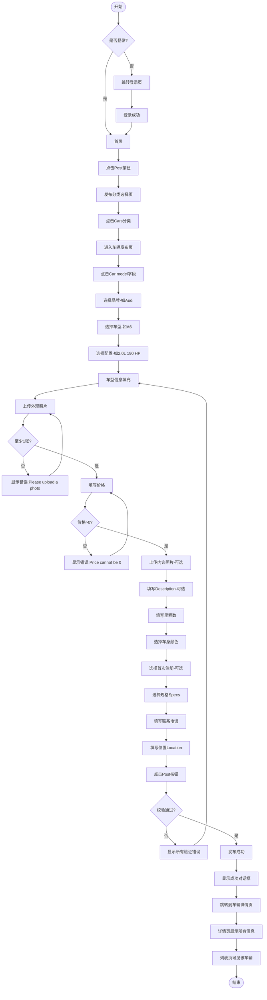

# 车辆发布业务流程

> **业务目标**: 让卖家能快速发布车辆信息,吸引买家

---

## 1. 完整流程图

---

## 2. 详细步骤与观测点

### 步骤1: 用户登录验证
**页面位置**: 任意页面

**操作**:
- 检查用户登录状态

**观测点**:
- ✅ 已登录用户: 可直接访问发布页
- ❌ 未登录用户: 点击发布按钮后,自动重定向到登录页
- ✅ 登录成功后: 返回发布流程

**验证方法**:
- 清除登录态,点击发布按钮,观察是否跳转登录页
- 登录后,观察是否返回发布分类页

**关联规则**: [车辆发布规则.md - 2.2 异常流程](../../../业务规则库/车辆模块/车辆发布规则.md#22-异常流程)

---

### 步骤2: 进入发布分类页
**页面位置**: 首页

**操作**:
- 点击首页右上角发布图标/按钮

**观测点**:
- ✅ URL跳转到发布分类页(https://aepub.58v5.cn/biz/en/publish/front)
- ✅ 页面显示"Post"标题
- ✅ 显示所有发布分类: Jobs、Property、Marketplace、Services、Community、Cars

**验证方法**:
- 点击发布按钮,观察URL是否变化
- 观察页面是否显示分类列表
- 尝试点击Cars分类

**关联规则**: [车辆发布规则.md - 1. 功能概述 - 入口位置](../../../业务规则库/车辆模块/车辆发布规则.md#1-功能概述)

---

### 步骤3: 选择车型(三级联动)
**页面位置**: 车辆发布页

**操作**:
1. 点击Car model字段,打开车型选择对话框
2. 选择品牌(如Audi),进入车型选择页
3. 选择车型(如A6),进入配置选择页
4. 选择配置(如"2.0L 190 HP Petrol Auto FWD"),对话框关闭

**观测点**:
- ✅ 点击Car model字段,对话框打开,显示"Select Car Brand"标题
- ✅ 选择品牌后,对话框标题变为"Select Car Model"
- ✅ 选择车型后,对话框标题变为"Select Car Trim"
- ✅ 选择配置后,对话框自动关闭
- ✅ Car model字段显示完整车型信息: "Audi A6 2025 2.0L 190 HP Petrol Auto FWD"
- ✅ 每级显示返回按钮可返回上级
- ✅ 点击关闭或按ESC,对话框关闭且不填充数据

**验证方法**:
- 点击Car model字段,观察对话框是否打开
- 依次选择品牌→车型→配置,观察标题变化
- 观察Car model字段是否正确填充
- 测试返回按钮功能
- 测试取消选择功能

**关联规则**: [车辆发布规则.md - 3.1 车型选择规则](../../../业务规则库/车辆模块/车辆发布规则.md#31-车型选择规则)

---

### 步骤4: 上传外观照片和内饰照片
**页面位置**: 车辆发布页

**操作**:
1. 点击"Exterior Photos *"上传区域,选择图片上传
2. 点击"Interior Photos"上传区域,选择图片上传(可选)
3. 点击图片缩略图打开图片查看器
4. 在图片查看器中设置主图或删除图片

**观测点**:
- ✅ 外观照片上传成功,显示图片缩略图
- ✅ 计数器显示已上传数量/最大数量(如"1/9"或"2/9")
- ✅ 第一张图片标记为"Main"(主图)
- ✅ 内饰照片上传成功,显示图片缩略图
- ✅ 点击图片缩略图,打开图片查看器对话框
- ✅ 图片查看器显示当前图片大图,提供"Set as Main"、"Delete"按钮
- ✅ 可左右切换查看其他图片
- ✅ 点击"Set as Main",当前图片被设置为主图,按钮文本变为"Main"
- ✅ 点击"Delete",图片被删除,计数器数量减1
- ✅ 上传9张外观照片后,上传按钮变为disabled或隐藏
- ✅ 尝试上传第10张照片,被拒绝或提示已达到最大数量限制
- ❌ 外观照片为空时提交,显示错误"Please upload a photo before submitting."

**验证方法**:
- 上传1张外观照片,观察计数器和主图标记
- 上传9张外观照片,观察上传按钮状态
- 尝试上传第10张,观察是否被拒绝
- 点击图片缩略图,观察图片查看器功能
- 测试Set as Main和Delete功能
- 不上传外观照片直接提交,观察错误提示

**关联规则**: [车辆发布规则.md - 3.2 图片/视频上传规则](../../../业务规则库/车辆模块/车辆发布规则.md#32-图片视频上传规则)

---

### 步骤5: 填写价格、Description、车辆信息
**页面位置**: 车辆发布页

**操作**:
1. 在Price字段输入价格(如150000)
2. 在Description字段输入描述(可选,0-10000字符)
3. 在Mileage字段输入里程数(如50000)
4. 选择车身颜色(如Black)
5. 选择首次注册月份和年份(可选,如06/2024)
6. 选择规格Specs(如GCC)

**观测点**:
- ✅ 价格输入成功,无验证错误提示
- ❌ 价格为0时提交,显示错误"Price cannot be 0.",焦点移动到Price字段
- ✅ 负数输入被自动拒绝或去除
- ✅ 价格超过100,000,000时,输入被自动截断为100,000,000
- ✅ Description输入成功,字段下方显示字符计数(如"152/10000")
- ✅ Description达到10000字符时,无法继续输入
- ✅ Description为空时可以成功提交
- ✅ 里程数输入成功,无验证错误提示
- ✅ 里程数负号被自动去除,字段值显示为正数
- ✅ 里程数超过99,999,999时,输入被自动截断为99,999,999
- ❌ 里程数为空时提交,显示错误"Please fill out this field."
- ✅ 车身颜色选择成功,按钮状态变为"Selected"
- ❌ 车身颜色为空时提交,显示错误"Please fill out this field."
- ✅ 首次注册月份和年份选择成功,字段显示"06/2024"
- ✅ 首次注册为空时可以成功提交
- ✅ 规格选择成功,按钮状态变为"Selected"
- ❌ 规格为空时提交,显示错误"Please fill out this field."

**验证方法**:
- 输入有效价格,观察是否接受
- 输入0、负数、超大值,观察校验行为
- 输入Description,观察字符计数
- 输入10000字符,观察是否可继续输入
- 输入有效里程数,观察是否接受
- 输入负数、超大值,观察校验行为
- 选择车身颜色、首次注册、规格,观察选中态
- 不填写必填项直接提交,观察错误提示

**关联规则**: 
- [车辆发布规则.md - 3.3 价格设置规则](../../../业务规则库/车辆模块/车辆发布规则.md#33-价格设置规则)
- [车辆发布规则.md - 3.4 Description描述规则](../../../业务规则库/车辆模块/车辆发布规则.md#34-description描述规则)
- [车辆发布规则.md - 3.5 车辆信息字段规则](../../../业务规则库/车辆模块/车辆发布规则.md#35-车辆信息字段规则)

---

### 步骤6: 填写联系信息
**页面位置**: 车辆发布页

**操作**:
1. 观察Contact Phone字段是否有预填值
2. 在Location字段输入关键词(如"Dubai Mall")
3. 点击搜索建议或按Enter键选择位置

**观测点**:
- ✅ Contact Phone字段显示预填的电话号码
- ✅ 预填值可以修改
- ⚠️ 清空Contact Phone后仍可提交(验证不一致问题)
- ✅ Location输入关键词,显示位置搜索建议列表
- ✅ 点击搜索建议,位置信息填充到字段中,搜索建议列表关闭
- ⚠️ 按Enter键会触发表单提交(UX问题)
- ✅ 点击"Locate me"按钮,浏览器请求地理位置权限,自动填充当前位置信息

**验证方法**:
- 观察Contact Phone字段是否有预填值
- 清空Contact Phone后提交,观察是否成功
- 在Location输入关键词,观察搜索建议
- 点击搜索建议,观察位置是否填充
- 测试"Locate me"按钮功能

**关联规则**: [车辆发布规则.md - 3.6 联系信息规则](../../../业务规则库/车辆模块/车辆发布规则.md#36-联系信息规则)

---

### 步骤7: 提交发布并验证
**页面位置**: 车辆发布页 → 车辆详情页

**操作**:
1. 点击Post按钮提交表单
2. 观察提交结果
3. 验证详情页信息完整性

**观测点**:
- ❌ 仅填写部分必填字段提交,显示所有验证错误,页面滚动到第一个错误字段
- ✅ 填写所有必填字段后提交,提交成功,显示成功对话框
- ✅ 自动跳转到车辆详情页
- ✅ 详情页URL格式为: /en/city/cate-car-used-car/<car-model>-<post_id>/
- ✅ 详情页显示"Posted 0 min ago"
- ✅ 详情页显示所有填写的信息: 车型/价格/里程/颜色/规格/外观照片/内饰照片/Description/首次注册/位置
- ✅ 详情页提供Edit和Withdraw按钮

**验证方法**:
- 仅填写部分必填字段提交,观察错误提示
- 填写所有必填字段提交,观察成功对话框
- 观察详情页URL格式
- 验证详情页所有信息是否正确显示
- 验证Edit和Withdraw按钮是否可见

**关联规则**: [车辆发布规则.md - 3.7 表单提交与验证规则](../../../业务规则库/车辆模块/车辆发布规则.md#37-表单提交与验证规则)

---

## 3. 流程完整性验证清单

- [ ] 未登录点击Post是否跳转登录页
- [ ] 登录成功后是否自动返回发布分类页
- [ ] 点击Cars分类是否进入车辆发布页
- [ ] 车型三级联动是否正常(品牌→车型→配置)
- [ ] 外观照片至少1张,最多9张
- [ ] 内饰照片最多9张
- [ ] 价格为0时是否显示错误提示
- [ ] 价格超过100,000,000时是否自动截断
- [ ] 负数价格是否被拒绝
- [ ] Description字符计数是否正确显示
- [ ] Description达到10000字符时是否无法继续输入
- [ ] 里程数为空时是否显示错误提示
- [ ] 里程数负号是否被自动去除
- [ ] 里程数超过99,999,999时是否自动截断
- [ ] 车身颜色为空时是否显示错误提示
- [ ] 规格为空时是否显示错误提示
- [ ] 首次注册为空时是否可以成功提交
- [ ] Location搜索建议是否正常显示
- [ ] 仅填写部分必填字段提交是否显示所有验证错误
- [ ] 填写所有必填字段提交是否成功
- [ ] 提交成功后是否跳转到详情页
- [ ] 详情页是否显示所有填写的信息
- [ ] 详情页是否提供Edit和Withdraw按钮

---

## 4. 关联文档

- [车辆业务全景](./车辆业务全景.md)
- [车辆发布规则.md](../../../业务规则库/车辆模块/车辆发布规则.md)

---

## 5. 变更历史

| 日期 | 版本 | 变更内容 | 变更人 |
|-----|------|---------|--------|
| 2026-03-24 | v1.0 | 初始版本,基于OK-AE-车发布页测试用例(50条)生成 | AI |
