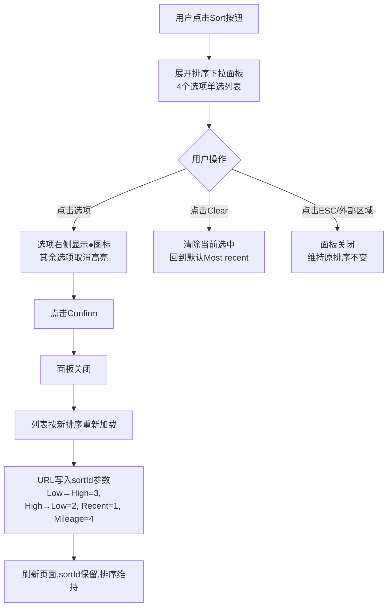
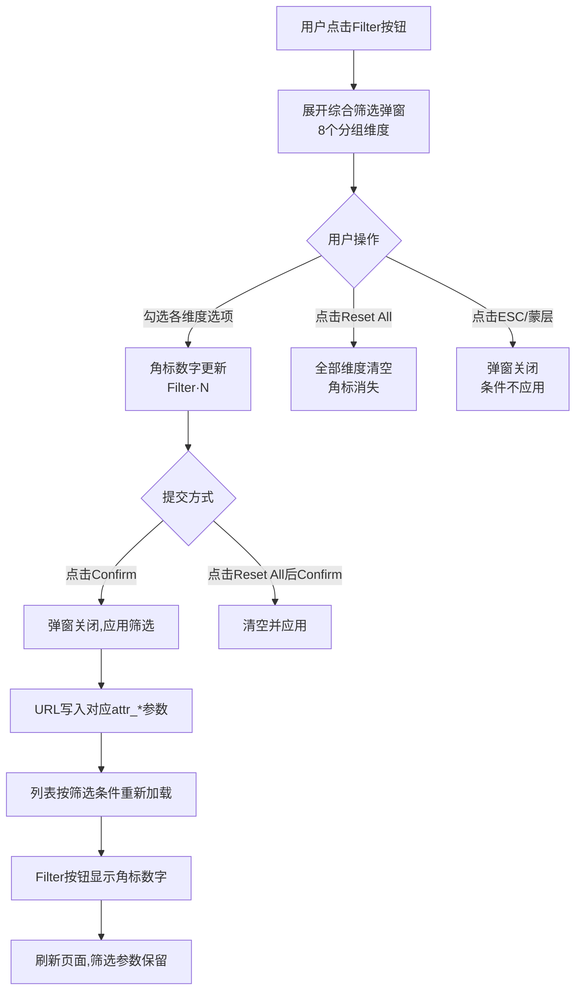
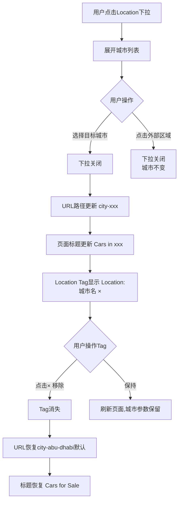
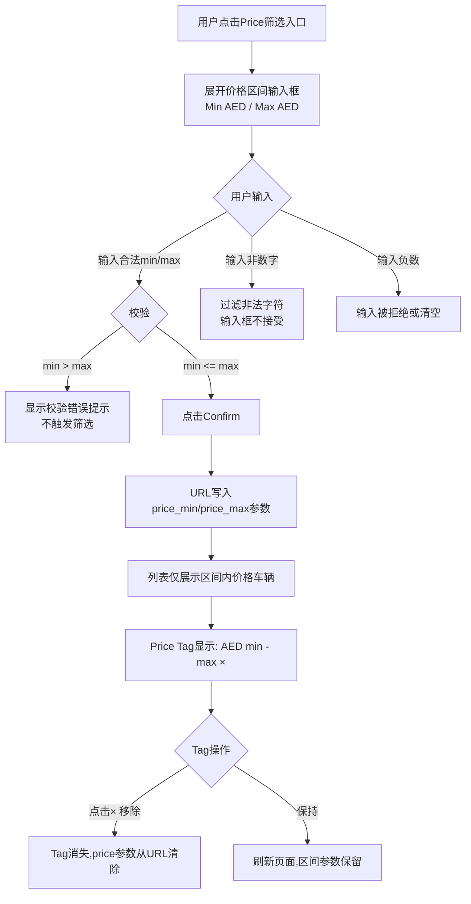
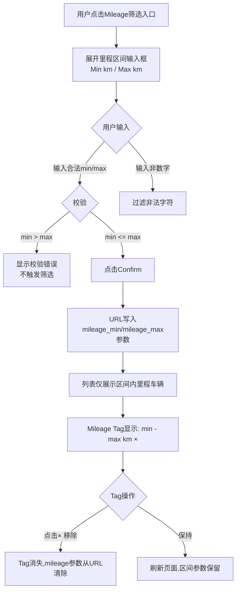
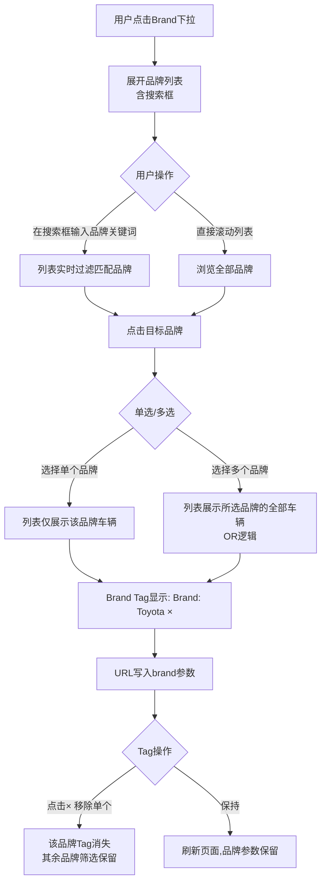
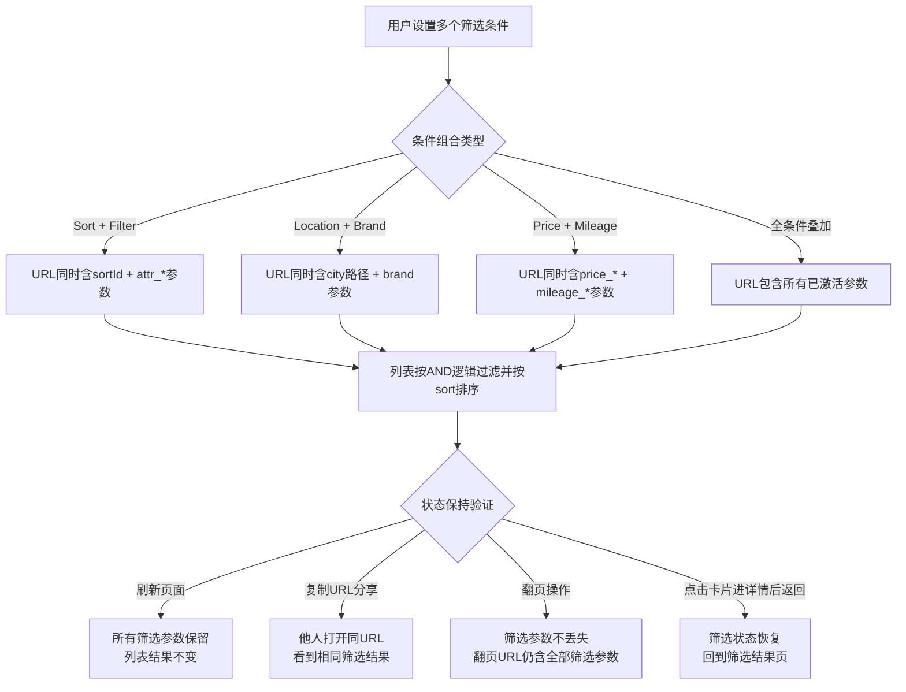

# 车辆浏览业务流程

> **业务目标**: 让买家能快速找到符合需求的车辆

---

## 1. 完整流程图

```mermaid
graph TD
    Start([开始]) --> Step1[首页]
    Step1 --> Step2[点击Cars图标]
    Step2 --> Step3[进入车辆列表页-默认Used cars]
    
    Step3 --> Step4[使用筛选条件]
    Step4 --> Step5[选择排序方式]
    Step5 --> Step6[浏览车辆卡片列表]
    
    Step6 --> Check1{找到目标车辆?}
    Check1 -->|否| Step4
    Check1 -->|是| Step7[点击车辆卡片]
    
    Step7 --> Step8[进入车辆详情页]
    Step8 --> Step9[查看车辆信息]
    Step9 --> Step10{是否收藏?}
    
    Step10 -->|是| Check2{是否登录?}
    Check2 -->|否| Login[弹出登录框]
    Login --> LoginSuccess[登录成功]
    LoginSuccess --> Step11[收藏成功]
    Check2 -->|是| Step11
    
    Step10 -->|否| Step12{是否联系卖家?}
    Step11 --> Step12
    
    Step12 -->|是| Check3{是否登录?}
    Check3 -->|否| Login2[弹出登录框]
    Login2 --> LoginSuccess2[登录成功]
    LoginSuccess2 --> Step13[进入联系流程]
    Check3 -->|是| Step13
    
    Step12 -->|否| Step14{是否分享?}
    Step13 --> Step14
    
    Step14 -->|是| Step15[点击Share按钮]
    Step15 --> Step16[复制链接到剪贴板]
    Step16 --> Step17[显示Link copied提示]
    
    Step14 -->|否| Step18{是否查看地图?}
    Step17 --> Step18
    
    Step18 -->|是| Step19[点击Show map]
    Step19 --> Step20[打开地图弹窗]
    Step20 --> Step21[查看车辆位置]
    
    Step18 -->|否| Step22{是否查看相关车辆?}
    Step21 --> Step22
    
    Step22 -->|是| Step23[点击相关车辆卡片]
    Step23 --> Step8
    
    Step22 -->|否| End([结束])
```

---

## 2. 详细步骤与观测点

### 步骤1: 进入车辆列表页
**页面位置**: 首页

**操作**:
- 点击首页Cars图标或Browse菜单

**观测点**:
- ✅ URL跳转到车辆列表页(如https://aepub.58v5.cn/cate-car-used-car/)
- ✅ 页面标题显示"Cars in {城市名称}"(如"Cars in Abu Dhabi")
- ✅ 面包屑导航显示"Home > Cars"
- ✅ Location Tag显示"Location: {城市名称} ×"
- ✅ 筛选栏显示Sort/Filter/Location/Price/Mileage/Brand/Reset
- ✅ 列表区域显示Loading状态(骨架屏或Spinner)
- ✅ 加载完成后显示车辆卡片列表

**验证方法**:
- 点击Cars图标,观察URL是否变化
- 观察页面标题和面包屑导航
- 观察筛选栏和列表区域

**关联规则**: [车辆列表页规则.md - 3.1 页面初始加载规则](../../../业务规则库/车辆模块/车辆列表页规则.md#31-页面初始加载规则)

---

### 步骤2: 使用筛选条件
**页面位置**: 车辆列表页

筛选功能由6个独立入口组成,各入口均通过URL参数持久化状态,支持多条件AND叠加。

---

#### 步骤2.1: Sort排序流程

**操作序列**: Sort按钮 → 选项单选(● 标识) → Confirm/Clear/ESC → 列表刷新 → URL持久化

**观测点**:
- ✅ 点击Sort按钮,展开排序下拉面板
- ✅ 面板包含4个排序选项: Price: Low to High / High to Low / Most recent / Lowest Mileage
- ✅ 当前激活选项右侧显示填充●图标,其余选项无标识
- ✅ 点击Confirm后面板关闭,列表按选择的方式排序
- ✅ 点击Clear后清除排序选中状态
- ✅ 点击ESC或面板外部区域,面板关闭且排序不变
- ✅ 排序切换后URL包含新sortId参数,不残留旧值
- ✅ 翻页后URL仍包含sortId(排序参数不丢失)
- ✅ 刷新页面后排序方式保持(状态持久化)
- ❌ 负向: Clear后sortId从URL中移除,列表恢复默认顺序

**Sort选项与sortId映射**:
| 排序选项 | sortId |
|--------|--------|
| Most recent (默认) | 1 |
| Price: High to Low | 2 |
| Price: Low to High | 3 |
| Lowest Mileage | 4 |

---

#### 步骤2.2: Filter综合筛选流程

**操作序列**: Filter按钮 → 多维度多选 → 角标实时更新 → Confirm/Reset/ESC → 列表刷新 → URL持久化

**观测点**:
- ✅ 点击Filter按钮,展开综合筛选弹窗
- ✅ 弹窗包含全部8个筛选分组: Body Style / Body Color / Year / Specs / energyType / Transmission / Engine(cc) / Drive Type
- ✅ 每个分组支持多选,选中项高亮
- ✅ 选择筛选条件后,Filter按钮显示角标数字(如"Filter · 1","Filter · 2")
- ✅ 角标数字等于激活的筛选维度数量(不是选项总数)
- ✅ 点击Confirm后弹窗关闭,URL写入对应attr_*参数
- ✅ 点击Reset All后全部已选条件清空,角标消失
- ✅ 点击ESC或弹窗蒙层,弹窗关闭且条件不应用
- ✅ 刷新页面后筛选参数保留,角标数字不变
- ❌ 负向: 仅勾选不Confirm,弹窗关闭后条件不应用

**Filter 8维度 URL参数对应**:
| 维度 | URL参数 | 示例值 |
|-----|---------|------|
| Body Style | attr_190 | SUV |
| Body Color | attr_180 | White |
| Year | attr_199 | 2020 |
| Specs | attr_194 | European |
| energyType | attr_192 | Petrol |
| Transmission | attr_197 | Auto |
| Engine(cc) | attr_479 | 1000-3000 |
| Drive Type | attr_191 | AWD |

---

#### 步骤2.3: Location城市切换流程

**操作序列**: Location下拉 → 城市单选 → URL/标题/Tag三联更新 → 点击× 恢复默认

**观测点**:
- ✅ 点击Location下拉,展开城市候选列表
- ✅ 选择Dubai后: URL路径更新为`city-dubai`,页面标题变为"Cars in Dubai",Location Tag显示"Location: Dubai ×"
- ✅ 选择Abu Dhabi后: URL路径变为`city-abu-dhabi`,标题变为"Cars in Abu Dhabi"
- ✅ 点击Tag上的×,Tag消失,URL恢复默认城市,标题恢复"Cars for Sale"
- ✅ 切换城市后列表数据刷新,展示该城市的车辆
- ✅ 刷新页面,城市参数保留
- ❌ 负向: 无可用城市时下拉为空或不展开

---

#### 步骤2.4: Price价格区间筛选流程

**操作序列**: Price入口 → 输入min/max(数字校验) → 校验通过 → Confirm → URL持久化 → Tag显示 → ×清除

**观测点**:
- ✅ 点击Price筛选入口,展开min/max输入框
- ✅ 输入合法区间(min ≤ max)后,列表展示价格在区间内的车辆
- ✅ Price Tag显示已选区间(如"AED 10000 - 50000 ×")
- ✅ URL包含价格区间参数(price_min / price_max)
- ✅ 刷新页面后价格区间参数保留
- ✅ 点击Tag ×,价格筛选清除,URL参数移除
- ❌ 负向: min > max 时显示错误提示,不触发筛选
- ❌ 负向: 输入非数字字符时,输入被过滤/拒绝
- ❌ 负向: 输入负数时,被拒绝或强制清空

---

#### 步骤2.5: Mileage里程区间筛选流程

**操作序列**: Mileage入口 → 输入min/max(km单位) → 校验通过 → Confirm → URL持久化 → Tag显示 → ×清除

**观测点**:
- ✅ 点击Mileage筛选入口,展开min/max输入框(单位: km)
- ✅ 输入合法区间(min ≤ max)后,列表展示里程在区间内的车辆
- ✅ Mileage Tag显示已选区间(如"0 - 50000 km ×")
- ✅ URL包含里程区间参数(mileage_min / mileage_max)
- ✅ 刷新页面后里程区间参数保留
- ✅ 点击Tag ×,里程筛选清除,URL参数移除
- ❌ 负向: min > max 时显示错误提示,不触发筛选
- ❌ 负向: 输入非数字字符时,输入被过滤/拒绝

---

#### 步骤2.6: Brand品牌筛选流程

**操作序列**: Brand下拉 → 搜索框过滤(可选) → 单选/多选 → Brand Tag显示 → URL持久化 → ×清除

**观测点**:
- ✅ 点击Brand下拉,展开品牌列表(含搜索框)
- ✅ 在搜索框输入关键词,列表实时过滤,只展示匹配品牌
- ✅ 选择Toyota,列表仅显示Toyota品牌车辆
- ✅ Brand Tag显示"Brand: Toyota ×"
- ✅ URL包含品牌参数
- ✅ 支持多品牌选择,多个Brand Tag同时显示
- ✅ 刷新页面后品牌参数保留
- ✅ 点击Tag ×,该品牌筛选移除,URL对应参数清除
- ❌ 负向: 搜索无匹配品牌时,列表显示空态或"No results"

---

#### 步骤2.7: 组合筛选与状态保持流程

**观测点**:
- ✅ 多条件叠加时URL包含所有激活的筛选参数
- ✅ 所有筛选条件为AND逻辑(同时满足)
- ✅ 刷新页面后全部筛选参数保留,结果不变
- ✅ URL分享给他人,打开后呈现相同筛选结果(可分享性)
- ✅ 翻页后URL仍包含全部筛选参数(分页不丢参)
- ✅ 从详情页点击浏览器返回,回到筛选结果页且筛选状态恢复
- ✅ 搜索关键词+排序组合时,URL同时含keyword和sortId参数
- ❌ 负向: 条件组合后无匹配结果时,显示空态而非报错

---

**整体验证方法**:
- 逐一验证各筛选入口的展开/选择/Confirm/Clear/ESC交互
- 验证每个筛选维度的URL参数写入和保留(刷新后不丢失)
- 验证Tag显示与×清除功能
- 验证min > max等边界错误处理
- 验证多条件AND组合逻辑及URL参数共存

**关联规则**: 
- [车辆列表页规则.md - 3.2 Sort排序规则](../../../业务规则库/车辆模块/车辆列表页规则.md#32-sort排序规则)
- [车辆列表页规则.md - 3.3 Filter综合筛选规则](../../../业务规则库/车辆模块/车辆列表页规则.md#33-filter综合筛选规则)
- [车辆列表页规则.md - 3.4 Location城市筛选规则](../../../业务规则库/车辆模块/车辆列表页规则.md#34-location城市筛选规则)
- [车辆列表页规则.md - 3.5 Price价格区间筛选规则](../../../业务规则库/车辆模块/车辆列表页规则.md#35-price价格区间筛选规则)
- [车辆列表页规则.md - 3.6 Mileage里程区间筛选规则](../../../业务规则库/车辆模块/车辆列表页规则.md#36-mileage里程区间筛选规则)
- [车辆列表页规则.md - 3.7 Brand品牌筛选规则](../../../业务规则库/车辆模块/车辆列表页规则.md#37-brand品牌筛选规则)
- [车辆列表页规则.md - 3.17 Filter筛选维度详细规则](../../../业务规则库/车辆模块/车辆列表页规则.md#317-filter筛选维度详细规则)

---

### 步骤3: 卡片数据校验
**页面位置**: 车辆列表页

**操作**:
- 加载列表页后,检查卡片数据完整性

**观测点**:
- ✅ 列表页加载后至少展示1张车辆卡片(无结果时显示空态)
- ✅ 每张卡片标题非空,包含车型信息(品牌+型号+年份)
- ✅ 每张卡片价格展示货币符号AED或显示"Free"
- ✅ 价格数值为正整数(Free帖子跳过,价格>0)
- ✅ 卡片详情参数包含年份(4位数字)和里程(含km)
- ✅ 封面图src不为空,以"http"开头
- ✅ 封面图alt不为空,包含标题文本前20字符(利于SEO)
- ✅ 卡片链接href不为空,包含站点域名和"cate-car"路径
- ✅ 关键词搜索后,结果卡片标题包含搜索词(如搜索"Toyota"至少1张卡片标题含"Toyota")

**验证方法**:
- 获取前10张卡片的标题、价格、封面图src/alt、href属性逐一验证

**关联规则**: [车辆列表页规则.md - 3.18 卡片数据校验规则](../../../业务规则库/车辆模块/车辆列表页规则.md#318-卡片数据校验规则)

---

### 步骤4: 排序数据正确性验证
**页面位置**: 车辆列表页

**操作**:
1. 选择Price: Low to High排序,获取前10张卡片价格
2. 选择Price: High to Low排序,获取前10张卡片价格
3. 组合Brand筛选+Price排序,验证两者共存

**观测点**:
- ✅ Price: Low to High排序时,相邻卡片价格满足非递减顺序(前一张≤后一张)
- ✅ Price: High to Low排序时,相邻卡片价格满足非递增顺序(前一张≥后一张)
- ✅ 切换排序方式前后卡片数量完全相同(排序不过滤数据)
- ✅ Price升序时,Free帖子聚集在最前或最后,不散落在中间
- ✅ Brand筛选+排序组合时,URL同时包含品牌参数和排序参数(sortId)
- ✅ 切换排序后URL包含新排序参数,不残留旧排序参数
- ✅ 搜索关键词+排序组合时,URL同时包含keyword参数和sortId参数
- ✅ 翻页后URL仍包含排序参数(sortId不丢失)

**验证方法**:
- 对比相邻卡片价格验证排序正确性
- 检查URL参数确认多条件共存

**关联规则**: [车辆列表页规则.md - 3.19 排序数据正确性规则](../../../业务规则库/车辆模块/车辆列表页规则.md#319-排序数据正确性规则)

---

### 步骤5: 分页深度验证
**页面位置**: 车辆列表页

**操作**:
1. 记录第1页前3条卡片标题
2. 点击Next翻到第2页
3. 记录第2页前3条卡片标题
4. 点击浏览器后退按钮

**观测点**:
- ✅ 第2页有卡片,前3条标题与第1页不同(数据确实翻页)
- ✅ 翻页后URL与第1页URL不同
- ✅ 浏览器后退后,首条标题与第1页首条标题一致
- ✅ 结果仅1页时Next按钮不可见或禁用
- ✅ 无结果时Next按钮不可见

**验证方法**:
- 对比两页卡片标题确认数据翻页
- 测试浏览器后退的页面恢复

**关联规则**: [车辆列表页规则.md - 3.20 分页深度验证规则](../../../业务规则库/车辆模块/车辆列表页规则.md#320-分页深度验证规则)

---

### 步骤6: 懒加载与搜索增强验证
**页面位置**: 车辆列表页

**操作**:
1. 滚动到页面底部,等待3秒,检查前15张卡片图片src
2. 搜索中文关键词"丰田汽车"
3. 搜索不存在的关键词"zzz_nonexistent_keyword_12345"

**观测点**:
- ✅ 滚动到底部后,前15张卡片中图片src为空的数量≤1(懒加载正常)
- ✅ 搜索中文关键词时页面未崩溃,URL包含keyword参数(中文已编码)
- ✅ 搜索不存在关键词时卡片数量为0,空态元素可见
- ✅ 无结果时Next按钮不可见

**验证方法**:
- 滚动页面后检查图片加载状态
- 输入中文关键词观察URL编码和页面稳定性
- 输入无效关键词验证空态展示

**关联规则**:
- [车辆列表页规则.md - 3.21 懒加载与交互规则](../../../业务规则库/车辆模块/车辆列表页规则.md#321-懒加载与交互规则)
- [车辆列表页规则.md - 3.22 搜索增强规则](../../../业务规则库/车辆模块/车辆列表页规则.md#322-搜索增强规则)

---

### 步骤7: 浏览车辆卡片列表
**页面位置**: 车辆列表页

**操作**:
- 浏览车辆卡片列表,查看车辆信息

**观测点**:
- ✅ 车辆卡片显示主图(外观照片第1张)
- ✅ 车辆卡片显示车辆标题(品牌+型号+年份)
- ✅ 车辆卡片显示价格(AED格式,带千分位分隔)
- ✅ 车辆卡片显示里程(显示里程数+单位km)
- ✅ 车辆卡片显示城市(显示车辆所在城市)
- ✅ 车辆卡片显示发布时间(相对时间,如"2 days ago")

**验证方法**:
- 观察车辆卡片显示的信息是否完整
- 观察价格格式是否正确

**关联规则**: [车辆列表页规则.md - 3.11 列表卡片展示规则](../../../业务规则库/车辆模块/车辆列表页规则.md#311-列表卡片展示规则)

---

### 步骤8: 进入车辆详情页
**页面位置**: 车辆列表页 → 车辆详情页

**操作**:
- 点击任意车辆卡片

**观测点**:
- ✅ 跳转至车辆详情页
- ✅ URL包含车辆ID(如/cate-car-used-car/<car-model>-<post_id>/)
- ✅ 详情页展示完整车辆信息
- ✅ 主图区显示外观照片轮播,支持左右切换
- ✅ 价格显示格式: AED 1,234,567(带千分位逗号)
- ✅ 车辆标题显示品牌+型号+年份+配置
- ✅ 年份/里程/地点横向排列显示
- ✅ 发布时间标签显示(如"Posted 0 min ago"或"Updated X min ago")
- ✅ Seller's Note区域显示卖家自定义描述(为空时不显示该区域)
- ✅ Vehicle Info区域显示Specs/Mileage/Body Color/First Registration
- ✅ Basic Features区域显示Fuel Type/Drive Type/Engine(cc)/Transmission
- ✅ Location区域显示地址+"Show map"按钮
- ✅ 卖家信息卡片显示头像+用户名
- ✅ Related Cars区域横向滚动展示相关车辆
- ✅ 收藏按钮(Favourites)显示
- ✅ 联系按钮(Contact)显示
- ✅ 分享按钮(Share)显示

**验证方法**:
- 点击车辆卡片,观察URL是否变化
- 验证详情页所有信息是否正确显示

**关联规则**: [车辆详情页规则.md - 3.1 页面展示规则](../../../业务规则库/车辆模块/车辆详情页规则.md#31-页面展示规则)

---

### 步骤9: 收藏车辆
**页面位置**: 车辆详情页

**操作**:
1. 点击Favourites按钮
2. 如未登录,登录后再次点击Favourites
3. 刷新页面,观察收藏状态

**观测点**:
- ❌ 未登录点击Favourites,弹出登录框(Welcome to OK.com)
- ✅ 登录框标题显示"Welcome to OK.com"
- ✅ 登录框显示站点标识"AE"
- ✅ 登录框显示Email or phone number输入框
- ✅ 登录框显示Continue按钮(未输入时为disabled)
- ✅ 登录框显示第三方登录入口(Google、Facebook、Apple)
- ✅ 登录成功后,收藏按钮或图标变为已收藏状态
- ✅ 刷新页面,收藏状态保持
- ✅ 再次点击Favourites,取消收藏,按钮或图标变为未收藏状态

**验证方法**:
- 清除登录态,点击Favourites,观察是否弹出登录框
- 登录后点击Favourites,观察按钮状态变化
- 刷新页面,观察收藏状态是否保持
- 再次点击Favourites,观察是否取消收藏

**关联规则**: [车辆详情页规则.md - 3.2 收藏功能规则](../../../业务规则库/车辆模块/车辆详情页规则.md#32-收藏功能规则)

---

### 步骤10: 联系卖家
**页面位置**: 车辆详情页

**操作**:
1. 点击Contact按钮
2. 如未登录,登录后再次点击Contact

**观测点**:
- ❌ 未登录点击Contact,弹出登录框(与收藏相同)
- ✅ 登录后点击Contact,进入联系卖家流程(打开聊天/表单弹窗或跳转)

**验证方法**:
- 清除登录态,点击Contact,观察是否弹出登录框
- 登录后点击Contact,观察是否进入联系流程

**关联规则**: [车辆详情页规则.md - 3.3 联系功能规则](../../../业务规则库/车辆模块/车辆详情页规则.md#33-联系功能规则)

---

### 步骤11: 分享车辆
**页面位置**: 车辆详情页

**操作**:
- 点击Share按钮

**观测点**:
- ✅ 点击Share按钮,复制当前页面链接到剪贴板
- ✅ 显示"Link copied"提示
- ✅ 提示在2秒后自动消失
- ✅ 页面URL保持不变,不导致页面异常跳转

**验证方法**:
- 点击Share按钮,观察提示是否显示
- 观察提示是否在2秒后消失
- 观察页面URL是否保持不变

**关联规则**: [车辆详情页规则.md - 3.4 分享功能规则](../../../业务规则库/车辆模块/车辆详情页规则.md#34-分享功能规则)

---

### 步骤12: 查看地图
**页面位置**: 车辆详情页

**操作**:
1. 点击Location区域的Show map按钮
2. 查看地图弹窗
3. 点击关闭按钮或按ESC键关闭弹窗

**观测点**:
- ✅ 点击Show map按钮,弹出地图弹窗(dialog)
- ✅ 地图弹窗显示地图区域及车辆位置标记
- ✅ 地图弹窗显示"Open this area in Google Maps"链接
- ✅ 点击close图标或关闭按钮,地图弹窗关闭
- ✅ 按ESC键,地图弹窗关闭
- ✅ 地图弹窗打开后地图正常加载,显示地图和标记

**验证方法**:
- 点击Show map按钮,观察地图弹窗是否打开
- 观察地图是否正常加载
- 测试关闭按钮和ESC键功能

**关联规则**: [车辆详情页规则.md - 3.5 地图弹窗规则](../../../业务规则库/车辆模块/车辆详情页规则.md#35-地图弹窗规则)

---

### 步骤13: 查看相关车辆推荐
**页面位置**: 车辆详情页

**操作**:
1. 滚动到Related Cars区域
2. 点击右箭头查看更多相关车辆
3. 点击相关车辆卡片

**观测点**:
- ✅ Related Cars区域展示相关车辆卡片,横向滚动
- ✅ 第一页时左箭头为disabled状态,不可点击
- ✅ 第一页时右箭头可点击
- ✅ 点击右箭头,列表向左滚动,展示更多相关车辆
- ✅ 点击相关车辆卡片,跳转到该车辆的详情页
- ✅ URL与标题更新为新车

**验证方法**:
- 观察Related Cars区域是否显示
- 测试左右箭头功能
- 点击相关车辆卡片,观察是否跳转到新详情页

**关联规则**: [车辆详情页规则.md - 3.7 相关车辆推荐规则](../../../业务规则库/车辆模块/车辆详情页规则.md#37-相关车辆推荐规则)

---

## 3. 流程完整性验证清单

- [ ] 点击Cars图标是否进入车辆列表页
- [ ] 页面标题是否显示"Cars in {城市名称}"
- [ ] 面包屑导航是否显示"Home > Cars"
- [ ] Sort排序功能是否正常
- [ ] Filter综合筛选功能是否正常
- [ ] Filter弹窗是否包含全部8个分组(Body Style/Body Color/Year/Specs/energyType/Transmission/Engine(cc)/Drive Type)
- [ ] Filter各维度选择后URL是否包含对应参数(attr_190/attr_180/attr_199/attr_194/attr_192/attr_197/attr_479/attr_191)
- [ ] Location城市筛选功能是否正常
- [ ] Price价格区间筛选功能是否正常
- [ ] Mileage里程区间筛选功能是否正常
- [ ] Brand品牌筛选功能是否正常
- [ ] 筛选Tag是否正确显示
- [ ] 卡片标题是否非空且包含车型信息
- [ ] 卡片价格是否含AED货币符号
- [ ] 卡片封面图src/alt是否有效
- [ ] 卡片链接是否包含cate-car路径
- [ ] Price: Low to High排序后价格是否递增
- [ ] Price: High to Low排序后价格是否递减
- [ ] 切换排序前后卡片总数是否不变
- [ ] 翻页后URL是否包含page参数且排序参数保留
- [ ] 第2页数据是否与第1页不同
- [ ] 浏览器后退是否正确恢复第1页
- [ ] 单页时Next按钮是否不可见
- [ ] 图片懒加载是否正常(前15张src为空数量≤1)
- [ ] 中文搜索关键词页面是否不崩溃
- [ ] 搜索不存在关键词时是否显示空态
- [ ] 点击车辆卡片是否跳转到详情页
- [ ] 详情页信息是否完整
- [ ] 未登录点击收藏是否弹出登录框
- [ ] 登录后收藏是否成功
- [ ] 刷新页面收藏状态是否保持
- [ ] 未登录点击联系是否弹出登录框
- [ ] 登录后联系是否进入联系流程
- [ ] 点击Share是否复制链接
- [ ] 点击Show map是否打开地图弹窗
- [ ] 地图弹窗是否正常加载
- [ ] Related Cars区域是否显示
- [ ] 点击相关车辆卡片是否跳转到新详情页

---

## 4. 关联文档

- [车辆业务全景](./车辆业务全景.md)
- [车辆列表页规则.md](../../../业务规则库/车辆模块/车辆列表页规则.md)
- [车辆详情页规则.md](../../../业务规则库/车辆模块/车辆详情页规则.md)

---

## 5. 变更历史

| 日期 | 版本 | 变更内容 | 变更人 |
|-----|------|---------|--------|
| 2026-03-24 | v1.0 | 初始版本,基于okcom-探索列表页测试用例(62条)和OK-AE-车详情页测试用例(30条)生成 | AI |
| 2026-04-28 | v2.0 | 归档okcom-探索列表页-测试用例-20260303.md(102条),新增步骤:卡片数据校验、排序数据正确性验证、分页深度验证、懒加载与搜索增强验证;步骤2补充Filter 8维度URL参数对应关系;验证清单从23条扩展至38条 | AI |
| 2026-04-28 | v3.0 | 步骤2筛选流程细化:拆分为7个子流程(Sort/Filter综合/Location/Price/Mileage/Brand/组合筛选),每个子流程补充Mermaid状态图、交互操作序列、正向与负向观测点,新增边界校验规则(min>max/非数字/负数)和URL状态保持验证 | AI |
