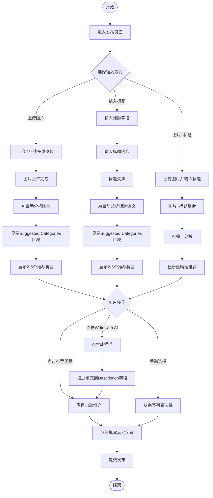
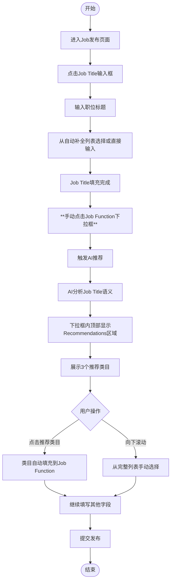

# AI推荐类目业务流程

> **业务目标**: 通过AI智能分析用户输入的标题和上传的图片,自动推荐相关类目,帮助用户快速准确地选择合适的分类

---

## 1. 完整流程图

> **说明**: Job分类与其他分类的触发方式不同，下图展示通用流程（Property/Marketplace/Services/Community）

### Job分类特殊流程

---

## 2. 详细步骤与观测点

### 步骤1: 上传图片触发AI推荐
**页面位置**: Property/Marketplace/Services/Community发布页面

**操作**:
1. 进入发布页面(如Property发布页)
2. 点击Pictures区域的上传按钮
3. 选择1张或多张图片上传
4. 等待图片上传完成

**观测点**:
- ✅ 图片成功上传,显示缩略图
- ✅ 图片上传计数正确显示(如"Upload 3/9")
- ✅ 页面出现"Suggested Categories"区域
- ✅ AI推荐至少1个相关类目
- ✅ 推荐类目可点击选择
- ✅ 多张图片推荐更精准(综合分析)

**验证方法**:
- 上传公寓内部图片,验证推荐是否包含"Apartment"相关类目
- 上传别墅外观图片,验证推荐是否包含"Villa"相关类目
- 上传iPhone图片,验证推荐是否包含"Electronics - Cell Phones"

**关联规则**: [AI推荐类目规则.md - 3.6 图片上传触发AI推荐规则](../../../业务规则库/通用规则/AI能力/AI推荐类目规则.md#36-图片上传触发ai推荐规则)

---

### 步骤2: 输入标题触发AI推荐
**页面位置**: Job/Property/Marketplace/Services/Community发布页面

#### Job分类（手动触发）
**操作**:
1. 在Job Title字段输入内容(如"Software Engineer")
2. 从自动补全列表选择或手动输入完整标题
3. **主动点击Job Function下拉框**
4. 等待AI推荐加载(约1-2秒)

**观测点**:
- ✅ Job Title字段支持自动补全(输入"software"显示5条建议)
- ✅ 选择建议后Job Title字段正确填充
- ✅ **点击Job Function下拉框后才触发AI推荐**
- ✅ 下拉框内部顶部显示"Recommendations"标题
- ✅ "Recommendations"下显示3个AI推荐类目
- ✅ 推荐格式为"父类别 - 子类别"(如"IT - Software Engineer")
- ✅ 推荐与标题内容相关

**验证方法**:
- 输入"Software Engineer",点击Job Function下拉框,验证推荐是否包含IT相关类目
- 输入"Nurse",点击Job Function下拉框,验证推荐是否包含Healthcare相关类目

#### 其他分类（自动触发）
**页面位置**: Property/Marketplace/Services/Community发布页面

**操作**:
1. 在标题字段输入内容(如Property Title输入"Luxury 2BR Apartment")
2. 点击标题字段外部或按Tab键触发失焦
3. **AI自动触发推荐**（无需点击类目字段）

**观测点**:
- ✅ 标题输入完成并失焦
- ✅ **自动出现独立的"Suggested Categories"区域**（在表单外部）
- ✅ 显示2-5个AI推荐类目
- ✅ 推荐类目可点击选择
- ✅ 推荐与标题内容相关

**验证方法**:
- 输入"Luxury 2BR Apartment",失焦后验证是否自动显示Apartment相关推荐
- 输入"iPhone 14 Pro Max",失焦后验证是否自动显示Electronics相关推荐

**关联规则**: [AI推荐类目规则.md - 3.1 触发规则](../../../业务规则库/通用规则/AI能力/AI推荐类目规则.md#31-触发规则)

---

### 步骤3: 图片+标题组合推荐(最精准)
**页面位置**: Property/Marketplace/Services/Community发布页面

**操作**:
1. 先上传图片(如公寓内部图片)
2. 等待图片上传完成
3. 输入标题(如"Luxury 2BR Apartment in Downtown Dubai")
4. 点击标题字段外部或按Tab键触发失焦
5. 观察AI推荐变化

**观测点**:
- ✅ 图片和标题结合后,"Suggested Categories"区域显示更精准的AI推荐
- ✅ 推荐类目应包含与图片和标题都匹配的选项
- ✅ 推荐类目数量为2-5个
- ✅ 每个推荐类目可点击选择
- ✅ 推荐准确性高于单独图片或单独标题

**验证方法**:
- 上传公寓图片+输入"2 Bedroom Apartment",验证推荐是否包含"Residential - 2 Bed Apartment"
- 上传iPhone图片+输入"iPhone 14 Pro Max",验证推荐是否包含"Electronics - Cell Phones"

**关联规则**: [AI推荐类目规则.md - 3.8 多模态推荐规则](../../../业务规则库/通用规则/AI能力/AI推荐类目规则.md#38-多模态推荐规则图片标题)

---

### 步骤4: 点击Write with AI生成描述
**页面位置**: 所有发布页面Description字段区域

**操作**:
1. 已上传图片或已填写标题
2. 定位到Description字段区域
3. 点击"Write with AI"按钮
4. 等待AI生成内容(约1-3秒)

**观测点**:
- ✅ 点击后按钮显示加载状态(loading)
- ✅ AI自动生成与上传图片和标题相关的描述内容
- ✅ 生成的描述内容填充到Description文本框
- ✅ 描述内容语言为英文
- ✅ 描述内容长度合理(50-1000字符)
- ✅ 生成后可手动编辑

**验证方法**:
- 仅上传图片,点击Write with AI,验证是否生成与图片相关的描述
- 仅输入标题,点击Write with AI,验证是否生成与标题相关的描述
- 图片+标题,点击Write with AI,验证是否生成综合描述

**关联规则**: [AI推荐类目规则.md - 3.7 Write with AI生成描述规则](../../../业务规则库/通用规则/AI能力/AI推荐类目规则.md#37-write-with-ai生成描述规则)

---

### 步骤5: 选择AI推荐类目
**页面位置**: 类目下拉框或Suggested Categories区域

**操作**:
1. 在"Suggested Categories"区域或"Recommendations"区域点击推荐类目
2. 观察页面变化

**观测点**:
- ✅ 点击后推荐类目被选中,状态高亮显示
- ✅ 类目信息自动填充到表单的类目字段
- ✅ 或者该类目被标记为用户选择的类目
- ✅ 下拉框关闭(如适用)

**验证方法**:
- 点击推荐类目,验证类目字段是否自动填充
- 验证选中状态是否高亮显示

**关联规则**: [AI推荐类目规则.md - 3.9 推荐类目选择规则](../../../业务规则库/通用规则/AI能力/AI推荐类目规则.md#39-推荐类目选择规则)

---

### 步骤6: 验证类目自动填充
**页面位置**: 发布表单

**操作**:
1. 选择推荐类目后
2. 检查类目字段是否正确填充
3. 继续填写其他必填字段
4. 点击提交按钮

**观测点**:
- ✅ 类目字段显示选中的类目名称
- ✅ 类目字段不再显示必填错误提示
- ✅ 可继续填写其他字段
- ✅ 提交时类目字段校验通过

**验证方法**:
- 不选择类目直接提交,验证是否显示"Category is required"错误
- 选择推荐类目后提交,验证是否校验通过

**关联规则**: [AI推荐类目规则.md - 3.4 字段校验规则](../../../业务规则库/通用规则/AI能力/AI推荐类目规则.md#34-字段校验规则)

---

## 3. 流程完整性验证清单

### 图片上传触发AI推荐
- [ ] 上传单张图片是否触发AI推荐
- [ ] 上传多张图片是否触发AI推荐
- [ ] 多张图片推荐是否更精准
- [ ] 图片格式JPG/PNG/JPEG是否支持
- [ ] 图片数量上限9张是否正确
- [ ] Property分类是否支持图片推荐
- [ ] Marketplace分类是否支持图片推荐
- [ ] Services分类是否支持图片推荐
- [ ] Community分类是否支持图片推荐
- [ ] Job分类是否不支持图片推荐

### 标题输入触发AI推荐
- [ ] 输入Job Title是否触发AI推荐
- [ ] 输入Property Title是否触发AI推荐
- [ ] 输入Item Title是否触发AI推荐
- [ ] 输入Service Title是否触发AI推荐
- [ ] 输入Post Title是否触发AI推荐
- [ ] 标题自动补全是否正常工作
- [ ] 点击类目字段是否显示Recommendations区域
- [ ] Recommendations区域是否显示3个推荐类目
- [ ] 推荐格式是否为"父类别 - 子类别"
- [ ] 推荐加载时间是否约1-2秒

### 图片+标题组合推荐
- [ ] 先上传图片后输入标题,推荐是否更新
- [ ] 先输入标题后上传图片,推荐是否更新
- [ ] 组合推荐准确性是否高于单独推荐
- [ ] 推荐类目数量是否为2-5个

### Write with AI生成描述
- [ ] 仅上传图片,点击Write with AI是否生成描述
- [ ] 仅输入标题,点击Write with AI是否生成描述
- [ ] 图片+标题,点击Write with AI是否生成描述
- [ ] 生成描述语言是否为英文
- [ ] 生成描述长度是否为50-1000字符
- [ ] 生成后是否可手动编辑
- [ ] 按钮是否显示loading状态

### 推荐类目选择
- [ ] 点击推荐类目是否自动填充
- [ ] 选中状态是否高亮显示
- [ ] 可否从完整列表手动选择
- [ ] 不选择类目提交是否显示错误

### 降级策略
- [ ] AI推荐服务不可用时是否显示完整列表
- [ ] AI推荐加载超时是否降级
- [ ] AI推荐返回空结果是否显示完整列表
- [ ] 网络断开是否缓存上次推荐

### 站点兼容性
- [ ] AE站是否支持所有分类
- [ ] 测试账号yangyang100@58.com是否可用

---

## 4. 关联文档

- [通用业务全景](./通用业务全景.md)
- [AI推荐类目规则.md](../../业务规则库/通用规则/AI能力/AI推荐类目规则.md)

---

## 5. 变更历史

| 日期 | 版本 | 变更内容 | 变更人 |
|-----|------|---------|--------|
| 2026-03-27 | v1.2 | 新增Job分类特殊流程图，明确手动触发与自动触发的流程差异 | AI |
| 2026-03-27 | v1.1 | 确认覆盖全部5个分类（Job、Property、Marketplace、Services、Community），基于ai_publish测试用例（43条） | AI |
| 2026-03-24 | v1.0 | 初始版本,基于ai_publish测试用例(40条)生成 | AI |
