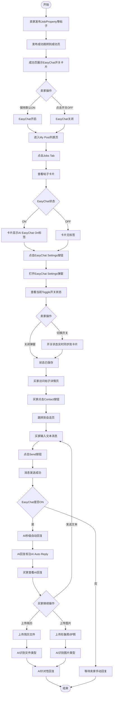

# AI自动回复(EasyChat)业务流程

> **业务目标**: 通过AI自动回复功能,让卖家/发布者的帖子能够自动理解买家意图并秒级回复消息,提升沟通效率,减少人工回复负担

> ⚠️ **实测覆盖说明**: 当前所有业务流程均基于**Jobs分类的58条实测用例**提取。其他分类（Property/Marketplace/Services/Community）产品设计上应支持EasyChat，但尚未通过实际测试验证，会话场景和AI回复内容可能存在差异。

---

## 1. 完整流程图

---

## 2. 详细步骤与观测点

### 步骤1: 发布成功页开启EasyChat
**页面位置**: 发布成功页(/biz/en/publish/success?id={jobId})

**操作**:
1. 完成Job发布(填写所有必填字段)
2. 点击Post按钮提交
3. 页面自动跳转到发布成功页
4. 查看EasyChat开关卡片

**观测点**:
- ✅ 页面跳转至`/biz/en/publish/success?id={jobId}`
- ✅ 页面标题显示"Submitted successfully"
- ✅ 显示文案"Thank you for your post! You've successfully published your listing."
- ✅ 显示文案"You can view your posts in 'My Post'"
- ✅ 显示EasyChat AI开关卡片
- ✅ 卡片标题显示"EasyChat"
- ✅ 卡片描述显示"AI Auto-Reply takes care of your conversations, understands intent, and responds instantly. Stay focused on your business — AI handles the rest."
- ✅ Toggle开关默认状态为ON(蓝色)

**验证方法**:
- 完成发布流程,验证是否自动跳转到成功页
- 验证EasyChat卡片是否可见
- 验证Toggle开关默认是否为ON状态

**关联规则**: [AI自动回复规则.md - 3.7 发布成功页AI开关规则](../../../业务规则库/通用规则/AI能力/AI自动回复规则.md#37-发布成功页ai开关规则)

---

### 步骤2: 列表页管理EasyChat开关
**页面位置**: My Post列表页(https://aepub.58v5.cn/biz/en/publish/list)

**操作**:
1. 进入My Post列表页
2. 点击Jobs Tab
3. 找到目标帖子
4. 点击帖子右下角"EasyChat Settings"按钮
5. 弹出EasyChat Settings弹窗

**观测点**:
- ✅ 弹窗标题为"EasyChat Settings"
- ✅ 弹窗内显示AI图标+"EasyChat"文字
- ✅ 弹窗内显示说明文案
- ✅ 弹窗内显示Toggle开关
- ✅ 弹窗内显示AI自动回复对话预览图
- ✅ 弹窗右上角显示X关闭按钮
- ✅ 每条帖子卡片底部均显示"EasyChat Settings"按钮
- ✅ EasyChat ON时卡片右上角显示蓝色"AI EasyChat On"标签
- ✅ EasyChat OFF时卡片无标签

**验证方法**:
- 点击"EasyChat Settings"按钮,验证弹窗是否打开
- 验证弹窗内容是否完整
- 验证卡片标签是否与开关状态一致

**关联规则**: [AI自动回复规则.md - 3.2 弹窗交互规则](../../../业务规则库/通用规则/AI能力/AI自动回复规则.md#32-弹窗交互规则)

---

### 步骤3: 切换EasyChat开关状态
**页面位置**: EasyChat Settings弹窗

**操作**:
1. 在弹窗中查看当前Toggle开关状态
2. 点击Toggle开关
3. 观察状态变化

**观测点**:
- ✅ Toggle从蓝色(ON)切换为灰色(OFF),或反之
- ✅ 弹窗保持打开,不自动关闭
- ✅ 页面无Toast提示
- ✅ 无二次确认弹窗
- ✅ 背景列表中该帖子的"EasyChat On"标签立即消失或出现(无需关闭弹窗)
- ✅ 整个切换过程无页面刷新
- ✅ 日志触发`handleChatAiChange true/false`

**验证方法**:
- 将ON切换为OFF,验证卡片标签是否立即消失
- 将OFF切换回ON,验证卡片标签是否立即恢复
- 关闭弹窗后刷新页面,验证状态是否持久化

**关联规则**: [AI自动回复规则.md - 3.1 开关控制规则](../../../业务规则库/通用规则/AI能力/AI自动回复规则.md#31-开关控制规则)

---

### 步骤4: 买家进入会话页
**页面位置**: Jobs详情页 → 会话页

**操作**:
1. 买家访问Jobs详情页
2. 点击Contact按钮
3. 页面跳转到会话页

**观测点**:
- ✅ 页面跳转至`https://aepub.58v5.cn/biz/en/chat?postId=...&shopId=...&postName=...`
- ✅ 会话页正常加载
- ✅ 底部工具栏显示完整(定位、文件上传、图片上传、Send按钮)
- ✅ 输入框显示"Input message"占位符
- ✅ Send按钮初始状态为disabled(灰色)
- ✅ 如果EasyChat ON,AI自动发送首条引导消息(标注"AI Auto Reply")

**验证方法**:
- 点击Contact按钮,验证是否跳转到会话页
- 验证底部工具栏是否完整显示
- 验证Send按钮初始状态是否为disabled

**关联规则**: [AI自动回复规则.md - 3.8 会话页AI自动回复规则](../../../业务规则库/通用规则/AI能力/AI自动回复规则.md#38-会话页ai自动回复规则)

---

### 步骤5: 买家发送文本消息
**页面位置**: 会话页

**操作**:
1. 点击底部Input message输入框
2. 输入文本:"Hello, I am interested in the Software Architect position."
3. 点击Send按钮

**观测点**:
- ✅ 输入框有内容时Send按钮从disabled变为可点击状态
- ✅ 点击Send后,消息出现在对话区右侧(己方消息气泡,深色背景)
- ✅ 输入框清空
- ✅ Send按钮恢复disabled状态

**验证方法**:
- 输入内容,验证Send按钮是否变为可点击
- 点击Send,验证消息是否出现在右侧
- 验证输入框是否清空

**关联规则**: [AI自动回复规则.md - 3.9 会话页底部工具栏规则](../../../业务规则库/通用规则/AI能力/AI自动回复规则.md#39-会话页底部工具栏规则)

---

### 步骤6: AI秒级自动回复
**页面位置**: 会话页对话区

**操作**:
1. 买家发送消息后
2. 等待AI回复(秒级)
3. 观察AI回复内容

**观测点**:
- ✅ AI在买家发送消息后秒级回复(通常1-3秒)
- ✅ AI回复消息出现在对话区左侧(对方消息气泡,浅色背景)
- ✅ AI回复消息标注"AI Auto Reply"
- ✅ AI回复内容与买家消息相关
- ✅ AI回复语言与买家消息语言一致
- ✅ AI理解买家意图(询价、咨询详情、预约等)
- ✅ AI回答常见问题或引导买家留联系方式

**验证方法**:
- 发送询价消息,验证AI是否回复价格相关信息
- 发送咨询详情消息,验证AI是否回复详情信息
- 发送预约消息,验证AI是否引导留联系方式

**关联规则**: [AI自动回复规则.md - 3.8 会话页AI自动回复规则](../../../业务规则库/通用规则/AI能力/AI自动回复规则.md#38-会话页ai自动回复规则)

---

### 步骤7: 买家上传简历/图片
**页面位置**: 会话页底部工具栏

**操作**:
1. 点击底部工具栏第2个图标(文件上传)或第3个图标(图片上传)
2. 选择文件(简历/形象照/护照)
3. 确认上传

**观测点**:
- ✅ 点击第2个图标,文件选择框打开,接受格式为`.pdf,.doc,.docx,.xls,.xlsx,.ppt,.pptx,.zip,.txt`
- ✅ 点击第3个图标,文件选择框打开,接受格式为`image/JPG,image/PNG,image/JPEG`
- ✅ 选中文件后,文件消息出现在对话区右侧
- ✅ 简历文件显示文件名或缩略图
- ✅ 图片文件显示缩略图
- ✅ AI识别文件类型(简历/形象照/护照)
- ✅ AI针对文件类型给出响应(标注"AI Auto Reply")

**验证方法**:
- 上传简历文件,验证AI是否识别为简历并回复
- 上传形象照片,验证AI是否识别为形象照并回复
- 上传护照图片,验证AI是否识别为护照并回复

**关联规则**: [AI自动回复规则.md - 3.8 会话页AI自动回复规则](../../../业务规则库/通用规则/AI能力/AI自动回复规则.md#38-会话页ai自动回复规则)

---

## 3. 流程完整性验证清单

### 发布成功页EasyChat开关
- [ ] 发布成功后是否自动跳转到成功页
- [ ] 成功页是否展示EasyChat开关卡片
- [ ] 卡片标题是否为"EasyChat"
- [ ] 卡片描述文案是否完整
- [ ] Toggle开关默认状态是否为ON(蓝色)
- [ ] 点击开关是否切换状态(ON↔OFF)
- [ ] 切换后是否无Toast提示
- [ ] 切换后是否无二次确认弹窗
- [ ] 刷新页面后状态是否保持

### 列表页EasyChat管理
- [ ] My Post列表页是否显示Jobs Tab
- [ ] 每条帖子卡片底部是否显示"EasyChat Settings"按钮
- [ ] 点击按钮是否打开EasyChat Settings弹窗
- [ ] 弹窗标题是否为"EasyChat Settings"
- [ ] 弹窗内容是否完整(图标、文案、开关、预览图、X按钮)
- [ ] EasyChat ON时卡片是否显示"AI EasyChat On"标签
- [ ] EasyChat OFF时卡片是否无标签
- [ ] 点击卡片标签是否无操作(只读)

### EasyChat开关切换
- [ ] 点击Toggle是否切换状态(ON↔OFF)
- [ ] 切换后弹窗是否保持打开
- [ ] 切换后卡片标签是否立即同步(无需关闭弹窗)
- [ ] 切换后是否无页面刷新
- [ ] 点击X按钮是否关闭弹窗
- [ ] 按ESC键是否关闭弹窗
- [ ] 点击蒙层是否不关闭弹窗
- [ ] 再次打开弹窗状态是否正确恢复

### 不同帖子独立开关
- [ ] 第一条帖子切换开关是否不影响其他帖子
- [ ] 不同帖子的EasyChat状态是否相互独立

### 会话页AI自动回复
- [ ] 买家点击Contact是否跳转到会话页
- [ ] 会话页URL格式是否正确
- [ ] 底部工具栏是否完整(定位、文件、图片、Send)
- [ ] 输入框初始状态是否为空
- [ ] Send按钮初始状态是否为disabled
- [ ] 输入内容后Send按钮是否变为可点击
- [ ] 点击Send后消息是否出现在右侧
- [ ] 输入框是否清空
- [ ] Send按钮是否恢复disabled

### AI自动回复功能
- [ ] EasyChat ON时买家发送消息是否触发AI回复
- [ ] AI回复是否秒级响应(1-3秒)
- [ ] AI回复消息是否出现在左侧
- [ ] AI回复是否标注"AI Auto Reply"
- [ ] AI回复内容是否与买家消息相关
- [ ] AI回复语言是否与买家消息语言一致
- [ ] AI是否理解买家意图(询价、咨询、预约)
- [ ] AI是否回答常见问题
- [ ] AI是否引导买家留联系方式

### 文件上传与AI回复
- [ ] 点击第2个图标是否打开文件选择框
- [ ] 文件格式是否为.pdf,.doc,.docx等
- [ ] 上传简历文件是否成功
- [ ] AI是否识别简历文件类型
- [ ] AI是否针对简历给出响应
- [ ] 点击第3个图标是否打开图片选择框
- [ ] 图片格式是否为JPG,PNG,JPEG
- [ ] 上传形象照是否成功
- [ ] 上传护照图片是否成功
- [ ] AI是否识别图片类型
- [ ] AI是否针对图片给出响应

### 适用分类
- [ ] Jobs分类是否支持EasyChat ✅ 已实测（58条用例）
- [ ] Property分类是否支持EasyChat ⚠️ 待实测验证
- [ ] Marketplace分类是否支持EasyChat ⚠️ 待实测验证
- [ ] Services分类是否支持EasyChat ⚠️ 待实测验证
- [ ] Community分类是否支持EasyChat ⚠️ 待实测验证

### 站点兼容性
- [ ] AE站是否支持EasyChat功能
- [ ] 测试账号yangyang100@58.com是否可用

---

## 4. 关联文档

- [通用业务全景](./通用业务全景.md)
- [AI自动回复规则.md](../../业务规则库/通用规则/AI能力/AI自动回复规则.md)

---

## 5. 变更历史

| 日期 | 版本 | 变更内容 | 变更人 |
|-----|------|---------|--------|
| 2026-03-27 | v1.1 | 修正适用分类说明：明确仅Jobs分类已实测验证（58条用例），其他分类待实测验证 | AI |
| 2026-03-24 | v1.0 | 初始版本,基于ai_chat测试用例(58条)生成 | AI |
