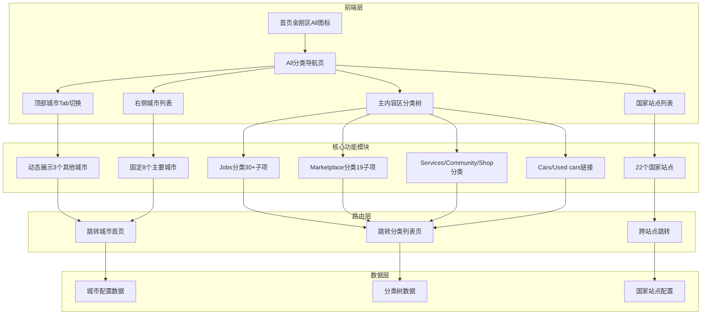
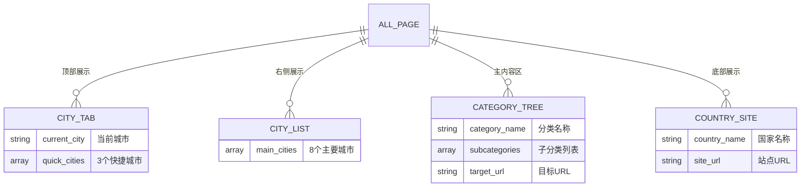
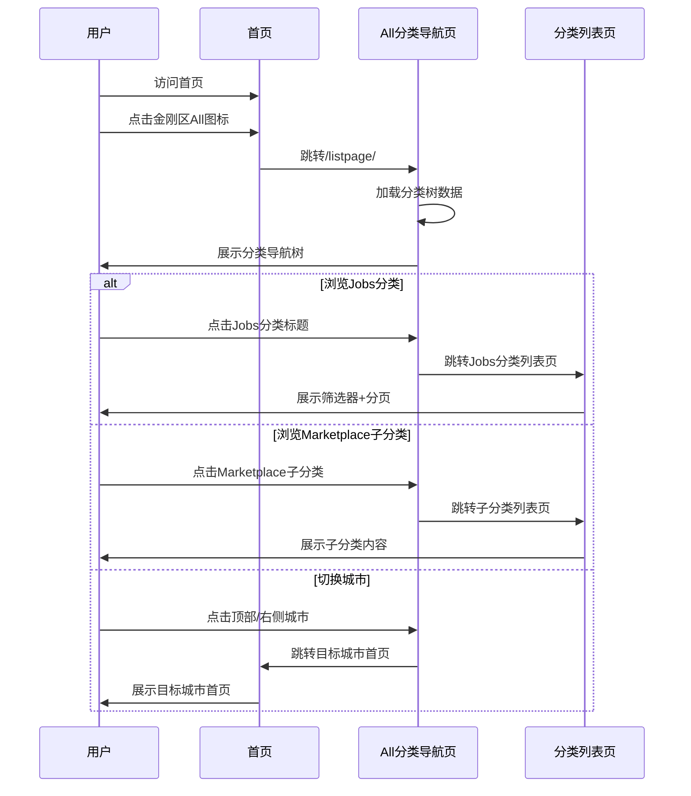
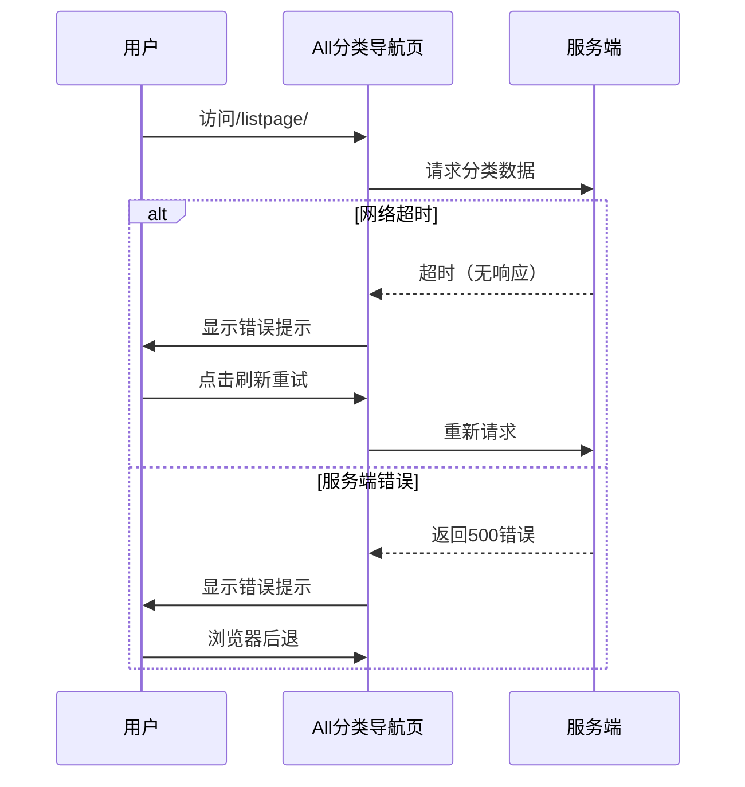

# All分类导航业务全景

## 1. 业务定位

### 业务价值链定位
All分类导航页是OK平台的核心流量分发中心，为用户提供跨城市、跨分类的统一浏览入口，连接首页与各业务域（Jobs/Property/Marketplace/Services/Community/Cars）。

### 战略目标
- **统一导航入口** → 降低用户浏览成本，提升平台分类可发现性
- **跨城市快速切换** → 优化多城市用户体验
- **SEO优化** → 提升长尾分类搜索权重

---

## 2. 系统架构全景

---

## 3. 业务域全景矩阵

### 3.1 功能模块覆盖

| 模块 | 功能点 | 实现状态 | 测试覆盖率 | 备注 |
|------|--------|---------|-----------|------|
| **页面入口** | 首页金刚区All图标 | ✅ 已实现 | 100% (TC001-TC002) | - |
| **城市切换** | 顶部城市Tab（3个快捷城市） | ✅ 已实现 | 100% (TC003-TC005) | 动态展示 |
| **城市切换** | 右侧城市列表（8个主要城市） | ✅ 已实现 | 100% (TC006-TC007) | 固定列表 |
| **分类导航** | Jobs分类树（30+子分类） | ✅ 已实现 | 100% (TC008-TC011) | 一级+二级 |
| **分类导航** | Marketplace分类树（19子分类） | ✅ 已实现 | 100% (TC012-TC014) | 一级+二级 |
| **分类导航** | Services/Community/Shop分类 | ✅ 已实现 | 100% (TC015-TC017) | 二级分类 |
| **分类导航** | Cars/Used cars链接 | ✅ 已实现 | 100% (TC018-TC019) | 独立链接 |
| **国家站点** | 22个国家/地区切换 | ✅ 已实现 | 100% (TC020-TC021) | 跨站点 |
| **边界场景** | 浏览器后退/刷新 | ✅ 已实现 | 100% (TC022-TC023) | - |
| **国际化** | 多语言支持 | ✅ 已实现 | 100% (TC024) | 英语 |
| **性能** | 页面加载时间 | ✅ 已实现 | 100% (TC025) | <3秒 |
| **无障碍** | 键盘导航 | ✅ 已实现 | 100% (TC026) | Tab键 |

**测试覆盖统计**:
- 总用例数：32条
- 已自动化：32条（100%）
- 已执行：32条（全部通过）

### 3.2 用户旅程覆盖

| 用户旅程 | 关键步骤 | 涉及模块 | 测试用例 |
|---------|---------|---------|---------|
| **快速浏览所有分类** | 首页→All→浏览分类树 | 页面入口、分类导航 | TC001, TC008-TC019 |
| **切换城市浏览** | 首页→All→点击其他城市 | 页面入口、城市切换 | TC001, TC003-TC007 |
| **跨国家浏览** | 首页→All→点击国家站点 | 页面入口、国家站点 | TC001, TC020-TC021 |
| **深入分类列表** | 首页→All→点击分类/子分类 | 页面入口、分类导航 | TC001, TC008-TC019 |

---

## 4. 数据模型全景

### 4.1 核心数据实体

### 4.2 关键业务规则

| 规则ID | 规则描述 | 优先级 | 验证用例 |
|--------|---------|--------|---------|
| R001 | URL格式：`/en/city-{city}/listpage/` | P0 | TC001 |
| R002 | 页面标题格式：`{City} Classified Information Website - OK` | P0 | TC002 |
| R003 | 顶部城市Tab：当前城市+动态3个其他城市 | P0 | TC003-TC005 |
| R004 | 右侧城市列表：固定8个主要城市 | P1 | TC006-TC007 |
| R005 | Jobs子分类数量 >= 30 | P1 | TC009 |
| R006 | Marketplace子分类数量 >= 19 | P1 | TC012 |
| R007 | 点击城市跳转至该城市首页（非listpage） | P0 | TC003-TC007 |
| R008 | 点击分类/子分类跳转至分类列表页 | P0 | TC008-TC019 |
| R009 | 点击国家站点跨站跳转 | P1 | TC020-TC021 |
| R010 | 页面加载时间 < 3秒 | P1 | TC025 |

---

## 5. 关键流程全景

### 5.1 主流程：用户浏览分类

### 5.2 异常流程：页面加载失败

---

## 6. 业务对比分析

### 6.1 All分类导航页 vs 首页金刚区

| 维度 | All分类导航页 | 首页金刚区 | 差异说明 |
|------|--------------|-----------|---------|
| **功能定位** | 全分类浏览入口 | 快捷导航入口 | All更全面 |
| **分类展示** | 全部分类树（30+/19子项） | 仅8个快捷入口 | All展示完整 |
| **城市切换** | 顶部Tab+右侧列表 | 无城市切换 | All支持切换 |
| **国家站点** | 支持22个国家切换 | 无国家切换 | All支持跨国 |
| **页面加载** | 需加载分类树数据 | 静态快捷入口 | All需网络 |
| **SEO权重** | 高（独立URL） | 低（首页一部分） | All利于SEO |

### 6.2 跨城市 vs 跨国家

| 维度 | 跨城市切换 | 跨国家切换 | 差异说明 |
|------|----------|-----------|---------|
| **入口位置** | 顶部Tab+右侧列表 | 底部国家列表 | 分离展示 |
| **目标页面** | 城市首页 | 国家根站点 | 层级不同 |
| **URL结构** | `/en/city-{city}/` | `https://{country}.58v5.cn` | 域名级别 |
| **数据隔离** | 同站点不同城市 | 跨站点独立数据 | 数据隔离 |

---

## 7. 技术架构全景

### 7.1 前端技术栈

| 技术 | 用途 | 版本 |
|------|------|------|
| HTML/CSS | 页面结构与样式 | - |
| JavaScript | 交互逻辑 | ES6+ |
| 响应式布局 | 移动端适配 | - |

### 7.2 后端依赖

| 服务 | 用途 | 备注 |
|------|------|------|
| 分类树数据API | 加载所有分类和子分类 | 实时数据 |
| 城市配置API | 动态城市列表 | 缓存数据 |
| 国家站点配置 | 22个国家链接 | 静态配置 |

---

## 8. 风险与挑战

### 8.1 技术风险

| 风险 | 影响 | 缓解措施 | 状态 |
|------|------|---------|------|
| **分类树数据过大** | 页面加载慢 | 懒加载子分类 | ⚠️ 待优化 |
| **跨站点跳转失败** | 用户无法访问其他国家 | 降级至当前站点 | ⚠️ 待实现 |
| **城市配置错误** | 用户跳转到错误城市 | 配置校验+监控 | ✅ 已实现 |

### 8.2 产品风险

| 风险 | 影响 | 缓解措施 | 状态 |
|------|------|---------|------|
| **用户对All入口认知不足** | 流量低 | 首页引导+工具提示 | ⚠️ 待优化 |
| **分类树层级过深** | 用户迷失 | 面包屑导航 | ❌ 未实现 |

---

## 9. 未来规划

### 9.1 功能增强

| 功能 | 优先级 | 预期收益 | 时间规划 |
|------|--------|---------|---------|
| 分类搜索 | P0 | 提升分类可发现性 | - |
| 热门分类推荐 | P1 | 引导用户浏览 | - |
| 分类收藏 | P2 | 提升用户粘性 | - |
| 分类统计展示 | P2 | 展示分类活跃度 | - |

### 9.2 性能优化

| 优化项 | 优先级 | 预期收益 | 时间规划 |
|--------|--------|---------|---------|
| 分类树懒加载 | P0 | 减少首屏加载时间 | - |
| 图片CDN加速 | P1 | 提升加载速度 | - |
| 页面缓存策略 | P1 | 减少服务端压力 | - |

---

## 10. 测试覆盖全景

### 10.1 功能测试覆盖

| 测试类型 | 用例数 | 通过率 | 备注 |
|---------|--------|--------|------|
| 页面入口 | 2 | 100% | TC001-TC002 |
| 城市切换 | 5 | 100% | TC003-TC007 |
| 分类导航 | 12 | 100% | TC008-TC019 |
| 国家站点 | 2 | 100% | TC020-TC021 |
| 边界场景 | 2 | 100% | TC022-TC023 |
| 国际化 | 1 | 100% | TC024 |
| 性能测试 | 1 | 100% | TC025 |
| 无障碍 | 1 | 100% | TC026 |
| UI一致性 | 6 | 100% | TC027-TC032 |

**总计**: 32条用例，100%通过率，100%自动化

### 10.2 测试环境矩阵

| 环境 | 城市 | 语言 | 状态 |
|------|------|------|------|
| ae站 | Abu Dhabi | 英语 | ✅ 已测试 |
| ae站 | Dubai | 英语 | ✅ 已测试 |

---

## 11. 变更历史

| 日期 | 版本 | 变更内容 | 变更人 |
|------|------|---------|--------|
| 2026-04-27 | v1.0 | 创建All分类导航业务全景文档 | AI Assistant |

---

## 12. 附录

### 相关文档
- 业务流程文档：`bundled/knowledge_base/业务知识图谱/通用业务域/All分类导航业务流程.md`
- 业务规则文档：`bundled/knowledge_base/业务规则库/通用规则/All分类导航页规则.md`
- 测试用例文档：`bundled/knowledge_base/文本用例/Tiyan/首页More/OK-All分类导航页-测试用例-20260313.md`

### 实测完成清单 ✅
- [x] TC001-TC032: 全部32条用例已编写并通过
- [x] 32条已自动化（自动化率100%）
- [x] 跨城市切换：已验证
- [x] 跨国家切换：已验证
- [x] 分类树完整性：已验证
