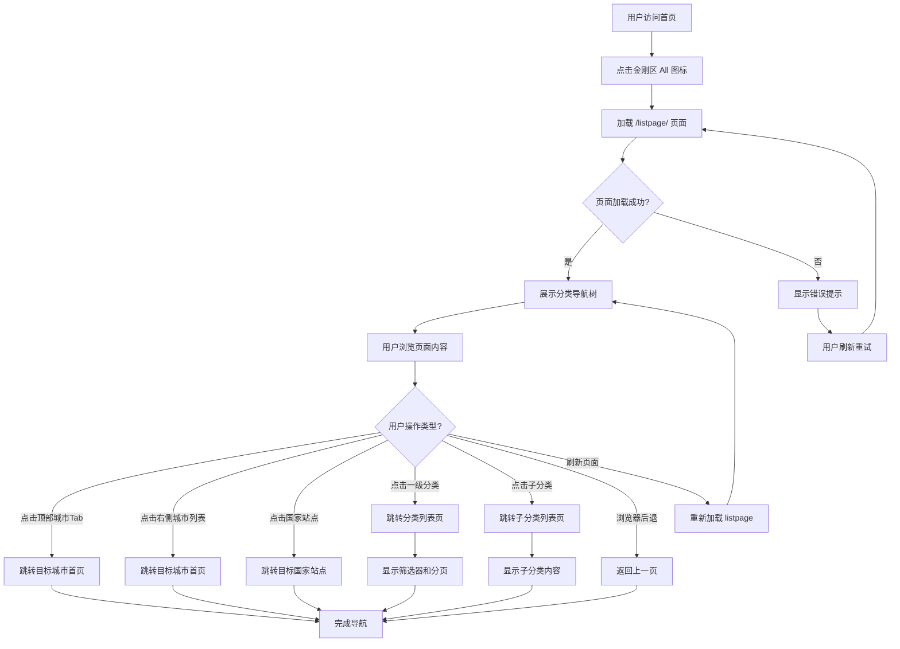

# All分类导航业务流程

> **业务目标**：为用户提供快速浏览和访问平台所有分类的统一导航入口

---

## 1. 完整流程图

> **说明**：本流程专注于 All 分类导航页内的操作流程，不包含跨域交互的复杂分支。



---

## 2. 详细步骤与观测点

### 步骤1：用户进入 All 分类导航页

**页面位置**: 首页金刚区

**操作流程**:
1. 用户访问首页（如 `https://ae.58v5.cn/en/city-abu-dhabi/`）
2. 定位金刚区的 "All" 图标
3. 点击 "All" 图标

**观测点**:
- ✅ P0观测点：URL 跳转至 `/en/city-{city}/listpage/`
- ✅ P0观测点：页面标题格式为 `{City} Classified Information Website - OK`
- ✅ P0观测点：HTTP 状态码为 200
- ✅ P1观测点：页面在 3 秒内完成加载

**验证方法**:
```javascript
// 验证 URL
expect(page.url()).toContain('/listpage/');

// 验证页面标题
expect(await page.title()).toContain('Classified Information Website - OK');

// 验证 HTTP 状态
expect(response.status()).toBe(200);
```

**关联规则**: [3.1 URL 规则](#31-url规则)

---

### 步骤2：查看页面内容 - 分类树

**页面位置**: listpage 主内容区

**操作流程**:
1. 页面加载完成后，自动展示分类导航树
2. 用户浏览分类树内容

**观测点**:
- ✅ P0观测点：Jobs 分类标题可见（含 `>` 箭头）
- ✅ P0观测点：Marketplace 分类标题可见
- ✅ P1观测点：Jobs 子分类数量 >= 30
- ✅ P1观测点：Marketplace 子分类数量 >= 19
- ✅ P1观测点：Services, Community, Shop 分类可见
- ✅ P1观测点：Cars 和 Used cars 链接可见

**验证方法**:
```javascript
// 验证 Jobs 分类
const jobsTitle = page.locator('text="Jobs"');
expect(await jobsTitle.isVisible()).toBeTruthy();

// 验证子分类数量
const jobsSubcategories = page.locator('[href*="cate-"] >> visible=true').count();
expect(jobsSubcategories).toBeGreaterThanOrEqual(30);
```

**关联规则**: [3.3 分类树结构规则](#33-分类树结构规则)

---

### 步骤3：查看顶部城市 Tab

**页面位置**: 页面顶部

**操作流程**:
1. 查看顶部城市 Tab 区域
2. 识别当前城市（纯文本，不可点击）
3. 识别其他 3 个城市链接

**观测点**:
- ✅ P1观测点：当前城市以纯文本形式展示
- ✅ P1观测点：旁边展示 3 个其他城市的可点击链接
- ✅ P2观测点：刷新页面后，3 个城市可能变化（动态推荐）

**验证方法**:
```javascript
// 验证当前城市（无链接）
const currentCity = page.locator('text="Abu Dhabi"').first();
expect(await currentCity.locator('a').count()).toBe(0);

// 验证其他城市链接
const cityLinks = page.locator('[href*="/city-"]').count();
expect(cityLinks).toBeGreaterThanOrEqual(3);
```

**关联规则**: [3.2 顶部城市 Tab 规则](#32-顶部城市-tab-规则)

---

### 步骤4：点击分类链接

**页面位置**: 分类树区域

**操作流程**:
1. 用户点击一级分类标题（如 Jobs、Marketplace）
2. 或用户点击子分类链接（如 Accounting、Electronics）

**观测点**:
- ✅ P0观测点：点击一级分类，跳转至 `/en/city-{city}/cate-{slug}/`
- ✅ P0观测点：分类列表页包含筛选工具栏
- ✅ P0观测点：分类列表页包含分页组件
- ✅ P1观测点：点击子分类，跳转至对应子分类列表页
- ✅ P1观测点：URL 包含当前城市参数 `city-{city}`
- ❌ 负向观测点：分类链接失效，显示 404 页面

**验证方法**:
```javascript
// 点击 Jobs 分类
await page.click('text="Jobs" >> visible=true');
await page.waitForLoadState('networkidle');

// 验证跳转
expect(page.url()).toContain('/cate-jobs/');
expect(page.url()).toContain('city-abu-dhabi');

// 验证页面元素
expect(await page.locator('text="Filter"').isVisible()).toBeTruthy();
expect(await page.locator('[class*="pagination"]').isVisible()).toBeTruthy();
```

**关联规则**: [3.4 分类链接点击规则](#34-分类链接点击规则)

---

### 步骤5：点击城市切换

**页面位置**: 顶部城市 Tab 或右侧城市列表

**操作流程**:
1. 用户点击顶部城市 Tab 中的其他城市链接
2. 或用户点击右侧城市列表中的城市

**观测点**:
- ✅ P1观测点：跳转至目标城市**首页**（非 listpage）
- ✅ P1观测点：URL 变为 `/en/city-{target-city}/`
- ✅ P1观测点：页面标题更新为目标城市名称
- ✅ P1观测点：金刚区域更新为目标城市对应内容

**验证方法**:
```javascript
// 点击城市
await page.click('text="Fujairah"');
await page.waitForLoadState('networkidle');

// 验证跳转
expect(page.url()).toContain('/city-fujairah/');
expect(page.url()).not.toContain('/listpage/');

// 验证页面标题
expect(await page.title()).toContain('Fujairah');
```

**关联规则**: [3.2 顶部城市 Tab 规则](#32-顶部城市-tab-规则), [3.5 右侧城市列表规则](#35-右侧城市列表规则)

---

### 步骤6：点击国家站点切换

**页面位置**: 页面底部国家站点列表

**操作流程**:
1. 用户向下滚动至国家站点列表
2. 点击目标国家（如 Australia, United States）

**观测点**:
- ✅ P2观测点：跳转至目标国家根站点
- ✅ P2观测点：URL 变为 `https://{country-code}.58v5.cn`
- ✅ P2观测点：页面语言和货币根据目标国家调整

**验证方法**:
```javascript
// 滚动至国家列表
await page.evaluate(() => window.scrollTo(0, document.body.scrollHeight));

// 点击 Australia
await page.click('text="Australia"');
await page.waitForLoadState('networkidle');

// 验证跳转
expect(page.url()).toContain('au.58v5.cn');
```

**关联规则**: [3.6 国家站点列表规则](#36-国家站点列表规则)

---

### 步骤7：刷新页面和浏览器后退

**页面位置**: 任意位置

**操作流程**:
1. 用户刷新页面（F5 或 Ctrl+R）
2. 或用户点击浏览器后退按钮

**观测点**:
- ✅ P1观测点：刷新后 URL 保持不变
- ✅ P1观测点：刷新后分类树内容完整展示
- ✅ P1观测点：后退返回至上一页（首页或其他来源页）
- ✅ P1观测点：后退后分类树正常展示

**验证方法**:
```javascript
// 刷新页面
const urlBefore = page.url();
await page.reload();
expect(page.url()).toBe(urlBefore);

// 验证内容
expect(await page.locator('text="Jobs"').isVisible()).toBeTruthy();

// 浏览器后退
await page.goBack();
expect(page.url()).not.toContain('/listpage/');
```

**关联规则**: [3.8 业务约束](#38-业务约束)

---

## 3. 流程完整性验证清单

- [ ] 从首页金刚区点击 All 图标，成功进入 listpage
- [ ] 直接访问 listpage URL，页面正常加载
- [ ] 页面展示完整分类树（Jobs, Marketplace, Services, Community, Shop, Cars）
- [ ] 顶部城市 Tab 显示当前城市 + 3 个其他城市链接
- [ ] 点击一级分类标题，跳转至分类列表页（含筛选器和分页）
- [ ] 点击子分类链接，跳转至子分类列表页
- [ ] 点击顶部城市链接，跳转至目标城市首页
- [ ] 点击右侧城市列表，跳转至目标城市首页
- [ ] 点击国家站点列表，跳转至目标国家根站点
- [ ] 刷新页面，分类树内容保持不变
- [ ] 浏览器后退，正确返回上一页
- [ ] 未登录访问，页面正常展示所有分类
- [ ] 不同城市的 listpage，分类链接包含对应城市参数

---

## 4. 关联文档

- [首页导航业务全景](./首页导航业务全景.md)
- [All分类导航页规则](../../业务规则库/通用规则/All分类导航页规则.md)

---

## 5. 变更历史

| 日期 | 版本 | 变更内容 | 变更人 |
|------|------|---------|--------|
| 2026-04-27 | v1.0 | 初始版本，基于测试用例归档 | AI Assistant |
