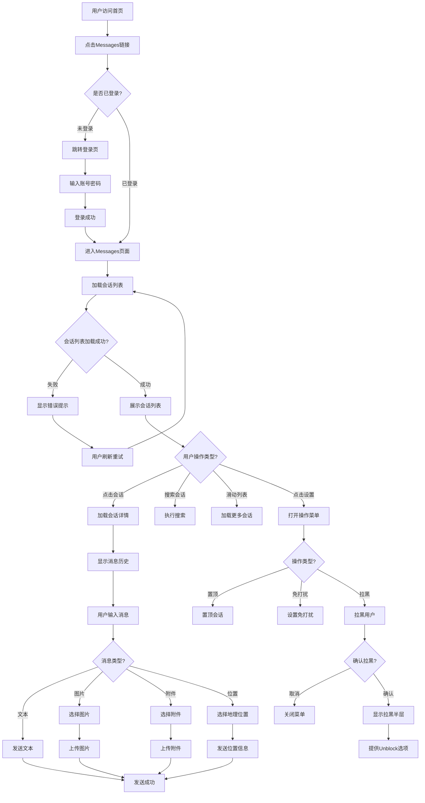

# Messages消息中心业务流程

> **业务目标**：为用户提供即时沟通平台，支持会话管理、消息发送和交互操作

---

## 1. 完整流程图

> **要求**：专注于Messages页面内的详细步骤，不包含跨域交互的复杂逻辑分支。



---

## 2. 详细步骤与观测点

### 步骤1：从首页进入Messages页面

**页面位置**: 首页导航栏

**操作流程**:
1. 用户访问首页 `https://ae.ok.com/en/city-abu-dhabi/`
2. 定位"Messages"链接
3. 点击"Messages"链接
4. 页面跳转至 `https://aepub.ok.com/biz/en/chat`

**观测点**:
- ✅ P0观测点：成功跳转至Messages页面
- ✅ P0观测点：URL包含 `/chat` 或 `/message`
- ✅ P0观测点：页面加载状态为 `networkidle`
- ✅ P1观测点：页面标题包含"Messages"相关文本

**验证方法**:
```javascript
// 验证URL
expect(page.url()).toContain('/chat');

// 验证页面加载状态
await page.waitForLoadState('networkidle');

// 验证关键元素可见
const messageContainer = page.locator('[class*="message"], [class*="chat"], textarea');
expect(await messageContainer.isVisible()).toBe(true);
```

**关联规则**: [R001-会话列表规则](#31-会话列表规则)

---

### 步骤2：加载并查看会话列表

**页面位置**: Messages页面左侧

**操作流程**:
1. 页面自动加载会话列表
2. 会话按时间倒序排列
3. 置顶会话显示在最前方
4. 每个会话显示：头像、用户名、最后消息、时间戳

**观测点**:
- ✅ P0观测点：会话列表不为空（至少1个会话）
- ✅ P0观测点：每个会话包含完整元素（头像/用户名/消息/时间）
- ✅ P1观测点：置顶会话显示toplist图标
- ✅ P1观测点：免打扰会话显示listMute图标
- ✅ P1观测点：未读消息显示红色气泡

**验证方法**:
```javascript
// 统计会话数量
const conversationItems = page.locator('[class*="conversation"], [class*="chat-item"]');
const count = await conversationItems.count();
expect(count).toBeGreaterThan(0);

// 验证会话元素完整性
const firstConversation = conversationItems.first();
const hasAvatar = await firstConversation.locator('img[class*="avatar"]').isVisible();
const hasUserName = await firstConversation.locator('[class*="name"]').isVisible();
expect(hasAvatar && hasUserName).toBe(true);
```

**关联规则**: [R001-R007](#31-会话列表规则)

---

### 步骤3：点击会话查看详情

**页面位置**: 会话列表

**操作流程**:
1. 用户点击某个会话项
2. 会话项高亮显示（选中状态）
3. 右侧或下方加载会话详情
4. 显示消息历史记录
5. 显示消息输入框

**观测点**:
- ✅ P0观测点：会话详情区域可见
- ✅ P0观测点：消息输入框可见
- ✅ P0观测点：详情页用户昵称与会话列表一致
- ✅ P1观测点：显示历史消息（如果有）
- ✅ P1观测点：页面滚动到最新消息

**验证方法**:
```javascript
// 点击会话
await conversationItems.nth(1).click();
await page.waitForTimeout(2000);

// 验证详情区域可见
const detailArea = page.locator('textarea[placeholder*="message"]');
expect(await detailArea.isVisible()).toBe(true);

// 验证用户昵称一致性
const listUserName = await conversationItems.nth(1).locator('[class*="name"]').textContent();
const detailUserName = await page.locator('h1, h2, h3, [class*="user-name"]').first().textContent();
expect(listUserName).toContain(detailUserName);
```

**关联规则**: [R007](#31-会话列表规则)

---

### 步骤4：发送文本消息

**页面位置**: 会话详情页消息输入框

**操作流程**:
1. 定位消息输入框（textarea）
2. 输入文本内容
3. Send按钮从disabled变为enabled
4. 点击Send按钮或按Enter键
5. 消息发送成功，显示在消息列表

**观测点**:
- ✅ P0观测点：Send按钮初始状态为disabled
- ✅ P0观测点：输入文字后Send按钮变为enabled
- ✅ P0观测点：点击Send后消息成功发送
- ✅ P1观测点：发送的消息显示在消息列表末尾
- ✅ P1观测点：清空输入框后Send按钮恢复disabled
- ❌ 负向观测点：空消息不能发送

**验证方法**:
```javascript
// 验证初始状态
const sendBtn = page.locator('button:has-text("Send")');
expect(await sendBtn.isDisabled()).toBe(true);

// 输入文本
const textarea = page.locator('textarea[placeholder*="message"]');
await textarea.fill('Test message');

// 验证按钮启用
expect(await sendBtn.isDisabled()).toBe(false);

// 发送消息
await sendBtn.click();
await page.waitForTimeout(2000);

// 验证消息显示
const messages = page.locator('[class*="message-item"], [class*="chat-bubble"]');
const lastMessage = messages.last();
expect(await lastMessage.textContent()).toContain('Test message');
```

**关联规则**: [R101-R111](#32-消息发送规则)

---

### 步骤5：发送图片消息

**页面位置**: 会话详情页消息输入区

**操作流程**:
1. 点击图片图标（picture25）
2. 触发文件选择器（input[type="file"]）
3. 选择图片文件（jpg/png/jpeg）
4. 图片上传到服务器
5. 图片消息发送成功

**观测点**:
- ✅ P0观测点：图片图标可见且可点击
- ✅ P0观测点：点击后触发文件选择器
- ✅ P0观测点：文件input的accept属性包含image/*
- ✅ P1观测点：上传成功后显示图片预览
- ✅ P1观测点：图片消息显示在消息列表

**验证方法**:
```javascript
// 点击图片图标
const pictureIcon = page.locator('[class*="picture"]').first();
await pictureIcon.click();

// 选择文件
const fileInput = page.locator('input[type="file"][accept*="image"]');
await fileInput.setInputFiles('path/to/test-image.jpg');

// 等待上传完成
await page.waitForTimeout(3000);

// 验证图片消息显示
const imageMessage = page.locator('img[class*="message-image"], img[class*="chat-image"]').last();
expect(await imageMessage.isVisible()).toBe(true);
```

**关联规则**: [R105-R106](#32-消息发送规则)

---

### 步骤6：管理会话（置顶/免打扰/拉黑）

**页面位置**: 会话详情页设置图标

**操作流程**:
1. 点击设置图标
2. 弹出操作菜单（Top/Mute/Block）
3. 选择操作类型
4. 执行相应操作
5. 更新会话状态

**观测点**:
- ✅ P0观测点：设置图标可见且可点击
- ✅ P0观测点：点击后显示操作菜单
- ✅ P1观测点：置顶后会话移至列表顶部+显示toplist图标
- ✅ P1观测点：免打扰后显示listMute图标
- ✅ P0观测点：拉黑需二次确认
- ✅ P0观测点：拉黑后显示拉黑半层+Unblock按钮

**验证方法**:
```javascript
// 点击设置图标
const settingsIcon = page.locator('[class*="setting"], [class*="more"]').first();
await settingsIcon.click();
await page.waitForTimeout(1000);

// 验证菜单显示
const menu = page.locator('[class*="menu"], [class*="dropdown"]');
expect(await menu.isVisible()).toBe(true);

// 点击Top选项
const topOption = page.locator('text=Top').first();
await topOption.click();
await page.waitForTimeout(2000);

// 验证置顶图标显示
const topIcon = page.locator('img[src*="toplist"]');
expect(await topIcon.isVisible()).toBe(true);
```

**关联规则**: [R201-R207](#33-会话操作规则)

---

### 步骤7：搜索会话

**页面位置**: Messages页面搜索框

**操作流程**:
1. 定位搜索输入框
2. 输入搜索关键词（用户名）
3. 会话列表实时过滤
4. 显示匹配结果
5. 清空搜索恢复完整列表

**观测点**:
- ✅ P1观测点：搜索框可见
- ✅ P1观测点：输入时实时过滤会话
- ✅ P1观测点：仅显示匹配的会话
- ✅ P2观测点：无匹配时显示空状态

**验证方法**:
```javascript
// 定位搜索框
const searchInput = page.locator('input[placeholder*="Search"], input[type="search"]');
await searchInput.fill('test user');
await page.waitForTimeout(1000);

// 验证过滤结果
const visibleConversations = page.locator('[class*="conversation"]:visible');
const count = await visibleConversations.count();
expect(count).toBeGreaterThanOrEqual(0);
```

**关联规则**: [R301-R303](#34-搜索和筛选规则)

---

## 3. 流程完整性验证清单

- [ ] 用户可以从首页进入Messages页面
- [ ] 会话列表正确加载并按时间排序
- [ ] 置顶和免打扰会话正确标识
- [ ] 点击会话后详情页用户信息一致
- [ ] 可以发送文本消息
- [ ] 可以发送图片消息（jpg/png/jpeg）
- [ ] 可以发送附件（pdf等9种格式）
- [ ] 可以发送地理位置
- [ ] Send按钮状态正确切换（disabled/enabled）
- [ ] 空消息无法发送
- [ ] 可以置顶会话
- [ ] 可以设置免打扰
- [ ] 可以拉黑用户并解除拉黑
- [ ] 搜索功能正常工作
- [ ] 会话列表支持滑动加载更多

---

## 4. 关联文档

- [业务全景](../../业务知识图谱/通用业务域/Messages消息中心业务全景.md)
- [业务规则](../../业务规则库/通用规则/Messages消息中心规则.md)
- [测试用例](../../文本用例/Tiyan/消息中心/OK-Messages-功能探索-测试用例-20260306.md)

---

## 5. 变更历史

| 日期 | 版本 | 变更内容 | 变更人 |
|------|------|---------|--------|
| 2026-04-27 | v1.0 | 创建Messages消息中心业务流程文档 | AI Assistant |
