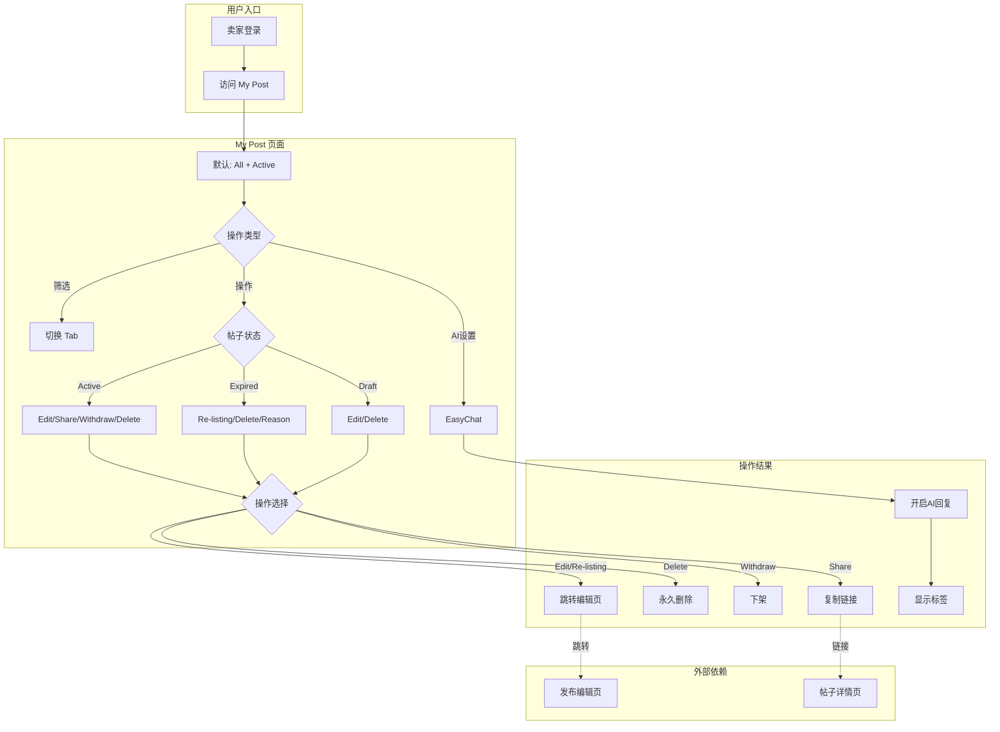
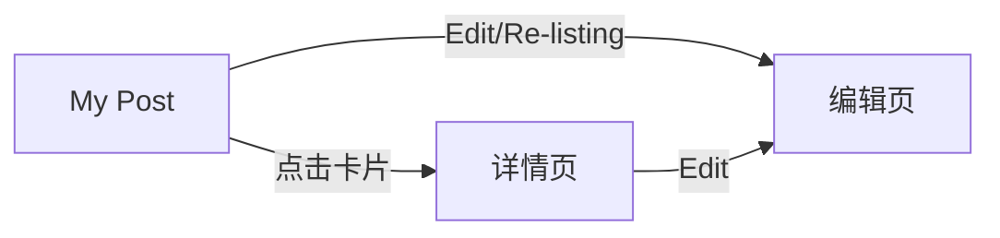
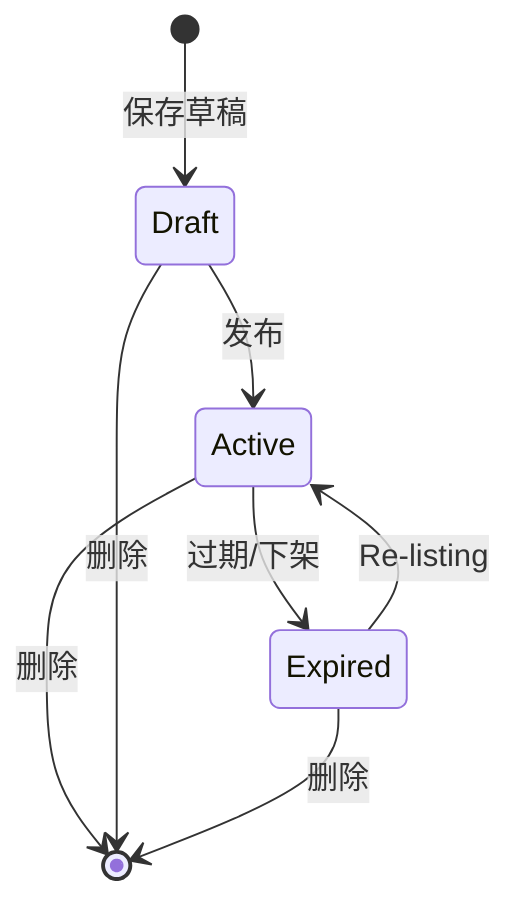

# 帖子发布业务全景

## 1. 业务定位

### 业务价值
- 为卖家提供统一的帖子管理平台，支持全生命周期管理
- 提升帖子管理效率，降低操作成本
- 通过 EasyChat AI 提升买卖双方沟通效率

### 目标用户
- **卖家（Seller）**：管理自己发布的帖子

---

## 2. 业务范围

### 功能覆盖
- 帖子列表管理（按状态、分类筛选）
- 帖子操作（编辑、分享、下架、删除、重新上架）
- EasyChat AI 自动回复设置
- 帖子详情查看

### 地域覆盖
- UAE 站（ae.58v5.cn）

### 用户角色
- Seller（卖家）

---

## 3. 业务流程全景图

---

## 4. 核心业务流程概览

### 4.1 帖子列表查看流程
- **业务目标**：快速查看和筛选帖子
- **核心步骤**：登录 → 访问页面 → 切换 Tab → 查看列表
- **关键观测点**：默认状态、Tab 切换、分页

### 4.2 帖子操作流程
- **业务目标**：管理帖子状态
- **核心步骤**：展开菜单 → 选择操作 → 二次确认 → 执行
- **关键观测点**：菜单选项、确认弹窗、操作结果

---

## 5. 页面拓扑关系

### 5.1 页面入口矩阵

| 页面 | 入口1 | 入口2 |
|------|-------|-------|
| My Post 列表页 | 直接访问 URL | 导航栏入口 |
| 编辑页 | Edit 操作 | Re-listing 操作 |
| 详情页 | 点击帖子卡片 | - |

### 5.2 页面跳转流程图

---

## 6. 业务数据流转

### 6.1 状态流转图

### 6.2 用户操作与数据变化

| 操作 | 数据变化 | 前台展示变化 |
|------|---------|-------------|
| Delete | 帖子永久删除 | 列表数量减1 |
| Withdraw | 状态变为 Expired | 移至 Expired Tab |
| Re-listing | 重新发布 | 移至 Active Tab |

---

## 7. 关键业务规则索引

- [3.1 Tab 筛选规则](../../业务规则库/通用规则/MyPost我的帖子页规则.md#31-tab-筛选规则)
- [3.3 操作菜单规则](../../业务规则库/通用规则/MyPost我的帖子页规则.md#33-操作菜单规则)
- [3.5 EasyChat Settings 规则](../../业务规则库/通用规则/MyPost我的帖子页规则.md#35-easychat-settings-规则)

---

## 8. 业务FAQ

### Q1: 为什么 Pending 状态通常为空？
**A**: Pending 状态是帖子待审核状态，通常审核速度较快，所以大部分时间为空。

### Q2: 刷新页面为什么会恢复默认状态？
**A**: Tab 状态不保存在 URL 参数中，刷新后自动恢复为默认的 All + Active 状态。

### Q3: EasyChat 为什么只在 Marketplace 类别显示？
**A**: 当前 EasyChat AI 功能仅支持 Marketplace 类别的商品交易场景。

---

## 9. 业务指标（可选）

- 帖子总数、Active/Expired/Draft 分布
- Delete/Withdraw/Re-listing 操作频率
- EasyChat 开启率

---

## 10. 已知问题与风险

### 技术风险
- 跨域名 Session 一致性
- Tab 状态不持久化

---

## 11. 变更历史

| 日期 | 版本 | 变更内容 | 变更人 |
|------|------|---------|--------|
| 2026-04-27 | v1.0 | 初始版本 | AI Assistant |
