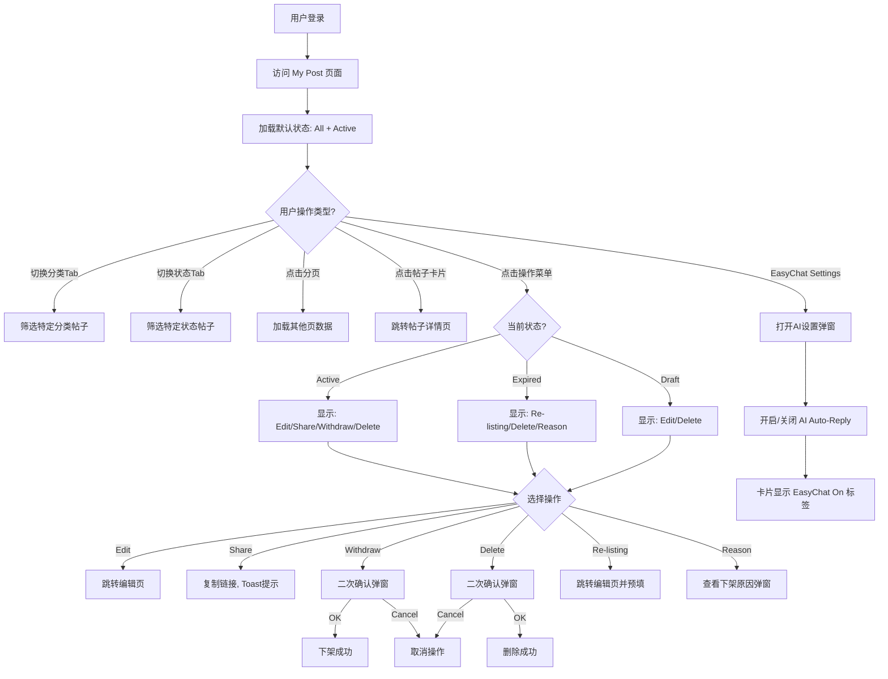

# MyPost帖子管理业务流程

> **业务目标**：为卖家提供统一的帖子全生命周期管理入口

---

## 1. 完整流程图

---

## 2. 详细步骤与观测点

### 步骤1：登录并进入 My Post 页面

**页面位置**: 发布系统

**操作流程**:
1. 用户完成登录
2. 访问 `https://aepub.58v5.cn/biz/en/publish/list`

**观测点**:
- ✅ P0观测点：页面标题为 "My Post"
- ✅ P0观测点：默认选中 All + Active
- ✅ P1观测点：列表每页展示 10 条帖子
- ❌ 负向观测点：未登录访问，重定向至登录页

**验证方法**: 验证页面标题、Tab 状态、帖子数量

**关联规则**: [3.1 Tab 筛选规则](../../业务规则库/通用规则/MyPost我的帖子页规则.md#31-tab-筛选规则)

---

### 步骤2：切换分类或状态 Tab

**页面位置**: Tab 导航区

**操作流程**: 点击分类 Tab 或状态 Tab

**观测点**:
- ✅ P0观测点：Tab 高亮状态更新
- ✅ P0观测点：列表内容根据筛选条件更新

**关联规则**: [3.1 Tab 筛选规则](../../业务规则库/通用规则/MyPost我的帖子页规则.md#31-tab-筛选规则)

---

### 步骤3：执行帖子操作

**页面位置**: 操作菜单

**操作流程**: 点击 `...` 展开菜单，选择操作

**观测点**:
- ✅ P0观测点：Edit 跳转编辑页并预填数据
- ✅ P1观测点：Share 复制链接并显示 Toast
- ✅ P0观测点：Delete 二次确认后删除成功

**关联规则**: [3.3 操作菜单规则](../../业务规则库/通用规则/MyPost我的帖子页规则.md#33-操作菜单规则)

---

## 3. 流程完整性验证清单

- [ ] 登录后成功访问 My Post 页面
- [ ] Tab 切换正常工作
- [ ] 操作菜单显示正确选项
- [ ] 所有操作执行正常
- [ ] 未登录访问重定向

---

## 4. 关联文档

- [MyPost我的帖子页规则](../../业务规则库/通用规则/MyPost我的帖子页规则.md)

---

## 5. 变更历史

| 日期 | 版本 | 变更内容 | 变更人 |
|------|------|---------|--------|
| 2026-04-27 | v1.0 | 初始版本 | AI Assistant |
