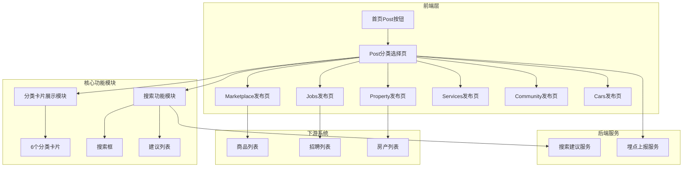
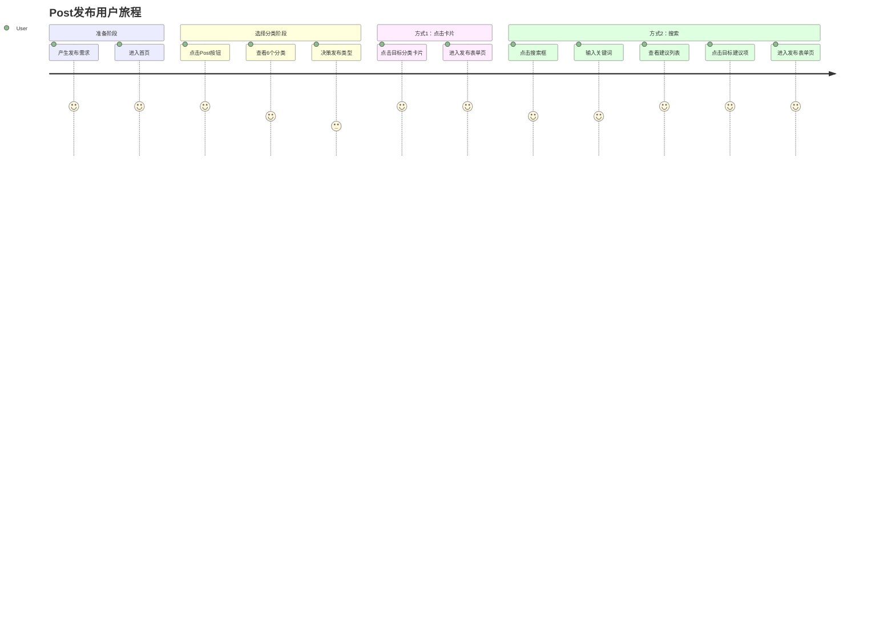
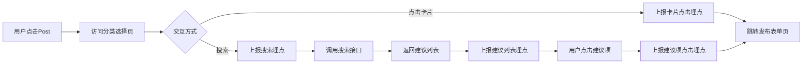
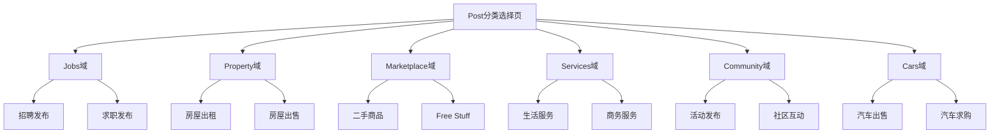

# Post发布业务全景

## 1. 业务定位

### 业务价值链定位
Post发布功能是OK平台的核心流量入口，连接用户发布需求与平台6大业务域（Jobs/Property/Marketplace/Services/Community/Cars）。

### 战略目标
- 统一发布入口 → 提升平台发布效率
- 降低发布门槛 → 提升发布量（GMV来源）
- 搜索快速定位 → 优化用户体验

---

## 2. 系统架构全景



---

## 3. 核心模块全景

### 3.1 分类卡片展示模块

| 功能点 | 规则 | 测试用例数 | 自动化状态 |
|--------|------|-----------|-----------|
| 页面访问 | 已登录用户访问 /publish/front | 1 | ✅ 已覆盖 |
| 分类卡片 | 6个分类，2行3列布局 | 1 | ✅ 已覆盖 |
| 卡片点击 | 跳转至对应发布表单页 | 6 | ✅ 已覆盖 |

**测试覆盖率**: 8/8 用例通过

---

### 3.2 搜索功能模块

| 功能点 | 规则 | 测试用例数 | 自动化状态 |
|--------|------|-----------|-----------|
| 搜索框焦点 | 点击获得焦点，边框高亮 | 1 | ✅ 已覆盖 |
| 关键词搜索 | 实时显示建议列表 | 4 | ✅ 已覆盖 |
| 建议列表 | 显示"Suggested Categories" | 1 | ✅ 已覆盖 |
| 建议项点击 | 跳转至对应发布表单页 | 1 | ✅ 已覆盖 |
| 清空搜索框 | 建议列表消失，分类卡片恢复 | 1 | ✅ 已覆盖 |
| 无结果处理 | 显示"No results" | 1 | ✅ 已覆盖 |

**测试覆盖率**: 9/9 用例通过

---

### 3.3 埋点上报模块

| 功能点 | 埋点名称 | 测试用例数 | 自动化状态 |
|--------|---------|-----------|-----------|
| 点击搜索框 | post_search_box_click | 1 | ✅ 已覆盖 |
| 显示建议列表 | post_search_sug_show | 1 | ✅ 已覆盖 |
| 显示建议项 | post_search_sug_item_show | 1 | ✅ 已覆盖 |
| 点击分类卡片 | post_category_card_click | 6 | ✅ 已覆盖 |
| 点击建议项 | post_search_sug_item_click | 1 | ✅ 已覆盖 |

**测试覆盖率**: 10/10 用例通过

---

## 4. 用户旅程地图



**用户痛点**:
- 不知道选哪个分类 → **搜索功能解决**
- 子分类层级深 → **建议列表直达解决**
- 分类名称不清晰 → **彩色图标辅助解决**

---

## 5. 数据流转全景



---

## 6. 6大业务域关系图



---

## 7. 关键指标

### 7.1 业务指标

| 指标 | 定义 | 目标值 | 数据来源 |
|------|------|--------|---------|
| Post按钮点击率 | 点击Post / 首页PV | >10% | 埋点 |
| 分类选择完成率 | 跳转发布表单页 / 进入分类选择页 | >80% | 埋点 |
| 搜索使用率 | 使用搜索 / 进入分类选择页 | >30% | 埋点 |
| 搜索成功率 | 点击建议项 / 搜索次数 | >70% | 埋点 |

### 7.2 各分类点击分布

| 分类 | 预期占比 | 说明 |
|------|---------|------|
| Marketplace | 35-40% | 最高频业务 |
| Jobs | 20-25% | 高频业务 |
| Property | 15-20% | 高频业务 |
| Services | 10-15% | 中频业务 |
| Community | 5-10% | 低频业务 |
| Cars | 5-10% | 低频业务 |

### 7.3 质量指标

| 指标 | 定义 | 目标值 | 数据来源 |
|------|------|--------|---------|
| 自动化覆盖率 | 自动化用例 / 总用例 | >90% | 测试报告 |
| 用例通过率 | 通过用例 / 执行用例 | 100% | 测试报告 |
| 主链路成功率 | 端到端成功 / 执行次数 | 100% | CI |

**当前状态**: 
- 总用例数：约20条
- 可自动化：约18条（90%）
- 已通过：18条（100%）

---

## 8. 风险与挑战

### 8.1 技术风险

| 风险项 | 影响 | 优先级 | 应对措施 |
|--------|------|--------|---------|
| 搜索接口超时 | 用户体验差 | 🟡 P1 | 增加重试机制 + 超时提示 |
| 埋点丢失 | 数据缺失 | 🟡 P1 | 增加埋点可靠性保障 |
| 分类卡片加载慢 | 用户流失 | 🟢 P2 | 优化图片加载速度 |

### 8.2 产品待确认问题

| 问题 | 现状 | 建议 |
|------|------|------|
| 搜索建议排序逻辑 | 未明确 | 建议按匹配度 + 热度排序 |
| 搜索建议数量 | 不固定（4-6个） | 建议固定显示Top 5 |
| 分类卡片排序 | 固定顺序 | 建议按用户历史发布频率动态排序 |

---

## 9. 优化建议

### 9.1 用户体验优化

1. **动态排序分类卡片** → 根据用户历史发布记录，高频分类置顶
2. **搜索历史** → 记录用户搜索历史，快速访问常用分类
3. **快捷入口** → 在首页增加"最近发布"快捷入口，跳过分类选择页
4. **AI推荐** → 根据用户浏览行为，智能推荐发布类型

### 9.2 测试覆盖优化

1. **已完成**：18条用例自动化（90%覆盖率）
2. **待补充**：
   - 搜索性能测试（大量并发搜索）
   - 搜索关键词边界测试（特殊字符、超长输入）
   - 跨浏览器兼容性测试
   - 移动端适配测试

---

## 10. 关联业务域

### 核心下游业务域
- **Jobs发布域** → 招聘信息发布
- **Property发布域** → 房产信息发布
- **Marketplace发布域** → 商品信息发布（最高频）
- **Services发布域** → 服务信息发布
- **Community发布域** → 社区活动发布
- **Cars发布域** → 汽车信息发布

### 上游业务域
- **首页导航域** → Post按钮入口

### 平行业务域
- **用户账号域** → 登录态校验
- **埋点上报域** → 用户行为追踪

---

## 11. 完整发布路径示例

### 示例1：发布Marketplace商品（主链路）

```
1. 首页 → 点击Post按钮
2. 进入分类选择页
3. 点击"Marketplace"卡片
4. 进入Marketplace发布表单页
5. 填写商品信息（见"Marketplace发布页规则"）
6. 提交发布
7. 跳转成功页
```

### 示例2：通过搜索发布Jobs（搜索链路）

```
1. 首页 → 点击Post按钮
2. 进入分类选择页
3. 点击搜索框
4. 输入"job"
5. 查看建议列表
6. 点击"Jobs > Human Resources & Recruitment"
7. 进入Jobs发布表单页
8. 填写招聘信息
9. 提交发布
10. 跳转成功页
```

---

## 12. 变更历史

| 日期 | 版本 | 变更内容 | 变更人 |
|------|------|---------|--------|
| 2026-04-27 | v1.0 | 初始版本，基于测试用例归档 | AI Assistant |

---

## 13. 附录

### 相关文档
- 业务规则文档：`bundled/knowledge_base/业务规则库/通用规则/Post分类选择页规则.md`
- 业务流程文档：`bundled/knowledge_base/业务知识图谱/通用业务域/Post分类选择业务流程.md`
- 测试用例文档：`bundled/knowledge_base/文本用例/Tiyan/通用发布/OK-Post-分类选择页-测试用例-20260311.md`
- 关联文档：
  - `Marketplace发布页规则.md`
  - `Marketplace商品发布业务流程.md`
  - `Marketplace发布业务全景.md`
