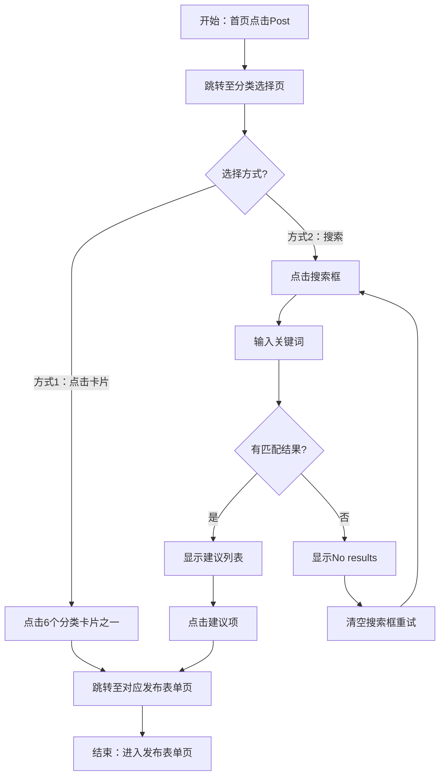
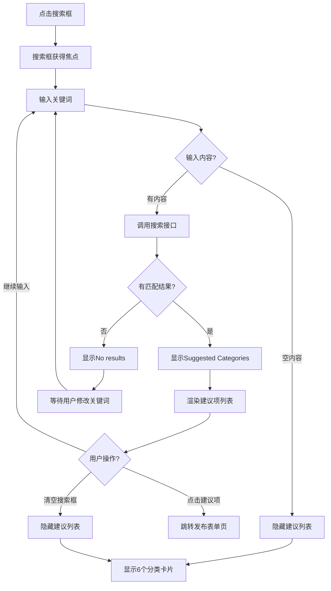
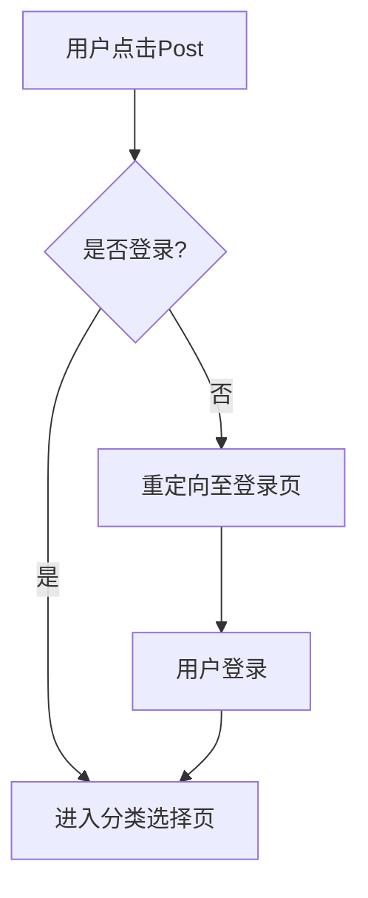

# Post分类选择业务流程

## 1. 流程概述

### 流程定位
Post分类选择流程是OK平台所有发布流程的统一入口，用户通过此页面选择发布类型后进入对应的发布表单页。

### 核心价值
- 统一发布入口 → 降低用户学习成本
- 搜索功能 → 快速定位目标分类
- 清晰的分类展示 → 提升用户决策效率

### 覆盖角色
- **Seller（卖家）**

---

## 2. 前置条件

### 业务前置条件
- 已完成注册和登录
- 账号状态正常（非封禁）

### 数据准备
- 无需特殊数据准备

### 权限要求
- 已登录Seller角色

---

## 3. 主流程

---

## 4. 分步操作

### 步骤1：进入分类选择页
- **入口**: 首页 → Post按钮
- **URL**: `https://aepub.58v5.cn/biz/en/publish/front`
- **预期**: 
  - 页面标题显示"Post"
  - 右上角显示黄色"Free"标签
  - 显示用户名和头像

### 步骤2：查看分类卡片
- **显示内容**: 6个分类卡片
  - 第一行：Jobs、Property、Marketplace
  - 第二行：Services、Community、Cars
- **布局**: 2行3列网格
- **卡片内容**: 彩色图标 + 分类名称

### 步骤3：选择发布方式

#### 方式A：点击分类卡片（推荐）

**操作流程**:
1. 直接点击目标分类卡片
2. 触发埋点：`post_category_card_click`
3. 跳转至对应发布表单页

**适用场景**: 用户明确知道要发布的类型

#### 方式B：搜索分类（快速定位）

**操作流程**:
1. 点击搜索框（触发埋点：`post_search_box_click`）
2. 输入关键词（如"marketplace"、"job"）
3. 实时显示建议列表（触发埋点：`post_search_sug_show`）
4. 查看建议项（触发埋点：`post_search_sug_item_show`）
5. 点击目标建议项（触发埋点：`post_search_sug_item_click`）
6. 跳转至对应发布表单页

**适用场景**: 
- 用户不确定具体分类位置
- 子分类层级较深，搜索更快

---

## 5. 搜索功能详细流程

---

## 6. 搜索关键词匹配示例

### 示例1：搜索"marketplace"

**输入**: `marketplace`

**建议列表**:
1. Marketplace
2. Marketplace > Free Stuff
3. Marketplace > Transportation > Others
4. Marketplace > Home Goods > Others

**说明**: 返回主分类和相关子分类

### 示例2：搜索"job"

**输入**: `job`

**建议列表**:
1. Jobs
2. Jobs > Other
3. Jobs > Science & Technology > Laboratory & Technical Services
4. Jobs > Human Resources & Recruitment > Other
5. Jobs > Design & Architecture

**说明**: 匹配Jobs分类及其子分类

### 示例3：搜索无结果

**输入**: `xxxxx`

**建议列表**: "No results"

**处理**: 用户清空搜索框，重新输入或直接点击分类卡片

---

## 7. 跳转路径汇总

### 从分类卡片跳转

| 分类 | 目标URL模式 | 说明 |
|------|-----------|------|
| Jobs | /biz/en/publish/jobs?... | 招聘发布页 |
| Property | /biz/en/publish/property?... | 房产发布页 |
| Marketplace | /biz/en/publish/classified?traceId=xxx | 商品发布页 |
| Services | /biz/en/publish/services?... | 服务发布页 |
| Community | /biz/en/publish/community?... | 社区发布页 |
| Cars | /biz/en/publish/cars?... | 汽车发布页 |

### 从搜索建议跳转

- 跳转至对应的子分类发布表单页
- URL包含完整的分类路径参数

---

## 8. 异常处理

### 8.1 未登录场景

### 8.2 搜索无结果场景

| 步骤 | 操作 | 处理 |
|------|------|------|
| 1 | 用户输入无效关键词 | 显示"No results" |
| 2 | 用户清空搜索框 | 建议列表消失，分类卡片恢复 |
| 3 | 用户重新输入 | 重新匹配并显示结果 |

### 8.3 网络异常场景

| 异常类型 | 触发条件 | 处理方式 |
|---------|---------|---------|
| 页面加载失败 | 网络中断 | 显示错误提示，提供重试按钮 |
| 搜索接口超时 | 网络延迟 | 显示加载状态，超时后提示重试 |

---

## 9. 流程验证点

### 关键验证点

| 步骤 | 验证项 | 预期 |
|------|--------|------|
| 进入页面 | 页面标题 | 显示"Post" |
| 进入页面 | Free标签 | 右上角显示黄色"Free"标签 |
| 进入页面 | 分类卡片 | 显示6个分类卡片（2行3列） |
| 进入页面 | 搜索框 | 占位符为"Search for category" |
| 点击搜索框 | 焦点状态 | 搜索框边框高亮 |
| 输入关键词 | 建议列表 | 实时显示"Suggested Categories" |
| 清空搜索框 | 页面恢复 | 建议列表消失，分类卡片显示 |
| 点击卡片 | 页面跳转 | 跳转至对应发布表单页 |
| 点击建议项 | 页面跳转 | 跳转至对应发布表单页 |

### 埋点验证

| 操作 | 埋点名称 | 触发时机 |
|------|---------|---------|
| 点击搜索框 | post_search_box_click | 搜索框获得焦点 |
| 显示建议列表 | post_search_sug_show | 建议列表出现 |
| 显示建议项 | post_search_sug_item_show | 每个建议项显示 |
| 点击分类卡片 | post_category_card_click | 点击卡片 |
| 点击建议项 | post_search_sug_item_click | 点击建议项 |

---

## 10. 依赖系统

### 上游系统
- 首页Post按钮

### 下游系统
- Jobs发布表单页
- Property发布表单页
- Marketplace发布表单页
- Services发布表单页
- Community发布表单页
- Cars发布表单页

### 外部依赖
- 搜索建议服务（后端接口）
- 埋点上报服务

---

## 11. 变更历史

| 日期 | 版本 | 变更内容 | 变更人 |
|------|------|---------|--------|
| 2026-04-27 | v1.0 | 初始版本，基于测试用例归档 | AI Assistant |
