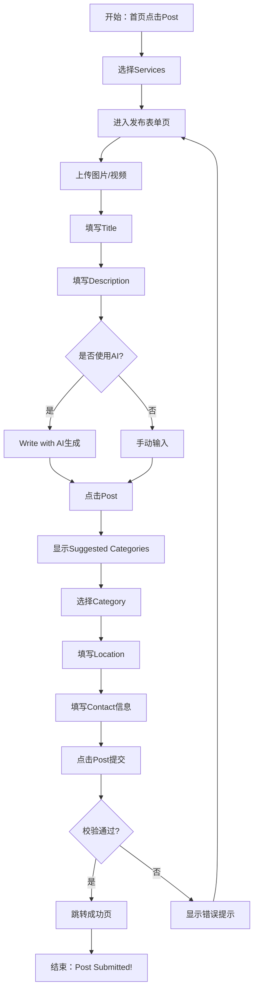
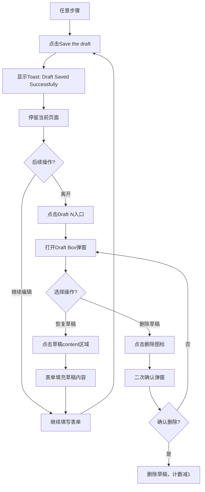
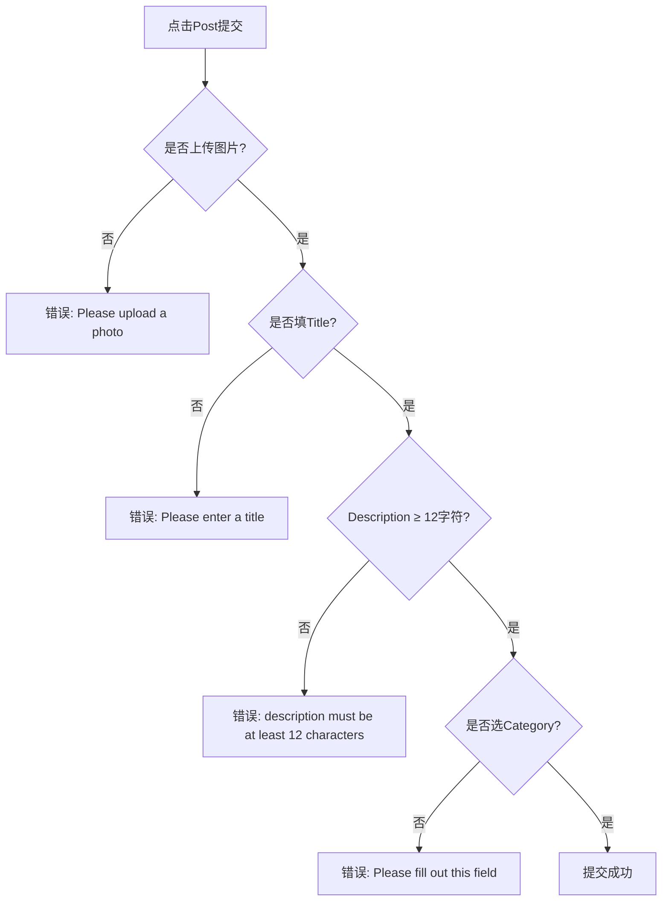

# Services发布业务流程

## 1. 流程概述

### 流程定位
Services发布流程支持服务提供商发布各类服务信息，包括清洁、维修、配送等服务。

### 核心价值
- 完成发帖 → 展示服务 → 收到询盘 → 促成交易
- AI辅助 → 提升发帖效率和质量
- 草稿保存 → 降低流失率

### 覆盖角色
- **Service Provider（服务提供商）**

---

## 2. 前置条件

### 业务前置条件
- 已完成注册和登录
- 账号状态正常（非封禁）

### 数据准备
- 服务图片/视频（1-9张，格式：jpg/png/mp4）
- 服务信息（标题/描述/分类/地点/联系方式）

### 权限要求
- 已登录Service Provider角色

---

## 3. 主流程

---

## 4. 分步操作

### 步骤1：进入发布页
- **入口**: 首页 → Post按钮 → Services
- **URL**: `https://aepub.58v5.cn/biz/en/publish?categoryId=23&traceId=xxx`
- **预期**: 跳转至发布表单页（URL含traceId）

### 步骤2：上传图片
- **操作**: 点击上传区域，选择1-9张图片/视频
- **校验**: 
  - 支持格式：jpg/png/mp4
  - 第一张自动标记"Main"
  - 计数器更新为"x/9"

### 步骤3：填写Title
- **操作**: 在Title输入框输入标题（maxlength=200）
- **校验**: 
  - 字符计数器显示"x/200"
  - 超出200字符自动截断

### 步骤4：填写Description
- **选项A: 手动输入**
  - 输入至少12字符
  - 可使用Polish with AI优化
  
- **选项B: AI生成**
  - 前置条件：已上传图片 + 已填Title
  - 点击"Write with AI"
  - 等待生成（显示"AI is working on it"）
  - 生成后可使用Shuffle重新生成

### 步骤5：填写Price（✅ 2026-04-27实测确认 - 非必填）
- **操作**: 输入服务价格（**可选**）
- **校验**: 
  - 接受数字和小数（如 99.5）
  - 不接受负数（自动变为0）
  - 接受0和空值
  - **可以不填写直接提交**

### 步骤6：触发Category显示
- **操作**: 点击"Post"按钮（首次点击）
- **预期**: 表单中插入Suggested Categories区域

### 步骤7：选择Category
- **选项A: Suggested Categories**
  - AI推荐的服务分类（基于图片和标题）
  - 直接点击选择
  
- **选项B: More Categories**
  - 点击"More Categories"
  - 搜索框输入 或 Browse浏览
  - 选择目标分类

### 步骤8：填写Location
- **操作**: 输入服务地点
- **自动完成**: Google Maps API自动完成
- **Locate me**: 可使用"Locate me"按钮获取当前位置

### 步骤9：填写Contact信息（✅ 2026-04-27补充测试 - 字段存在）
- **Contact字段**: ✅ 存在（id="contact"）
- **必填性**: ⚠️ 待确认（需补充TC060测试）
- **格式**: 待验证

### 步骤10：提交发布
- **操作**: 点击"Post"按钮（第二次点击）
- **校验**: 必填项完整性
- **成功**: 跳转至成功页（URL: `/biz/en/publish/success?id=xxx`）

---

## 5. 草稿保存流程（支线流程）

---

## 6. 异常处理

### 6.1 空提交错误链

### 6.2 其他异常场景

| 异常场景 | 触发条件 | 处理方式 |
|---------|---------|---------|
| 刷新页面 | 按F5 / 浏览器刷新 | 所有内容清空，traceId不变 |
| 后退 | 点击浏览器后退 | 返回分类选择页（/biz/en/publish/front） |
| AI生成超时 | 网络慢 | 显示加载状态，可能需重试 |
| 图片上传失败 | 格式错误/大小超限 | 显示错误提示 |

---

## 7. 流程验证点

### 关键验证点

| 步骤 | 验证项 | 预期 |
|------|--------|------|
| 上传图片 | 计数器更新 | "1/9" |
| 上传图片 | Main标签 | 第一张图标记"Main" |
| 填写Title | 字符计数 | "x/200" |
| AI生成 | 按钮状态 | "Write with AI" → "Polish with AI" |
| 点击Post | Category显示 | 插入Suggested Categories区域 |
| 选择Category | Category面包屑 | 显示选中的分类路径 |
| 提交成功 | 页面跳转 | URL含`/biz/en/publish/success?id=xxx` |
| 保存草稿 | Toast提示 | "Draft Saved Successfully" |

---

## 8. 与Marketplace流程对比

| 步骤 | Services | Marketplace |
|------|---------|-------------|
| 图片上传 | ✅ 相同 | ✅ 相同 |
| Title | ✅ 相同 | ✅ 相同 |
| Description | ✅ 相同 | ✅ 相同 |
| AI工具 | ✅ 相同 | ✅ 相同 |
| Categories | ✅ 相同 | ✅ 相同 |
| **Price** | ❌ 无 | ✅ 有 |
| **Condition** | ❌ 无 | ✅ 有（5个选项） |
| **More Brand** | ❌ 无 | ✅ 有 |
| **Delivery Options** | ❌ 无 | ✅ 有（4种） |
| Location | ✅ 有 | ✅ 有 |
| **Contact信息** | ✅ 必填 | ⚠️ 可选 |
| 草稿保存 | ✅ 相同 | ✅ 相同 |

---

## 9. 依赖系统

### 上游系统
- 首页Post按钮
- 分类选择页（/biz/en/publish/front）

### 下游系统
- AI生成服务（Description + Suggested Categories）
- 图片上传服务
- 发布成功页
- My Post页面（Draft列表）
- Google Maps API（Location自动完成）

---

## 10. 变更历史

| 日期 | 版本 | 变更内容 | 变更人 |
|------|------|---------|--------|
| 2026-04-27 | v2.1 | 更新测试用例编号（删除重复用例后），同步TC编号变更 | AI Assistant |
| 2026-04-27 | v2.0 | 重新生成Services流程，修正Marketplace错误内容 | AI Assistant |
