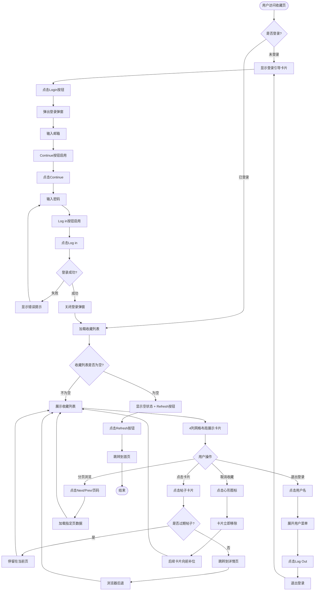

# 收藏页业务流程

> **业务目标**: 为登录用户提供收藏内容的集中管理，支持查看、取消收藏、重新收藏、分页浏览等操作

## 1. 完整流程图

> **要求**: 专注于收藏页域内的详细步骤，不包含跨域交互的复杂逻辑分支（跨域逻辑统一在业务全景文档中展示）

## 2. 详细步骤与观测点

### 步骤1: 访问收藏页并验证登录态

#### 页面位置
- URL: `/biz/en/list/favorites`
- 入口: 用户菜单 → "Favourites" 选项 或 直接访问URL

#### 操作流程
1. 用户访问收藏页URL
2. 系统验证用户登录态（检查Cookie中的Token）
3. 根据登录态决定展示内容：
   - 未登录 → 显示登录引导卡片
   - 已登录 → 加载并展示收藏列表

#### 观测点
- ✅ **P0**: 未登录用户访问收藏页，页面显示登录引导卡片
- ✅ **P0**: 登录引导卡片包含插图、"Log in to view more content"文案和"Login"按钮
- ✅ **P0**: 已登录用户访问收藏页，直接显示收藏列表
- ✅ **P1**: 页面标题显示"Favourites"
- ❌ **负向**: 会话过期时，自动弹出登录弹窗

#### 验证方法
- 使用访客身份访问收藏页，验证是否显示登录引导
- 使用已登录账号访问收藏页，验证是否直接显示列表
- 清除Cookie后刷新页面，验证登录态失效处理

#### 关联规则
- [收藏页规则 - 3.1 访问控制规则](../../业务规则库/通用规则/收藏页规则.md#31-访问控制规则)

---

### 步骤2: 登录流程

#### 页面位置
- 登录弹窗（模态对话框）

#### 操作流程
1. 点击登录引导卡片上的"Login"按钮
2. 弹出登录弹窗，显示邮箱输入界面
3. 输入邮箱或手机号，Continue按钮从禁用变为启用
4. 点击Continue按钮
5. 切换到密码输入界面，显示"Welcome back!"标题
6. 输入密码，Log in按钮从禁用变为启用
7. 点击Log in按钮
8. 系统验证邮箱和密码
9. 登录成功后，弹窗自动关闭，页面自动加载收藏列表（SPA刷新）

#### 观测点
- ✅ **P0**: 点击Login按钮后，弹出登录弹窗
- ✅ **P0**: 弹窗标题显示"Welcome to OK.com AE"
- ✅ **P0**: 显示邮箱输入框、Continue按钮（初始禁用）
- ✅ **P0**: 输入邮箱后，Continue按钮启用
- ✅ **P0**: 点击Continue后，切换到密码输入界面，标题变为"Welcome back!"
- ✅ **P0**: 输入密码后，Log in按钮启用
- ✅ **P0**: 登录成功后，弹窗关闭，页面右上角显示用户名
- ✅ **P0**: 登录成功后，自动显示收藏列表（4列网格布局）
- ❌ **负向**: 输入错误密码，显示"邮箱或密码错误"提示

#### 验证方法
- 访客状态下点击Login按钮，验证登录弹窗是否正确弹出
- 输入邮箱和密码，验证按钮状态变化
- 使用正确账号登录，验证登录成功后的页面状态
- 使用错误密码登录，验证错误提示

#### 关联规则
- [收藏页规则 - 3.2 登录流程规则](../../业务规则库/通用规则/收藏页规则.md#32-登录流程规则)

---

### 步骤3: 收藏列表展示

#### 页面位置
- 收藏页主体内容区域

#### 操作流程
1. 系统调用 `GET /api/favorites?page=1` 接口获取收藏列表数据
2. 前端渲染4列网格布局
3. 每张卡片包含：帖子图片、实心心形图标、标题、位置、价格
4. 过期帖子左上角显示"Expired"标签
5. 底部显示分页器（如有多页）

#### 观测点
- ✅ **P0**: 收藏列表以4列网格布局展示
- ✅ **P0**: 每张卡片包含图片、实心心形图标、标题、位置、价格
- ✅ **P0**: 不同类目的帖子混合展示（Services、Cars、Jobs、Furniture等）
- ✅ **P1**: 过期帖子左上角显示"Expired"标签
- ✅ **P1**: 分页器显示在列表底部（如有多页）
- ❌ **负向**: 空收藏列表显示空状态提示 + Refresh按钮

#### 验证方法
- 使用有收藏数据的账号登录，验证列表是否正确展示
- 观察卡片元素是否完整（图片、标题、价格等）
- 检查是否包含不同类目的帖子
- 使用空收藏账号登录，验证空状态展示

#### 关联规则
- [收藏页规则 - 3.3 收藏列表展示规则](../../业务规则库/通用规则/收藏页规则.md#33-收藏列表展示规则)

---

### 步骤4: 点击卡片跳转详情页

#### 页面位置
- 收藏列表中的任意帖子卡片

#### 操作流程
1. 用户点击帖子卡片（非过期帖子）
2. 系统获取帖子ID和类目信息
3. 跳转到对应的详情页URL
4. 详情页显示帖子完整信息
5. 详情页的Favourites按钮显示为实心图标（已收藏状态）

#### 观测点
- ✅ **P0**: 点击正常帖子卡片，成功跳转到详情页
- ✅ **P0**: 详情页URL正确，包含帖子ID和类目信息
- ✅ **P0**: 详情页Favourites按钮显示为实心图标（已收藏状态）
- ✅ **P0**: 在当前标签页打开，非新标签页
- ✅ **P1**: 点击过期帖子，不跳转详情页，停留在当前页
- ✅ **P1**: 浏览器后退返回收藏页，登录状态保持，列表正常展示

#### 验证方法
- 点击正常帖子卡片，验证是否跳转到正确的详情页
- 验证详情页的收藏按钮状态是否为实心（已收藏）
- 点击过期帖子，验证是否不跳转
- 从详情页点击浏览器后退按钮，验证是否返回收藏页

#### 关联规则
- [收藏页规则 - 3.3 收藏列表展示规则](../../业务规则库/通用规则/收藏页规则.md#33-收藏列表展示规则)

---

### 步骤5: 取消收藏

#### 页面位置
- 收藏列表中的任意帖子卡片右上角

#### 操作流程
1. 用户点击卡片右上角的实心心形图标
2. 前端乐观更新：卡片立即从列表中移除
3. 后续卡片自动向前补位
4. 异步调用 `DELETE /api/favorites/{postId}` 接口
5. 接口成功返回，无toast提示

#### 观测点
- ✅ **P0**: 点击心形图标，卡片立即从列表中移除
- ✅ **P0**: 无二次确认弹窗，直接移除
- ✅ **P0**: 后续卡片自动向前补位，无空位
- ✅ **P0**: 无toast提示信息
- ❌ **负向**: 接口失败时，卡片回滚到列表中

#### 验证方法
- 点击心形图标，验证卡片是否立即移除
- 观察后续卡片是否自动补位
- 验证是否有toast提示

#### 关联规则
- [收藏页规则 - 3.4 取消收藏规则](../../业务规则库/通用规则/收藏页规则.md#34-取消收藏规则)

---

### 步骤6: 重新收藏

#### 页面位置
- 帖子详情页的Favourites按钮

#### 操作流程
1. 在详情页确认Favourites按钮显示为空心图标（未收藏状态）
2. 点击Favourites按钮
3. 图标立即变为实心（已收藏状态）
4. 显示toast提示"Added to favourites"
5. 异步调用 `POST /api/favorites/{postId}` 接口
6. 返回收藏页后，该帖子重新出现在列表第一位

#### 观测点
- ✅ **P0**: 点击Favourites按钮，图标立即变为实心
- ✅ **P0**: 显示toast提示"Added to favourites"
- ✅ **P0**: 页面不刷新（SPA行为）
- ✅ **P0**: 返回收藏页后，该帖子出现在第一位
- ✅ **P0**: 其他收藏帖子保持不变

#### 验证方法
- 取消收藏后，访问该帖子详情页
- 点击Favourites按钮，验证图标状态变化和toast提示
- 返回收藏页，验证该帖子是否重新出现在第一位

#### 关联规则
- [收藏页规则 - 3.5 重新收藏规则](../../业务规则库/通用规则/收藏页规则.md#35-重新收藏规则)

---

### 步骤7: 分页浏览

#### 页面位置
- 收藏列表底部分页器

#### 操作流程
1. 用户点击Next/Prev/页码数字
2. 系统调用 `GET /api/favorites?page={page}` 接口
3. 前端渲染指定页的收藏列表
4. 更新分页器状态：
   - 第1页：Prev按钮禁用
   - 最后一页：Next按钮禁用
   - 当前页码高亮显示

#### 观测点
- ✅ **P1**: 第1页Prev按钮为禁用状态（灰色）
- ✅ **P0**: 点击Next按钮，页面切换到第2页
- ✅ **P1**: 最后一页Next按钮为禁用状态（灰色）
- ✅ **P0**: 点击Prev按钮，页面返回上一页
- ✅ **P0**: 点击页码数字，页面跳转到指定页
- ✅ **P1**: 不同页面数据不重复
- ✅ **P1**: 翻页不影响收藏状态

#### 验证方法
- 在第1页观察Prev按钮状态
- 点击Next按钮，验证是否跳转到第2页
- 在最后一页观察Next按钮状态
- 点击页码数字，验证是否跳转到指定页
- 记录第1页第一张卡片，翻页后返回验证数据一致性

#### 关联规则
- [收藏页规则 - 3.6 分页规则](../../业务规则库/通用规则/收藏页规则.md#36-分页规则)

---

### 步骤8: 退出登录

#### 页面位置
- 页面右上角用户名下拉菜单

#### 操作流程
1. 点击页面右上角的用户名
2. 展开下拉菜单，显示8个菜单项
3. 点击"Log Out"选项
4. 系统清除Cookie中的登录态
5. 页面刷新，显示访客状态
6. 顶部右侧显示"Log in / Register"链接
7. 自动弹出登录弹窗
8. 收藏列表内容被隐藏，显示登录引导卡片

#### 观测点
- ✅ **P0**: 点击用户名，展开下拉菜单
- ✅ **P0**: 菜单包含8个选项：Profile、My Post、Verification、Wallet、Purchase Orders、Sales Orders、Settings、Log Out
- ✅ **P0**: 点击Log Out，页面刷新显示访客状态
- ✅ **P0**: 顶部右侧显示"Log in / Register"链接
- ✅ **P0**: 自动弹出登录弹窗
- ✅ **P0**: 收藏列表内容被隐藏
- ✅ **P2**: 点击菜单外部区域，菜单自动关闭

#### 验证方法
- 点击用户名，验证菜单是否正确展开
- 点击Log Out，验证退出后的页面状态
- 点击菜单外部区域，验证菜单是否自动关闭

#### 关联规则
- [收藏页规则 - 3.8 用户菜单规则](../../业务规则库/通用规则/收藏页规则.md#38-用户菜单规则)
- [收藏页规则 - 3.9 退出登录规则](../../业务规则库/通用规则/收藏页规则.md#39-退出登录规则)

---

### 步骤9: 空列表状态处理

#### 页面位置
- 收藏页主体内容区域

#### 操作流程
1. 使用无收藏数据的账号登录
2. 系统调用 `GET /api/favorites?page=1` 接口，返回空列表
3. 前端展示空状态：图标 + 文案 + Refresh按钮
4. 用户点击Refresh按钮
5. 跳转到站点首页

#### 观测点
- ⚠️ **P1**: 空收藏账号登录后，页面显示空状态提示
- ⚠️ **P1**: 显示"Refresh"按钮
- ⚠️ **P1**: 不显示分页器
- ⚠️ **P1**: 点击Refresh按钮，跳转到首页
- ⚠️ **P1**: 登录状态保持

#### 验证方法
- 使用空收藏账号（shencccccccc@outlook.com）登录
- 观察空状态展示是否正确
- 点击Refresh按钮，验证是否跳转到首页

#### 关联规则
- [收藏页规则 - 3.7 空列表规则](../../业务规则库/通用规则/收藏页规则.md#37-空列表规则)

---

## 3. 流程完整性验证清单

### 访问控制与登录
- [ ] 访客访问收藏页，显示登录引导卡片
- [ ] 点击Login按钮，弹出登录弹窗
- [ ] 输入邮箱后，Continue按钮启用
- [ ] 点击Continue，切换到密码输入界面
- [ ] 输入密码后，Log in按钮启用
- [ ] 登录成功，弹窗关闭，自动显示收藏列表

### 收藏列表展示与交互
- [ ] 收藏列表以4列网格布局展示
- [ ] 每张卡片包含完整元素（图片、标题、价格等）
- [ ] 过期帖子显示"Expired"标签
- [ ] 点击正常帖子卡片，跳转到详情页
- [ ] 点击过期帖子，不跳转
- [ ] 浏览器后退，返回收藏页

### 取消与重新收藏
- [ ] 点击心形图标，卡片立即移除
- [ ] 后续卡片自动补位
- [ ] 在详情页重新收藏，显示toast提示
- [ ] 返回收藏页，该帖子出现在第一位

### 分页浏览
- [ ] 第1页Prev按钮禁用
- [ ] 点击Next按钮，跳转到下一页
- [ ] 最后一页Next按钮禁用
- [ ] 点击页码数字，跳转到指定页
- [ ] 不同页面数据不重复

### 退出登录与会话管理
- [ ] 点击用户名，展开菜单
- [ ] 点击Log Out，退出登录
- [ ] 页面刷新，显示访客状态
- [ ] 重新登录，收藏列表完整保持
- [ ] 刷新页面，登录状态保持

### 空列表状态
- [ ] 空收藏账号登录，显示空状态提示
- [ ] 显示Refresh按钮
- [ ] 点击Refresh按钮，跳转到首页

---

## 4. 关联文档

- [通用业务全景](./通用业务全景.md)
- [收藏页规则](../../业务规则库/通用规则/收藏页规则.md)

---

## 5. 变更历史

| 日期 | 版本 | 变更内容 | 变更人 |
|-----|------|---------|--------|
| 2026-04-23 | v1.0 | 初始版本，基于OK.com-收藏页-测试用例-20260402.md生成 | AI |
