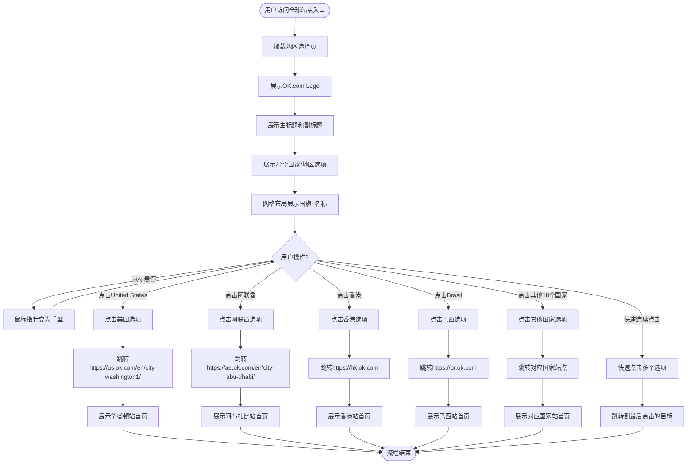

# 地区选择页业务流程

## 1. 业务概述
地区选择页是OK.com的全球站点入口,为用户提供22个国家/地区的快速访问通道,实现流量的精准分发和本地化服务。

## 2. 业务目标
- **用户目标**: 快速找到并进入目标国家/地区站点
- **平台目标**: 实现全球流量的有效分发,提升用户本地化体验

## 3. 涉及角色
- **访客**: 任何访问全球站点的用户,无需登录

## 4. 核心流程图

## 5. 详细步骤说明

### 步骤1: 访问地区选择页
- **入口URL**: https://www.ok.com/biz/en/site
- **无需登录**: 任何访客均可访问
- **加载性能**: 3秒内完成DOMContentLoaded

### 步骤2: 展示页面元素
- **Logo**: OK.com彩色Logo(红/绿/橙/蓝),居中显示
- **主标题**: "Please select the country and region you would like to browse."
- **副标题**: "Explore your community below"
- **国家选项**: 22个国家/地区,网格布局,每个选项包含国旗图标+国家名称

### 步骤3: 国家选项布局
- **桌面端**: 每行约6列,内容居中,左右留白
- **移动端**: 自适应减少列数,保持所有内容可见可点击
- **大屏幕**: 内容居中不过度拉伸,左右留白增加

### 步骤4: 多语言国家名称
- **阿拉伯语**(RTL): الإمارات العربية المتحدة(阿联酋)、المملكة العربية السعودية(沙特)
- **中文**(LTR): 香港
- **英语**(LTR): United States、Canada、Australia
- **葡萄牙语/西班牙语**(LTR): Brasil、España、México、Perú

### 步骤5: 用户交互
- **鼠标悬停**: 指针变为手型(cursor: pointer),选项无视觉变化
- **点击选项**: 立即跳转到对应国家站点
- **重复点击**: 允许多次点击同一选项,每次均正常跳转
- **快速连续点击**: 跳转到最后点击的目标,不会卡死

### 步骤6: 跳转到目标站点
- **United States**: 跳转到 https://us.ok.com/en/city-washington1/ (华盛顿站)
- **阿联酋**: 跳转到 https://ae.ok.com/en/city-abu-dhabi/ (阿布扎比站)
- **香港**: 跳转到 https://hk.ok.com (带默认城市)
- **Brasil**: 跳转到 https://br.ok.com
- **其他国家**: 跳转到对应国家站点 https://[国家代码].ok.com

### 步骤7: 展示目标站点首页
- **页面标题变更**: 显示目标城市名称,如"Washington Classified Information Website - OK"、"Abu Dhabi Classified Information Website - OK"
- **本地化内容**: 显示目标国家/地区的货币、语言、分类导航、商品列表等
- **正常浏览**: 用户可在目标站点正常浏览和搜索

## 6. 异常分支

### 6.1 页面加载失败
- **场景**: 网络异常
- **处理**: 显示错误提示

### 6.2 跳转失败
- **场景**: 目标站点不可用
- **处理**: 显示友好提示

### 6.3 快速连续点击
- **场景**: 用户在第一次跳转完成前点击第二个选项
- **处理**: 跳转到最后点击的目标,不会卡死或报错

## 7. 关联流程
- **各国家站点首页**: 地区选择页是进入各国家站点的主要入口
- **国际化与本地化**: 各国家站点提供本地化服务(语言、货币、内容)

## 8. 变更历史

| 日期 | 版本 | 变更内容 | 变更人 |
|-----|------|---------|--------|
| 2026-04-28 | v1.0 | 初始版本,基于OK.com-地区选择页-测试用例-20260320.md生成 | AI |
