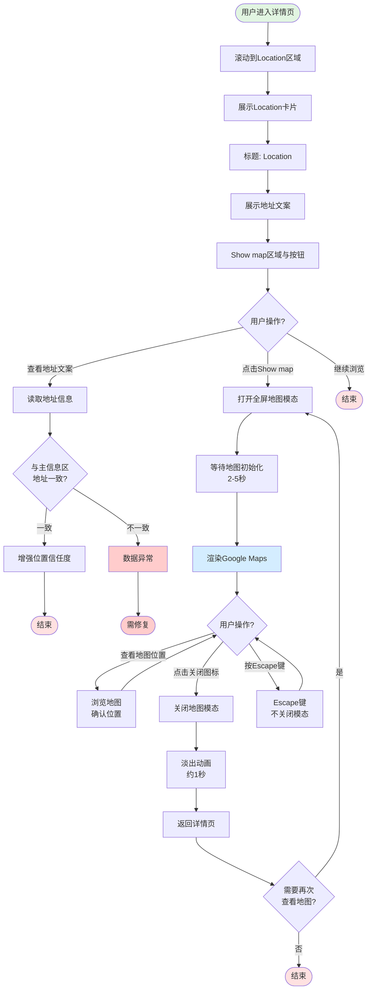

# 详情页Location区域业务流程

## 1. 流程概述
- **流程名称**: 详情页Location区域展示与地图查看
- **起点**: 用户进入详情页并滚动到Location区域
- **终点**: 用户完成地址查看或地图查看
- **预期耗时**: 5-20秒(取决于是否打开地图查看)
- **涉及角色**: 访客、买家(权限一致,不区分登录态)
- **核心目标**: 帮助用户确认商品/服务的线下位置或地标,提升交易信任度

## 2. 业务流程图

## 3. 详细步骤

### 步骤1: 用户进入详情页并滚动到Location区域
**执行方**: 用户  
**操作内容**:
- 从列表页点击商品进入详情页
- 浏览商品详情(图片、价格、标题、描述等)
- 向下滚动至Description等详情内容之后区域

**系统响应**:
- 详情页正常加载
- Description、发布者信息等模块展示
- Location区域进入可视区域

**数据变化**: 无

**观测点**:
- 页面滚动位置到达Location区域
- Location卡片可见

**关联测试用例**: TC-LOCATION-A-001

---

### 步骤2: 展示Location卡片
**执行方**: 系统  
**操作内容**:
- 渲染Location卡片容器(`LocationCard_locationCard__rZmTq`)
- 按照自上而下顺序渲染:标题→地址文案→Show map区域

**系统响应**:
- 卡片整体尺寸约宽667px、高228px(视口1440px)
- 卡片相对主内容列左侧对齐(约x=152)
- 三个核心元素依次展示

**数据变化**: 无

**观测点**:
- Location卡片容器存在
- 卡片尺寸和位置正确
- 内部结构完整

**关联测试用例**: TC-LOCATION-A-001

---

### 步骤3: 展示标题"Location"
**执行方**: 系统  
**操作内容**:
- 渲染标题节点(class含`LocationCard_title__6haRB`与`locationTitle`)
- 显示文案"Location"(英文站点)

**系统响应**:
- 标题清晰可见
- 文案与页面语言一致

**数据变化**: 无

**观测点**:
- 标题文案为"Location"
- 标题样式正确

**关联测试用例**: TC-LOCATION-A-002

---

### 步骤4: 展示地址文案
**执行方**: 系统  
**操作内容**:
- 渲染地址容器(`LocationCard_address__SJx_4`)
- 显示实际地址文案(如"Al-Az Pest Control Company")

**系统响应**:
- 地址文案清晰展示
- 元素高度约21px,宽度约667px
- 与主信息区地址保持一致

**数据变化**: 无

**观测点**:
- 地址文案非空
- 地址内容完整
- 地址与主信息区一致

**关联测试用例**: TC-LOCATION-A-003, TC-LOCATION-C-001

---

### 步骤5: 展示Show map区域与按钮
**执行方**: 系统  
**操作内容**:
- 渲染预览区域(`LocationCard_showMap__15yGP` / `LocationCard_pcShowMapCard__KCxk4`)
- 渲染Show map按钮(`LocationCard_showMapBtn__sgjv4`)

**系统响应**:
- 预览区域高度约145px,宽度约667px
- 按钮文案为"Show map"
- 按钮尺寸约宽157px、高44px
- 按钮位于预览区中部偏下

**数据变化**: 无

**观测点**:
- 预览区域可见
- 按钮文案正确
- 按钮位置和尺寸正确

**关联测试用例**: TC-LOCATION-A-004

---

### 步骤6: 用户点击Show map按钮
**执行方**: 用户  
**操作内容**:
- 点击"Show map"按钮

**系统响应**:
- 触发地图模态打开事件
- 开始初始化地图

**数据变化**: 无

**观测点**:
- 按钮点击响应
- 模态开始加载

**关联测试用例**: TC-LOCATION-B-001

---

### 步骤7: 打开全屏地图模态
**执行方**: 系统  
**操作内容**:
- 创建全屏模态(`modal-dialog modal-fullscreen`)
- 模态根节点class包含`fade LocationCard_modalMap__PhyVC modal show`
- 创建地图容器(`id="map"`)
- 调用Google Maps服务初始化地图

**系统响应**:
- 模态全屏覆盖详情页
- 显示半透明黑色遮罩背景
- 等待地图初始化(2-5秒)
- 渲染Google Maps(包含`gm-style`结构)
- 加载地图资源(maps.gstatic.com)
- 左上角显示关闭/返回图标

**数据变化**: 无

**观测点**:
- 模态存在且带`show` class
- 地图容器`#map`存在
- Google Maps DOM结构渲染
- 关闭图标可见

**关联测试用例**: TC-LOCATION-B-001, TC-LOCATION-B-002

---

### 步骤8: 用户查看地图位置
**执行方**: 用户  
**操作内容**:
- 在地图上浏览位置
- 确认商品/服务的地理位置
- 可能进行缩放、拖动等地图交互

**系统响应**:
- Google Maps响应用户交互
- 地图平滑缩放、拖动
- 位置标记清晰可见

**数据变化**: 无

**观测点**:
- 地图交互流畅
- 位置标记准确
- 用户体验良好

**关联测试用例**: TC-LOCATION-B-001

---

### 步骤9: 用户点击关闭图标
**执行方**: 用户  
**操作内容**:
- 点击模态左上角关闭图标(`img.LocationCard_back__8OIyE`或`img[alt='close']`)

**系统响应**:
- 触发模态关闭事件
- 开始淡出动画

**数据变化**: 无

**观测点**:
- 关闭图标点击响应
- 模态开始关闭

**关联测试用例**: TC-LOCATION-B-003

---

### 步骤10: 关闭地图模态
**执行方**: 系统  
**操作内容**:
- 执行淡出动画(约1秒)
- 移除模态的`show` class
- 销毁或隐藏模态DOM

**系统响应**:
- 模态平滑淡出
- 遮罩背景消失
- 返回详情页
- Location区域仍然可见

**数据变化**: 无

**观测点**:
- 不再存在带`show`的模态
- 详情页正常显示
- 可再次点击Show map打开

**关联测试用例**: TC-LOCATION-B-003, TC-LOCATION-B-004

---

### 步骤11: 用户按Escape键(可选)
**执行方**: 用户  
**操作内容**:
- 在地图模态打开状态下按Escape键

**系统响应**:
- 模态仍保持打开状态(实测Escape不关闭)
- 无任何变化

**数据变化**: 无

**观测点**:
- Escape键不关闭模态
- 模态仍带`show` class

**关联测试用例**: TC-LOCATION-D-001

---

### 步骤12: 验证地址一致性(后台校验)
**执行方**: 系统  
**操作内容**:
- 对比主信息区地址(`MainInfo_address__TSTas`)
- 对比Location区地址(`LocationCard_address__SJx_4`)

**系统响应**:
- 两处地址文本完全一致
- 数据来源统一

**数据变化**: 无

**观测点**:
- 地址文案一致
- 无数据不一致问题

**关联测试用例**: TC-LOCATION-C-001

---

## 4. 验证清单

### 4.1 前置条件验证
- [ ] 测试环境可正常访问OK.com
- [ ] 详情页属于非招聘、非房产类目
- [ ] 详情页有地址数据

### 4.2 Location卡片基础展示验证
- [ ] Location卡片容器存在
- [ ] 卡片尺寸正确(宽667px,高228px)
- [ ] 卡片位置正确(Description之后)
- [ ] 标题"Location"正常显示
- [ ] 地址文案非空且清晰展示
- [ ] Show map区域和按钮可见
- [ ] 按钮文案为"Show map"

### 4.3 地图模态交互验证
- [ ] 点击Show map按钮打开全屏地图模态
- [ ] 模态存在且带`show` class
- [ ] 地图容器`#map`存在
- [ ] Google Maps正常渲染
- [ ] 地图资源正常加载
- [ ] 左上角关闭图标可见
- [ ] 点击关闭图标关闭模态
- [ ] 模态平滑淡出(约1秒)
- [ ] 关闭后不再存在带`show`的模态
- [ ] 可再次点击Show map打开地图

### 4.4 地址一致性验证
- [ ] 主信息区地址与Location区地址完全一致
- [ ] 地址文案格式一致
- [ ] 无数据不一致问题

### 4.5 键盘与无障碍验证
- [ ] 地图区域有`aria-label="Map"`语义标注
- [ ] Escape键不关闭模态(实测行为)
- [ ] 模态打开后焦点在模态内
- [ ] 支持Tab键在模态内导航

## 5. 关联文档

### 5.1 规则文档
- [详情页Location区域规则](../../业务规则库/详情页规则/详情页Location区域规则.md)

### 5.2 测试用例
- [OK.com-详情页Location区域-测试用例-20260410.md](../../文本用例/Tiyan/通用详情页/OK.com-详情页Location区域-测试用例-20260410.md)

### 5.3 相关业务域
- [通用业务全景](./通用业务全景.md)
- 详情页核心信息业务流程(地址数据来源)
- Google Maps服务集成(待建立)

---

**📝 文档版本**: v1.0  
**📅 生成日期**: 2026-04-27  
**🔄 变更历史**:
- v1.0 (2026-04-27): 初始版本,基于OK.com-详情页Location区域-测试用例-20260410.md生成
