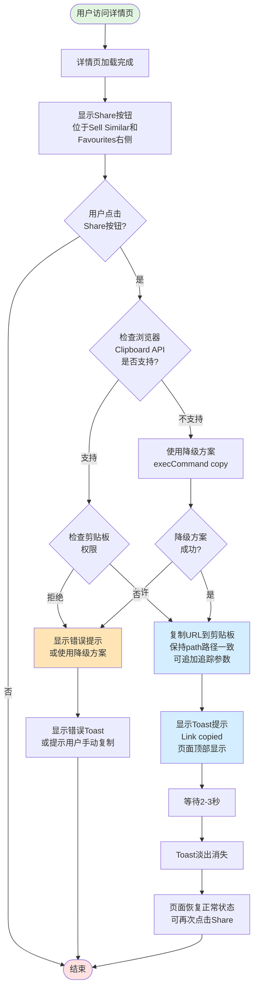

# 详情页分享功能业务流程

## 1. 流程概述
- **流程名称**: 详情页分享功能
- **起点**: 用户访问详情页,查看Share按钮
- **终点**: 链接复制成功,Toast提示显示并消失
- **预期耗时**: 3-5秒(含Toast显示时长)
- **涉及角色**: 访客、登录用户(功能对所有用户开放)
- **核心目标**: 让用户便捷复制详情页链接,方便在其他渠道分享内容

## 2. 业务流程图

## 3. 详细步骤

### 步骤1: 用户访问详情页
**执行方**: 用户  
**操作内容**:
- 从列表页、首页或其他入口进入详情页
- 等待详情页加载完成(包括图片、标题、价格等核心信息)

**系统响应**:
- 渲染详情页内容
- 在图片下方操作区域显示Share按钮

**数据变化**: 无

**观测点**:
- Share按钮清晰可见
- 按钮位于"Sell Similar"和"Favourites"按钮右侧
- 按钮包含分享图标和"Share"文字
- 按钮样式与其他操作按钮保持一致
- 鼠标悬停时显示pointer样式

**关联测试用例**: TC001

---

### 步骤2: 用户点击Share按钮
**执行方**: 用户  
**操作内容**:
- 点击详情页图片下方的Share按钮

**系统响应**:
- 检查浏览器是否支持Clipboard API
- 检查剪贴板访问权限

**数据变化**: 无

**观测点**:
- 按钮可点击,有点击反馈(如按下效果)
- 点击后触发复制逻辑
- 页面不刷新,不跳转

**关联测试用例**: TC002, TC009, TC010

---

### 步骤3: 系统检查Clipboard API支持
**执行方**: 系统  
**操作内容**:
- 检查`navigator.clipboard`对象是否存在
- 检查浏览器版本和协议(HTTPS/HTTP)
- 如果不支持,准备降级方案

**系统响应**:
- 支持: 继续使用`navigator.clipboard.writeText()`
- 不支持: 使用`document.execCommand('copy')`降级方案

**数据变化**: 无

**观测点**:
- Chrome浏览器: 支持Clipboard API
- Safari浏览器: 支持Clipboard API(需用户手势)
- 老旧浏览器(如IE11): 不支持,使用降级方案
- HTTP环境: Clipboard API可能受限

**关联测试用例**: TC014, TC016

---

### 步骤4: 系统检查剪贴板权限
**执行方**: 系统  
**操作内容**:
- 检查用户是否授予剪贴板访问权限
- 如果权限未授予,请求权限或显示提示

**系统响应**:
- 权限允许: 执行复制操作
- 权限拒绝: 显示错误提示或使用降级方案

**数据变化**: 无

**观测点**:
- Chrome: 通常默认允许(用户手势触发)
- Safari: 可能需要用户手势,自动授予
- 权限被拒: 显示友好错误提示

**关联测试用例**: TC013

---

### 步骤5: 复制URL到剪贴板
**执行方**: 系统  
**操作内容**:
- 获取当前详情页URL
- 保持path路径不变
- 可选: 追加分享追踪参数(如utm_source=share, share_from=detail)
- 调用`navigator.clipboard.writeText(url)`或降级方案
- 将完整URL写入系统剪贴板

**系统响应**:
- 复制成功: 准备显示Toast提示
- 复制失败: 显示错误提示

**数据变化**:
- 系统剪贴板内容更新为详情页URL

**观测点**:
- 复制的URL协议、域名、path路径与原始URL一致
- 可能追加query参数(如?utm_source=share&share_from=detail)
- URL格式正确,可在浏览器中打开
- 复制内容前后无多余空格或特殊字符
- 复制操作在500ms内完成
- 页面不刷新,不跳转

**关联测试用例**: TC002, TC006, TC017, TC019

---

### 步骤6: 显示Toast提示
**执行方**: 系统  
**操作内容**:
- 在页面顶部显示Toast提示
- 内容为"Link copied"(英文站)
- Toast为alert类型元素(可被屏幕阅读器识别)

**系统响应**:
- Toast立即显示(<500ms延迟)
- Toast样式清晰,与页面整体风格一致

**数据变化**: 无

**观测点**:
- Toast在页面顶部显示
- 内容为"Link copied"
- 显示清晰,与页面风格一致
- 显示时机: 点击后立即显示(<500ms)
- Toast为alert类型,可被屏幕阅读器识别

**关联测试用例**: TC003, TC007

---

### 步骤7: Toast自动消失
**执行方**: 系统  
**操作内容**:
- 等待2-3秒
- Toast淡出消失(平滑动画效果)
- 页面恢复正常状态

**系统响应**:
- Toast消失后,页面恢复正常
- 用户可以再次点击Share按钮

**数据变化**: 无

**观测点**:
- Toast显示2-3秒后自动消失
- 消失时有淡出动画效果(平滑过渡)
- Toast消失后页面恢复正常状态
- 可以再次点击Share按钮
- 快速连续点击: 只显示1个Toast,或多个Toast排列整齐不重叠

**关联测试用例**: TC007, TC008

---

### 步骤8: 用户粘贴分享链接
**执行方**: 用户  
**操作内容**:
- 在其他应用(如社交媒体、消息应用)粘贴链接
- 或在新浏览器标签页中打开复制的链接

**系统响应**:
- 链接可正常粘贴
- 打开链接后显示与原详情页内容一致的页面

**数据变化**: 无

**观测点**:
- 复制的链接可正常访问
- 打开后的页面与原详情页内容一致(即使URL包含分享参数)
- 页面加载成功,无404或500错误
- 页面内容(图片、标题、价格等)与原页面一致
- 分享参数不影响页面正常展示

**关联测试用例**: TC019

---

## 4. 验证清单

### 4.1 前置条件验证
- [ ] 测试环境可正常访问OK.com美国站
- [ ] 浏览器支持剪贴板API(Chrome、Safari最新版)
- [ ] 从列表页进入非招聘、非房产类目的帖子详情页

### 4.2 核心流程验证
- [ ] Share按钮正常展示,位置正确,样式一致
- [ ] 点击Share按钮后链接成功复制到剪贴板
- [ ] 复制的URL path路径与原始URL一致
- [ ] Toast提示"Link copied"正常显示
- [ ] Toast显示2-3秒后自动消失,有淡出动画
- [ ] Toast消失后可再次点击Share按钮
- [ ] 复制的链接可正常访问,内容一致

### 4.3 用户角色验证
- [ ] 访客可正常使用分享功能
- [ ] 登录用户可正常使用分享功能
- [ ] 两种角色的功能行为完全一致

### 4.4 类目一致性验证
- [ ] 所有类目(如Home Decor、Pet Supplies、Marketplace等)详情页都显示Share按钮
- [ ] 所有类目的按钮位置、样式一致
- [ ] 所有类目的复制功能正常

### 4.5 浏览器兼容性验证
- [ ] Chrome浏览器: 分享功能完全正常
- [ ] Safari浏览器: 分享功能正常(需用户手势)
- [ ] iOS Safari: 移动端分享功能正常
- [ ] Android Chrome: 移动端分享功能正常

### 4.6 异常场景验证
- [ ] 剪贴板权限被拒: 显示错误提示或使用降级方案
- [ ] HTTP环境: 使用降级方案或显示提示
- [ ] 网络断开: 复制功能正常工作(不依赖网络)
- [ ] 老旧浏览器: 使用降级方案或显示不支持提示
- [ ] 快速连续点击: 系统正常处理,不卡顿

### 4.7 安全性验证
- [ ] 复制的URL不包含用户Token、Session ID等敏感信息
- [ ] URL格式标准,符合安全规范
- [ ] URL不包含XSS攻击向量(如`javascript:`协议)
- [ ] 快速重复点击不导致页面崩溃或异常请求

## 5. 关联文档

### 5.1 规则文档
- [详情页分享功能规则](../../业务规则库/通用规则/详情页分享功能规则.md)

### 5.2 测试用例
- [OK.com-详情页分享功能-测试用例-20260401.md](../../文本用例/Tiyan/通用详情页/OK.com-详情页分享功能-测试用例-20260401.md)

### 5.3 相关业务域
- [通用业务全景](./通用业务全景.md)
- 详情页模块业务流程(待建立)
- Toast提示组件文档(待建立)
- 分享追踪服务文档(待建立)

---

**📝 文档版本**: v1.0  
**📅 生成日期**: 2026-04-27  
**🔄 变更历史**:
- v1.0 (2026-04-27): 初始版本,基于OK.com-详情页分享功能-测试用例-20260401.md生成
