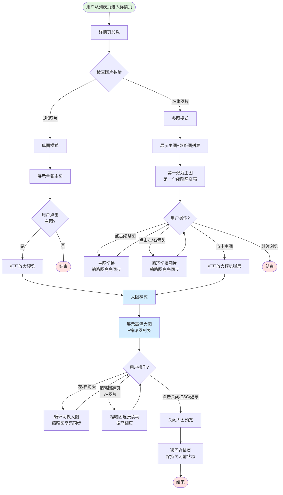

# 详情页图片区域业务流程

## 1. 流程概述
- **流程名称**: 详情页图片区域展示与交互
- **起点**: 用户从列表页进入详情页
- **终点**: 用户完成图片浏览,关闭大图预览或继续浏览其他内容
- **预期耗时**: 5-30秒(取决于图片数量和用户浏览意愿)
- **涉及角色**: 访客、买家(权限一致,不区分登录态)
- **核心目标**: 清晰展示商品/服务图片,支持多图切换和放大预览,提升用户购买意愿

## 2. 业务流程图

## 3. 详细步骤

### 步骤1: 用户从列表页进入详情页
**执行方**: 用户  
**操作内容**:
- 在列表页浏览帖子卡片
- 点击感兴趣的帖子卡片(单图或多图)

**系统响应**:
- 浏览器导航到详情页URL
- 详情页开始加载

**数据变化**: 
- URL变化,进入详情页

**观测点**:
- 页面开始加载
- URL包含详情页标识

**关联测试用例**: TC001, TC004

---

### 步骤2: 检查图片数量并选择展示模式
**执行方**: 系统  
**操作内容**:
- 获取当前帖子的图片数量
- 根据图片数量决定展示模式

**系统响应**:
- 图片数量=1: 使用单图模式
- 图片数量≥2: 使用多图模式

**数据变化**: 无

**观测点**:
- 图片数量正确识别
- 展示模式自动切换

**关联测试用例**: TC001, TC002, TC004

---

### 步骤3: 单图模式-展示单张主图
**执行方**: 系统  
**操作内容**:
- 加载并展示该商品的唯一图片
- 不显示缩略图区域和切换箭头

**系统响应**:
- 主图清晰展示,尺寸适配容器
- 图片保持原始比例不变形
- 如加载失败,显示占位图

**数据变化**: 无

**观测点**:
- 主图清晰可见
- 无缩略图区域
- 无左右箭头按钮
- 图片不超出边界

**关联测试用例**: TC001, TC002, TC003

---

### 步骤4: 单图模式-用户点击主图放大(可选)
**执行方**: 用户  
**操作内容**:
- 鼠标悬停在主图上(cursor变为可点击样式)
- 点击主图

**系统响应**:
- 打开全屏或大尺寸图片预览弹层
- 显示高清版本图片

**数据变化**: 无

**观测点**:
- 大图预览弹层打开
- 显示高清图片
- 有关闭按钮和遮罩背景

**关联测试用例**: TC012

---

### 步骤5: 多图模式-展示主图和缩略图列表
**执行方**: 系统  
**操作内容**:
- 加载并展示主图区域(大尺寸)
- 加载并展示缩略图列表(小尺寸,横向或纵向排列)
- 默认显示第一张图片为主图
- 第一个缩略图高亮

**系统响应**:
- 主图和缩略图列表同时可见
- 主图显示第一张图片
- 第一个缩略图有高亮样式(边框、阴影等)
- 所有图片成功加载

**数据变化**: 无

**观测点**:
- 主图区域显示第一张图片
- 缩略图列表排列整齐
- 第一个缩略图高亮
- 缩略图数量=实际图片总数
- 所有图片加载成功

**关联测试用例**: TC004, TC005, TC006, TC007, TC008

---

### 步骤6: 多图模式-用户点击缩略图切换
**执行方**: 用户  
**操作内容**:
- 点击缩略图列表中的某个缩略图(如第3个)

**系统响应**:
- 主图立即切换为第3张图片
- 第3个缩略图变为高亮
- 之前高亮的缩略图(第1个)恢复普通样式

**数据变化**: 无

**观测点**:
- 主图切换流畅,无卡顿或闪烁
- 被点击的缩略图立即高亮
- 之前高亮的缩略图取消高亮
- 任何时刻只有一个缩略图高亮
- 高亮状态与主图显示的内容一致

**关联测试用例**: TC009, TC010

---

### 步骤7: 多图模式-用户使用箭头循环切换
**执行方**: 用户  
**操作内容**:
- 点击主图区域的左箭头或右箭头按钮
- 可能在第一张图片时点左箭头,或在最后一张图片时点右箭头

**系统响应**:
- 主图切换到上一张/下一张图片
- 支持循环: 第一张点左箭头→最后一张,最后一张点右箭头→第一张
- 缩略图高亮同步更新

**数据变化**: 无

**观测点**:
- 主图区域有左右箭头按钮(可能悬停时显示)
- 循环切换流畅,无卡顿
- 缩略图高亮立即同步
- 箭头始终可点击,不禁用

**关联测试用例**: TC011

---

### 步骤8: 多图模式-用户点击主图打开放大预览
**执行方**: 用户  
**操作内容**:
- 鼠标悬停在主图上(cursor变为可点击样式)
- 点击主图

**系统响应**:
- 打开全屏或大尺寸图片预览弹层
- 显示当前主图的高清版本
- 显示半透明黑色遮罩背景
- 显示关闭按钮(×)和左右导航箭头
- 显示缩略图列表

**数据变化**: 无

**观测点**:
- 大图预览弹层打开
- 显示高清图片
- 有遮罩背景、关闭按钮、导航箭头
- 底部或侧边有缩略图列表

**关联测试用例**: TC012

---

### 步骤9: 大图模式-左右箭头循环切换
**执行方**: 用户  
**操作内容**:
- 在大图预览弹层中点击左箭头或右箭头
- 可能在第一张图片时点左箭头,或在最后一张图片时点右箭头

**系统响应**:
- 大图切换到上一张/下一张图片
- 支持循环: 第一张点左箭头→最后一张,最后一张点右箭头→第一张
- 缩略图高亮同步更新
- 切换流畅,有淡入淡出或滑动动画(可选)

**数据变化**: 无

**观测点**:
- 大图弹层显示左右箭头导航按钮
- 循环切换流畅
- 缩略图高亮立即同步更新
- 左右箭头始终可点击,不禁用

**关联测试用例**: TC013, TC014

---

### 步骤10: 大图模式-缩略图翻页(7+图片时)
**执行方**: 用户  
**操作内容**:
- 当图片数量≥8张时,缩略图区域显示左右翻页箭头
- 用户点击翻页箭头浏览更多缩略图

**系统响应**:
- 初始状态显示第1-7张缩略图
- 每次点击右翻页箭头,缩略图列表向左滚动一张(逐张滚动)
- 每次点击左翻页箭头,缩略图列表向右滚动一张
- 支持循环: 在最后一组点右箭头→回到第1-7张,在第一组点左箭头→到最后一组

**数据变化**: 无

**观测点**:
- 缩略图区域一次性显示7个缩略图
- 显示左右翻页箭头按钮
- 每次点击逐张滚动
- 循环翻页流畅,有平滑过渡动画
- 当前选中的缩略图始终在可见区域内

**关联测试用例**: TC016, TC017

---

### 步骤11: 大图模式-关闭预览
**执行方**: 用户  
**操作内容**:
- 点击关闭按钮(×)
- 或按ESC键
- 或点击弹层外的遮罩区域

**系统响应**:
- 大图预览弹层关闭
- 返回详情页
- 主图保持关闭前的状态(如关闭前查看第3张,返回后主图仍显示第3张)
- 页面滚动位置保持不变
- 关闭动画流畅(淡出效果)

**数据变化**: 无

**观测点**:
- 三种关闭方式均有效
- 关闭后返回详情页
- 主图状态保持
- 滚动位置保持
- 关闭动画流畅

**关联测试用例**: TC015

---

## 4. 验证清单

### 4.1 前置条件验证
- [ ] 测试环境可正常访问OK.com(AE站或其他站点)
- [ ] 列表页有单图和多图帖子
- [ ] 有图片数量≥8张的帖子(用于测试缩略图翻页)

### 4.2 单图模式验证
- [ ] 单图详情页主图清晰展示
- [ ] 图片尺寸适配容器,保持比例
- [ ] 无缩略图区域
- [ ] 无左右箭头按钮
- [ ] 图片加载失败时显示占位图
- [ ] 点击主图可打开放大预览(可选)

### 4.3 多图模式-基础展示验证
- [ ] 主图和缩略图列表同时可见
- [ ] 主图默认显示第一张图片
- [ ] 第一个缩略图默认高亮
- [ ] 缩略图数量=实际图片总数
- [ ] 所有图片成功加载,清晰可见

### 4.4 多图模式-切换交互验证
- [ ] 点击缩略图立即切换主图
- [ ] 主图切换流畅,无卡顿
- [ ] 缩略图高亮与主图同步
- [ ] 任何时刻只有一个缩略图高亮
- [ ] 左右箭头支持循环切换
- [ ] 点击主图打开放大预览弹层

### 4.5 大图模式-主图切换验证
- [ ] 大图弹层显示左右箭头导航
- [ ] 左右箭头支持循环切换
- [ ] 切换流畅,有过渡动画
- [ ] 缩略图列表在弹层中显示
- [ ] 缩略图高亮与大图同步

### 4.6 大图模式-缩略图翻页验证(7+图片)
- [ ] 图片≥8张时显示翻页箭头
- [ ] 初始显示第1-7张缩略图
- [ ] 点击翻页箭头逐张滚动
- [ ] 支持循环翻页
- [ ] 滚动流畅,有平滑动画
- [ ] 当前选中缩略图始终可见

### 4.7 大图模式-关闭验证
- [ ] 点击关闭按钮(×)可关闭
- [ ] 按ESC键可关闭
- [ ] 点击遮罩区域可关闭
- [ ] 关闭后返回详情页
- [ ] 主图状态保持
- [ ] 滚动位置保持
- [ ] 关闭动画流畅

## 5. 关联文档

### 5.1 规则文档
- [详情页图片区域规则](../../业务规则库/详情页规则/详情页图片区域规则.md)

### 5.2 测试用例
- [OK.com-详情页图片区域-测试用例-20260326.md](../../文本用例/Tiyan/通用详情页/OK.com-详情页图片区域-测试用例-20260326.md)

### 5.3 相关业务域
- [通用业务全景](./通用业务全景.md)
- 详情页核心信息业务流程(图片区域所在页面)
- 图片管理业务流程(待建立)

---

**📝 文档版本**: v1.0  
**📅 生成日期**: 2026-04-27  
**🔄 变更历史**:
- v1.0 (2026-04-27): 初始版本,基于OK.com-详情页图片区域-测试用例-20260326.md生成
